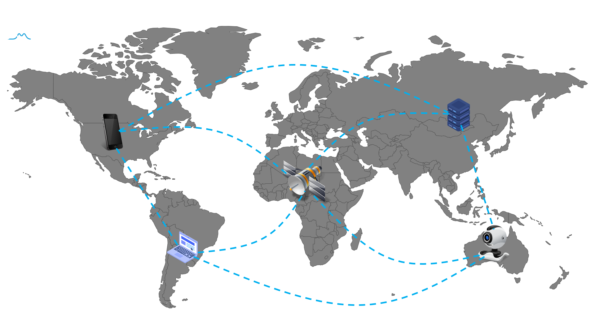

# Awesome Federated Machine Learning  
Federated Learning (FL) is a new machine learning framework, which enables multiple devices collaboratively to train a shared model without compromising data privacy and security.  

This repository aims to keep tracking the latest research advancements of federated learning, including but not limited to research papers, books, codes, tutorials, and videos.

## Table of Contents

 - [Top Machine Learning Conferences](#top-machine-learning-conferences)
     + [ICML](#icml)&emsp;[ICLR](#iclr)&emsp;[NeurIPS](#neurips)   
 - [Top Computer Vision Conferences](#top-computer-vision-conferences)
     + [CVPR](#cvpr)&emsp;[ICCV](#iccv)&emsp;[ECCV](#eccv)   
 - [Top Artificial Intelligence and Data Mining Conferences](#top-artificial-intelligence-and-data-mining-conferences)
     + [AAAI](#aaai)&emsp;[AISTATS](#aistats)&emsp;[KDD](#kdd) 	 
 - [Books](#books)
 - [Papers (Research directions)](#papers)
     + [Model Aggregation](#1-model-aggregation)
	 + [Personalization](#2-personalization)&emsp;&emsp; 
	 + [Recommender system](#3-recommender-system)
	 + [Security](#4-security)&emsp;&emsp;
	 + [Survey](#5-survey)&emsp;&emsp;
	 + [Efficiency](#7-efficiency)&emsp;&emsp;
	 + [Optimization](#8-optimization)&emsp;&emsp; 
	 + [Fairness](#9-fairness) 
	 + [Application](#10-applications)&emsp;&emsp;
	 + [Boosting](#11-boosting)&emsp;&emsp;
	 + [Incentive mechanism](#12-incentive-mechanism)
	 + [Unsupervised Learning](#13-unsupervised-learning)&emsp;&emsp;
	 + [Heterogeneity](#14-heterogeneity)&emsp;&emsp;
	 + [Client Selection](#15-client-selection)
	 + [Graph Neural Networks](#16-graph-neural-networks)
	 + [Other Machine Learning Paradigm](#18-other-machine-learning-paradigm)
	 + [Computational Learning Theory](#19-computational-learning-theory)
 - [Google FL Workshops](#google-fl-workshops)	 
 - [Videos and Lectures](#videos-and-lectures)
 - [Tutorials and Blogs](#tutorials-and-blogs)
 - [Open-Sources](#open-sources)
     + [Enterprise Grade](#enterprise-grade)
	 + [Research Purpose](#research-purpose)

&nbsp; 

## Top Machine Learning Conferences

In this section, we will summarize Federated Learning papers accepted by top machine learning conference, Including NeurIPS, ICML, ICLR.

### ICML 
<table border=0 cellpadding=0 cellspacing=0 >
    <col width="5%" style='mso-width-source:userset;mso-width-alt:6848'>
	<col width="65%" style='mso-width-source:userset;mso-width-alt:26080'>
	<col width="25%" style='mso-width-source:userset;mso-width-alt:4032'>
	<col width="5%" style='mso-width-source:userset;mso-width-alt:4032'>
	<tr height=19 style='height:14.25pt'>
		<td height=19 class=xl6519452 width="5%" align="center">Years</td>
		<td class=xl6519452 width="65%" align="center">Title</td>
		<td class=xl6519452 width="25%" align="center">Affiliations</td>
		<td class=xl6519452 width="5%" align="center">Materials</td>
	</tr>
	<tr height=19 style='height:14.15pt'>
        <td rowspan=50 height=950 class=xl6519452 style='height:242.25pt' align="center"><a href="https://icml.cc/Conferences/2023/Schedule?type=Poster">ICML 2023</a></td>
        <td class=xl6519452 align="center"><a href="https://arxiv.org/pdf/2206.10189.pdf">A General Theory for Federated Optimization with Asynchronous and Heterogeneous Clients Updates</a></td>
        <td class=xl6519452 align="center">Accenture Labs</td>
		<td class=xl6519452 align="center"></td>
	</tr>
    <tr height=19 style='height:14.25pt'>
		<td height=19 class=xl6519452 style='height:14.25pt' align="center"><a href="https://arxiv.org/pdf/2306.00127.pdf">Surrogate Model Extension (SME): A Fast and Accurate Weight Update Attack on Federated Learning</a></td>
        <td class=xl6519452 align="center">ESAT-PSI, KU Leuven</td>
		<td class=xl6519452 align="center"><a href="https://github.com/JunyiZhu-AI/surrogate_model_extension">code</a></td>
	</tr>
	<tr height=19 style='height:14.25pt'>
		<td height=19 class=xl6519452 style='height:14.25pt' align="center"><a href="https://repository.tudelft.nl/islandora/object/uuid%3A44963ca4-46f8-49a1-9285-1c01e4d49402?collection=education">LeadFL: Client Self-Defense against Model Poisoning in Federated Learning</a></td>
        <td class=xl6519452 align="center">Delft University of Technology</td>
		<td class=xl6519452 align="center"></td>
	</tr>
	<tr height=19 style='height:14.25pt'>
		<td height=19 class=xl6519452 style='height:14.25pt' align="center"><a href="https://arxiv.org/pdf/2302.05412.pdf">Achieving Linear Speedup in Non-IID Federated Bilevel Learning</a></td>
        <td class=xl6519452 align="center">Meta</td>
		<td class=xl6519452 align="center"></td>
	</tr>
	<tr height=19 style='height:14.25pt'>
		<td height=19 class=xl6519452 style='height:14.25pt' align="center"><a href="https://arxiv.org/pdf/2302.03109.pdf">On the Convergence of Federated Averaging with Cyclic Client Participation</a></td>
        <td class=xl6519452 align="center">Carnegie Mellon University</td>
		<td class=xl6519452 align="center"></td>
	</tr>
	<tr height=19 style='height:14.25pt'>
		<td height=19 class=xl6519452 style='height:14.25pt' align="center"><a href="https://arxiv.org/pdf/2304.13407.pdf">FedVS: Straggler-Resilient and Privacy-Preserving Vertical Federated Learning for Split Models</a></td>
        <td class=xl6519452 align="center">The Hong Kong University of Science and Technology</td>
		<td class=xl6519452 align="center"></td>
	</tr>
	<tr height=19 style='height:14.25pt'>
		<td height=19 class=xl6519452 style='height:14.25pt' align="center"><a href="https://guanh01.github.io/files/2023flash.pdf">Flash: Concept Drift Adaptation in Federated Learning</a></td>
        <td class=xl6519452 align="center">University of Massachusetts</td>
		<td class=xl6519452 align="center"><a href="https://drive.google.com/drive/folders/1293G8IimzRus-WkjDacrqmEMzaHYSKMD">code</a></td>
	</tr>
	<tr height=19 style='height:14.25pt'>
		<td height=19 class=xl6519452 style='height:14.25pt' align="center"><a href="https://arxiv.org/pdf/2305.01068.pdf">Personalized Federated Learning under Mixture of Distributions</a></td>
        <td class=xl6519452 align="center">University of California, Los Angeles</td>
		<td class=xl6519452 align="center"></td>
	</tr>
	<tr height=19 style='height:14.25pt'>
		<td height=19 class=xl6519452 style='height:14.25pt' align="center"><a href="https://arxiv.org/pdf/2307.13347.pdf">Federated Heavy Hitter Recovery under Linear Sketching</a></td>
		<td class=xl6519452 align="center">Google</td>
		<td class=xl6519452 align="center"></td>
	</tr>
	<tr height=19 style='height:14.25pt'>
		<td height=19 class=xl6519452 style='height:14.25pt' align="center"><a href="https://arxiv.org/pdf/2302.04083.pdf">Improving the Model Consistency of Decentralized Federated Learning</a></td>
        <td class=xl6519452 align="center">Tsinghua University</td>
		<td class=xl6519452 align="center"></td>
	</tr>
	<tr height=19 style='height:14.25pt'>
		<td height=19 class=xl6519452 style='height:14.25pt' align="center"><a href="https://arxiv.org/pdf/2305.00771.pdf">Towards Unbiased Training in Federated Open-world Semi-supervised Learning</a></td>
        <td class=xl6519452 align="center">The Hong Kong Polytechnic University</td>
		<td class=xl6519452 align="center"></td>
	</tr>
	<tr height=19 style='height:14.25pt'>
		<td height=19 class=xl6519452 style='height:14.25pt' align="center"><a href="https://arxiv.org/pdf/2306.06508.pdf">Optimizing the Collaboration Structure in Cross-Silo Federated Learning</a></td>
        <td class=xl6519452 align="center">University of Illinois Urbana-Champaign</td>
		<td class=xl6519452 align="center"><a href="https://github.com/baowenxuan/FedCollab">code</a></td>
	</tr>
	<tr height=19 style='height:14.25pt'>
		<td height=19 class=xl6519452 style='height:14.25pt' align="center"><a href="https://arxiv.org/pdf/2205.13462.pdf">FedBR: Improving Federated Learning on Heterogeneous Data via Local Learning Bias Reduction</a></td>
        <td class=xl6519452 align="center">The Chinese University of Hong Kong</td>
		<td class=xl6519452 align="center"><a href="https://github.com/lins-lab/fedbr">code</a></td>
	</tr>
	<tr height=19 style='height:14.25pt'>
		<td height=19 class=xl6519452 style='height:14.25pt' align="center"><a href="https://proceedings.mlr.press/v202/patel23a/patel23a.pdf">Federated Online and Bandit Convex Optimization</a></td>
        <td class=xl6519452 align="center">Toyota Technology Institute</td>
		<td class=xl6519452 align="center"></td>
	</tr>
	<tr height=19 style='height:14.25pt'>
		<td height=19 class=xl6519452 style='height:14.25pt' align="center"><a href="https://aps.arxiv.org/pdf/2306.05275.pdf">Federated Linear Contextual Bandits with User-level Differential Privacy</a></td>
        <td class=xl6519452 align="center">The Pennsylvania State University</td>
		<td class=xl6519452 align="center"></td>
	</tr>
	<tr height=19 style='height:14.25pt'>
		<td height=19 class=xl6519452 style='height:14.25pt' align="center"><a href="https://proceedings.mlr.press/v202/zhang23w/zhang23w.pdf">FedCR: Personalized Federated Learning Based on Across-Client Common Representation with Conditional Mutual Information Regularization</a></td>
        <td class=xl6519452 align="center">Shanghai Jiao Tong University</td>
		<td class=xl6519452 align="center"><a href="https://github.com/haozzh/FedCR">code</a></td>
	</tr>
	<tr height=19 style='height:14.25pt'>
		<td height=19 class=xl6519452 style='height:14.25pt' align="center"><a href="https://arxiv.org/pdf/2210.01785.pdf">TabLeak: Tabular Data Leakage in Federated Learning</a></td>
        <td class=xl6519452 align="center">ETH Zurich</td>
		<td class=xl6519452 align="center"></td>
	</tr>
	<tr height=19 style='height:14.25pt'>
		<td height=19 class=xl6519452 style='height:14.25pt' align="center"><a href="https://arxiv.org/pdf/2209.05578.pdf">Cocktail Party Attack: Breaking Aggregation-Based Privacy in Federated Learning Using Independent Component Analysis</a></td>
        <td class=xl6519452 align="center">Georgia Institute of Technology</td>
		<td class=xl6519452 align="center"></td>
	</tr>
	<tr height=19 style='height:14.25pt'>
		<td height=19 class=xl6519452 style='height:14.25pt' align="center"><a href="https://arxiv.org/pdf/2305.10697.pdf">The Blessing of Heterogeneity in Federated Q-Learning: Linear Speedup and Beyond</a></td>
        <td class=xl6519452 align="center">Carnegie Mellon University</td>
		<td class=xl6519452 align="center"></td>
	</tr>
	<tr height=19 style='height:14.25pt'>
		<td height=19 class=xl6519452 style='height:14.25pt' align="center"><a href="https://arxiv.org/pdf/2305.02219.pdf">LESS-VFL: Communication-Efficient Feature Selection for Vertical Federated Learning</a></td>
        <td class=xl6519452 align="center">Rensselaer Polytechnic Institute</td>
		<td class=xl6519452 align="center"></td>
	</tr>
	<tr height=19 style='height:14.25pt'>
		<td height=19 class=xl6519452 style='height:14.25pt' align="center"><a href="https://arxiv.org/pdf/2302.06322.pdf">One-Shot Federated Conformal Prediction</a></td>
        <td class=xl6519452 align="center">Universite Paris-Saclay</td>
		<td class=xl6519452 align="center"><a href="https://github.com/pierreHmbt/FedCP-QQ">code</a></td>
	</tr>
	<tr height=19 style='height:14.25pt'>
		<td height=19 class=xl6519452 style='height:14.25pt' align="center"><a href="https://proceedings.mlr.press/v202/che23b/che23b.pdf">Fast Federated Machine Unlearning with Nonlinear Functional Theory</a></td>
        <td class=xl6519452 align="center">Auburn University</td>
		<td class=xl6519452 align="center"><a href="https://proceedings.mlr.press/v202/che23b/che23b.pdf">code</a></td>
	</tr>
	<tr height=19 style='height:14.25pt'>
		<td height=19 class=xl6519452 style='height:14.25pt' align="center"><a href="https://arxiv.org/pdf/2305.02776.pdf">Efficient Personalized Federated Learning via Sparse Model-Adaptation</a></td>
        <td class=xl6519452 align="center">Alibaba</td>
		<td class=xl6519452 align="center"><a href="https://github.com/yxdyc/pFedGate">code</a></td>
	</tr>
	<tr height=19 style='height:14.25pt'>
		<td height=19 class=xl6519452 style='height:14.25pt' align="center"><a href="https://arxiv.org/pdf/2302.00543.pdf">DoCoFL: Downlink Compression for Cross-Device Federated Learning</a></td>
        <td class=xl6519452 align="center">VMware Research</td>
		<td class=xl6519452 align="center"></td>
	</tr>
	<tr height=19 style='height:14.25pt'>
		<td height=19 class=xl6519452 style='height:14.25pt' align="center"><a href="https://proceedings.mlr.press/v202/ullah23b/ullah23b.pdf">Private Federated Learning with Autotuned Compression</a></td>
        <td class=xl6519452 align="center">The Johns Hopkins University</td>
		<td class=xl6519452 align="center"></td>
	</tr>
	<tr height=19 style='height:14.25pt'>
		<td height=19 class=xl6519452 style='height:14.25pt' align="center"><a href="https://arxiv.org/pdf/2211.14292.pdf">Analysis of Error Feedback in Federated Non-Convex Optimization with Biased Compression: Linear Speedup and Partial Participation</a></td>
        <td class=xl6519452 align="center">LinkedIn</td>
		<td class=xl6519452 align="center"></td>
	</tr>
	<tr height=19 style='height:14.25pt'>
		<td height=19 class=xl6519452 style='height:14.25pt' align="center"><a href="https://arxiv.org/pdf/2206.10206.pdf">Personalized Subgraph Federated Learning</a></td>
        <td class=xl6519452 align="center">KAIST</td>
		<td class=xl6519452 align="center"><a href="https://github.com/JinheonBaek/FED-PUB">code</a></td>
	</tr>
	<tr height=19 style='height:14.25pt'>
		<td height=19 class=xl6519452 style='height:14.25pt' align="center"><a href="https://arxiv.org/pdf/2304.12961.pdf">Chameleon: Adapting to Peer Images for Planting Durable Backdoors in Federated Learning</a></td>
        <td class=xl6519452 align="center">Hong Kong University of Science and Technology </td>
		<td class=xl6519452 align="center"><a href="https://github.com/ybdai7/Chameleon-durable-backdoor">code</a></td>
	</tr>
	<tr height=19 style='height:14.25pt'>
		<td height=19 class=xl6519452 style='height:14.25pt' align="center"><a href="https://arxiv.org/pdf/2305.11584.pdf">Dynamic Regularized Sharpness Aware Minimization in Federated Learning: Approaching Global Consistency and Smooth Landscape</a></td>
        <td class=xl6519452 align="center">The University of Sydney</td>
		<td class=xl6519452 align="center"></td>
	</tr>
	<tr height=19 style='height:14.25pt'>
		<td height=19 class=xl6519452 style='height:14.25pt' align="center"><a href="https://proceedings.mlr.press/v202/park23e/park23e.pdf">Towards Understanding Ensemble Distillation in Federated Learning</a></td>
        <td class=xl6519452 align="center">KAIST</td>
		<td class=xl6519452 align="center"></td>
	</tr>
	<tr height=19 style='height:14.25pt'>
		<td height=19 class=xl6519452 style='height:14.25pt' align="center"><a href="https://arxiv.org/pdf/2306.07644.pdf">SRATTA: Sample Re-ATTribution Attack of Secure Aggregation in Federated Learning</a></td>
        <td class=xl6519452 align="center">Owkin Inc</td>
		<td class=xl6519452 align="center"><a href="https://github.com/owkin/SRATTA">code</a></td>
	</tr>
	<tr height=19 style='height:14.25pt'>
		<td height=19 class=xl6519452 style='height:14.25pt' align="center"><a href="https://proceedings.mlr.press/v202/wang23n/wang23n.pdf">FedHPO-Bench: A Benchmark Suite for Federated Hyperparameter Optimization</a></td>
        <td class=xl6519452 align="center">Alibaba</td>
		<td class=xl6519452 align="center"><a href="https://github.com/alibaba/FederatedScope/tree/master/benchmark/FedHPOBench">code</a></td>
	</tr>
	<tr height=19 style='height:14.25pt'>
		<td height=19 class=xl6519452 style='height:14.25pt' align="center"><a href="https://arxiv.org/pdf/2302.04969.pdf">Federated Hypergradient Computation via Aggregated Iterative Differentiation</a></td>
        <td class=xl6519452 align="center">University at Buffalo</td>
		<td class=xl6519452 align="center"></td>
	</tr>
	<tr height=19 style='height:14.25pt'>
		<td height=19 class=xl6519452 style='height:14.25pt' align="center"><a href="http://proceedings.mlr.press/v202/ye23b/ye23b.pdf">Personalized Federated Learning with Inferred Collaboration Graphs</a></td>
        <td class=xl6519452 align="center">Shanghai Jiao Tong University</td>
		<td class=xl6519452 align="center"><a href="https://github.com/MediaBrain-SJTU/pFedGraph">code</a></td>
	</tr>
	<tr height=19 style='height:14.25pt'>
		<td height=19 class=xl6519452 style='height:14.25pt' align="center"><a href="https://proceedings.mlr.press/v202/pang23a/pang23a.pdf">Secure Federated Correlation Test and Entropy Estimation</a></td>
        <td class=xl6519452 align="center">Carnegie Mellon University</td>
		<td class=xl6519452 align="center"><a href="https://github.com/Qi-Pang/Federated-Correlation-Test">code</a></td>
	</tr>
	<tr height=19 style='height:14.25pt'>
		<td height=19 class=xl6519452 style='height:14.25pt' align="center"><a href="https://arxiv.org/pdf/2301.09223.pdf">Doubly Adversarial Federated Bandits</a></td>
        <td class=xl6519452 align="center">London School of Economics and Political Science</td>
		<td class=xl6519452 align="center"></td>
	</tr>
	<tr height=19 style='height:14.25pt'>
		<td height=19 class=xl6519452 style='height:14.25pt' align="center"><a href="https://arxiv.org/pdf/2305.19229.pdf">FedDisco: Federated Learning with Discrepancy-Aware Collaboration</a></td>
        <td class=xl6519452 align="center">Shanghai Jiao Tong University</td>
		<td class=xl6519452 align="center"><a href="https://github.com/MediaBrain-SJTU/FedDisco">code</a></td>
	</tr>
	<tr height=19 style='height:14.25pt'>
		<td height=19 class=xl6519452 style='height:14.25pt' align="center"><a href="https://arxiv.org/pdf/2302.10911.pdf">Revisiting Weighted Aggregation in Federated Learning with Neural Networks</a></td>
        <td class=xl6519452 align="center">Zhejiang University</td>
		<td class=xl6519452 align="center"></td>
	</tr>
	<tr height=19 style='height:14.25pt'>
		<td height=19 class=xl6519452 style='height:14.25pt' align="center"><a href="https://arxiv.org/pdf/2211.03942.pdf">Privacy-Aware Compression for Federated Learning Through Numerical Mechanism Design</a></td>
        <td class=xl6519452 align="center">Meta</td>
		<td class=xl6519452 align="center"></td>
	</tr>
	<tr height=19 style='height:14.25pt'>
		<td height=19 class=xl6519452 style='height:14.25pt' align="center"><a href="https://arxiv.org/pdf/2206.05891.pdf">Anchor Sampling for Federated Learning with Partial Client Participation</a></td>
        <td class=xl6519452 align="center">Purdue University</td>
		<td class=xl6519452 align="center"><a href="https://github.com/HarliWu/FedAMD">code</a></td>
	</tr>
	<tr height=19 style='height:14.25pt'>
		<td height=19 class=xl6519452 style='height:14.25pt' align="center"><a href="https://arxiv.org/pdf/2208.03635.pdf">Federated Adversarial Learning: A Framework with Convergence Analysis</a></td>
        <td class=xl6519452 align="center">University of British Columbia</td>
		<td class=xl6519452 align="center"></td>
	</tr>
	<tr height=19 style='height:14.25pt'>
		<td height=19 class=xl6519452 style='height:14.25pt' align="center"><a href="https://arxiv.org/pdf/2209.15245.pdf">Fed-CBS: A Heterogeneity-Aware Client Sampling Mechanism for Federated Learning via Class-Imbalance Reduction</a></td>
        <td class=xl6519452 align="center">Duke University</td>
		<td class=xl6519452 align="center"></td>
	</tr>
	<tr height=19 style='height:14.25pt'>
		<td height=19 class=xl6519452 style='height:14.25pt' align="center"><a href="https://proceedings.mlr.press/v202/chen23j/chen23j.pdf">GuardHFL: Privacy Guardian for Heterogeneous Federated Learning</a></td>
        <td class=xl6519452 align="center">University of Electronic Science and Technology of China</td>
		<td class=xl6519452 align="center"></td>
	</tr>
	<tr height=19 style='height:14.25pt'>
		<td height=19 class=xl6519452 style='height:14.25pt' align="center"><a href="https://arxiv.org/pdf/2303.05786.pdf">Vertical Federated Graph Neural Network for Recommender System</a></td>
        <td class=xl6519452 align="center">National University of Singapore</td>
		<td class=xl6519452 align="center"><a href="https://github.com/maiph123/VerticalGNN">code</a></td>
	</tr>
	<tr height=19 style='height:14.25pt'>
		<td height=19 class=xl6519452 style='height:14.25pt' align="center"><a href="https://arxiv.org/pdf/2210.14396.pdf">FeDXL: Provable Federated Learning for Deep X-Risk Optimization</a></td>
        <td class=xl6519452 align="center">Texas A&M University</td>
		<td class=xl6519452 align="center"><a href="https://github.com/Optimization-AI/ICML2023_FeDXL">code</a></td>
	</tr>
	<tr height=19 style='height:14.25pt'>
		<td height=19 class=xl6519452 style='height:14.25pt' align="center"><a href="https://arxiv.org/pdf/2306.05131.pdf">Conformal Prediction for Federated Uncertainty Quantification Under Label Shift</a></td>
        <td class=xl6519452 align="center">Lagrange Mathematics and Computing Research Center</td>
		<td class=xl6519452 align="center"></td>
	</tr>
	<tr height=19 style='height:14.25pt'>
		<td height=19 class=xl6519452 style='height:14.25pt' align="center"><a href="https://arxiv.org/pdf/2302.12559.pdf">From Noisy Fixed-Point Iterations to Private ADMM for Centralized and Federated Learning</a></td>
        <td class=xl6519452 align="center">Univ. Lille, Inria</td>
		<td class=xl6519452 align="center"></td>
	</tr>
	<tr height=19 style='height:14.25pt'>
		<td height=19 class=xl6519452 style='height:14.25pt' align="center"><a href="http://proceedings.mlr.press/v202/zhang23aa/zhang23aa.pdf">No One Idles: Efficient Heterogeneous Federated Learning with Parallel Edge and Server Computation</a></td>
        <td class=xl6519452 align="center">Harbin Institute of Technology</td>
		<td class=xl6519452 align="center"><a href="https://github.com/Hypervoyager/PFL">code</a></td>
	</tr>
	<tr height=19 style='height:14.25pt'>
		<td height=19 class=xl6519452 style='height:14.25pt' align="center"><a href="https://proceedings.mlr.press/v202/guo23b/guo23b.pdf">Out-of-Distribution Generalization of Federated Learning via Implicit Invariant Relationships</a></td>
        <td class=xl6519452 align="center">Jilin University</td>
		<td class=xl6519452 align="center"><a href="https://github.com/YamingGuo98/FedIIR">code</a></td>
	</tr>
	<tr height=19 style='height:14.25pt'>
		<td height=19 class=xl6519452 style='height:14.25pt' align="center"><a href="https://arxiv.org/pdf/2305.17564.pdf">Federated Conformal Predictors for Distributed Uncertainty Quantification</a></td>
        <td class=xl6519452 align="center">MIT</td>
		<td class=xl6519452 align="center"><a href="https://github.com/clu5/federated-conformal">code</a></td>
	</tr>
	<tr height=19 style='height:14.25pt'>
		<td height=19 class=xl6519452 style='height:14.25pt'></td>
		<td class=xl6519452></td>
		<td class=xl6519452></td>
        <td class=xl6519452></td>
	</tr>
	<tr height=19 style='height:14.15pt'>
        <td rowspan=37 height=703 class=xl6519452 style='height:242.25pt' align="center"><a href="https://icml.cc/Conferences/2022/Schedule?type=Poster">ICML 2022</a></td>
        <td class=xl6519452 align="center"><a href="https://proceedings.mlr.press/v162/liu22k/liu22k.pdf">Deep Neural Network Fusion via Graph Matching with Applications to Model Ensemble and Federated Learning</a></td>
        <td class=xl6519452 align="center">Shanghai Jiao Tong University</td>
		<td class=xl6519452 align="center"><a href="https://github.com/Thinklab-SJTU/GAMF">code</a> <a href="https://slideslive.cz/38984048/deep-neural-network-fusion-via-graph-matching-with-applications-to-model-ensemble-and-federated-learning">video</a></td>
	</tr>
    <tr height=19 style='height:14.25pt'>
		<td height=19 class=xl6519452 style='height:14.25pt' align="center"><a href="https://arxiv.org/pdf/2202.11453.pdf">Bitwidth Heterogeneous Federated Learning with Progressive Weight Dequantization</a></td>
        <td class=xl6519452 align="center">KAIST</td>
		<td class=xl6519452 align="center"><a href="https://slideslive.cz/38984293/bitwidth-heterogeneous-federated-learning-with-progressive-weight-dequantization?ref=search-presentations-Bitwidth+Heterogeneous+Federated+Learning">video</a> <a href="https://icml.cc/media/icml-2022/Slides/18266.pdf">slide</a></td>
	</tr>
	<tr height=19 style='height:14.25pt'>
		<td height=19 class=xl6519452 style='height:14.25pt' align="center"><a href="https://arxiv.org/pdf/2206.08829.pdf">FedNew: A Communication-Efficient and Privacy-Preserving Newton-Type Method for Federated Learning</a></td>
        <td class=xl6519452 align="center">University of Oulu</td>
		<td class=xl6519452 align="center"><a href="https://github.com/aelgabli/FedNew">code</a> <a href="https://slideslive.cz/38983782/fednew-a-communicationefficient-and-privacypreserving-newtontype-method-for-federated-learning?ref=search-presentations-FedNew">video</a> <a href="https://icml.cc/media/icml-2022/Slides/16854.pdf">slide</a></td>
	</tr>
	<tr height=19 style='height:14.25pt'>
		<td height=19 class=xl6519452 style='height:14.25pt' align="center"><a href="https://arxiv.org/pdf/2106.02969.pdf">FedNL: Making Newton-Type Methods Applicable to Federated Learning</a></td>
        <td class=xl6519452 align="center">KAUST</td>
		<td class=xl6519452 align="center"><a href="https://www.youtube.com/watch?v=_VYCEWT17R0&ab_channel=FederatedLearningOneWorldSeminar">video</a> <a href="https://icml.cc/media/icml-2022/Slides/17084.pdf">slide</a> <a href="https://slideslive.cz/38984020/fednl-making-newtontype-methods-applicable-to-federated-learning?ref=search-presentations-FedNL">video</a></td>
	</tr>
	<tr height=19 style='height:14.25pt'>
		<td height=19 class=xl6519452 style='height:14.25pt' align="center"><a href="https://arxiv.org/pdf/2203.04850.pdf">Federated Minimax Optimization: Improved Convergence Analyses and Algorithms</a></td>
        <td class=xl6519452 align="center">Carnegie Mellon University</td>
		<td class=xl6519452 align="center"><a href="https://icml.cc/media/icml-2022/Slides/17436.pdf">slide</a> <a href="https://slideslive.cz/38984067/federated-minimax-optimization-improved-convergence-analyses-and-algorithms?ref=search-presentations-Federated+Minimax+Optimization">video</a></td>
	</tr>
	<tr height=19 style='height:14.25pt'>
		<td height=19 class=xl6519452 style='height:14.25pt' align="center"><a href="https://arxiv.org/pdf/2205.02215.pdf">FedNest: Federated Bilevel, Minimax, and Compositional Optimization</a></td>
        <td class=xl6519452 align="center">University of Michigan</td>
		<td class=xl6519452 align="center"><a href="https://github.com/mc-nya/FedNest">code</a> <a href="https://slideslive.cz/38983097/fednest-federated-bilevel-minimax-and-compositional-optimization?ref=search-presentations-FedNest%3A+Federated+Bilevel%2C+Minimax%2C+and+Compositional+Optimization">video</a> <a href="https://icml.cc/media/icml-2022/Slides/17792_OrkxOe6.pdf">slide</a></td>
	</tr>
	<tr height=19 style='height:14.25pt'>
		<td height=19 class=xl6519452 style='height:14.25pt' align="center"><a href="https://arxiv.org/pdf/2202.00580.pdf">Fishing for User Data in Large-Batch Federated Learning via Gradient Magnification</a></td>
        <td class=xl6519452 align="center">University of Maryland</td>
		<td class=xl6519452 align="center"><a href="https://github.com/JonasGeiping/breaching">code</a> <a href="https://icml.cc/media/icml-2022/Slides/16788.pdf">slide</a> <a href="https://slideslive.cz/38983313/fishing-for-user-data-in-largebatch-federated-learning-via-gradient-magnification?ref=search-presentations-Fishing+for+User+Data+in+Large-Batch+Federated+Learning+via+Gradient+Magnification">video</a></td>
	</tr>
	<tr height=19 style='height:14.25pt'>
		<td height=19 class=xl6519452 style='height:14.25pt' align="center"><a href="https://arxiv.org/pdf/2206.00187.pdf">DisPFL: Towards Communication-Efficient Personalized Federated Learning via Decentralized Sparse Training</a></td>
        <td class=xl6519452 align="center">University of Science and Technology of China</td>
		<td class=xl6519452 align="center"><a href="https://github.com/rong-dai/DisPFL">code</a> <a href="https://slideslive.ch/38983644/dispfl-towards-communicationefficient-personalized-federated-learning-via-decentralized-sparse-training?ref=recommended">video</a></td>
	</tr>
	<tr height=19 style='height:14.25pt'>
		<td height=19 class=xl6519452 style='height:14.25pt' align="center"><a href="https://arxiv.org/pdf/2106.10904.pdf">Federated Learning with Positive and Unlabeled Data</a></td>
        <td class=xl6519452 align="center">Xi’an Jiaotong University</td>
		<td class=xl6519452 align="center"><a href="https://slideslive.ch/38984116/federated-learning-with-positive-and-unlabeled-data?ref=search-presentations-Federated+Learning+with+Positive+and+Unlabeled+Data">video</a></td>
	</tr>
	<tr height=19 style='height:14.25pt'>
		<td height=19 class=xl6519452 style='height:14.25pt' align="center"><a href="https://arxiv.org/pdf/2206.10341.pdf">Neurotoxin: Durable Backdoors in Federated Learning</a></td>
        <td class=xl6519452 align="center">Southeast University; Princeton University</td>
		<td class=xl6519452 align="center"><a href="https://github.com/jhcknzzm/Federated-Learning-Backdoor/">code</a> <a href="https://icml.cc/media/icml-2022/Slides/18208.pdf">slide</a> <a href="https://slideslive.ch/38984143/neurotoxin-durable-backdoors-in-federated-learning?ref=search-presentations-Neurotoxin">video</a></td>
	</tr>
	<tr height=19 style='height:14.25pt'>
		<td height=19 class=xl6519452 style='height:14.25pt' align="center"><a href="https://arxiv.org/pdf/2111.00465.pdf">DAdaQuant: Doubly-adaptive quantization for communication-efficient Federated Learning</a></td>
        <td class=xl6519452 align="center">University of Cambridge</td>
		<td class=xl6519452 align="center"><a href="https://icml.cc/media/icml-2022/Slides/16009.pdf">slide</a> <a href="https://slideslive.ch/38983886/dadaquant-doublyadaptive-quantization-for-communicationefficient-federated-learning?ref=search-presentations-DAdaQuant">video</a></td>
	</tr>
	<tr height=19 style='height:14.25pt'>
		<td height=19 class=xl6519452 style='height:14.25pt' align="center"><a href="https://arxiv.org/pdf/2110.03681.pdf">Neural Tangent Kernel Empowered Federated Learning</a></td>
        <td class=xl6519452 align="center">NC State University</td>
		<td class=xl6519452 align="center"><a href="https://github.com/KAI-YUE/ntk-fed">code</a> <a href="https://icml.cc/media/icml-2022/Slides/16732.pdf">slide</a> <a href="https://slideslive.ch/38983411/neural-tangent-kernel-empowered-federated-learning?ref=search-presentations-Neural+Tangent+Kernel+Empowered+Federated+Learning">video</a></td>
	</tr>
	<tr height=19 style='height:14.25pt'>
		<td height=19 class=xl6519452 style='height:14.25pt' align="center"><a href="https://github.com/amitport/EDEN-Distributed-Mean-Estimation">EDEN: Communication-Efficient and Robust Distributed Mean Estimation for Federated Learning</a></td>
        <td class=xl6519452 align="center">VMware Research</td>
		<td class=xl6519452 align="center"><a href="https://github.com/amitport/EDEN-Distributed-Mean-Estimation">code</a> <a href="https://icml.cc/media/icml-2022/Slides/17680.pdf">slide</a> <a href="https://slideslive.ch/38983975/eden-communicationefficient-and-robust-distributed-mean-estimation-for-federated-learning?ref=search-presentations-EDEN">video</a></td>
	</tr>
	<tr height=19 style='height:14.25pt'>
		<td height=19 class=xl6519452 style='height:14.25pt' align="center"><a href="https://arxiv.org/pdf/2202.07757.pdf">Architecture Agnostic Federated Learning for Neural Networks</a></td>
        <td class=xl6519452 align="center">The University of Texas at Austin</td>
		<td class=xl6519452 align="center"><a href="https://icml.cc/media/icml-2022/Slides/16926.pdf">slide</a> <a href="https://slideslive.ch/38983435/architecture-agnostic-federated-learning-for-neural-networks?ref=search-presentations-Architecture+Agnostic+Federated+Learning+for+Neural+Networks">video</a></td>
	</tr>
	<tr height=19 style='height:14.25pt'>
		<td height=19 class=xl6519452 style='height:14.25pt' align="center"><a href="https://proceedings.mlr.press/v162/bao22b/bao22b.pdf">Fast Composite Optimization and Statistical Recovery in Federated Learning</a></td>
        <td class=xl6519452 align="center">Shanghai Jiao Tong University</td>
		<td class=xl6519452 align="center"><a href="https://icml.cc/media/icml-2022/Slides/17582.pdf">slide</a> <a href="https://slideslive.ch/38983993/fast-composite-optimization-and-statistical-recovery-in-federated-learning?ref=search-presentations-Fast+Composite+Optimization+and+Statistical+Recovery+in+Federated+Learning">video</a></td>
	</tr>
	<tr height=19 style='height:14.25pt'>
		<td height=19 class=xl6519452 style='height:14.25pt' align="center"><a href="https://arxiv.org/pdf/2202.05318.pdf">Personalization Improves Privacy-Accuracy Tradeoffs in Federated Learning</a></td>
        <td class=xl6519452 align="center">New York University</td>
		<td class=xl6519452 align="center"><a href="https://icml.cc/media/icml-2022/Slides/16592.pdf">slide</a> <a href="https://slideslive.ch/38983416/personalization-improves-privacyaccuracy-tradeoffs-in-federated-learning?ref=search-presentations-Personalization+Improves+Privacy%E2%80%93Accuracy+Tradeoffs+in+Federated+Learning">video</a></td>
	</tr>
	<tr height=19 style='height:14.25pt'>
		<td height=19 class=xl6519452 style='height:14.25pt' align="center"><a href="https://arxiv.org/pdf/2205.02719.pdf">Communication-Efficient Adaptive Federated Learning</a></td>
        <td class=xl6519452 align="center">Pennsylvania State University</td>
		<td class=xl6519452 align="center"><a href="https://icml.cc/media/icml-2022/Slides/18274.pdf">slide</a> <a href="https://slideslive.ch/38983359/communicationefficient-adaptive-federated-learning?ref=search-presentations-Communication-Efficient+Adaptive+Federated+Learning">video</a></td>
	</tr>
	<tr height=19 style='height:14.25pt'>
		<td height=19 class=xl6519452 style='height:14.25pt' align="center"><a href="https://arxiv.org/pdf/2206.07977.pdf">Personalized Federated Learning via Variational Bayesian Inference</a></td>
        <td class=xl6519452 align="center">Chinese Academy of Sciences</td>
		<td class=xl6519452 align="center"><a href="https://github.com/AllenBeau/pFedBayes">code</a> <a href="https://slideslive.ch/38984249/personalized-federated-learning-via-variational-bayesian-inference?ref=search-presentations-Personalized+Federated+Learning+via+Variational+Bayesian">video</a></td>
	</tr>
	<tr height=19 style='height:14.25pt'>
		<td height=19 class=xl6519452 style='height:14.25pt' align="center"><a href="https://proceedings.mlr.press/v162/yi22a/yi22a.pdf">QSFL: A Two-Level Uplink Communication Optimization Framework for Federated Learning</a></td>
        <td class=xl6519452 align="center">Nankai University</td>
		<td class=xl6519452 align="center"><a href="https://github.com/LipingYi/QSFL">code</a> <a href="https://icml.cc/media/icml-2022/Slides/15968.pdf">slide</a> <a href="https://slideslive.ch/38984295/qsfl-a-twolevel-uplink-communication-optimization-framework-for-federated-learning?ref=search-presentations-QSFL">video</a></td>
	</tr>
	<tr height=19 style='height:14.25pt'>
		<td height=19 class=xl6519452 style='height:14.25pt' align="center"><a href="https://arxiv.org/pdf/2106.13673.pdf">Understanding Clipping for Federated Learning: Convergence and Client-Level Differential Privacy</a></td>
        <td class=xl6519452 align="center">University of Minnesota</td>
		<td class=xl6519452 align="center"><a href="https://slideslive.com/38983965/understanding-clipping-for-federated-learning-convergence-and-clientlevel-differential-privacy?ref=search-presentations-Understanding+Clipping+for+Federated+Learning%3A+Convergence+and+Client-Level+Differential+Privacy">video</a></td>
	</tr>
	<tr height=19 style='height:14.25pt'>
		<td height=19 class=xl6519452 style='height:14.25pt' align="center"><a href="https://proceedings.mlr.press/v162/chen22s/chen22s.pdf">The Poisson Binomial Mechanism for Unbiased Federated Learning with Secure Aggregation</a></td>
        <td class=xl6519452 align="center">Stanford University;   Google Research</td>
		<td class=xl6519452 align="center"><a href="https://icml.cc/media/icml-2022/Slides/17922_u8B84RF.pdf">slide</a> <a href="https://slideslive.com/38983067/the-poisson-binomial-mechanism-for-unbiased-federated-learning-with-secure-aggregation?ref=search-presentations-The+Poisson+Binomial+Mechanism">video</a></td>
	</tr>
	<tr height=19 style='height:14.25pt'>
		<td height=19 class=xl6519452 style='height:14.25pt' align="center"><a href="https://proceedings.mlr.press/v162/chen22c/chen22c.pdf">The Fundamental Price of Secure Aggregation in Differentially Private Federated Learning</a></td>
        <td class=xl6519452 align="center">Stanford University;   Google Research</td>
		<td class=xl6519452 align="center"><a href="https://github.com/google-research/federated/tree/master/private_linear_compression">code</a> <a href="https://slideslive.com/38983654/the-fundamental-price-of-secure-aggregation-in-differentially-private-federated-learning?ref=search-presentations-The+Fundamental+Price+of+Secure+Aggregation+in+Differentially+Private+Federated+Learning">video</a></td>
	</tr>
	<tr height=19 style='height:14.25pt'>
		<td height=19 class=xl6519452 style='height:14.25pt' align="center"><a href="https://arxiv.org/pdf/2206.06818.pdf">Disentangled Federated Learning for Tackling Attributes Skew via Invariant Aggregation and Diversity Transferring</a></td>
        <td class=xl6519452 align="center">University of Science and Technology of China</td>
		<td class=xl6519452 align="center"><a href="https://icml.cc/media/icml-2022/Slides/16881.pdf">slide</a> <a href="https://slideslive.com/38984212/disentangled-federated-learning-for-tackling-attributes-skew-via-invariant-aggregation-and-diversity-transferring?ref=search-presentations-Disentangled+Federated+Learning+for+TacklingAttributesSkewvia+Invariant+Aggregation+and+Diversity+Transferring">video</a></td>
	</tr>
	<tr height=19 style='height:14.25pt'>
		<td height=19 class=xl6519452 style='height:14.25pt' align="center"><a href="https://arxiv.org/pdf/2206.10185.pdf">Federated Reinforcement Learning: Linear Speedup Under Markovian Sampling</a></td>
        <td class=xl6519452 align="center">Geogia Institute of Technology</td>
		<td class=xl6519452 align="center"><a href="https://icml.cc/media/icml-2022/Slides/16656.pdf">slide</a> <a href="https://slideslive.com/38983157/federated-reinforcement-learning-linear-speedup-under-markovian-sampling?ref=search-presentations-Federated+Reinforcement+Learning%3A+Linear+Speedup+Under+Markovian+Sampling">video</a></td>
	</tr>
	<tr height=19 style='height:14.25pt'>
		<td height=19 class=xl6519452 style='height:14.25pt' align="center"><a href="https://arxiv.org/pdf/2205.11506.pdf">Orchestra: Unsupervised Federated Learning via Globally Consistent Clustering</a></td>
        <td class=xl6519452 align="center">University of Michigan</td>
		<td class=xl6519452 align="center"><a href="https://github.com/akhilmathurs/orchestra">code</a> <a href="https://slideslive.com/38984080/orchestra-unsupervised-federated-learning-via-globally-consistent-clustering?ref=search-presentations-Orchestra%3A+Unsupervised+Federated+Learning+via+Globally+Consistent+Clustering">video</a></td>
	</tr>
	<tr height=19 style='height:14.25pt'>
		<td height=19 class=xl6519452 style='height:14.25pt' align="center"><a href="https://proceedings.mlr.press/v162/zhu22e/zhu22e.pdf">Resilient and Communication Efficient Learning for Heterogeneous Federated Systems</a></td>
        <td class=xl6519452 align="center">Michigan State University</td>
		<td class=xl6519452 align="center"><a href="https://icml.cc/media/icml-2022/Slides/16700.pdf">slide</a> <a href="https://slideslive.com/38983443/fedrescue-resilient-and-communication-efficient-learning-for-heterogeneous-federated-systems?ref=search-presentations-FedResCue">video</a></td>
	</tr>
	<tr height=19 style='height:14.25pt'>
		<td height=19 class=xl6519452 style='height:14.25pt' align="center"><a href="https://proceedings.mlr.press/v162/jin22e/jin22e.pdf">Accelerated Federated Learning with Decoupled Adaptive Optimization</a></td>
        <td class=xl6519452 align="center">Auburn University</td>
		<td class=xl6519452 align="center"><a href="https://icml.cc/media/icml-2022/Slides/17540.pdf">slide</a> <a href="https://slideslive.com/38983363/accelerated-federated-learning-with-decoupled-adaptive-optimization?ref=search-presentations-Accelerated+Federated+Learning+with+Decoupled+Adaptive+Optimization">video</a></td>
	</tr>
	<tr height=19 style='height:14.25pt'>
		<td height=19 class=xl6519452 style='height:14.25pt' align="center"><a href="https://arxiv.org/pdf/2102.06704.pdf">Proximal and Federated Random Reshuffling</a></td>
        <td class=xl6519452 align="center">KAUST</td>
		<td class=xl6519452 align="center"><a href="https://github.com/konstmish/rr_prox_fed">code</a> <a href="https://slideslive.com/38984060/proximal-and-federated-random-reshuffling?ref=search-presentations-Proximal+and+Federated+Random+Reshuffling">video</a></td>
	</tr>
	<tr height=19 style='height:14.25pt'>
		<td height=19 class=xl6519452 style='height:14.25pt' align="center"><a href="https://arxiv.org/pdf/2111.09360.pdf">Personalized Federated Learning through Local Memorization</a></td>
        <td class=xl6519452 align="center">Inria</td>
		<td class=xl6519452 align="center"><a href="https://github.com/omarfoq/knn-per">code</a> <a href="https://slideslive.com/38983601/personalized-federated-learning-through-local-memorization?ref=search-presentations-Personalized+Federated+Learning+through+Local+Memorization">video</a></td>
	</tr>
	<tr height=19 style='height:14.25pt'>
		<td height=19 class=xl6519452 style='height:14.25pt' align="center"><a href="https://proceedings.mlr.press/v162/pillutla22a/pillutla22a.pdf">Federated Learning with Partial Model Personalization</a></td>
        <td class=xl6519452 align="center">University of Washington</td>
		<td class=xl6519452 align="center"><a href="https://github.com/krishnap25/FL_partial_personalization">code</a> <a href="https://icml.cc/media/icml-2022/Slides/16616.pdf">slide</a> <a href="https://slideslive.com/38983657/federated-learning-with-partial-model-personalization?ref=search-presentations-Federated+Learning+with+Partial+Model+Personalization">video</a></td>
	</tr>
	<tr height=19 style='height:14.25pt'>
		<td height=19 class=xl6519452 style='height:14.25pt' align="center"><a href="https://arxiv.org/pdf/2110.05323.pdf">ProgFed: Effective, Communication, and Computation Efficient Federated Learning by Progressive Training</a></td>
        <td class=xl6519452 align="center">CISPA Helmholz Center for Information Security</td>
		<td class=xl6519452 align="center"><a href="https://github.com/a514514772/ProgFed">code</a> <a href="https://slideslive.com/38984136/progfed-effective-communication-and-computation-efficient-federated-learning-by-progressive-training?ref=search-presentations-ProgFed%3A+Effective%2C+Communication%2C+and+Computation+Efficient+Federated+Learning+by+Progressive+Training">video</a></td>
	</tr>
	<tr height=19 style='height:14.25pt'>
		<td height=19 class=xl6519452 style='height:14.25pt' align="center"><a href="https://proceedings.mlr.press/v162/zhang22p/zhang22p.pdf">Federated Learning with Label Distribution Skew via Logits Calibration</a></td>
        <td class=xl6519452 align="center">Zhejiang University</td>
		<td class=xl6519452 align="center"><a href="https://icml.cc/media/icml-2022/Slides/16222_ACMSuAk.pdf">slide</a> <a href="https://slideslive.com/38983855/federated-learning-with-label-distribution-skew-via-logits-calibration?ref=search-presentations-Federated+Learning+with+Label+Distribution+Skew+via+Logits+Calibration">video</a></td>
	</tr>
	<tr height=19 style='height:14.25pt'>
		<td height=19 class=xl6519452 style='height:14.25pt' align="center"><a href="https://arxiv.org/pdf/2108.09875.pdf">Anarchic Federated Learning</a></td>
        <td class=xl6519452 align="center">The Ohio State University</td>
		<td class=xl6519452 align="center"><a href="https://icml.cc/media/icml-2022/Slides/17061_kg1Vbwp.pdf">slide</a> <a href="https://slideslive.com/38983163/anarchic-federated-learning?ref=search-presentations-Anarchic+Federated+Learning">video</a></td>
	</tr>
	<tr height=19 style='height:14.25pt'>
		<td height=19 class=xl6519452 style='height:14.25pt' align="center"><a href="https://arxiv.org/pdf/2206.02465.pdf">Virtual Homogeneity Learning: Defending against Data Heterogeneity in Federated Learning</a></td>
        <td class=xl6519452 align="center">Hong Kong Baptist University</td>
		<td class=xl6519452 align="center"><a href="https://github.com/wizard1203/VHL">code</a> <a href="https://slideslive.com/38983852/virtual-homogeneity-learning-defending-against-data-heterogeneity-in-federated-learning?ref=search-presentations-Virtual+Homogeneity+Learning%3A+Defending+against+Data+Heterogeneity+in+Federated+Learning">video</a></td>
	</tr>
	<tr height=19 style='height:14.25pt'>
		<td height=19 class=xl6519452 style='height:14.25pt' align="center"><a href="https://arxiv.org/pdf/2206.02618.pdf">Generalized Federated Learning via Sharpness Aware Minimization</a></td>
        <td class=xl6519452 align="center">University of South Florida</td>
		<td class=xl6519452 align="center"><a href="https://icml.cc/media/icml-2022/Slides/16134.pdf">slide</a> <a href="https://slideslive.com/38983752/generalized-federated-learning-via-sharpness-aware-minimization?ref=search-presentations-Generalized+Federated+Learning+via+Sharpness+Aware+Minimization">video</a></td>
	</tr>
	<tr height=19 style='height:14.25pt'>
		<td height=19 class=xl6519452 style='height:14.25pt' align="center"><a href="https://arxiv.org/pdf/2105.11367.pdf">FedScale: Benchmarking Model and System Performance of Federated Learning at Scale</a></td>
        <td class=xl6519452 align="center">University of Michigan</td>
		<td class=xl6519452 align="center"><a href="https://github.com/SymbioticLab/FedScale">code</a> <a href="https://slideslive.com/38984131/fedscale-benchmarking-model-and-system-performance-for-federated-learning-at-scale?ref=search-presentations-FedScale%3A+Benchmarking+Model+and+System+Performance+of+Federated+Learning+at+Scale">video</a></td>
	</tr>
	<tr height=19 style='height:14.25pt'>
		<td height=19 class=xl6519452 style='height:14.25pt' align="center"><a href="https://arxiv.org/pdf/2207.06936.pdf">Multi-Level Branched Regularization for Federated Learning</a></td>
        <td class=xl6519452 align="center">Seoul National University</td>
		<td class=xl6519452 align="center"><a href="http://cvlab.snu.ac.kr/research/FedMLB/">HomePage</a> <a href="https://icml.cc/media/icml-2022/Slides/18370.pdf">slide</a> <a href="https://slideslive.com/38984250/multilevel-branched-regularization-for-federated-learning?ref=search-presentations-Multi-Level+Branched+Regularization+for+Federated+Learning">video</a></td>
	</tr>
	<tr height=19 style='height:14.25pt'>
		<td height=19 class=xl6519452 style='height:14.25pt'></td>
		<td class=xl6519452></td>
		<td class=xl6519452></td>
        <td class=xl6519452></td>
	</tr>
	<tr height=19 style='height:14.15pt'>
        <td rowspan=18 height=342 class=xl6519452 style='height:242.25pt' align="center"><a href="https://icml.cc/Conferences/2021/Schedule?type=Poster">ICML 2021</a></td>
        <td class=xl6519452 align="center"><a href="https://arxiv.org/pdf/2106.06089.pdf">Gradient Disaggregation: Breaking Privacy in Federated Learning by Reconstructing the User Participant Matrix</a></td>
        <td class=xl6519452 align="center">Harvard University</td>
		<td class=xl6519452 align="center"><a href="https://slideslive.com/38958558/gradient-disaggregation-breaking-privacy-in-federated-learning-by-reconstructing-the-user-participant-matrix">video</a> <a href="https://github.com/gdisag/gradient_disaggregation">code</a></td>
	</tr>
    <tr height=19 style='height:14.25pt'>
		<td height=19 class=xl6519452 style='height:14.25pt' align="center"><a href="https://arxiv.org/pdf/2105.05001.pdf">FL-NTK: A Neural Tangent Kernel-based Framework for Federated Learning Analysis</a></td>
        <td class=xl6519452 align="center">Peking University;  Princeton University</td>
		<td class=xl6519452 align="center"><a href="https://slideslive.com/38959650/flntk-a-neural-tangent-kernelbased-framework-for-federated-learning-analysis">video</a></td>
	</tr>
	<tr height=19 style='height:14.25pt'>
		<td height=19 class=xl6519452 style='height:14.25pt' align="center"><a href="https://arxiv.org/pdf/2103.04628.pdf">Personalized Federated Learning using Hypernetworks</a></td>
        <td class=xl6519452 align="center">Bar-Ilan University;  NVIDIA </td>
		<td class=xl6519452 align="center"><a href="https://github.com/AvivSham/pFedHN">code</a> <a href="https://avivsham.github.io/pfedhn/">HomePage</a> <a href="https://slideslive.com/38959583/personalized-federated-learning-using-hypernetworks">video</a></td>
	</tr>
	<tr height=19 style='height:14.25pt'>
		<td height=19 class=xl6519452 style='height:14.25pt' align="center"><a href="https://arxiv.org/pdf/2011.08474.pdf">Federated Composite Optimization</a></td>
        <td class=xl6519452 align="center">Stanford University;  Google</td>
		<td class=xl6519452 align="center"><a href="https://github.com/hongliny/FCO-ICML21">code</a> <a href="https://www.youtube.com/watch?v=tKDbc60XJks&ab_channel=FederatedLearningOneWorldSeminar">video</a> <a href="https://hongliny.github.io/files/FCO_ICML21/FCO_ICML21_slides.pdf">slides</a></td>
	</tr>
	<tr height=19 style='height:14.25pt'>
		<td height=19 class=xl6519452 style='height:14.25pt' align="center"><a href="https://arxiv.org/pdf/2102.07078.pdf">Exploiting Shared Representations for Personalized Federated Learning</a></td>
        <td class=xl6519452 align="center">University of Texas at Austin;  University of Pennsylvania</td>
		<td class=xl6519452 align="center"><a href="https://github.com/lgcollins/FedRep">code</a> <a href="https://slideslive.com/38959519/exploiting-shared-representations-for-personalized-federated-learning">video</a></td>
	</tr>
	<tr height=19 style='height:14.25pt'>
		<td height=19 class=xl6519452 style='height:14.25pt' align="center"><a href="https://arxiv.org/pdf/2105.10056.pdf">Data-Free Knowledge Distillation for Heterogeneous Federated Learning</a></td>
        <td class=xl6519452 align="center">Michigan State University</td>
		<td class=xl6519452 align="center"><a href="https://github.com/zhuangdizhu/FedGen">code</a> <a href="https://slideslive.com/38959429/datafree-knowledge-distillation-for-heterogeneous-federated-learning">video</a></td>
	</tr>
	<tr height=19 style='height:14.25pt'>
		<td height=19 class=xl6519452 style='height:14.25pt' align="center"><a href="https://arxiv.org/pdf/2003.03196.pdf">Federated Continual Learning with Weighted Inter-client Transfer</a></td>
        <td class=xl6519452 align="center">KAIST</td>
		<td class=xl6519452 align="center"><a href="https://github.com/wyjeong/FedWeIT">code</a> <a href="https://slideslive.com/38959323/federated-continual-learning-with-weighted-interclient-transfer">video</a></td>
	</tr>
	<tr height=19 style='height:14.25pt'>
		<td height=19 class=xl6519452 style='height:14.25pt' align="center"><a href="https://arxiv.org/pdf/2102.04635.pdf">Federated Deep AUC Maximization for Hetergeneous Data with a Constant Communication Complexity</a></td>
        <td class=xl6519452 align="center">The University of Iowa</td>
		<td class=xl6519452 align="center"><a href="https://slideslive.com/38959235/federated-deep-auc-maximization-for-hetergeneous-data-with-a-constant-communication-complexity">video</a></td>
	</tr>
	<tr height=19 style='height:14.25pt'>
		<td height=19 class=xl6519452 style='height:14.25pt' align="center"><a href="https://arxiv.org/pdf/2102.03198.pdf">Bias-Variance Reduced Local SGD for Less Heterogeneous Federated Learning</a></td>
        <td class=xl6519452 align="center">The University of Tokyo</td>
		<td class=xl6519452 align="center"><a href="https://slideslive.com/38959169/biasvariance-reduced-local-sgd-for-less-heterogeneous-federated-learning">video</a></td>
	</tr>
	<tr height=19 style='height:14.25pt'>
		<td height=19 class=xl6519452 style='height:14.25pt' align="center"><a href="https://arxiv.org/pdf/2104.08776.pdf">Federated Learning of User Verification Models Without Sharing Embeddings</a></td>
        <td class=xl6519452 align="center">Qualcomm</td>
		<td class=xl6519452 align="center"><a href="https://slideslive.com/38958858/federated-learning-of-user-verification-models-without-sharing-embeddings">video</a></td>
	</tr>
	<tr height=19 style='height:14.25pt'>
		<td height=19 class=xl6519452 style='height:14.25pt' align="center"><a href="https://arxiv.org/pdf/2105.05883.pdf">Clustered Sampling: Low-Variance and Improved Representativity for Clients Selection in Federated Learning</a></td>
        <td class=xl6519452 align="center">Accenture</td>
		<td class=xl6519452 align="center"><a href="https://github.com/Accenture//Labs-Federated-Learning/tree/clustered_sampling">code</a> <a href="https://slideslive.com/38959618/clustered-sampling-lowvariance-and-improved-representativity-for-clients-selection-in-federated-learning">video</a></td>
	</tr>
	<tr height=19 style='height:14.25pt'>
		<td height=19 class=xl6519452 style='height:14.25pt' align="center"><a href="https://arxiv.org/pdf/2012.04221.pdf">Ditto: Fair and Robust Federated Learning Through Personalization</a></td>
        <td class=xl6519452 align="center">CMU;  Facebook AI</td>
		<td class=xl6519452 align="center"><a href="https://github.com/litian96/ditto">code</a> <a href="https://slideslive.com/38955195/ditto-fair-and-robust-federated-learning-through-personalization">video</a></td>
	</tr>
	<tr height=19 style='height:14.25pt'>
		<td height=19 class=xl6519452 style='height:14.25pt' align="center"><a href="https://arxiv.org/pdf/2103.00697.pdf">Heterogeneity for the Win: One-Shot Federated Clustering</a></td>
        <td class=xl6519452 align="center">CMU</td>
		<td class=xl6519452 align="center"><a href="https://slideslive.com/38959380/heterogeneity-for-the-win-oneshot-federated-clustering">video</a></td>
	</tr>
	<tr height=19 style='height:14.25pt'>
		<td height=19 class=xl6519452 style='height:14.25pt' align="center"><a href="https://arxiv.org/pdf/2102.06387.pdf">The Distributed Discrete Gaussian Mechanism for Federated Learning with Secure Aggregation</a></td>
        <td class=xl6519452 align="center">Google</td>
		<td class=xl6519452 align="center"><a href="https://slideslive.com/38959306/the-distributed-discrete-gaussian-mechanism-for-federated-learning-with-secure-aggregation">video</a></td>
	</tr>
	<tr height=19 style='height:14.25pt'>
        <td height=19 class=xl6519452 style='height:14.25pt' align="center"><a href="http://proceedings.mlr.press/v139/acar21a/acar21a.pdf">Debiasing Model Updates for Improving Personalized Federated Training</a></td>
        <td class=xl6519452 align="center">Boston University;  Arm </td>
		<td class=xl6519452 align="center"><a href="https://slideslive.com/38959212/debiasing-model-updates-for-improving-personalized-federated-training">video</a></td>
	</tr>
	<tr height=19 style='height:14.25pt'>
		<td height=19 class=xl6519452 style='height:14.25pt' align="center"><a href="https://arxiv.org/pdf/2103.03228.pdf">One for One, or All for All: Equilibria and Optimality of Collaboration in Federated Learning</a></td>
        <td class=xl6519452 align="center">Toyota; Berkeley;  Cornell University</td>
		<td class=xl6519452 align="center"><a href="https://github.com/rlphilli/Collaborative-Incentives">code</a> <a href="https://slideslive.com/38959135/one-for-one-or-all-for-all-equilibria-and-optimality-of-collaboration-in-federated-learning">video</a></td>
	</tr>
	<tr height=19 style='height:14.25pt'>
        <td height=19 class=xl6519452 style='height:14.25pt' align="center"><a href="https://arxiv.org/pdf/2106.08283.pdf">CRFL: Certifiably Robust Federated Learning against Backdoor Attacks</a></td>
        <td class=xl6519452 align="center">UIUC; IBM</td>
        <td class=xl6519452 align="center"><a href="https://github.com/AI-secure/CRFL">code</a> <a href="https://slideslive.com/38959047/crfl-certifiably-robust-federated-learning-against-backdoor-attacks">video</a></td>
	</tr>
	<tr height=19 style='height:14.25pt'>
        <td height=19 class=xl6519452 style='height:14.25pt' align="center"><a href="https://assets.amazon.science/11/23/3e0cfaf1456d80ecf3f37a2cd812/federated-learning-under-arbitrary-communication-patterns.pdf">Federated Learning under Arbitrary Communication Patterns</a></td>
        <td class=xl6519452 align="center">Indiana University;  Amazon</td>
		<td class=xl6519452 align="center"><a href="https://slideslive.com/38959048/federated-learning-under-arbitrary-communication-patterns">video</a></td>
	</tr>
	<tr height=19 style='height:14.25pt'>
		<td height=19 class=xl6519452 style='height:14.25pt'></td>
		<td class=xl6519452></td>
		<td class=xl6519452></td>
        <td class=xl6519452></td>
	</tr>
	<tr height=19 style='height:14.25pt'>
        <td rowspan=6 height=114 class=xl6519452 style='height:85.5pt' align="center"><a href="https://icml.cc/Conferences/2020/Schedule?type=Poster">ICML 2020</a></td>
		<td class=xl6619452 width=815 style='width:611pt' align="center"><a href="http://proceedings.mlr.press/v119/hamer20a/hamer20a.pdf">FedBoost: A Communication-Efficient Algorithm for Federated Learning</a></td>
        <td class=xl6519452 align="center">Google</td>
        <td class=xl6519452 align="center"><a href="https://slideslive.com/38928463/fedboost-a-communicationefficient-algorithm-for-federated-learning?ref=speaker-16993-latest">Video</a></td>
	</tr>
    <tr height=19 style='height:14.25pt'>
		<td height=19 class=xl6519452 style='height:14.25pt' align="center"><a href="https://arxiv.org/pdf/2007.07682.pdf">FetchSGD: Communication-Efficient Federated Learning with Sketching</a></td>
        <td class=xl6519452 align="center">UC Berkeley; Johns Hopkins University; Amazon</td>
        <td class=xl6519452 align="center"><a href="https://slideslive.com/38928454/fetchsgd-communicationefficient-federated-learning-with-sketching">Video</a> <a href="https://github.com/kiddyboots216/CommEfficient">Code</a></td>
	</tr>
    <tr height=19 style='height:14.25pt'>
		<td height=19 class=xl6519452 style='height:14.25pt' align="center"><a href="https://arxiv.org/pdf/1910.06378.pdf">SCAFFOLD: Stochastic Controlled Averaging for Federated Learning</a></td>
        <td class=xl6519452 align="center">EPFL; Google</td>
        <td class=xl6519452 align="center"><a href="https://slideslive.com/38927610/scaffold-stochastic-controlled-averaging-for-federated-learning">Video</a></td>
	</tr>
    <tr height=19 style='height:14.25pt'>
		<td height=19 class=xl6519452 style='height:14.25pt' align="center"><a href="https://arxiv.org/abs/2004.10342">Federated Learning with
		Only Positive Labels</a></td>
        <td class=xl6519452 align="center">Google</td>
        <td class=xl6519452 align="center"><a href="https://slideslive.com/38928322/federated-learning-with-only-positive-labels">Video</a></td>
	</tr>
    <tr height=19 style='height:14.25pt'>
		<td height=19 class=xl6519452 style='height:14.25pt' align="center"><a href="https://arxiv.org/pdf/2004.01442.pdf">From Local SGD to Local Fixed-Point Methods for Federated Learning</a></td>
        <td class=xl6519452 align="center">Moscow Institute of Physics and Technology; KAUST</td>
        <td class=xl6519452 align="center"><a href="https://icml.cc/media/Slides/icml/2020/virtual(no-parent)-15-18-00UTC-6590-from_local_sgd.pdf">Slide</a> <a href="https://slideslive.com/38928320/from-local-sgd-to-local-fixed-point-methods-for-federated-learning">Video</a></td>
	</tr>
    <tr height=19 style='height:14.25pt'>
		<td height=19 class=xl6619452 width=815 style='height:14.25pt;width:611pt' align="center"><a href="https://arxiv.org/abs/2002.11364">Acceleration for Compressed Gradient Descent in Distributed and Federated Optimization</a></td>
        <td class=xl6519452 align="center">KAUST</td>
        <td class=xl6519452 align="center"><a href="https://icml.cc/media/Slides/icml/2020/virtual(no-parent)-15-19-00UTC-6191-acceleration_fo.pdf">Slide</a> <a href="https://slideslive.com/38927921/acceleration-for-compressed-gradient-descent-in-distributed-optimization">Video</a></td>
	</tr>
	<tr height=19 style='height:14.25pt'>
		<td height=19 class=xl6519452 style='height:14.25pt'></td>
		<td class=xl6519452></td>
		<td class=xl6519452></td>
        <td class=xl6519452></td>
	</tr>
	<tr height=19 style='height:14.25pt'>
        <td rowspan=3 height=57 class=xl6519452 style='height:85.5pt' align="center"><a href="https://icml.cc/Conferences/2019/Schedule?type=Poster">ICML 2019</a></td>
		<td class=xl6619452 width=815 style='width:611pt' align="center"><a href="https://arxiv.org/pdf/1905.12022.pdf">Bayesian Nonparametric Federated Learning of Neural Networks</a></td>
        <td class=xl6519452 align="center">IBM</td>
        <td class=xl6519452 align="center"><a href="https://github.com/IBM/probabilistic-federated-neural-matching">Code</a></td>
	</tr>
    <tr height=19 style='height:14.25pt'>
		<td height=19 class=xl6619452 width=815 style='height:14.25pt;width:611pt' align="center"><a href="https://arxiv.org/abs/1811.12470">Analyzing Federated Learning through an Adversarial Lens</a></td>
        <td class=xl6519452 align="center">Princeton University; IBM</td>
		<td class=xl6519452 align="center"><a href="https://github.com/inspire-group/ModelPoisoning">Code</a></td>
	</tr>
    <tr height=19 style='height:14.25pt'>
		<td height=19 class=xl6619452 width=815 style='height:14.25pt;width:611pt' align="center"><a href="https://arxiv.org/pdf/1902.00146.pdf">Agnostic Federated Learning</a></td>
        <td class=xl6519452 align="center">Google </td>
		<td class=xl6519452 align="center"></td>
	</tr>
</table>

### ICLR

<table border=0 cellpadding=0 cellspacing=0 >
    <col width="5%" style='mso-width-source:userset;mso-width-alt:6848'>
	<col width="65%" style='mso-width-source:userset;mso-width-alt:26080'>
	<col width="25%" style='mso-width-source:userset;mso-width-alt:4032'>
	<col width="5%" style='mso-width-source:userset;mso-width-alt:4032'>
	<tr height=19 style='height:14.25pt'>
		<td height=19 class=xl6519452 width="5%" align="center">Years</td>
		<td class=xl6519452 width="65%" align="center">Title</td>
		<td class=xl6519452 width="25%" align="center">Affiliation</td>
		<td class=xl6519452 width="5%" align="center">Materials</td>
	</tr>
	<tr height=19 style='height:14.15pt'>
		<td rowspan=47 height=893 class=xl6519452 style='height:242.25pt' align="center"><a href="https://openreview.net/group?id=ICLR.cc/2023/Conference">ICLR 2023</a></td>
		<td class=xl6519452 align="center"><a href="https://openreview.net/pdf?id=2QGJXyMNoPz">MocoSFL: enabling cross-client collaborative self-supervised learning</a></td>
        <td class=xl6519452 align="center">Arizona State University</td>
		<td class=xl6519452 align="center"><a href="https://github.com/SonyAI/MocoSFL">Code</a></td>
	</tr>
    <tr height=19 style='height:14.25pt'>
		<td height=19 class=xl6519452 style='height:14.25pt' align="center"><a href="https://openreview.net/pdf?id=SXZr8aDKia">Personalized Federated Learning with Feature Alignment and Classifier Collaboration </a></td>
        <td class=xl6519452 align="center">Tsinghua University</td>
		<td class=xl6519452 align="center"></td>
	</tr>
	<tr height=19 style='height:14.25pt'>
		<td height=19 class=xl6519452 style='height:14.25pt' align="center"><a href="https://openreview.net/pdf?id=3RhuF8foyPW">Single-shot General Hyper-parameter Optimization for Federated Learning </a></td>
        <td class=xl6519452 align="center">IBM Research</td>
		<td class=xl6519452 align="center"></td>
	</tr>
	<tr height=19 style='height:14.25pt'>
		<td height=19 class=xl6519452 style='height:14.25pt' align="center"><a href="https://openreview.net/pdf?id=Mpa3tRJFBb">Where to Begin? On the Impact of Pre-Training and Initialization in Federated Learning</a></td>
        <td class=xl6519452 align="center">Meta AI</td>
		<td class=xl6519452 align="center"></td>
	</tr>
	<tr height=19 style='height:14.25pt'>
		<td height=19 class=xl6519452 style='height:14.25pt' align="center"><a href="https://openreview.net/pdf?id=IPrzNbddXV">FedExP: Speeding Up Federated Averaging via Extrapolation</a></td>
        <td class=xl6519452 align="center">Carnegie Mellon University</td>
		<td class=xl6519452 align="center"><a href="https://github.com/Divyansh03/FedExP">code</a></td>
	</tr>
	<tr height=19 style='height:14.25pt'>
		<td height=19 class=xl6519452 style='height:14.25pt' align="center"><a href="https://openreview.net/pdf?id=mMNimwRb7Gr">Turning the Curse of Heterogeneity in Federated Learning into a Blessing for Out-of-Distribution Detection</a></td>
        <td class=xl6519452 align="center">Michigan State University</td>
		<td class=xl6519452 align="center"><a href="https://github.com/illidanlab/FOSTER">code</a></td>
	</tr>
	<tr height=19 style='height:14.25pt'>
		<td height=19 class=xl6519452 style='height:14.25pt' align="center"><a href="https://openreview.net/pdf?id=VA1YpcNr7ul">DASHA: Distributed Nonconvex Optimization with Communication Compression and Optimal Oracle Complexity</a></td>
        <td class=xl6519452 align="center">KAUST</td>
		<td class=xl6519452 align="center"><a href="https://github.com/mysteryresearcher/dasha">code</a></td>
	</tr>
	<tr height=19 style='height:14.25pt'>
		<td height=19 class=xl6519452 style='height:14.25pt' align="center"><a href="https://openreview.net/pdf?id=38m4h8HcNRL">Federated Neural Bandits</a></td>
        <td class=xl6519452 align="center">National University of Singapore</td>
		<td class=xl6519452 align="center"><a href="https://github.com/daizhongxiang/Federated-Neural-Bandits">code</a></td>
	</tr>
	<tr height=19 style='height:14.25pt'>
		<td height=19 class=xl6519452 style='height:14.25pt' align="center"><a href="https://openreview.net/pdf?id=VzwfoFyYDga">Machine Unlearning of Federated Clusters</a></td>
        <td class=xl6519452 align="center">University of Illinois Urbana-Champaign</td>
		<td class=xl6519452 align="center"><a href="https://github.com/thupchnsky/mufc">code</a></td>
	</tr>
	<tr height=19 style='height:14.25pt'>
		<td height=19 class=xl6519452 style='height:14.25pt' align="center"><a href="https://openreview.net/pdf?id=U9yFP90jU0">FedFA: Federated Feature Augmentation</a></td>
        <td class=xl6519452 align="center">ETH Zurich</td>
		<td class=xl6519452 align="center"><a href="https://github.com/tfzhou/FedFA">code</a></td>
	</tr>
	<tr height=19 style='height:14.25pt'>
		<td height=19 class=xl6519452 style='height:14.25pt' align="center"><a href="https://openreview.net/pdf?id=dZrQR7OR11">Federated Learning as Variational Inference: A Scalable Expectation Propagation Approach</a></td>
        <td class=xl6519452 align="center">Carnegie Mellon University</td>
		<td class=xl6519452 align="center"><a href="https://github.com/HanGuo97/expectation-propagation">code</a></td>
	</tr>
	<tr height=19 style='height:14.25pt'>
		<td height=19 class=xl6519452 style='height:14.25pt' align="center"><a href="https://openreview.net/pdf?id=cRxYWKiTan">Better Generative Replay for Continual Federated Learning</a></td>
        <td class=xl6519452 align="center">University of Virginia</td>
		<td class=xl6519452 align="center"><a href="https://github.com/daiqing98/FedCIL">code</a></td>
	</tr>
	<tr height=19 style='height:14.25pt'>
		<td height=19 class=xl6519452 style='height:14.25pt' align="center"><a href="https://openreview.net/pdf?id=hDDV1lsRV8">Federated Learning from Small Datasets</a></td>
        <td class=xl6519452 align="center">University Hospital Essen</td>
		<td class=xl6519452 align="center"><a href="https://github.com/kampmichael/FedDC">code</a></td>
	</tr>
	<tr height=19 style='height:14.25pt'>
		<td height=19 class=xl6519452 style='height:14.25pt' align="center"><a href="https://openreview.net/pdf?id=R1U5G2spbLd">Federated Nearest Neighbor Machine Translation</a></td>
        <td class=xl6519452 align="center">University of Science and Technology of China</td>
		<td class=xl6519452 align="center"><a href="https://github.com/duyichao/FedNN-MT">code</a></td>
	</tr>
	<tr height=19 style='height:14.25pt'>
		<td height=19 class=xl6519452 style='height:14.25pt' align="center"><a href="https://openreview.net/pdf?id=3aBuJEza5sq">Test-Time Robust Personalization for Federated Learning</a></td>
        <td class=xl6519452 align="center">Westlake University</td>
		<td class=xl6519452 align="center"><a href="https://github.com/LINs-lab/FedTHE">code</a></td>
	</tr>
	<tr height=19 style='height:14.25pt'>
		<td height=19 class=xl6519452 style='height:14.25pt' align="center"><a href="https://openreview.net/pdf?id=pf8RIZTMU58">DepthFL : Depthwise Federated Learning for Heterogeneous Clients</a></td>
        <td class=xl6519452 align="center">Seoul National University</td>
		<td class=xl6519452 align="center"></td>
	</tr>
	<tr height=19 style='height:14.25pt'>
		<td height=19 class=xl6519452 style='height:14.25pt' align="center"><a href="https://openreview.net/pdf?id=rzrqh85f4Sc">Towards Addressing Label Skews in One-Shot Federated Learning</a></td>
        <td class=xl6519452 align="center">National University of Singapore</td>
		<td class=xl6519452 align="center"><a href="https://github.com/Xtra-Computing/FedOV">code</a></td>
	</tr>
	<tr height=19 style='height:14.25pt'>
		<td height=19 class=xl6519452 style='height:14.25pt' align="center"><a href="https://openreview.net/pdf?id=EXnIyMVTL8s">Towards Understanding and Mitigating Dimensional Collapse in Heterogeneous Federated Learning</a></td>
        <td class=xl6519452 align="center">National University of Singapore</td>
		<td class=xl6519452 align="center"><a href="https://github.com/bytedance/FedDecorr">code</a></td>
	</tr>
	<tr height=19 style='height:14.25pt'>
		<td height=19 class=xl6519452 style='height:14.25pt' align="center"><a href="https://openreview.net/pdf?id=V7CYzdruWdm">Bias Propagation in Federated Learning</a></td>
        <td class=xl6519452 align="center">National University of Singapore</td>
		<td class=xl6519452 align="center"><a href="https://github.com/privacytrustlab/bias_in_FL">code</a></td>
	</tr>
	<tr height=19 style='height:14.25pt'>
		<td height=19 class=xl6519452 style='height:14.25pt' align="center"><a href="https://openreview.net/pdf?id=A9WQaxYsfx">Panning for Gold in Federated Learning: Targeted Text Extraction under Arbitrarily Large-Scale Aggregation</a></td>
        <td class=xl6519452 align="center">University of Maryland</td>
		<td class=xl6519452 align="center"></td>
	</tr>
	<tr height=19 style='height:14.25pt'>
		<td height=19 class=xl6519452 style='height:14.25pt' align="center"><a href="https://openreview.net/pdf?id=jh1nCir1R3d">SWIFT: Rapid Decentralized Federated Learning via Wait-Free Model Communication</a></td>
        <td class=xl6519452 align="center">University of Maryland</td>
		<td class=xl6519452 align="center"><a href="https://github.com/umd-huang-lab/SWIFT">code</a></td>
	</tr>
	<tr height=19 style='height:14.25pt'>
		<td height=19 class=xl6519452 style='height:14.25pt' align="center"><a href="https://openreview.net/pdf?id=TVY6GoURrw">Private Federated Learning Without a Trusted Server: Optimal Algorithms for Convex Losses</a></td>
        <td class=xl6519452 align="center">University of Southern California</td>
		<td class=xl6519452 align="center"></td>
	</tr>
	<tr height=19 style='height:14.25pt'>
		<td height=19 class=xl6519452 style='height:14.25pt' align="center"><a href="https://openreview.net/pdf?id=QsCSLPP55Ku">Effective passive membership inference attacks in federated learning against overparameterized models</a></td>
        <td class=xl6519452 align="center">Purdue University</td>
		<td class=xl6519452 align="center"></td>
	</tr>
	<tr height=19 style='height:14.25pt'>
		<td height=19 class=xl6519452 style='height:14.25pt' align="center"><a href="https://openreview.net/pdf?id=bZjxxYURKT">FedSpeed: Larger Local Interval, Less Communication Round, and Higher Generalization Accuracy</a></td>
        <td class=xl6519452 align="center">The University of Sydney</td>
		<td class=xl6519452 align="center"></td>
	</tr>
	<tr height=19 style='height:14.25pt'>
		<td height=19 class=xl6519452 style='height:14.25pt' align="center"><a href="https://openreview.net/pdf?id=9aokcgBVIj1">FiT: Parameter Efficient Few-shot Transfer Learning for Personalized and Federated Image Classification</a></td>
        <td class=xl6519452 align="center">University of Cambridge</td>
		<td class=xl6519452 align="center"><a href="https://github.com/cambridge-mlg/fit">code</a></td>
	</tr>
	<tr height=19 style='height:14.25pt'>
		<td height=19 class=xl6519452 style='height:14.25pt' align="center"><a href="https://openreview.net/pdf?id=Hnk1WRMAYqg">Multimodal Federated Learning via Contrastive Representation Ensemble</a></td>
        <td class=xl6519452 align="center">Tsinghua University</td>
		<td class=xl6519452 align="center"></td>
	</tr>
	<tr height=19 style='height:14.25pt'>
		<td height=19 class=xl6519452 style='height:14.25pt' align="center"><a href="https://openreview.net/pdf?id=ElC6LYO4MfD">Faster federated optimization under second-order similarity</a></td>
        <td class=xl6519452 align="center">Princeton University</td>
		<td class=xl6519452 align="center"></td>
	</tr>
	<tr height=19 style='height:14.25pt'>
		<td height=19 class=xl6519452 style='height:14.25pt' align="center"><a href="https://openreview.net/pdf?id=oJpVVGXu9i">Share Your Representation Only: Guaranteed Improvement of the Privacy-Utility Tradeoff in Federated Learning</a></td>
        <td class=xl6519452 align="center">ETH Zurich</td>
		<td class=xl6519452 align="center"><a href="https://github.com/shenzebang/CENTAUR-Privacy-Federated-Representation-Learning">code</a></td>
	</tr>
	<tr height=19 style='height:14.25pt'>
		<td height=19 class=xl6519452 style='height:14.25pt' align="center"><a href="https://openreview.net/pdf?id=29V3AWjVAFi">The Best of Both Worlds: Accurate Global and Personalized Models through Federated Learning with Data-Free Hyper-Knowledge Distillation</a></td>
        <td class=xl6519452 align="center">The University of Texas at Austin</td>
		<td class=xl6519452 align="center"></td>
	</tr>
	<tr height=19 style='height:14.25pt'>
		<td height=19 class=xl6519452 style='height:14.25pt' align="center"><a href="https://openreview.net/pdf?id=hxEIgUXLFF">PerFedMask: Personalized Federated Learning with Optimized Masking Vectors</a></td>
        <td class=xl6519452 align="center">The University of British Columbia</td>
		<td class=xl6519452 align="center"><a href="https://github.com/MehdiSet/PerFedMask">code</a></td>
	</tr>
	<tr height=19 style='height:14.25pt'>
		<td height=19 class=xl6519452 style='height:14.25pt' align="center"><a href="https://openreview.net/pdf?id=6P9Y25Pljl6">FedDAR: Federated Domain-Aware Representation Learning</a></td>
        <td class=xl6519452 align="center">Harvard University</td>
		<td class=xl6519452 align="center"><a href="https://github.com/zlz0414/FedDAR">code</a></td>
	</tr>
	<tr height=19 style='height:14.25pt'>
		<td height=19 class=xl6519452 style='height:14.25pt' align="center"><a href="https://openreview.net/pdf?id=ytZIYmztET">EPISODE: Episodic Gradient Clipping with Periodic Resampled Corrections for Federated Learning with Heterogeneous Data</a></td>
        <td class=xl6519452 align="center">George Mason University</td>
		<td class=xl6519452 align="center"><a href="https://github.com/MingruiLiu-ML-Lab/episode">code</a></td>
	</tr>
	<tr height=19 style='height:14.25pt'>
		<td height=19 class=xl6519452 style='height:14.25pt' align="center"><a href="https://openreview.net/pdf?id=Xo2E217_M4n">FLIP: A Provable Defense Framework for Backdoor Mitigation in Federated Learning </a></td>
        <td class=xl6519452 align="center">Purdue University</td>
		<td class=xl6519452 align="center"><a href="https://github.com/KaiyuanZh/FLIP">code</a></td>
	</tr>
	<tr height=19 style='height:14.25pt'>
		<td height=19 class=xl6519452 style='height:14.25pt' align="center"><a href="https://openreview.net/pdf?id=-EHqoysUYLx">Generalization Bounds for Federated Learning: Fast Rates, Unparticipating Clients and Unbounded Losses</a></td>
        <td class=xl6519452 align="center">Renmin University of China</td>
		<td class=xl6519452 align="center"></td>
	</tr>
	<tr height=19 style='height:14.25pt'>
		<td height=19 class=xl6519452 style='height:14.25pt' align="center"><a href="https://openreview.net/pdf?id=eKllxpLOOm">Combating Exacerbated Heterogeneity for Robust Models in Federated Learning</a></td>
        <td class=xl6519452 align="center">Hong Kong Baptist University</td>
		<td class=xl6519452 align="center"><a href="https://github.com/ZFancy/SFAT">code</a></td>
	</tr>
	<tr height=19 style='height:14.25pt'>
		<td height=19 class=xl6519452 style='height:14.25pt' align="center"><a href="https://openreview.net/pdf?id=uhLAcrAZ9cJ">Efficient Federated Domain Translation</a></td>
        <td class=xl6519452 align="center">Purdue University</td>
		<td class=xl6519452 align="center"></td>
	</tr>
	<tr height=19 style='height:14.25pt'>
		<td height=19 class=xl6519452 style='height:14.25pt' align="center"><a href="https://openreview.net/pdf?id=fWWFv--P0xP">On the Importance and Applicability of Pre-Training for Federated Learning</a></td>
        <td class=xl6519452 align="center">The Ohio State University</td>
		<td class=xl6519452 align="center"><a href="https://github.com/andytu28/FPS_Pre-training">code</a></td>
	</tr>
	<tr height=19 style='height:14.25pt'>
		<td height=19 class=xl6519452 style='height:14.25pt' align="center"><a href="https://openreview.net/pdf?id=FUiDMCr_W4o">A Statistical Framework for Personalized Federated Learning and Estimation: Theory, Algorithms, and Privacy</a></td>
        <td class=xl6519452 align="center">University of California, Los Angeles</td>
		<td class=xl6519452 align="center"></td>
	</tr>
	<tr height=19 style='height:14.25pt'>
		<td height=19 class=xl6519452 style='height:14.25pt' align="center"><a href="https://openreview.net/pdf?id=FIrQfNSOoTr">Instance-wise Batch Label Restoration via Gradients in Federated Learning</a></td>
        <td class=xl6519452 align="center">Beihang University</td>
		<td class=xl6519452 align="center"><a href="https://github.com/BUAA-CST/iLRG">code</a></td>
	</tr>
	<tr height=19 style='height:14.25pt'>
		<td height=19 class=xl6519452 style='height:14.25pt' align="center"><a href="https://openreview.net/pdf?id=r0BrY4BiEXO">Decepticons: Corrupted Transformers Breach Privacy in Federated Learning for Language Models</a></td>
        <td class=xl6519452 align="center">University of Maryland</td>
		<td class=xl6519452 align="center"></td>
	</tr>
	<tr height=19 style='height:14.25pt'>
		<td height=19 class=xl6519452 style='height:14.25pt' align="center"><a href="https://openreview.net/pdf?id=TDf-XFAwc79">Meta Knowledge Condensation for Federated Learning</a></td>
        <td class=xl6519452 align="center">Center for Frontier AI Research</td>
		<td class=xl6519452 align="center"></td>
	</tr>
	<tr height=19 style='height:14.25pt'>
		<td height=19 class=xl6519452 style='height:14.25pt' align="center"><a href="https://openreview.net/pdf?id=_hb4vM3jspB">Data-Free One-Shot Federated Learning Under Very High Statistical Heterogeneity</a></td>
        <td class=xl6519452 align="center">William & Mary</td>
		<td class=xl6519452 align="center"></td>
	</tr>
	<tr height=19 style='height:14.25pt'>
		<td height=19 class=xl6519452 style='height:14.25pt' align="center"><a href="https://openreview.net/pdf?id=Kf7Yyf4O0u">CANIFE: Crafting Canaries for Empirical Privacy Measurement in Federated Learning</a></td>
        <td class=xl6519452 align="center">University of Warwick</td>
		<td class=xl6519452 align="center"><a href="https://github.com/facebookresearch/canife">code</a></td>
	</tr>
	<tr height=19 style='height:14.25pt'>
		<td height=19 class=xl6519452 style='height:14.25pt' align="center"><a href="https://openreview.net/pdf?id=k1FHgri5y3-">Sparse Random Networks for Communication-Efficient Federated Learning</a></td>
        <td class=xl6519452 align="center">Stanford University</td>
		<td class=xl6519452 align="center"><a href="https://github.com/BerivanIsik/sparse-random-networks">code</a></td>
	</tr>
	<tr height=19 style='height:14.25pt'>
		<td height=19 class=xl6519452 style='height:14.25pt' align="center"><a href="https://openreview.net/pdf?id=nAgdXgfmqj">Hyperparameter Optimization through Neural Network Partitioning</a></td>
        <td class=xl6519452 align="center">University of Cambridge</td>
		<td class=xl6519452 align="center"></td>
	</tr>
	<tr height=19 style='height:14.25pt'>
		<td height=19 class=xl6519452 style='height:14.25pt' align="center"><a href="https://openreview.net/pdf?id=2L9gzS80tA4">Does Learning from Decentralized Non-IID Unlabeled Data Benefit from Self Supervision?</a></td>
        <td class=xl6519452 align="center">MIT CSAIL</td>
		<td class=xl6519452 align="center"><a href="https://openreview.net/pdf?id=2L9gzS80tA4">code</a></td>
	</tr>
	<tr height=19 style='height:14.25pt'>
		<td height=19 class=xl6519452 style='height:14.25pt' align="center"><a href="https://openreview.net/pdf?id=pfuqQQCB34">Variance Reduction is an Antidote to Byzantines: Better Rates, Weaker Assumptions and Communication Compression as a Cherry on the Top</a></td>
        <td class=xl6519452 align="center">KAUST</td>
		<td class=xl6519452 align="center"></td>
	</tr>
	<tr height=19 style='height:14.25pt'>
		<td height=19 class=xl6519452 style='height:14.25pt'></td>
		<td class=xl6519452></td>
		<td class=xl6519452></td>
        <td class=xl6519452></td>
	</tr>
	<tr height=19 style='height:14.15pt'>
		<td rowspan=21 height=399 class=xl6519452 style='height:242.25pt' align="center"><a href="https://openreview.net/group?id=ICLR.cc/2022/Conference">ICLR 2022</a></td>
		<td class=xl6519452 align="center"><a href="https://arxiv.org/pdf/2111.04706.pdf">Bayesian Framework for Gradient Leakage</a></td>
        <td class=xl6519452 align="center">ETH Zurich</td>
		<td class=xl6519452 align="center"><a href="https://github.com/eth-sri/bayes-framework-leakage">Code</a></td>
	</tr>
    <tr height=19 style='height:14.25pt'>
		<td height=19 class=xl6519452 style='height:14.25pt' align="center"><a href="https://openreview.net/pdf?id=WHA8009laxu">Federated Learning from only unlabeled data with class-conditional-sharing clients</a></td>
        <td class=xl6519452 align="center">The University of Tokyo; The Chinese University of Hong Kong</td>
		<td class=xl6519452 align="center"><a href="https://github.com/lunanbit/FedUL">Code</a></td>
	</tr>
	<tr height=19 style='height:14.25pt'>
		<td height=19 class=xl6519452 style='height:14.25pt' align="center"><a href="https://arxiv.org/pdf/2108.06869.pdf">FedChain: Chained Algorithms for Near-Optimal Communication Cost in Federated Learning</a></td>
        <td class=xl6519452 align="center">Carnegie Mellon University; University of Illinois at Urbana-Champaign; University of Washington</td>
		<td class=xl6519452 align="center"></td>
	</tr>
	<tr height=19 style='height:14.25pt'>
		<td height=19 class=xl6519452 style='height:14.25pt' align="center"><a href="https://openreview.net/pdf?id=541PxiEKN3F">Acceleration of Federated Learning with Alleviated Forgetting in Local Training</a></td>
        <td class=xl6519452 align="center">Tsinghua University</td>
		<td class=xl6519452 align="center"><a href="https://github.com/Zoesgithub/FedReg">Code</a></td>
	</tr>
	<tr height=19 style='height:14.25pt'>
		<td height=19 class=xl6519452 style='height:14.25pt' align="center"><a href="https://arxiv.org/pdf/2108.06098.pdf">FedPara: Low-rank Hadamard Product for Communication-Efficient Federated Learning</a></td>
        <td class=xl6519452 align="center">POSTECH</td>
		<td class=xl6519452 align="center"><a href="https://github.com/South-hw/FedPara_ICLR22">Code</a></td>
	</tr>
	<tr height=19 style='height:14.25pt'>
		<td height=19 class=xl6519452 style='height:14.25pt' align="center"><a href="https://openreview.net/pdf?id=Xo0lbDt975">An Agnostic Approach to Federated Learning with Class Imbalance</a></td>
        <td class=xl6519452 align="center">University of Pennsylvania </td>
		<td class=xl6519452 align="center"><a href="https://github.com/shenzebang/Federated-Learning-Pytorch">Code</a></td>
	</tr>
	<tr height=19 style='height:14.25pt'>
		<td height=19 class=xl6519452 style='height:14.25pt' align="center"><a href="https://openreview.net/pdf?id=_QLmakITKg">Efficient Split-Mix Federated Learning for On-Demand and In-Situ Customization</a></td>
        <td class=xl6519452 align="center">Michigan State University; The University of Texas at Austin</td>
		<td class=xl6519452 align="center"><a href="https://github.com/illidanlab/SplitMix">code</a></td>
	</tr>
	<tr height=19 style='height:14.25pt'>
		<td height=19 class=xl6519452 style='height:14.25pt' align="center"><a href="https://openreview.net/pdf?id=fwzUgo0FM9v">Robbing the Fed: Directly Obtaining Private Data in Federated Learning with Modified Models</a></td>
        <td class=xl6519452 align="center">University of Maryland; New York University</td>
		<td class=xl6519452 align="center"><a href="https://github.com/lhfowl/robbing_the_fed">code (Minimum)</a> <a href="https://github.com/JonasGeiping/breaching">code (Comprehensive)</a></td>
	</tr>
	<tr height=19 style='height:14.25pt'>
		<td height=19 class=xl6519452 style='height:14.25pt' align="center"><a href="https://openreview.net/pdf?id=2sDQwC_hmnM">ZeroFL: Efficient On-Device Training for Federated Learning with Local Sparsity</a></td>
        <td class=xl6519452 align="center">University of Cambridge; University of Oxford</td>
		<td class=xl6519452 align="center"></td>
	</tr>
	<tr height=19 style='height:14.25pt'>
		<td height=19 class=xl6519452 style='height:14.25pt' align="center"><a href="https://openreview.net/pdf?id=nwKXyFvaUm">Diverse Client Selection for Federated Learning via Submodular Maximization</a></td>
        <td class=xl6519452 align="center">Intel; Carnegie Mellon University</td>
		<td class=xl6519452 align="center"><a href="https://github.com/melodi-lab/divfl">code</a></td>
	</tr>
	<tr height=19 style='height:14.25pt'>
		<td height=19 class=xl6519452 style='height:14.25pt' align="center"><a href="https://arxiv.org/pdf/2202.00280.pdf">Recycling Model Updates in Federated Learning: Are Gradient Subspaces Low-Rank? </a></td>
        <td class=xl6519452 align="center">Purdue University</td>
		<td class=xl6519452 align="center"><a href="https://github.com/shams-sam/FedOptim">code</a></td>
	</tr>
	<tr height=19 style='height:14.25pt'>
		<td height=19 class=xl6519452 style='height:14.25pt' align="center"><a href="https://openreview.net/pdf?id=E4EE_ohFGz">Diurnal or Nocturnal? Federated Learning of Multi-branch Networks from Periodically Shifting Distributions </a></td>
        <td class=xl6519452 align="center">University of Maryland; Google</td>
		<td class=xl6519452 align="center"><a href="https://github.com/google-research/federated/tree/7525c36324cb022bc05c3fce88ef01147cae9740/periodic_distribution_shift">code</a></td>
	</tr>
	<tr height=19 style='height:14.25pt'>
		<td height=19 class=xl6519452 style='height:14.25pt' align="center"><a href="https://arxiv.org/pdf/2110.15210.pdf">Towards Model Agnostic Federated Learning Using Knowledge Distillation</a></td>
        <td class=xl6519452 align="center">EPFL</td>
		<td class=xl6519452 align="center"></td>
	</tr>
	<tr height=19 style='height:14.25pt'>
		<td height=19 class=xl6519452 style='height:14.25pt' align="center"><a href="https://openreview.net/pdf?id=oVE1z8NlNe">Divergence-aware Federated Self-Supervised Learning</a></td>
        <td class=xl6519452 align="center"> Nanyang Technological University; SenseTime</td>
		<td class=xl6519452 align="center"></td>
	</tr>
	<tr height=19 style='height:14.25pt'>
		<td height=19 class=xl6519452 style='height:14.25pt' align="center"><a href="https://arxiv.org/pdf/2110.14216.pdf">What Do We Mean by Generalization in Federated Learning? </a></td>
        <td class=xl6519452 align="center">Stanford University; Google</td>
		<td class=xl6519452 align="center"><a href="https://github.com/google-research/federated/tree/master/generalization">code</a></td>
	</tr>
	<tr height=19 style='height:14.25pt'>
		<td height=19 class=xl6519452 style='height:14.25pt' align="center"><a href="https://arxiv.org/pdf/2106.06042.pdf">FedBABU: Toward Enhanced Representation for Federated Image Classification </a></td>
        <td class=xl6519452 align="center">KAIST</td>
		<td class=xl6519452 align="center"><a href="https://github.com/jhoon-oh/FedBABU">code</a></td>
	</tr>
	<tr height=19 style='height:14.25pt'>
		<td height=19 class=xl6519452 style='height:14.25pt' align="center"><a href="https://arxiv.org/pdf/2006.09365.pdf">Byzantine-Robust Learning on Heterogeneous Datasets via Bucketing </a></td>
        <td class=xl6519452 align="center">EPFL</td>
		<td class=xl6519452 align="center"><a href="https://github.com/liehe/byzantine-robust-noniid-optimizer">code</a></td>
	</tr>
	<tr height=19 style='height:14.25pt'>
		<td height=19 class=xl6519452 style='height:14.25pt' align="center"><a href="https://arxiv.org/pdf/2201.12467.pdf">Improving Federated Learning Face Recognition via Privacy-Agnostic Clusters</a></td>
        <td class=xl6519452 align="center">Aibee</td>
		<td class=xl6519452 align="center"><a href="https://github.com/IrvingMeng/MagFace">code</a></td>
	</tr>
	<tr height=19 style='height:14.25pt'>
		<td height=19 class=xl6519452 style='height:14.25pt' align="center"><a href="https://openreview.net/pdf?id=H0oaWl6THa">Hybrid Local SGD for Federated Learning with Heterogeneous Communications </a></td>
        <td class=xl6519452 align="center">University of Texas; 	Pennsylvania State University</td>
		<td class=xl6519452 align="center"></td>
	</tr>
	<tr height=19 style='height:14.25pt'>
		<td height=19 class=xl6519452 style='height:14.25pt' align="center"><a href="https://arxiv.org/pdf/2107.00778.pdf">On Bridging Generic and Personalized Federated Learning for Image Classification </a></td>
        <td class=xl6519452 align="center">The Ohio State University</td>
		<td class=xl6519452 align="center"><a href="https://github.com/hongyouc/Fed-RoD">code</a></td>
	</tr>
	<tr height=19 style='height:14.25pt'>
		<td height=19 class=xl6519452 style='height:14.25pt' align="center"><a href="https://arxiv.org/pdf/2110.10342.pdf">Minibatch vs Local SGD with Shuffling: Tight Convergence Bounds and Beyond</a></td>
        <td class=xl6519452 align="center">KAIST; MIT</td>
		<td class=xl6519452 align="center"></td>
	</tr>
	<tr height=19 style='height:14.25pt'>
		<td height=19 class=xl6519452 style='height:14.25pt'></td>
		<td class=xl6519452></td>
		<td class=xl6519452></td>
        <td class=xl6519452></td>
	</tr>
	<tr height=19 style='height:14.15pt'>
		<td rowspan=10 height=190 class=xl6519452 style='height:242.25pt' align="center"><a href="https://openreview.net/group?id=ICLR.cc/2021/Conference">ICLR 2021</a></td>
		<td class=xl6519452 align="center"><a href="https://openreview.net/pdf?id=B7v4QMR6Z9w">Federated Learning Based on Dynamic Regularization</a></td>
        <td class=xl6519452 align="center">Boston University; ARM</td>
		<td class=xl6519452 align="center"></td>
	</tr>
    <tr height=19 style='height:14.25pt'>
		<td height=19 class=xl6519452 style='height:14.25pt' align="center"><a href="https://openreview.net/pdf?id=jDdzh5ul-d">Achieving Linear Speedup with Partial Worker Participation in Non-IID Federated Learning</a></td>
        <td class=xl6519452 align="center">The Ohio State University</td>
		<td class=xl6519452 align="center"></td>
	</tr>
	<tr height=19 style='height:14.25pt'>
		<td height=19 class=xl6519452 style='height:14.25pt' align="center"><a href="https://arxiv.org/pdf/2010.01264.pdf">HeteroFL: Computation and Communication Efficient Federated Learning for Heterogeneous Clients</a></td>
        <td class=xl6519452 align="center">Duke University</td>
		<td class=xl6519452 align="center"><a href="https://github.com/dem123456789/HeteroFL-Computation-and-Communication-Efficient-Federated-Learning-for-Heterogeneous-Clients">code</a></td>
	</tr>
	<tr height=19 style='height:14.25pt'>
		<td height=19 class=xl6519452 style='height:14.25pt' align="center"><a href="https://openreview.net/pdf?id=Ogga20D2HO-">FedMix: Approximation of Mixup under Mean Augmented Federated Learning</a></td>
        <td class=xl6519452 align="center">KAIST</td>
		<td class=xl6519452 align="center"></td>
	</tr>
	<tr height=19 style='height:14.25pt'>
		<td height=19 class=xl6519452 style='height:14.25pt' align="center"><a href="https://arxiv.org/pdf/2010.05273.pdf">Federated Learning via Posterior Averaging: A New Perspective and Practical Algorithms</a></td>
        <td class=xl6519452 align="center">CMU; Google</td>
		<td class=xl6519452 align="center"><a href="https://github.com/alshedivat/fedpa">code</a></td>
	</tr>
	<tr height=19 style='height:14.25pt'>
		<td height=19 class=xl6519452 style='height:14.25pt' align="center"><a href="https://arxiv.org/pdf/2003.00295.pdf">Adaptive Federated Optimization</a></td>
        <td class=xl6519452 align="center">Google</td>
		<td class=xl6519452 align="center"><a href="https://github.com/google-research/federated/tree/master/optimization">code</a></td>
	</tr>
	<tr height=19 style='height:14.25pt'>
		<td height=19 class=xl6519452 style='height:14.25pt' align="center"><a href="https://openreview.net/pdf?id=ehJqJQk9cw">Personalized Federated Learning with First Order Model Optimization</a></td>
        <td class=xl6519452 align="center">Stanford University; NVIDIA</td>
		<td class=xl6519452 align="center"></td>
	</tr>
	<tr height=19 style='height:14.25pt'>
		<td height=19 class=xl6519452 style='height:14.25pt' align="center"><a href="https://openreview.net/pdf?id=6YEQUn0QICG">FedBN: Federated Learning on Non-IID Features via Local Batch Normalization</a></td>
        <td class=xl6519452 align="center">Princeton University</td>
		<td class=xl6519452 align="center"><a href="https://github.com/med-air/FedBN">code</a></td>
	</tr>
	<tr height=19 style='height:14.25pt'>
		<td height=19 class=xl6519452 style='height:14.25pt' align="center"><a href="https://arxiv.org/pdf/2009.01974.pdf">FedBE: Making Bayesian Model Ensemble Applicable to Federated Learning</a></td>
        <td class=xl6519452 align="center">The Ohio State University</td>
		<td class=xl6519452 align="center"></td>
	</tr>
	<tr height=19 style='height:14.25pt'>
		<td height=19 class=xl6519452 style='height:14.25pt' align="center"><a href="https://openreview.net/pdf?id=ce6CFXBh30h">Federated Semi-Supervised Learning with Inter-Client Consistency & Disjoint Learning</a></td>
        <td class=xl6519452 align="center">KAIST</td>
		<td class=xl6519452 align="center"><a href="https://github.com/wyjeong/FedMatch">code</a></td>
	</tr>
	<tr height=19 style='height:14.25pt'>
		<td height=19 class=xl6519452 style='height:14.25pt'></td>
		<td class=xl6519452></td>
		<td class=xl6519452></td>
        <td class=xl6519452></td>
	</tr>
	<tr height=19 style='height:14.25pt'>
		<td rowspan=7 height=133 class=xl6519452 style='height:85.5pt' align="center"><a href="https://openreview.net/group?id=ICLR.cc/2020/Conference">ICLR 2020</a></td>
		<td class=xl6619452 width=815 style='width:611pt' align="center"><a href="https://openreview.net/pdf?id=HJezF3VYPB">Federated Adversarial Domain Adaptation</a></td>
        <td class=xl6519452 align="center">Boston University; Columbia University; Rutgers University</td>
		<td class=xl6519452 align="center"></td>
	</tr>
    <tr height=19 style='height:14.25pt'>
		<td height=19 class=xl6519452 style='height:14.25pt' align="center"><a href="https://openreview.net/pdf?id=rkgyS0VFvr">DBA: Distributed Backdoor Attacks against Federated Learning</a></td>
        <td class=xl6519452 align="center">Zhejiang University; IBM Research</td>
        <td class=xl6519452 align="center"><a href="https://github.com/AI-secure/DBA">Code</a></td>
	</tr>
    <tr height=19 style='height:14.25pt'>
		<td height=19 class=xl6519452 style='height:14.25pt' align="center"><a href="https://openreview.net/pdf?id=ByexElSYDr">Fair Resource Allocation in Federated Learning</a></td>
        <td class=xl6519452 align="center">CMU; Facebook AI</td>
        <td class=xl6519452 align="center"><a href="https://github.com/litian96/fair_flearn">Code</a></td>
	</tr>
    <tr height=19 style='height:14.25pt'>
		<td height=19 class=xl6519452 style='height:14.25pt' align="center"><a href="https://openreview.net/pdf?id=BkluqlSFDS">Federated Learning with Matched Averaging</a></td>
        <td class=xl6519452 align="center">University of Wisconsin-Madison; IBM Research</td>
        <td class=xl6519452 align="center"><a href="https://github.com/IBM/FedMA">Code</a></td>
	</tr>
    <tr height=19 style='height:14.25pt'>
		<td height=19 class=xl6519452 style='height:14.25pt' align="center"><a href="https://openreview.net/pdf?id=rJgqMRVYvr">Differentially Private Meta-Learning</a></td>
        <td class=xl6519452 align="center">CMU</td>
        <td class=xl6519452 align="center"></td>
	</tr>
    <tr height=19 style='height:14.25pt'>
		<td height=19 class=xl6619452 width=815 style='height:14.25pt;width:611pt' align="center"><a href="https://openreview.net/pdf?id=SJgaRA4FPH">Generative Models for Effective ML on Private, Decentralized Datasets</a></td>
        <td class=xl6519452 align="center">Google</td>
		<td class=xl6519452 align="center"><a href="https://github.com/tensorflow/gan">Code</a></td>
	</tr>
    <tr height=19 style='height:14.25pt'>
		<td height=19 class=xl6619452 width=815 style='height:14.25pt;width:611pt' align="center"><a href="https://openreview.net/pdf?id=HJxNAnVtDS">On the Convergence of FedAvg on Non-IID Data</a></td>
        <td class=xl6519452 align="center">Peking University</td>
		<td class=xl6519452 align="center"><a href="https://github.com/lx10077/fedavgpy">Code</a></td>
	</tr>
</table>

### NeurIPS
<table border=0 cellpadding=0 cellspacing=0 >
    <col width="5%" style='mso-width-source:userset;mso-width-alt:6848'>
	<col width="65%" style='mso-width-source:userset;mso-width-alt:26080'>
	<col width="25%" style='mso-width-source:userset;mso-width-alt:4032'>
	<col width="5%" style='mso-width-source:userset;mso-width-alt:4032'>
	<tr height=19 style='height:14.25pt'>
		<td height=19 class=xl6519452 width="5%" align="center">Years</td>
		<td class=xl6519452 width="65%" align="center">Title</td>
		<td class=xl6519452 width="25%" align="center">Affiliation</td>
		<td class=xl6519452 width="5%" align="center">Materials</td>
	</tr>	
	<tr height=19 style='height:14.15pt'>
		<td rowspan=56 height=1064 class=xl6519452 style='height:242.25pt' align="center"><a href="https://papers.nips.cc/paper/2022">NeurIPS 2023</a></td>
		<td class=xl6519452 align="center"><a href="https://openreview.net/attachment?id=ZdxGmJGKOo&name=pdf">SimFBO: Towards Simple, Flexible and Communication-efficient Federated Bilevel Learning</a></td>
		<td class=xl6519452 align="center">University at Buffalo</td>
		<td class=xl6519452 align="center"></td>
	</tr>
	<tr height=19 style='height:14.25pt'>
		<td height=19 class=xl6519452 style='height:14.25pt' align="center"><a href="https://openreview.net/attachment?id=M6UccKMFGl&name=pdf">Multiply Robust Federated Estimation of Targeted Average Treatment Effects</a></td>
		<td class=xl6519452 align="center">Northeastern University</td>
		<td class=xl6519452 align="center"></td>
	</tr>
	<tr height=19 style='height:14.25pt'>
		<td height=19 class=xl6519452 style='height:14.25pt' align="center"><a href="https://openreview.net/attachment?id=1aQivXgZKj&name=pdf">Incentivized Communication for Federated Bandits</a></td>
		<td class=xl6519452 align="center">University of Virginia</td>
		<td class=xl6519452 align="center"></td>
	</tr>
	<tr height=19 style='height:14.25pt'>
		<td height=19 class=xl6519452 style='height:14.25pt' align="center"><a href="https://openreview.net/attachment?id=46x3zvYCyQ&name=pdf">Zeroth-Order Methods for Nondifferentiable, Nonconvex, and Hierarchical Federated Optimization</a></td>
		<td class=xl6519452 align="center">Rutgers University</td>
		<td class=xl6519452 align="center"></td>
	</tr>
	<tr height=19 style='height:14.25pt'>
		<td height=19 class=xl6519452 style='height:14.25pt' align="center"><a href="https://openreview.net/attachment?id=rzDBoh1tBh&name=pdf">Private Federated Frequency Estimation: Adapting to the Hardness of the Instance</a></td>
		<td class=xl6519452 align="center">Johns Hopkins University</td>
		<td class=xl6519452 align="center"></td>
	</tr>
	<tr height=19 style='height:14.25pt'>
		<td height=19 class=xl6519452 style='height:14.25pt' align="center"><a href="https://openreview.net/attachment?id=LGKxz9clGG&name=pdf">Handling Data Heterogeneity via Architectural Design for Federated Visual Recognition</a></td>
		<td class=xl6519452 align="center">Mohamed Bin Zayed University of Artificial Intelligence</td>
		<td class=xl6519452 align="center"><a href="https://github.com/sarapieri/fed_het">code</a></td>
	</tr>
	<tr height=19 style='height:14.25pt'>
		<td height=19 class=xl6519452 style='height:14.25pt' align="center"><a href="https://openreview.net/attachment?id=Dxhv8Oja2V&name=pdf">Convergence Analysis of Sequential Federated Learning on Heterogeneous Data</a></td>
		<td class=xl6519452 align="center">Beijing University of Posts and Telecommunications</td>
		<td class=xl6519452 align="center"><a href="https://github.com/liyipeng00/convergence">code</a></td>
	</tr>
	<tr height=19 style='height:14.25pt'>
		<td height=19 class=xl6519452 style='height:14.25pt' align="center"><a href="https://openreview.net/attachment?id=9OqezkNxnX&name=pdf">Incentives in Federated Learning: Equilibria, Dynamics, and Mechanisms for Welfare Maximization</a></td>
		<td class=xl6519452 align="center">University of Illinois, Urbana-Champaign</td>
		<td class=xl6519452 align="center"><a href="https://github.com/liyipeng00/convergence">code</a></td>
	</tr>
	<tr height=19 style='height:14.25pt'>
		<td height=19 class=xl6519452 style='height:14.25pt' align="center"><a href="https://openreview.net/attachment?id=bzXpQUnule&name=pdf">Federated Linear Bandits with Finite Adversarial Actions</a></td>
		<td class=xl6519452 align="center">University of Virginia</td>
		<td class=xl6519452 align="center"></td>
	</tr>
	<tr height=19 style='height:14.25pt'>
		<td height=19 class=xl6519452 style='height:14.25pt' align="center"><a href="https://openreview.net/attachment?id=P3Z59Okb5I&name=pdf">EvoFed: Leveraging Evolutionary Strategies for Communication-Efficient Federated Learning</a></td>
		<td class=xl6519452 align="center">KAIST</td>
		<td class=xl6519452 align="center"></td>
	</tr>
	<tr height=19 style='height:14.25pt'>
		<td height=19 class=xl6519452 style='height:14.25pt' align="center"><a href="https://openreview.net/attachment?id=cemEOP8YoC&name=pdf">IBA: Towards Irreversible Backdoor Attacks in Federated Learning</a></td>
		<td class=xl6519452 align="center">Vanderbilt University</td>
		<td class=xl6519452 align="center"><a href="https://github.com/sail-research/iba">code</a></td>
	</tr>
	<tr height=19 style='height:14.25pt'>
		<td height=19 class=xl6519452 style='height:14.25pt' align="center"><a href="https://openreview.net/attachment?id=qJJmu4qsLO&name=pdf">Is Heterogeneity Notorious? Taming Heterogeneity to Handle Test-Time Shift in Federated Learning</a></td>
		<td class=xl6519452 align="center">University of Technology Sydney</td>
		<td class=xl6519452 align="center"></td>
	</tr>
	<tr height=19 style='height:14.25pt'>
		<td height=19 class=xl6519452 style='height:14.25pt' align="center"><a href="https://openreview.net/attachment?id=3b9sqxCW1x&name=pdf">A Data-Free Approach to Mitigate Catastrophic Forgetting in Federated Class Incremental Learning for Vision Tasks</a></td>
		<td class=xl6519452 align="center">University of Southern California</td>
		<td class=xl6519452 align="center"><a href="https://github.com/SaraBabakN/MFCL-NeurIPS23">code</a></td>
	</tr>
	<tr height=19 style='height:14.25pt'>
		<td height=19 class=xl6519452 style='height:14.25pt' align="center"><a href="https://openreview.net/attachment?id=2D7ou48q0E&name=pdf">Navigating Data Heterogeneity in Federated Learning: A Semi-Supervised Federated Object Detection</a></td>
		<td class=xl6519452 align="center">KAIST</td>
		<td class=xl6519452 align="center"></td>
	</tr>
	<tr height=19 style='height:14.25pt'>
		<td height=19 class=xl6519452 style='height:14.25pt' align="center"><a href="https://openreview.net/attachment?id=0ycX03sMAT&name=pdf">Fine-Grained Theoretical Analysis of Federated Zeroth-Order Optimization</a></td>
		<td class=xl6519452 align="center">Huazhong Agricultural University</td>
		<td class=xl6519452 align="center"></td>
	</tr>
	<tr height=19 style='height:14.25pt'>
		<td height=19 class=xl6519452 style='height:14.25pt' align="center"><a href="https://openreview.net/attachment?id=HRGd5dcVfw&name=pdf">Guiding The Last Layer in Federated Learning with Pre-Trained Models</a></td>
		<td class=xl6519452 align="center">Concordia University</td>
		<td class=xl6519452 align="center"><a href="https://github.com/GwenLegate/GuidingLastLayerFLPretrain">code</a></td>
	</tr>
	<tr height=19 style='height:14.25pt'>
		<td height=19 class=xl6519452 style='height:14.25pt' align="center"><a href="https://openreview.net/attachment?id=x5fs7TXKDc&name=pdf">FedNAR: Federated Optimization with Normalized Annealing Regularization</a></td>
		<td class=xl6519452 align="center">Mohamed bin Zayed University of Artificial Intelligence</td>
		<td class=xl6519452 align="center"><a href="https://github.com/ljb121002/fednar">code</a></td>
	</tr>
	<tr height=19 style='height:14.25pt'>
		<td height=19 class=xl6519452 style='height:14.25pt' align="center"><a href="https://openreview.net/attachment?id=KMxRQO7P98&name=pdf">One-Pass Distribution Sketch for Measuring Data Heterogeneity in Federated Learning</a></td>
		<td class=xl6519452 align="center">Rice University</td>
		<td class=xl6519452 align="center"><a href="https://github.com/lzcemma/RACE_Distance">code</a></td>
	</tr>
	<tr height=19 style='height:14.25pt'>
		<td height=19 class=xl6519452 style='height:14.25pt' align="center"><a href="https://openreview.net/attachment?id=V5cQH7JbGo&name=pdf">Lockdown: Backdoor Defense for Federated Learning with Isolated Subspace Training</a></td>
		<td class=xl6519452 align="center">Georgia Institute of Technology</td>
		<td class=xl6519452 align="center"><a href="https://github.com/git-disl/Lockdown">code</a></td>
	</tr>
	<tr height=19 style='height:14.25pt'>
		<td height=19 class=xl6519452 style='height:14.25pt' align="center"><a href="https://openreview.net/attachment?id=nX0zYBGEka&name=pdf">FedGame: A Game-Theoretic Defense against Backdoor Attacks in Federated Learning</a></td>
		<td class=xl6519452 align="center">The Pennsylvania State University</td>
		<td class=xl6519452 align="center"><a href="https://github.com/AI-secure/FedGame">code</a></td>
	</tr>
	<tr height=19 style='height:14.25pt'>
		<td height=19 class=xl6519452 style='height:14.25pt' align="center"><a href="https://openreview.net/attachment?id=zpVCITHknd&name=pdf">Towards Personalized Federated Learning via Heterogeneous Model Reassembly</a></td>
		<td class=xl6519452 align="center">The Pennsylvania State University</td>
		<td class=xl6519452 align="center"><a href="https://github.com/JackqqWang/pfedHR">code</a></td>
	</tr>
	<tr height=19 style='height:14.25pt'>
		<td height=19 class=xl6519452 style='height:14.25pt' align="center"><a href="https://openreview.net/attachment?id=AWpWaub6nf&name=pdf">Every Parameter Matters: Ensuring the Convergence of Federated Learning with Dynamic Heterogeneous Models Reduction</a></td>
		<td class=xl6519452 align="center">The George Washington University</td>
		<td class=xl6519452 align="center"></td>
	</tr>
	<tr height=19 style='height:14.25pt'>
		<td height=19 class=xl6519452 style='height:14.25pt' align="center"><a href="https://openreview.net/attachment?id=3H9QH1v6U9&name=pdf">DFRD: Data-Free Robustness Distillation for Heterogeneous Federated Learning</a></td>
		<td class=xl6519452 align="center">East China Normal University</td>
		<td class=xl6519452 align="center"><a href="https://anonymous.4open.science/r/DFRD-0C83/README.md">code</a></td>
	</tr>
	<tr height=19 style='height:14.25pt'>
		<td height=19 class=xl6519452 style='height:14.25pt' align="center"><a href="https://openreview.net/attachment?id=AYiRHZirD2&name=pdf">A Unified Solution for Privacy and Communication Efficiency in Vertical Federated Learning</a></td>
		<td class=xl6519452 align="center">Western University</td>
		<td class=xl6519452 align="center"><a href="https://github.com/GanyuWang/VFL-CZOFO">code</a></td>
	</tr>
	<tr height=19 style='height:14.25pt'>
		<td height=19 class=xl6519452 style='height:14.25pt' align="center"><a href="https://openreview.net/attachment?id=3n8PNUdvSg&name=pdf">RECESS Vaccine for Federated Learning: Proactive Defense Against Model Poisoning Attacks</a></td>
		<td class=xl6519452 align="center">Xidian University</td>
		<td class=xl6519452 align="center"></td>
	</tr>
	<tr height=19 style='height:14.25pt'>
		<td height=19 class=xl6519452 style='height:14.25pt' align="center"><a href="https://openreview.net/attachment?id=wwmKVO8bsR&name=pdf">Federated Learning with Bilateral Curation for Partially Class-Disjoint Data</a></td>
		<td class=xl6519452 align="center">Shanghai Jiao Tong University</td>
		<td class=xl6519452 align="center"><a href="https://github.com/MediaBrain-SJTU/FedGELA">code</a></td>
	</tr>
	<tr height=19 style='height:14.25pt'>
		<td height=19 class=xl6519452 style='height:14.25pt' align="center"><a href="https://openreview.net/attachment?id=Yq6GKgN3RC&name=pdf">Federated Learning with Client Subsampling, Data Heterogeneity, and Unbounded Smoothness: A New Algorithm and Lower Bounds</a></td>
		<td class=xl6519452 align="center">George Mason University</td>
		<td class=xl6519452 align="center"><a href="https://github.com/MingruiLiu-ML-Lab/episode_plusplus">code</a></td>
	</tr>
	<tr height=19 style='height:14.25pt'>
		<td height=19 class=xl6519452 style='height:14.25pt' align="center"><a href="https://openreview.net/attachment?id=FM81CI68Iz&name=pdf">FedL2P: Federated Learning to Personalize</a></td>
		<td class=xl6519452 align="center">University of Cambridge</td>
		<td class=xl6519452 align="center"><a href="https://github.com/royson/fedl2p">code</a></td>
	</tr>
	<tr height=19 style='height:14.25pt'>
		<td height=19 class=xl6519452 style='height:14.25pt' align="center"><a href="https://openreview.net/attachment?id=rbw9xCU6Ci&name=pdf">Adaptive Test-Time Personalization for Federated Learning</a></td>
		<td class=xl6519452 align="center">University of Illinois Urbana-Champaign</td>
		<td class=xl6519452 align="center"><a href="https://github.com/baowenxuan/ATP">code</a></td>
	</tr>
	<tr height=19 style='height:14.25pt'>
		<td height=19 class=xl6519452 style='height:14.25pt' align="center"><a href="https://openreview.net/attachment?id=E0Gw1uz7lU&name=pdf">Federated Conditional Stochastic Optimization</a></td>
		<td class=xl6519452 align="center">University of Pittsburgh</td>
		<td class=xl6519452 align="center"></td>
	</tr>
	<tr height=19 style='height:14.25pt'>
		<td height=19 class=xl6519452 style='height:14.25pt' align="center"><a href="https://openreview.net/attachment?id=RW7rZ8Y3Bp&name=pdf">Federated Spectral Clustering via Secure Similarity Reconstruction</a></td>
		<td class=xl6519452 align="center">The Chinese University of Hong Kong</td>
		<td class=xl6519452 align="center"></td>
	</tr>
	<tr height=19 style='height:14.25pt'>
		<td height=19 class=xl6519452 style='height:14.25pt' align="center"><a href="https://openreview.net/attachment?id=EcmqyXekuP&name=pdf">Mobilizing Personalized Federated Learning in Infrastructure-Less and Heterogeneous Environments via Random Walk Stochastic ADMM</a></td>
		<td class=xl6519452 align="center">University of Michigan</td>
		<td class=xl6519452 align="center"></td>
	</tr>
	<tr height=19 style='height:14.25pt'>
		<td height=19 class=xl6519452 style='height:14.25pt' align="center"><a href="https://openreview.net/attachment?id=ody3RBUuJS&name=pdf">FedGCN: Convergence-Communication Tradeoffs in Federated Training of Graph Convolutional Networks</a></td>
		<td class=xl6519452 align="center">Carnegie Mellon University</td>
		<td class=xl6519452 align="center"><a href="https://github.com/yh-yao/FedGCN">code</a></td>
	</tr>
	<tr height=19 style='height:14.25pt'>
		<td height=19 class=xl6519452 style='height:14.25pt' align="center"><a href="https://openreview.net/attachment?id=rG1M3kOVba&name=pdf">FLuID: Mitigating Stragglers in Federated Learning using Invariant Dropout</a></td>
		<td class=xl6519452 align="center">University of British Columbia</td>
		<td class=xl6519452 align="center"><a href="https://github.com/iwang05/FLuID">code</a></td>
	</tr>
	<tr height=19 style='height:14.25pt'>
		<td height=19 class=xl6519452 style='height:14.25pt' align="center"><a href="https://openreview.net/attachment?id=BI031mw7iS&name=pdf">Flow: Per-instance Personalized Federated Learning</a></td>
		<td class=xl6519452 align="center">University of Massachusetts</td>
		<td class=xl6519452 align="center"><a href="https://github.com/Astuary/Flow">code</a></td>
	</tr>
	<tr height=19 style='height:14.25pt'>
		<td height=19 class=xl6519452 style='height:14.25pt' align="center"><a href="https://openreview.net/attachment?id=S6ajVZy6FA&name=pdf">A3FL: Adversarially Adaptive Backdoor Attacks to Federated Learning</a></td>
		<td class=xl6519452 align="center">The Pennsylvania State University
</td>
		<td class=xl6519452 align="center"><a href="https://github.com/hfzhang31/A3FL">code</a></td>
	</tr>
	<tr height=19 style='height:14.25pt'>
		<td height=19 class=xl6519452 style='height:14.25pt' align="center"><a href="https://openreview.net/attachment?id=S6ajVZy6FA&name=pdf">Federated Compositional Deep AUC Maximization</a></td>
		<td class=xl6519452 align="center">Temple University</td>
		<td class=xl6519452 align="center"></td>
	</tr>
	<tr height=19 style='height:14.25pt'>
		<td height=19 class=xl6519452 style='height:14.25pt' align="center"><a href="https://openreview.net/attachment?id=6XC5iKqRVm&name=pdf">DELTA: Diverse Client Sampling for Fasting Federated Learning</a></td>
		<td class=xl6519452 align="center">The Chinese University of Hong Kong</td>
		<td class=xl6519452 align="center"><a href="https://github.com/L3030/DELTA_FL">code</a></td>
	</tr>
	<tr height=19 style='height:14.25pt'>
		<td height=19 class=xl6519452 style='height:14.25pt' align="center"><a href="https://openreview.net/attachment?id=ylPX5D7It7&name=pdf">Understanding How Consistency Works in Federated Learning via Stage-wise Relaxed Initialization</a></td>
		<td class=xl6519452 align="center">The University of Sydney</td>
		<td class=xl6519452 align="center"><a href="https://github.com/L3030/DELTA_FL">code</a></td>
	</tr>
	<tr height=19 style='height:14.25pt'>
		<td height=19 class=xl6519452 style='height:14.25pt' align="center"><a href="https://openreview.net/attachment?id=IjZa2fQ8tL&name=pdf">StableFDG: Style and Attention Based Learning for Federated Domain Generalization</a></td>
		<td class=xl6519452 align="center">KAIST</td>
		<td class=xl6519452 align="center"></td>
	</tr>
	<tr height=19 style='height:14.25pt'>
		<td height=19 class=xl6519452 style='height:14.25pt' align="center"><a href="https://openreview.net/attachment?id=B5XwENgy0T&name=pdf">Communication-Efficient Federated Bilevel Optimization with Global and Local Lower Level Problems</a></td>
		<td class=xl6519452 align="center">University of Pittsburgh</td>
		<td class=xl6519452 align="center"></td>
	</tr>
	<tr height=19 style='height:14.25pt'>
		<td height=19 class=xl6519452 style='height:14.25pt' align="center"><a href="https://openreview.net/attachment?id=j4QVhftpYM&name=pdf">Resolving the Tug-of-War: A Separation of Communication and Learning in Federated Learning</a></td>
		<td class=xl6519452 align="center">University of Pittsburgh</td>
		<td class=xl6519452 align="center"></td>
	</tr>
	<tr height=19 style='height:14.25pt'>
		<td height=19 class=xl6519452 style='height:14.25pt' align="center"><a href="https://openreview.net/attachment?id=SpStmVboGy&name=pdf">Solving a Class of Non-Convex Minimax Optimization in Federated Learning</a></td>
		<td class=xl6519452 align="center">University of Pittsburgh</td>
		<td class=xl6519452 align="center"><a href="https://github.com/xidongwu/Federated-Minimax-and-Conditional-Stochastic-Optimization">code</a></td>
	</tr>
	<tr height=19 style='height:14.25pt'>
		<td height=19 class=xl6519452 style='height:14.25pt' align="center"><a href="https://openreview.net/attachment?id=dEDdRWunxU&name=pdf">Fed-CO$_{2}$: Cooperation of Online and Offline Models for Severe Data Heterogeneity in Federated Learning</a></td>
		<td class=xl6519452 align="center">ShanghaiTech University</td>
		<td class=xl6519452 align="center"><a href="https://github.com/zhyczy/Fed-CO2">code</a></td>
	</tr>
	<tr height=19 style='height:14.25pt'>
		<td height=19 class=xl6519452 style='height:14.25pt' align="center"><a href="https://openreview.net/attachment?id=RteNLuc8D9&name=pdf">Dynamic Personalized Federated Learning with Adaptive Differential Privacy</a></td>
		<td class=xl6519452 align="center">Wuhan University</td>
		<td class=xl6519452 align="center"><a href="https://github.com/xiyuanyang45/DynamicPFL">code</a></td>
	</tr>
	<tr height=19 style='height:14.25pt'>
		<td height=19 class=xl6519452 style='height:14.25pt' align="center"><a href="https://openreview.net/attachment?id=gJewjFjfN2&name=pdf">Fed-GraB: Federated Long-tailed Learning with Self-Adjusting Gradient Balancer</a></td>
		<td class=xl6519452 align="center">Zhejiang University</td>
		<td class=xl6519452 align="center"><a href="https://github.com/ZackZikaiXiao/FedGraB">code</a></td>
	</tr>
	<tr height=19 style='height:14.25pt'>
		<td height=19 class=xl6519452 style='height:14.25pt' align="center"><a href="https://openreview.net/attachment?id=2XT3UpOv48&name=pdf">Structured Federated Learning through Clustered Additive Modeling</a></td>
		<td class=xl6519452 align="center">University of Technology Sydney</td>
		<td class=xl6519452 align="center"></td>
	</tr>
	<tr height=19 style='height:14.25pt'>
		<td height=19 class=xl6519452 style='height:14.25pt' align="center"><a href="https://openreview.net/attachment?id=7uPnuoYqac&name=pdf">Federated Learning with Manifold Regularization and Normalized Update Reaggregation</a></td>
		<td class=xl6519452 align="center">Beijing Institute of Technology</td>
		<td class=xl6519452 align="center"></td>
	</tr>
	<tr height=19 style='height:14.25pt'>
		<td height=19 class=xl6519452 style='height:14.25pt' align="center"><a href="https://openreview.net/attachment?id=nO5i1XdUS0&name=pdf">Eliminating Domain Bias for Federated Learning in Representation Space</a></td>
		<td class=xl6519452 align="center">Shanghai Jiao Tong University</td>
		<td class=xl6519452 align="center"><a href="https://github.com/TsingZ0/DBE">code</a></td>
	</tr>
	<tr height=19 style='height:14.25pt'>
		<td height=19 class=xl6519452 style='height:14.25pt' align="center"><a href="https://openreview.net/attachment?id=RqjQL08UFc&name=pdf">Spectral Co-Distillation for Personalized Federated Learning</a></td>
		<td class=xl6519452 align="center">Singapore University of Technology and Design</td>
		<td class=xl6519452 align="center"><a href="https://github.com/TsingZ0/DBE">code</a></td>
	</tr>
	<tr height=19 style='height:14.25pt'>
		<td height=19 class=xl6519452 style='height:14.25pt' align="center"><a href="https://openreview.net/attachment?id=kuxu4lCRr5&name=pdf">PRIOR: Personalized Prior for Reactivating the Information Overlooked in Federated Learning</a></td>
		<td class=xl6519452 align="center">Sichuan University</td>
		<td class=xl6519452 align="center"><a href="https://github.com/BDeMo/pFedBreD_public">code</a></td>
	</tr>
	<tr height=19 style='height:14.25pt'>
		<td height=19 class=xl6519452 style='height:14.25pt' align="center"><a href="https://openreview.net/attachment?id=phnGilhPH8&name=pdf">FedFed: Feature Distillation against Data Heterogeneity in Federated Learning</a></td>
		<td class=xl6519452 align="center">Beihang University</td>
		<td class=xl6519452 align="center"><a href="https://github.com/tmlr-group/FedFed">code</a></td>
	</tr>
	<tr height=19 style='height:14.25pt'>
		<td height=19 class=xl6519452 style='height:14.25pt' align="center"><a href="https://openreview.net/attachment?id=txPdKZrrZF&name=pdf">Fed-FA: Theoretically Modeling Client Data Divergence for Federated Language Backdoor Defense</a></td>
		<td class=xl6519452 align="center">National Key Laboratory for Multimedia Information Processing</td>
		<td class=xl6519452 align="center"><a href="https://github.com/tmlr-group/FedFed">code</a></td>
	</tr>
	<tr height=19 style='height:14.25pt'>
		<td height=19 class=xl6519452 style='height:14.25pt' align="center"><a href="https://openreview.net/attachment?id=txPdKZrrZF&name=pdf">Fed-FA: Theoretically Modeling Client Data Divergence for Federated Language Backdoor Defense</a></td>
		<td class=xl6519452 align="center">National Key Laboratory for Multimedia Information Processing</td>
		<td class=xl6519452 align="center"><a href="https://github.com/tmlr-group/FedFed">code</a></td>
	</tr>
	<tr height=19 style='height:14.25pt'>
		<td height=19 class=xl6519452 style='height:14.25pt' align="center"><a href="https://openreview.net/attachment?id=tmxjuIFSEc&name=pdf">SPACE: Single-round Participant Amalgamation for Contribution Evaluation in Federated Learning</a></td>
		<td class=xl6519452 align="center">National Taiwan University</td>
		<td class=xl6519452 align="center"><a href="https://github.com/culiver/SPACE">code</a></td>
	</tr>
	<tr height=19 style='height:14.25pt'>
		<td height=19 class=xl6519452 style='height:14.25pt' align="center"><a href="https://openreview.net/attachment?id=0ORqsMY6OL&name=pdf">Improved Communication Efficiency in Federated Natural Policy Gradient via ADMM-based Gradient Updates</a></td>
		<td class=xl6519452 align="center">Purdue University</td>
		<td class=xl6519452 align="center"></td>
	</tr>
	<tr height=19 style='height:14.25pt'>
		<td height=19 class=xl6519452 style='height:14.25pt'></td>
		<td class=xl6519452></td>
		<td class=xl6519452></td>
        <td class=xl6519452></td>
	</tr>
	<tr height=19 style='height:14.15pt'>
		<td rowspan=57 height=1083 class=xl6519452 style='height:242.25pt' align="center"><a href="https://papers.nips.cc/paper/2022">NeurIPS 2022</a></td>
		<td class=xl6519452 align="center"><a href="https://openreview.net/pdf?id=mhQLcMjWw75">Federated Learning from Pre-Trained Models: A Contrastive Learning Approach</a></td>
		<td class=xl6519452 align="center">University of Technology Sydney</td>
		<td class=xl6519452 align="center"></td>
	</tr>
	<tr height=19 style='height:14.25pt'>
		<td height=19 class=xl6519452 style='height:14.25pt' align="center"><a href="https://openreview.net/pdf?id=8N1NDRGQSQ">CalFAT: Calibrated Federated Adversarial Training with Label Skewness</a></td>
		<td class=xl6519452 align="center">Zhejiang University</td>
		<td class=xl6519452 align="center"></td>
	</tr>
	<tr height=19 style='height:14.25pt'>
		<td height=19 class=xl6519452 style='height:14.25pt' align="center"><a href="https://openreview.net/pdf?id=QFQoxCFYEkA">DENSE: Data-Free One-Shot Federated Learning </a></td>
		<td class=xl6519452 align="center">Zhejiang University</td>
		<td class=xl6519452 align="center"></td>
	</tr>
	<tr height=19 style='height:14.25pt'>
		<td height=19 class=xl6519452 style='height:14.25pt' align="center"><a href="https://openreview.net/pdf?id=sj9l1JCrAk6">Federated Submodel Optimization for Hot and Cold Data Features</a></td>
		<td class=xl6519452 align="center">Shanghai Jiao Tong University</td>
		<td class=xl6519452 align="center"><a href="https://github.com/sjtu-yc/federated-submodel-averaging">code</a></td>
	</tr>
	<tr height=19 style='height:14.25pt'>
		<td height=19 class=xl6519452 style='height:14.25pt' align="center"><a href="https://openreview.net/pdf?id=tz1PRT6lfLe">SoteriaFL: A Unified Framework for Private Federated Learning with Communication Compression</a></td>
		<td class=xl6519452 align="center">CMU</td>
		<td class=xl6519452 align="center"><a href="https://github.com/haoyuzhao123/soteriafl">code</a></td>
	</tr>
	<tr height=19 style='height:14.25pt'>
		<td height=19 class=xl6519452 style='height:14.25pt' align="center"><a href="https://openreview.net/pdf?id=Ql75oqz1npy">Factorized-FL: Personalized Federated Learning with Parameter Factorization & Similarity Matching</a></td>
		<td class=xl6519452 align="center">KAIST</td>
		<td class=xl6519452 align="center"></td>
	</tr>
	<tr height=19 style='height:14.25pt'>
		<td height=19 class=xl6519452 style='height:14.25pt' align="center"><a href="https://openreview.net/pdf?id=OtxyysUdBE">FedRolex: Model-Heterogeneous Federated Learning with Rolling Sub-Model Extraction</a></td>
		<td class=xl6519452 align="center">Michigan State University</td>
		<td class=xl6519452 align="center"><a href="https://github.com/MSU-MLSys-Lab/FedRolex">code</a></td>
	</tr>
	<tr height=19 style='height:14.25pt'>
		<td height=19 class=xl6519452 style='height:14.25pt' align="center"><a href="https://openreview.net/pdf?id=Fx7oXUVEPW">A Simple and Provably Efficient Algorithm for Asynchronous Federated Contextual Linear Bandits</a></td>
		<td class=xl6519452 align="center">UCLA</td>
		<td class=xl6519452 align="center"><a href="https://github.com/uclaml/FedLinUCB">code</a></td>
	</tr>
	<tr height=19 style='height:14.25pt'>
		<td height=19 class=xl6519452 style='height:14.25pt' align="center"><a href="https://openreview.net/pdf?id=Nx4gNemvNvx">Byzantine-tolerant federated Gaussian process regression for streaming data </a></td>
		<td class=xl6519452 align="center">Pennsylvania State University</td>
		<td class=xl6519452 align="center"></td>
	</tr>
	<tr height=19 style='height:14.25pt'>
		<td height=19 class=xl6519452 style='height:14.25pt' align="center"><a href="https://openreview.net/pdf?id=qw3MZb1Juo">Preservation of the Global Knowledge by Not-True Distillation in Federated Learning</a></td>
		<td class=xl6519452 align="center">KAIST</td>
		<td class=xl6519452 align="center"></td>
	</tr>
	<tr height=19 style='height:14.25pt'>
		<td height=19 class=xl6519452 style='height:14.25pt' align="center"><a href="https://openreview.net/pdf?id=jzd2bE5MxW">TCT: Convexifying Federated Learning using Bootstrapped Neural Tangent Kernels </a></td>
		<td class=xl6519452 align="center">UC Berkeley</td>
		<td class=xl6519452 align="center"><a href="https://github.com/yaodongyu/TCT">code</a></td>
	</tr>
	<tr height=19 style='height:14.25pt'>
		<td height=19 class=xl6519452 style='height:14.25pt' align="center"><a href="https://openreview.net/pdf?id=qSs7C7c4G8D">A Unified Analysis of Federated Learning with Arbitrary Client Participation</a></td>
		<td class=xl6519452 align="center">IBM</td>
		<td class=xl6519452 align="center"><a href="https://github.com/IBM/fl-arbitrary-participation">code</a></td>
	</tr>
	<tr height=19 style='height:14.25pt'>
		<td height=19 class=xl6519452 style='height:14.25pt' align="center"><a href="https://openreview.net/pdf?id=1GAjC_FauE">SemiFL: Semi-Supervised Federated Learning for Unlabeled Clients with Alternate Training</a></td>
		<td class=xl6519452 align="center">Duke University</td>
		<td class=xl6519452 align="center"><a href="https://github.com/dem123456789/SemiFL-Semi-Supervised-Federated-Learning-for-Unlabeled-Clients-with-Alternate-Training">code</a></td>
	</tr>
	<tr height=19 style='height:14.25pt'>
		<td height=19 class=xl6519452 style='height:14.25pt' align="center"><a href="https://openreview.net/pdf?id=TATzsweWfof">A Communication-efficient Algorithm with Linear Convergence for Federated Minimax Learning</a></td>
		<td class=xl6519452 align="center">Northwestern University</td>
		<td class=xl6519452 align="center"></td>
	</tr>
	<tr height=19 style='height:14.25pt'>
		<td height=19 class=xl6519452 style='height:14.25pt' align="center"><a href="https://openreview.net/pdf?id=wfel7CjOYk">Resource-Adaptive Federated Learning with All-In-One Neural Composition </a></td>
		<td class=xl6519452 align="center">Johns Hopkins University</td>
		<td class=xl6519452 align="center"></td>
	</tr>
	<tr height=19 style='height:14.25pt'>
		<td height=19 class=xl6519452 style='height:14.25pt' align="center"><a href="https://openreview.net/pdf?id=lKULHf7oFDo">Fairness in Federated Learning via Core-Stability</a></td>
		<td class=xl6519452 align="center">University of Illinois at Urbana Champaign</td>
		<td class=xl6519452 align="center"><a href="https://openreview.net/forum?id=lKULHf7oFDo">code</a></td>
	</tr>
	<tr height=19 style='height:14.25pt'>
		<td height=19 class=xl6519452 style='height:14.25pt' align="center"><a href="https://openreview.net/pdf?id=mrt90D00aQX">FedSR: A Simple and Effective Domain Generalization Method for Federated Learning</a></td>
		<td class=xl6519452 align="center">University of Oxford</td>
		<td class=xl6519452 align="center"><a href="https://github.com/atuannguyen/FedSR">code</a></td>
	</tr>
	<tr height=19 style='height:14.25pt'>
		<td height=19 class=xl6519452 style='height:14.25pt' align="center"><a href="https://openreview.net/pdf?id=7EP90NMAoK">On Sample Optimality in Personalized Collaborative and Federated Learning</a></td>
		<td class=xl6519452 align="center">Inria </td>
		<td class=xl6519452 align="center"></td>
	</tr>
	<tr height=19 style='height:14.25pt'>
		<td height=19 class=xl6519452 style='height:14.25pt' align="center"><a href="https://openreview.net/pdf?id=DdxNka9tMRd">Global Convergence of Federated Learning for Mixed Regression</a></td>
		<td class=xl6519452 align="center">Northeastern University</td>
		<td class=xl6519452 align="center"></td>
	</tr>
	<tr height=19 style='height:14.25pt'>
		<td height=19 class=xl6519452 style='height:14.25pt' align="center"><a href="https://openreview.net/pdf?id=hPkGV4BPsmv">DReS-FL: Dropout-Resilient Secure Federated Learning for Non-IID Clients via Secret Data Sharing </a></td>
		<td class=xl6519452 align="center">Hong Kong University of Science and Technology</td>
		<td class=xl6519452 align="center"></td>
	</tr>
	<tr height=19 style='height:14.25pt'>
		<td height=19 class=xl6519452 style='height:14.25pt' align="center"><a href="https://openreview.net/pdf?id=wTp4KgVIJ5">SAGDA: Achieving  Communication Complexity in Federated Min-Max Learning </a></td>
		<td class=xl6519452 align="center">The Ohio State University</td>
		<td class=xl6519452 align="center"></td>
	</tr>
	<tr height=19 style='height:14.25pt'>
		<td height=19 class=xl6519452 style='height:14.25pt' align="center"><a href="https://openreview.net/pdf?id=wTp4KgVIJ5">SAGDA: Achieving  Communication Complexity in Federated Min-Max Learning </a></td>
		<td class=xl6519452 align="center">The Ohio State University</td>
		<td class=xl6519452 align="center"></td>
	</tr>
	<tr height=19 style='height:14.25pt'>
		<td height=19 class=xl6519452 style='height:14.25pt' align="center"><a href="https://openreview.net/pdf?id=5vVSA_cdRqe">FairVFL: A Fair Vertical Federated Learning Framework with Contrastive Adversarial Learning</a></td>
		<td class=xl6519452 align="center">Tsinghua University</td>
		<td class=xl6519452 align="center"><a href="https://github.com/taoqi98/FairVFL">code</a></td>
	</tr>
	<tr height=19 style='height:14.25pt'>
		<td height=19 class=xl6519452 style='height:14.25pt' align="center"><a href="https://openreview.net/pdf?id=KETwimTQexH">FedPop: A Bayesian Approach for Personalised Federated Learning</a></td>
		<td class=xl6519452 align="center">Skolkovo Institute of Science and Technology</td>
		<td class=xl6519452 align="center"><a href="https://openreview.net/forum?id=KETwimTQexH">code</a></td>
	</tr>
	<tr height=19 style='height:14.25pt'>
		<td height=19 class=xl6519452 style='height:14.25pt' align="center"><a href="https://openreview.net/pdf?id=EqJ5_hZSqgy">Self-Aware Personalized Federated Learning</a></td>
		<td class=xl6519452 align="center">Amazon</td>
		<td class=xl6519452 align="center"></td>
	</tr>
	<tr height=19 style='height:14.25pt'>
		<td height=19 class=xl6519452 style='height:14.25pt' align="center"><a href="https://openreview.net/pdf?id=dqgzfhHd2-">Recovering Private Text in Federated Learning of Language Models</a></td>
		<td class=xl6519452 align="center">Princeton University</td>
		<td class=xl6519452 align="center"><a href="https://github.com/Princeton-SysML/FILM">code</a></td>
	</tr>
	<tr height=19 style='height:14.25pt'>
		<td height=19 class=xl6519452 style='height:14.25pt' align="center"><a href="https://openreview.net/pdf?id=Xwz9B6LDM5c">Communication Efficient Federated Learning for Generalized Linear Bandits </a></td>
		<td class=xl6519452 align="center">University of Virginia</td>
		<td class=xl6519452 align="center"><a href="https://openreview.net/forum?id=Xwz9B6LDM5c">code</a></td>
	</tr>
	<tr height=19 style='height:14.25pt'>
		<td height=19 class=xl6519452 style='height:14.25pt' align="center"><a href="https://openreview.net/pdf?id=fiBnhdazkyx">A Coupled Design of Exploiting Record Similarity for Practical Vertical Federated Learning</a></td>
		<td class=xl6519452 align="center">National University of Singapore</td>
		<td class=xl6519452 align="center"><a href="https://github.com/Xtra-Computing/FedSim">code</a></td>
	</tr>
	<tr height=19 style='height:14.25pt'>
		<td height=19 class=xl6519452 style='height:14.25pt' align="center"><a href="https://openreview.net/pdf?id=Oq2bdIQQOIZ">On Privacy and Personalization in Cross-Silo Federated Learning </a></td>
		<td class=xl6519452 align="center">CMU</td>
		<td class=xl6519452 align="center"><a href="https://github.com/kenziyuliu/private-cross-silo-fl">code</a></td>
	</tr>
	<tr height=19 style='height:14.25pt'>
		<td height=19 class=xl6519452 style='height:14.25pt' align="center"><a href="https://openreview.net/pdf?id=wUctlvhsNWg">Personalized Online Federated Learning with Multiple Kernels</a></td>
		<td class=xl6519452 align="center">University of California Irvine</td>
		<td class=xl6519452 align="center"><a href="https://github.com/pouyamghari/POF-MKL">code</a></td>
	</tr>
	<tr height=19 style='height:14.25pt'>
		<td height=19 class=xl6519452 style='height:14.25pt' align="center"><a href="https://openreview.net/pdf?id=W72rB0wwLVu">Communication Acceleration of Local Gradient Methods via an Accelerated Primal-Dual Algorithm with an Inexact Prox</a></td>
		<td class=xl6519452 align="center">KAUST</td>
		<td class=xl6519452 align="center"></td>
	</tr>
	<tr height=19 style='height:14.25pt'>
		<td height=19 class=xl6519452 style='height:14.25pt' align="center"><a href="https://openreview.net/pdf?id=4OHRr7gmhd4">Learning to Attack Federated Learning: A Model-based Reinforcement Learning Attack Framework</a></td>
		<td class=xl6519452 align="center">Tulane University</td>
		<td class=xl6519452 align="center"><a href="https://github.com/SliencerX/Learning-to-Attack-Federated-Learning">code</a></td>
	</tr>
	<tr height=19 style='height:14.25pt'>
		<td height=19 class=xl6519452 style='height:14.25pt' align="center"><a href="https://openreview.net/pdf?id=N0tKCpMhA2">Coresets for Vertical Federated Learning: Regularized Linear Regression and K-Means Clustering</a></td>
		<td class=xl6519452 align="center">Nanjing University</td>
		<td class=xl6519452 align="center"><a href="https://github.com/haoyuzhao123/coreset-vfl-codes">code</a></td>
	</tr>
	<tr height=19 style='height:14.25pt'>
		<td height=19 class=xl6519452 style='height:14.25pt' align="center"><a href="https://openreview.net/pdf?id=fJt2KFnRqZ">An Adaptive Kernel Approach to Federated Learning of Heterogeneous Causal Effects</a></td>
		<td class=xl6519452 align="center">National University of Singapore</td>
		<td class=xl6519452 align="center"><a href="https://github.com/vothanhvinh/CausalRFF">code</a></td>
	</tr>
	<tr height=19 style='height:14.25pt'>
		<td height=19 class=xl6519452 style='height:14.25pt' align="center"><a href="https://openreview.net/pdf?id=6iqd9JAVR1z">LAMP: Extracting Text from Gradients with Language Model Priors</a></td>
		<td class=xl6519452 align="center">ETH Zurich</td>
		<td class=xl6519452 align="center"><a href="https://github.com/eth-sri/lamp">code</a></td>
	</tr>
	<tr height=19 style='height:14.25pt'>
		<td height=19 class=xl6519452 style='height:14.25pt' align="center"><a href="https://openreview.net/pdf?id=25XIE30VHZE">SecureFedYJ: a safe feature Gaussianization protocol for Federated Learning</a></td>
		<td class=xl6519452 align="center">Owkin Inc</td>
		<td class=xl6519452 align="center"></td>
	</tr>
	<tr height=19 style='height:14.25pt'>
		<td height=19 class=xl6519452 style='height:14.25pt' align="center"><a href="https://openreview.net/pdf?id=vNrSXIFJ9wz">VF-PS: How to Select Important Participants in Vertical Federated Learning, Efficiently and Securely?</a></td>
		<td class=xl6519452 align="center">Wuhan University</td>
		<td class=xl6519452 align="center"></td>
	</tr>
	<tr height=19 style='height:14.25pt'>
		<td height=19 class=xl6519452 style='height:14.25pt' align="center"><a href="https://openreview.net/pdf?id=4_oCZgBIVI">Sharper Convergence Guarantees for Asynchronous SGD for Distributed and Federated Learning </a></td>
		<td class=xl6519452 align="center">EPFL</td>
		<td class=xl6519452 align="center"></td>
	</tr>
	<tr height=19 style='height:14.25pt'>
		<td height=19 class=xl6519452 style='height:14.25pt' align="center"><a href="https://openreview.net/pdf?id=edkno3SvKo">Variance Reduced ProxSkip: Algorithm, Theory and Application to Federated Learning </a></td>
		<td class=xl6519452 align="center">KAUST</td>
		<td class=xl6519452 align="center"></td>
	</tr>
	<tr height=19 style='height:14.25pt'>
		<td height=19 class=xl6519452 style='height:14.25pt' align="center"><a href="https://openreview.net/pdf?id=8SilFGuXgmk">Taming Fat-Tailed (“Heavier-Tailed” with Potentially Infinite Variance) Noise in Federated Learning</a></td>
		<td class=xl6519452 align="center">The Ohio State University</td>
		<td class=xl6519452 align="center"></td>
	</tr>
	<tr height=19 style='height:14.25pt'>
		<td height=19 class=xl6519452 style='height:14.25pt' align="center"><a href="https://openreview.net/pdf?id=G3fswMh9P8y">FedAvg with Fine Tuning: Local Updates Lead to Representation Learning</a></td>
		<td class=xl6519452 align="center">The University of Texas at Austin</td>
		<td class=xl6519452 align="center"></td>
	</tr>
	<tr height=19 style='height:14.25pt'>
		<td height=19 class=xl6519452 style='height:14.25pt' align="center"><a href="https://openreview.net/pdf?id=wFymjzZEEkH">Personalized Federated Learning towards Communication Efficiency, Robustness and Fairness </a></td>
		<td class=xl6519452 align="center">Peking University</td>
		<td class=xl6519452 align="center"><a href="https://github.com/desternylin/perfed">code</a></td>
	</tr>
	<tr height=19 style='height:14.25pt'>
		<td height=19 class=xl6519452 style='height:14.25pt' align="center"><a href="https://openreview.net/pdf?id=_33ynl9VgCX">On Convergence of FedProx: Local Dissimilarity Invariant Bounds, Non-smoothness and Beyond</a></td>
		<td class=xl6519452 align="center">Baidu Research</td>
		<td class=xl6519452 align="center"></td>
	</tr>
	<tr height=19 style='height:14.25pt'>
		<td height=19 class=xl6519452 style='height:14.25pt' align="center"><a href="https://openreview.net/pdf?id=i9XrHJoyLqJ">Improved Differential Privacy for SGD via Optimal Private Linear Operators on Adaptive Streams </a></td>
		<td class=xl6519452 align="center">University of Wisconsin-Madison</td>
		<td class=xl6519452 align="center"></td>
	</tr>
	<tr height=19 style='height:14.25pt'>
		<td height=19 class=xl6519452 style='height:14.25pt' align="center"><a href="https://openreview.net/pdf?id=Vj-jYs47cx">Decentralized Gossip-Based Stochastic Bilevel Optimization over Communication Networks </a></td>
		<td class=xl6519452 align="center">HKUST</td>
		<td class=xl6519452 align="center"></td>
	</tr>
	<tr height=19 style='height:14.25pt'>
		<td height=19 class=xl6519452 style='height:14.25pt' align="center"><a href="https://openreview.net/pdf?id=wo-a8Ji6s3A">Asymptotic Behaviors of Projected Stochastic Approximation: A Jump Diffusion Perspective </a></td>
		<td class=xl6519452 align="center">Peking University</td>
		<td class=xl6519452 align="center"></td>
	</tr>
	<tr height=19 style='height:14.25pt'>
		<td height=19 class=xl6519452 style='height:14.25pt' align="center"><a href="https://openreview.net/pdf?id=mUeMOdJ2IJp">Subspace Recovery from Heterogeneous Data with Non-isotropic Noise </a></td>
		<td class=xl6519452 align="center">Stanford University</td>
		<td class=xl6519452 align="center"></td>
	</tr>
	<tr height=19 style='height:14.25pt'>
		<td height=19 class=xl6519452 style='height:14.25pt' align="center"><a href="https://openreview.net/pdf?id=PeJO709WUup">EF-BV: A Unified Theory of Error Feedback and Variance Reduction Mechanisms for Biased and Unbiased Compression in Distributed Optimization</a></td>
		<td class=xl6519452 align="center">KAUST</td>
		<td class=xl6519452 align="center"></td>
	</tr>
	<tr height=19 style='height:14.25pt'>
		<td height=19 class=xl6519452 style='height:14.25pt' align="center"><a href="https://openreview.net/pdf?id=FR289LMkmxZ">On-Demand Sampling: Learning Optimally from Multiple Distributions</a></td>
		<td class=xl6519452 align="center">University of California, Berkeley</td>
		<td class=xl6519452 align="center"><a href="https://github.com/ericzhao28/multidistributionlearning">code</a></td>
	</tr>
	<tr height=19 style='height:14.25pt'>
		<td height=19 class=xl6519452 style='height:14.25pt' align="center"><a href="https://openreview.net/pdf?id=XFCirHGr4Cs">Improved Utility Analysis of Private CountSketch </a></td>
		<td class=xl6519452 align="center">University of Copenhagen</td>
		<td class=xl6519452 align="center"><a href="https://github.com/rasmus-pagh/private-countsketch">code</a></td>
	</tr>
	<tr height=19 style='height:14.25pt'>
		<td height=19 class=xl6519452 style='height:14.25pt' align="center"><a href="https://openreview.net/pdf?id=APXedc0hgdT">Rate-Distortion Theoretic Bounds on Generalization Error for Distributed Learning</a></td>
		<td class=xl6519452 align="center">Huawei Technologies France</td>
		<td class=xl6519452 align="center"><a href="https://github.com/RomainChor/DataScience/tree/master/Generalization_NeurIPS2022">code</a></td>
	</tr>
	<tr height=19 style='height:14.25pt'>
		<td height=19 class=xl6519452 style='height:14.25pt' align="center"><a href="https://openreview.net/pdf?id=Y4vT7m4e3d">Decentralized Local Stochastic Extra-Gradient for Variational Inequalities</a></td>
		<td class=xl6519452 align="center">Yandex</td>
		<td class=xl6519452 align="center"><a href="https://github.com/RomainChor/DataScience/tree/master/Generalization_NeurIPS2022">code</a></td>
	</tr>
	<tr height=19 style='height:14.25pt'>
		<td height=19 class=xl6519452 style='height:14.25pt' align="center"><a href="https://openreview.net/pdf?id=I47eFCKa1f3">BEER: Fast  Rate for Decentralized Nonconvex Optimization with Communication Compression</a></td>
		<td class=xl6519452 align="center">Princeton University</td>
		<td class=xl6519452 align="center"><a href="https://github.com/liboyue/beer">code</a></td>
	</tr>
	<tr height=19 style='height:14.25pt'>
		<td height=19 class=xl6519452 style='height:14.25pt' align="center"><a href="https://openreview.net/pdf?id=KOHC_CYEIuP">Escaping Saddle Points with Bias-Variance Reduced Local Perturbed SGD for Communication Efficient Nonconvex Distributed Learning</a></td>
		<td class=xl6519452 align="center">NTT DATA Mathematical Systems Inc</td>
		<td class=xl6519452 align="center"></td>
	</tr>
	<tr height=19 style='height:14.25pt'>
		<td height=19 class=xl6519452 style='height:14.25pt' align="center"><a href="https://openreview.net/pdf?id=2xfJ26BuFP">Near-Optimal Collaborative Learning in Bandits</a></td>
		<td class=xl6519452 align="center">Université Paris Cité</td>
		<td class=xl6519452 align="center"><a href="https://github.com/clreda/near-optimal-federated">code</a></td>
	</tr>
	<tr height=19 style='height:14.25pt'>
		<td height=19 class=xl6519452 style='height:14.25pt' align="center"><a href="https://openreview.net/pdf?id=J0nhRuMkdGf">Distributed Methods with Compressed Communication for Solving Variational Inequalities, with Theoretical Guarantees</a></td>
		<td class=xl6519452 align="center">Yandex</td>
		<td class=xl6519452 align="center"></td>
	</tr>
	<tr height=19 style='height:14.25pt'>
		<td height=19 class=xl6519452 style='height:14.25pt' align="center"><a href="https://openreview.net/pdf?id=SNElc7QmMDe">Towards Optimal Communication Complexity in Distributed Non-Convex Optimization</a></td>
		<td class=xl6519452 align="center">TTIC</td>
		<td class=xl6519452 align="center"><a href="https://openreview.net/forum?id=SNElc7QmMDe">code</a></td>
	</tr>
	<tr height=19 style='height:14.25pt'>
		<td height=19 class=xl6519452 style='height:14.25pt'></td>
		<td class=xl6519452></td>
		<td class=xl6519452></td>
        <td class=xl6519452></td>
	</tr>
    <tr height=19 style='height:14.15pt'>
        <td rowspan=33 height=627 class=xl6519452 style='height:242.25pt' align="center"><a href="https://papers.nips.cc/paper/2021">NeurIPS 2021</a></td>
		<td class=xl6519452 align="center"><a href="https://proceedings.neurips.cc/paper/2021/file/076a8133735eb5d7552dc195b125a454-Paper.pdf">Sageflow: Robust Federated Learning against Both Stragglers and Adversaries</a></td>
        <td class=xl6519452 align="center">KAIST</td>
        <td class=xl6519452 align="center"><a href="https://papers.nips.cc/paper/2021/hash/076a8133735eb5d7552dc195b125a454-Abstract.html">HomePage</a></td>
	</tr>
    <tr height=19 style='height:14.25pt'>
		<td height=19 class=xl6519452 style='height:14.25pt' align="center"><a href="https://papers.neurips.cc/paper/2021/file/08040837089cdf46631a10aca5258e16-Paper.pdf">CAFE: Catastrophic Data Leakage in Vertical Federated Learning</a></td>
        <td class=xl6519452 align="center">Rensselaer Polytechnic Institute; IBM Research</td>
        <td class=xl6519452 align="center"><a href="https://github.com/DeRafael/CAFE">code</a> <a href="https://papers.nips.cc/paper/2021/hash/08040837089cdf46631a10aca5258e16-Abstract.html">HomePage</a></td>
	</tr>
    <tr height=19 style='height:14.25pt'>
        <td height=19 class=xl6519452 style='height:14.25pt' align="center"><a href="https://papers.neurips.cc/paper/2021/file/080acdcce72c06873a773c4311c2e464-Paper.pdf">Fault-Tolerant Federated Reinforcement Learning with Theoretical Guarantee</a></td>
        <td class=xl6519452 align="center">NUS</td>
        <td class=xl6519452 align="center"><a href="https://github.com/flint-xf-fan/Byzantine-Federeated-RL">code</a> <a href="https://papers.nips.cc/paper/2021/hash/080acdcce72c06873a773c4311c2e464-Abstract.html">HomePage</a></td>
	</tr>
    <tr height=19 style='height:14.25pt'>
		<td height=19 class=xl6519452 style='height:14.25pt' align="center"><a href="https://papers.neurips.cc/paper/2021/file/09a5e2a11bea20817477e0b1dfe2cc21-Paper.pdf">Optimality and Stability in Federated Learning: A Game-theoretic Approach</a></td>
        <td class=xl6519452 align="center">Cornell University</td>
        <td class=xl6519452 align="center"><a href="https://github.com/kpdonahue/model_sharing_games">code</a> <a href="https://papers.nips.cc/paper/2021/hash/09a5e2a11bea20817477e0b1dfe2cc21-Abstract.html">HomePage</a></td>
	</tr>
    <tr height=19 style='height:14.25pt'>
		<td height=19 class=xl6519452 style='height:14.25pt' align="center"><a href="https://papers.neurips.cc/paper/2021/file/1dba3025b159cd9354da65e2d0436a31-Paper.pdf">QuPeD: Quantized Personalization via Distillation with Applications to Federated Learning</a></td>
        <td class=xl6519452 align="center">UCLA</td>
        <td class=xl6519452 align="center"><a href="https://papers.nips.cc/paper/2021/hash/1dba3025b159cd9354da65e2d0436a31-Abstract.html">HomePage</a></td>
	</tr>
    <tr height=19 style='height:14.25pt'>
		<td height=19 class=xl6519452 style='height:14.25pt' align="center"><a href="https://papers.neurips.cc/paper/2021/file/285baacbdf8fda1de94b19282acd23e2-Paper.pdf">The Skellam Mechanism for Differentially Private Federated Learning</a></td>
        <td class=xl6519452 align="center">Google Research; CMU</td>
		<td class=xl6519452 align="center"><a href="https://papers.neurips.cc/paper/2021/hash/285baacbdf8fda1de94b19282acd23e2-Abstract.html">HomePage</a></td>
	</tr>
    <tr height=19 style='height:14.25pt'>
		<td height=19 class=xl6519452 style='height:14.25pt' align="center"><a href="https://papers.neurips.cc/paper/2021/file/2f2b265625d76a6704b08093c652fd79-Paper.pdf">No Fear of Heterogeneity: Classifier Calibration for Federated Learning with Non-IID Data</a></td>
        <td class=xl6519452 align="center">NUS;   Huawei</td>
		<td class=xl6519452 align="center"><a href="https://papers.neurips.cc/paper/2021/hash/2f2b265625d76a6704b08093c652fd79-Abstract.html">HomePage</a></td>
	</tr>
    <tr height=19 style='height:14.25pt'>
		<td height=19 class=xl6519452 style='height:14.25pt' align="center"><a href="https://papers.neurips.cc/paper/2021/file/3016a447172f3045b65f5fc83e04b554-Paper.pdf">STEM: A Stochastic Two-Sided Momentum Algorithm Achieving Near-Optimal Sample and Communication Complexities for Federated Learning</a></td>
        <td class=xl6519452 align="center">University of Minnesota</td>
        <td class=xl6519452 align="center"><a href="https://papers.neurips.cc/paper/2021/hash/3016a447172f3045b65f5fc83e04b554-Abstract.html">HomePage</a></td>
	</tr>
    <tr height=19 style='height:14.25pt'>
		<td height=19 class=xl6619452 width=815 style='height:14.25pt;width:611pt' align="center"><a href="https://papers.neurips.cc/paper/2021/file/34adeb8e3242824038aa65460a47c29e-Paper.pdf">Subgraph Federated Learning with Missing Neighbor Generation</a></td>
        <td class=xl6519452 align="center">Emory University;   University of British Columbia;   Lehigh University</td>
		<td class=xl6519452 align="center"><a href="https://papers.neurips.cc/paper/2021/hash/34adeb8e3242824038aa65460a47c29e-Abstract.html">HomePage</a></td>
	</tr>
    <tr height=19 style='height:14.25pt'>
		<td height=19 class=xl6519452 style='height:14.25pt' align="center"><a href="https://papers.neurips.cc/paper/2021/file/3b3fff6463464959dcd1b68d0320f781-Paper.pdf">Evaluating Gradient Inversion Attacks and Defenses in Federated Learning</a></td>
        <td class=xl6519452 align="center">Princeton University</td>
		<td class=xl6519452 align="center"><a href="https://github.com/JonasGeiping/invertinggradients">Code</a> <a href="https://papers.neurips.cc/paper/2021/hash/3b3fff6463464959dcd1b68d0320f781-Abstract.html">HomePage</a></td>
	</tr>
    <tr height=19 style='height:14.25pt'>
		<td height=19 class=xl6519452 style='height:14.25pt' align="center"><a href="https://arxiv.org/pdf/2106.15482.pdf">Personalized Federated Learning With Gaussian Processes</a></td>
        <td class=xl6519452 align="center">Bar-Ilan University</td>
		<td class=xl6519452 align="center"><a href="https://github.com/IdanAchituve/pFedGP">code</a> <a href="https://papers.nips.cc/paper/2021/hash/46d0671dd4117ea366031f87f3aa0093-Abstract.html">HomePage</a></td>
	</tr>
    <tr height=19 style='height:14.25pt'>
		<td height=19 class=xl6519452 style='height:14.25pt' align="center"><a href="https://papers.nips.cc/paper/2021/file/4c27cea8526af8cfee3be5e183ac9605-Paper.pdf">Differentially Private Federated Bayesian Optimization with Distributed Exploration</a></td>
        <td class=xl6519452 align="center">MIT; NUS</td>
		<td class=xl6519452 align="center"><a href="https://github.com/daizhongxiang/Differentially-Private-Federated-Bayesian-Optimization">code</a> <a href="https://papers.nips.cc/paper/2021/hash/4c27cea8526af8cfee3be5e183ac9605-Abstract.html">HomePage</a></td>
	</tr>
    <tr height=19 style='height:14.25pt'>
		<td height=19 class=xl6519452 style='height:14.25pt' align="center"><a href="https://papers.nips.cc/paper/2021/file/5383c7318a3158b9bc261d0b6996f7c2-Paper.pdf">Parameterized Knowledge Transfer for Personalized Federated Learning</a></td>
        <td class=xl6519452 align="center">Hong Kong Polytechnic University;   </td>
        <td class=xl6519452 align="center"><a href="https://papers.nips.cc/paper/2021/hash/5383c7318a3158b9bc261d0b6996f7c2-Abstract.html">HomePage</a></td>
	</tr>
    <tr height=19 style='height:14.25pt'>
		<td height=19 class=xl6519452 style='height:14.25pt' align="center"><a href="https://papers.nips.cc/paper/2021/file/5d44a2b0d85aa1a4dd3f218be6422c66-Paper.pdf">Federated Reconstruction: Partially Local Federated Learning</a></td>
        <td class=xl6519452 align="center">Google Research</td>
        <td class=xl6519452 align="center"><a href="https://papers.nips.cc/paper/2021/hash/5d44a2b0d85aa1a4dd3f218be6422c66-Abstract.html">HomePage</a></td>
	</tr>
    <tr height=19 style='height:14.25pt'>
		<td height=19 class=xl6519452 style='height:14.25pt' align="center"><a href="https://papers.nips.cc/paper/2021/file/64be20f6dd1dd46adf110cf871e3ed35-Paper.pdf">Fast Federated Learning in the Presence of Arbitrary Device Unavailability</a></td>
        <td class=xl6519452 align="center">Tsinghua University; Princeton University; MIT</td>
        <td class=xl6519452 align="center"><a href="https://github.com/hmgxr128/MIFA_code/">code</a> <a href="https://papers.nips.cc/paper/2021/hash/64be20f6dd1dd46adf110cf871e3ed35-Abstract.html">HomePage</a></td>
	</tr>
    <tr height=19 style='height:14.25pt'>
		<td height=19 class=xl6519452 style='height:14.25pt' align="center"><a href="https://papers.nips.cc/paper/2021/file/692baebec3bb4b53d7ebc3b9fabac31b-Paper.pdf">FL-WBC: Enhancing Robustness against Model Poisoning Attacks in Federated Learning from a Client Perspective</a></td>
        <td class=xl6519452 align="center">Duke University; Accenture Labs</td>
        <td class=xl6519452 align="center"><a href="https://github.com/jeremy313/FL-WBC">code</a> <a href="https://papers.nips.cc/paper/2021/hash/692baebec3bb4b53d7ebc3b9fabac31b-Abstract.html">HomePage</a></td>
	</tr>
    <tr height=19 style='height:14.25pt'>
		<td height=19 class=xl6519452 style='height:14.25pt' align="center"><a href="https://papers.nips.cc/paper/2021/file/6aed000af86a084f9cb0264161e29dd3-Paper.pdf">FjORD: Fair and Accurate Federated Learning under heterogeneous targets with Ordered Dropout</a></td>
        <td class=xl6519452 align="center">KAUST; Samsung AI Center</td>
		<td class=xl6519452 align="center"><a href="https://papers.nips.cc/paper/2021/hash/6aed000af86a084f9cb0264161e29dd3-Abstract.html">HomePage</a></td>
	</tr>
    <tr height=19 style='height:14.25pt'>
		<td height=19 class=xl6519452 style='height:14.25pt' align="center"><a href="https://papers.nips.cc/paper/2021/file/6aed000af86a084f9cb0264161e29dd3-Paper.pdf">Linear Convergence in Federated Learning: Tackling Client Heterogeneity and Sparse Gradients</a></td>
        <td class=xl6519452 align="center">University of Pennsylvania</td>
		<td class=xl6519452 align="center"><a href="https://papers.nips.cc/paper/2021/hash/7a6bda9ad6ffdac035c752743b7e9d0e-Abstract.html">HomePage</a></td>
	</tr>
    <tr height=19 style='height:14.25pt'>
		<td height=19 class=xl6519452 style='height:14.25pt' align="center"><a href="https://papers.nips.cc/paper/2021/file/82599a4ec94aca066873c99b4c741ed8-Paper.pdf">Federated Multi-Task Learning under a Mixture of Distributions</a></td>
        <td class=xl6519452 align="center">INRIA; Accenture Labs</td>
        <td class=xl6519452 align="center"><a href="https://github.com/omarfoq/FedEM">code</a> <a href="https://papers.nips.cc/paper/2021/hash/82599a4ec94aca066873c99b4c741ed8-Abstract.html">HomePage</a></td>
	</tr>
    <tr height=19 style='height:14.25pt'>
		<td height=19 class=xl6519452 style='height:14.25pt' align="center"><a href="https://papers.nips.cc/paper/2021/file/9c6947bd95ae487c81d4e19d3ed8cd6f-Paper.pdf">Federated Graph Classification over Non-IID Graphs</a></td>
        <td class=xl6519452 align="center">Emory University</td>
        <td class=xl6519452 align="center"><a href="https://papers.nips.cc/paper/2021/hash/9c6947bd95ae487c81d4e19d3ed8cd6f-Abstract.html">HomePage</a></td>
	</tr>
    <tr height=19 style='height:14.25pt'>
		<td height=19 class=xl6519452 style='height:14.25pt' align="center"><a href="https://papers.nips.cc/paper/2021/file/a0205b87490c847182672e8d371e9948-Paper.pdf">Federated Hyperparameter Tuning: Challenges, Baselines, and Connections to Weight-Sharing</a></td>
        <td class=xl6519452 align="center">CMU; Hewlett Packard Enterprise</td>
        <td class=xl6519452 align="center"><a href="https://github.com/mkhodak/fedex">code</a> <a href="https://papers.nips.cc/paper/2021/hash/a0205b87490c847182672e8d371e9948-Abstract.html">HomePage</a></td>
	</tr>
    <tr height=19 style='height:14.25pt'>
		<td height=19 class=xl6519452 style='height:14.25pt' align="center"><a href="https://papers.nips.cc/paper/2021/file/ab9ebd57177b5106ad7879f0896685d4-Paper.pdf">On Large-Cohort Training for Federated Learning</a></td>
        <td class=xl6519452 align="center">Google; CMU</td>
        <td class=xl6519452 align="center"><a href="https://github.com/google-research/federated/tree/f4e26c1b9b47ac320e520a8b9943ea2c5324b8c2/large_cohort">code</a> <a href="https://papers.nips.cc/paper/2021/hash/ab9ebd57177b5106ad7879f0896685d4-Abstract.html">HomePage</a></td>
	</tr>
    <tr height=19 style='height:14.25pt'>
		<td height=19 class=xl6519452 style='height:14.25pt' align="center"><a href="https://papers.nips.cc/paper/2021/file/b0ab42fcb7133122b38521d13da7120b-Paper.pdf">DeepReduce: A Sparse-tensor Communication Framework for Federated Deep Learning</a></td>
        <td class=xl6519452 align="center">KAUST; Columbia University; University of Central Florida</td>
        <td class=xl6519452 align="center"><a href="https://github.com/hangxu0304/DeepReduce">code</a> <a href="https://papers.nips.cc/paper/2021/hash/b0ab42fcb7133122b38521d13da7120b-Abstract.html">HomePage</a></td>
	</tr>
    <tr height=19 style='height:14.25pt'>
		<td height=19 class=xl6519452 style='height:14.25pt' align="center"><a href="https://papers.nips.cc/paper/2021/file/c429429bf1f2af051f2021dc92a8ebea-Paper.pdf">PartialFed: Cross-Domain Personalized Federated Learning via Partial Initialization</a></td>
        <td class=xl6519452 align="center">Huawei</td>
        <td class=xl6519452 align="center"><a href="https://papers.nips.cc/paper/2021/hash/c429429bf1f2af051f2021dc92a8ebea-Abstract.html">HomePage</a></td>
	</tr>
    <tr height=19 style='height:14.25pt'>
		<td height=19 class=xl6519452 style='height:14.25pt' align="center"><a href="https://papers.nips.cc/paper/2021/file/ceb0595112db2513b9325a85761b7310-Paper.pdf">Federated Split Task-Agnostic Vision Transformer for COVID-19 CXR Diagnosis</a></td>
        <td class=xl6519452 align="center">KAIST</td>
        <td class=xl6519452 align="center"><a href="https://papers.nips.cc/paper/2021/hash/ceb0595112db2513b9325a85761b7310-Abstract.html">HomePage</a></td>
	</tr>
    <tr height=19 style='height:14.25pt'>
		<td height=19 class=xl6519452 style='height:14.25pt' align="center"><a href="https://papers.nips.cc/paper/2021/file/db8e1af0cb3aca1ae2d0018624204529-Paper.pdf">Addressing Algorithmic Disparity and Performance Inconsistency in Federated Learning</a></td>
        <td class=xl6519452 align="center">Tsinghua University;  Alibaba; Weill Cornell Medicine</td>
        <td class=xl6519452 align="center"><a href="https://github.com/cuis15/FCFL">code</a> <a href="https://papers.nips.cc/paper/2021/hash/db8e1af0cb3aca1ae2d0018624204529-Abstract.html">HomePage</a></td>
	</tr>
    <tr height=19 style='height:14.25pt'>
		<td height=19 class=xl6519452 style='height:14.25pt' align="center"><a href="https://papers.nips.cc/paper/2021/file/e347c51419ffb23ca3fd5050202f9c3d-Paper.pdf">Federated Linear Contextual Bandits</a></td>
        <td class=xl6519452 align="center">The Pennsylvania State University;  Facebook; University of Virginia</td>
        <td class=xl6519452 align="center"><a href="https://papers.nips.cc/paper/2021/hash/e347c51419ffb23ca3fd5050202f9c3d-Abstract.html">HomePage</a></td>
	</tr>
    <tr height=19 style='height:14.25pt'>
		<td height=19 class=xl6519452 style='height:14.25pt' align="center"><a href="https://papers.nips.cc/paper/2021/file/f065d878ccfb4cc4f4265a4ff8bafa9a-Paper.pdf">Few-Round Learning for Federated Learning</a></td>
        <td class=xl6519452 align="center">KAIST</td>
        <td class=xl6519452 align="center"><a href="https://papers.nips.cc/paper/2021/hash/f065d878ccfb4cc4f4265a4ff8bafa9a-Abstract.html">HomePage</a></td>
	</tr>
    <tr height=19 style='height:14.25pt'>
		<td height=19 class=xl6519452 style='height:14.25pt' align="center"><a href="https://papers.nips.cc/paper/2021/file/f0e6be4ce76ccfa73c5a540d992d0756-Paper.pdf">Breaking the centralized barrier for cross-device federated learning</a></td>
        <td class=xl6519452 align="center">EPFL; Google Research</td>
        <td class=xl6519452 align="center"><a href="https://fedjax.readthedocs.io/en/latest/fedjax.algorithms.html#module-fedjax.algorithms.mime">code</a> <a href="https://papers.nips.cc/paper/2021/hash/f0e6be4ce76ccfa73c5a540d992d0756-Abstract.html">HomePage</a></td>
	</tr>
    <tr height=19 style='height:14.25pt'>
		<td height=19 class=xl6519452 style='height:14.25pt' align="center"><a href="https://papers.nips.cc/paper/2021/file/f740c8d9c193f16d8a07d3a8a751d13f-Paper.pdf">Federated-EM with heterogeneity mitigation and variance reduction</a></td>
        <td class=xl6519452 align="center">Ecole Polytechnique; Google Research</td>
        <td class=xl6519452 align="center"><a href="https://papers.nips.cc/paper/2021/hash/f740c8d9c193f16d8a07d3a8a751d13f-Abstract.html">HomePage</a></td>
	</tr>
    <tr height=19 style='height:14.25pt'>
		<td height=19 class=xl6519452 style='height:14.25pt' align="center"><a href="https://papers.nips.cc/paper/2021/file/fc03d48253286a798f5116ec00e99b2b-Paper.pdf">Delayed Gradient Averaging: Tolerate the Communication Latency for Federated Learning</a></td>
        <td class=xl6519452 align="center">MIT; Amazon; Google</td>
        <td class=xl6519452 align="center"><a href="https://dga.hanlab.ai/">HomePage</a></td>
	</tr>
    <tr height=19 style='height:14.25pt'>
		<td height=19 class=xl6519452 style='height:14.25pt' align="center"><a href="https://papers.nips.cc/paper/2021/file/fe7ee8fc1959cc7214fa21c4840dff0a-Paper.pdf">FedDR – Randomized Douglas-Rachford Splitting Algorithms for Nonconvex Federated Composite Optimization</a></td>
        <td class=xl6519452 align="center">University of North Carolina at Chapel Hill; IBM Research</td>
        <td class=xl6519452 align="center"><a href="https://github.com/unc-optimization/FedDR">code</a> <a href="https://papers.nips.cc/paper/2021/hash/fe7ee8fc1959cc7214fa21c4840dff0a-Abstract.html">HomePage</a></td>
	</tr>
    <tr height=19 style='height:14.25pt'>
		<td height=19 class=xl6519452 style='height:14.25pt' align="center"><a href="https://papers.nips.cc/paper/2021/file/fa84632d742f2729dc32ce8cb5d49733-Paper.pdf">Gradient Inversion with Generative Image Prior</a></td>
        <td class=xl6519452 align="center">Pohang University of Science and Technology; University of Wisconsin-Madison; University of Washington</td>
        <td class=xl6519452 align="center"><a href="https://github.com/ml-postech/gradient-inversion-generative-image-prior">code</a> <a href="https://papers.nips.cc/paper/2021/hash/fa84632d742f2729dc32ce8cb5d49733-Abstract.html">HomePage</a></td>
	</tr>
	<tr height=19 style='height:14.25pt'>
		<td height=19 class=xl6519452 style='height:14.25pt'></td>
		<td class=xl6519452></td>
		<td class=xl6519452></td>
        <td class=xl6519452></td>
	</tr>
	<tr height=19 style='height:14.15pt'>
        <td rowspan=17 height=323 class=xl6519452 style='height:242.25pt' align="center"><a href="https://papers.nips.cc/paper/2020">NeurIPS 2020</a></td>
		<td class=xl6519452 align="center"><a href="https://arxiv.org/abs/2010.11425">Differentially-Private Federated Linear Bandits</a></td>
        <td class=xl6519452 align="center">MIT</td>
		<td class=xl6519452 align="center"><a href="https://github.com/abhimanyudubey/private_federated_linear_bandits">code</a></td>
	</tr>
    <tr height=19 style='height:14.25pt'>
		<td height=19 class=xl6519452 style='height:14.25pt' align="center"><a href="https://arxiv.org/abs/1907.08059">Federated Principal Component Analysis</a></td>
        <td class=xl6519452 align="center">University of Cambridge; Quine Technologies</td>
		<td class=xl6519452 align="center"><a href="https://github.com/andylamp/federated_pca">code</a></td>
	</tr>
    <tr height=19 style='height:14.25pt'>
        <td height=19 class=xl6519452 style='height:14.25pt' align="center"><a href="https://arxiv.org/abs/2005.05238">FedSplit: an algorithmic framework for fast federated optimization</a></td>
        <td class=xl6519452 align="center">UC Berkeley</td>
		<td class=xl6519452 align="center"></td>
	</tr>
    <tr height=19 style='height:14.25pt'>
		<td height=19 class=xl6519452 style='height:14.25pt' align="center"><a href="https://arxiv.org/abs/2010.10154">Federated Bayesian Optimization via Thompson Sampling</a></td>
        <td class=xl6519452 align="center">NUS; MIT</td>
		<td class=xl6519452 align="center"></td>
	</tr>
    <tr height=19 style='height:14.25pt'>
		<td height=19 class=xl6519452 style='height:14.25pt' align="center"><a href="https://arxiv.org/abs/2010.02372">Lower Bounds and Optimal Algorithms for Personalized Federated Learning</a></td>
        <td class=xl6519452 align="center">KAUST</td>
		<td class=xl6519452 align="center"></td>
	</tr>
    <tr height=19 style='height:14.25pt'>
		<td height=19 class=xl6519452 style='height:14.25pt' align="center"><a href="https://arxiv.org/abs/2006.08907">Robust Federated
		Learning: The Case of Affine Distribution Shifts</a></td>
        <td class=xl6519452 align="center">UC Santa Barbara; MIT</td>
		<td class=xl6519452 align="center"></td>
	</tr>
    <tr height=19 style='height:14.25pt'>
		<td height=19 class=xl6519452 style='height:14.25pt' align="center"><a href="https://arxiv.org/abs/2006.04088">An Efficient Framework for Clustered Federated Learning</a></td>
        <td class=xl6519452 align="center">UC Berkeley; DeepMind</td>
		<td class=xl6519452 align="center"><a href="https://github.com/jichan3751/ifca">Code</a></td>
	</tr>
    <tr height=19 style='height:14.25pt'>
		<td height=19 class=xl6519452 style='height:14.25pt' align="center"><a href="https://papers.nips.cc/paper/2020/file/ac450d10e166657ec8f93a1b65ca1b14-Paper.pdf">Distributionally Robust
		Federated Averaging</a></td>
        <td class=xl6519452 align="center">Pennsylvania State University</td>
        <td class=xl6519452 align="center"><a href="https://github.com/MLOPTPSU/FedTorch">Code</a></td>
	</tr>
    <tr height=19 style='height:14.25pt'>
		<td height=19 class=xl6619452 width=815 style='height:14.25pt;width:611pt' align="center"><a href="https://arxiv.org/abs/2006.08848">Personalized
		Federated Learning with Moreau Envelopes</a></td>
        <td class=xl6519452 align="center">The University of Sydney</td>
		<td class=xl6519452 align="center"><a href="https://github.com/CharlieDinh/pFedMe">code</a></td>
	</tr>
    <tr height=19 style='height:14.25pt'>
		<td height=19 class=xl6519452 style='height:14.25pt' align="center"><a href="https://arxiv.org/abs/2002.07948">Personalized Federated
		Learning with Theoretical Guarantees: A Model-Agnostic Meta-Learning Approach</a></td>
        <td class=xl6519452 align="center">MIT; UT Austin</td>
		<td class=xl6519452 align="center"></td>
	</tr>
    <tr height=19 style='height:14.25pt'>
		<td height=19 class=xl6519452 style='height:14.25pt' align="center"><a href="https://arxiv.org/abs/2007.14513">Group Knowledge
		Transfer: Federated Learning of Large CNNs at the Edge</a></td>
        <td class=xl6519452 align="center">University of Southern California</td>
		<td class=xl6519452 align="center"><a href="https://github.com/FedML-AI/FedML/tree/master/fedml_experiments/distributed/fedgkt">code</a></td>
	</tr>
    <tr height=19 style='height:14.25pt'>
		<td height=19 class=xl6519452 style='height:14.25pt' align="center"><a href="https://arxiv.org/abs/2007.07481">Tackling the Objective
		Inconsistency Problem in Heterogeneous Federated Optimization</a></td>
        <td class=xl6519452 align="center">CMU; Princeton University</td>
		<td class=xl6519452 align="center"></td>
	</tr>
    <tr height=19 style='height:14.25pt'>
		<td height=19 class=xl6519452 style='height:14.25pt' align="center"><a href="https://arxiv.org/abs/2007.05084">Attack of the Tails:
		Yes, You Really Can Backdoor Federated Learning</a></td>
        <td class=xl6519452 align="center">University of Wisconsin-Madison</td>
		<td class=xl6519452 align="center"></td>
	</tr>
    <tr height=19 style='height:14.25pt'>
		<td height=19 class=xl6519452 style='height:14.25pt' align="center"><a href="https://arxiv.org/abs/2006.08950">Federated Accelerated
		Stochastic Gradient Descent</a></td>
        <td class=xl6519452 align="center">Stanford University</td>
		<td class=xl6519452 align="center"><a href="https://github.com/hongliny/FedAc-NeurIPS20">code</a></td>
	</tr>
    <tr height=19 style='height:14.25pt'>
		<td height=19 class=xl6519452 style='height:14.25pt' align="center"><a href="https://arxiv.org/abs/2003.14053">Inverting Gradients -
		How easy is it to break privacy in federated learning?</a></td>
        <td class=xl6519452 align="center">University of Siegen</td>
		<td class=xl6519452 align="center"><a href="https://github.com/JonasGeiping/invertinggradients">code</a></td>
	</tr>
    <tr height=19 style='height:14.25pt'>
		<td height=19 class=xl6519452 style='height:14.25pt' align="center"><a href="https://arxiv.org/pdf/2006.07242.pdf">Ensemble Distillation for Robust Model Fusion in Federated Learning</a></td>
        <td class=xl6519452 align="center">EPFL</td>
		<td class=xl6519452 align="center"></td>
	</tr>
    <tr height=19 style='height:14.25pt'>
		<td height=19 class=xl6519452 style='height:14.25pt' align="center"><a href="https://arxiv.org/pdf/2010.12229.pdf">Throughput-Optimal Topology Design for Cross-Silo Federated Learning</a></td>
        <td class=xl6519452 align="center">INRIA</td>
		<td class=xl6519452 align="center"><a href="https://github.com/omarfoq/communication-in-cross-silo-fl">code</a></td>
	</tr>
	<tr height=19 style='height:14.25pt'>
		<td height=19 class=xl6519452 style='height:14.25pt'></td>
		<td class=xl6519452></td>
		<td class=xl6519452></td>
        <td class=xl6519452></td>
	</tr>
	<tr height=19 style='height:14.15pt'>
        <td rowspan=1 height=19 class=xl6519452 style='height:242.25pt' align="center"><a href="https://papers.nips.cc/paper/2018">NeurIPS 2018</a></td>
		<td class=xl6519452 align="center"><a href="https://arxiv.org/pdf/1805.10559.pdf">cpSGD: Communication-efficient and differentially-private distributed SGD</a></td>
		<td class=xl6519452 align="center">Princeton University; Google</td>
		<td class=xl6519452 align="center"></td>
	</tr>
	<tr height=19 style='height:14.25pt'>
		<td height=19 class=xl6519452 style='height:14.25pt'></td>
		<td class=xl6519452></td>
		<td class=xl6519452></td>
        <td class=xl6519452></td>
	</tr>
	<tr height=19 style='height:14.15pt'>
        <td rowspan=1 height=19 class=xl6519452 style='height:242.25pt' align="center"><a href="https://papers.nips.cc/paper/2017">NeurIPS 2017</a></td>
		<td class=xl6519452 align="center"><a href="https://arxiv.org/pdf/1705.10467.pdf">Federated Multi-Task Learning</a></td>
		<td class=xl6519452 align="center">Stanford;   USC;   CMU</td>
		<td class=xl6519452 align="center"><a href="https://github.com/gingsmith/fmtl">code</a></td>
	</tr>
</table>

&nbsp; 

## Top Computer Vision Conferences
In this section, we will summarize Federated Learning papers accepted by top computer vision conference, Including CVPR, ICCV, ECCV.

### CVPR 
<table border=0 cellpadding=0 cellspacing=0 >
    <col width="5%" style='mso-width-source:userset;mso-width-alt:6848'>
	<col width="65%" style='mso-width-source:userset;mso-width-alt:26080'>
	<col width="25%" style='mso-width-source:userset;mso-width-alt:4032'>
	<col width="5%" style='mso-width-source:userset;mso-width-alt:4032'>
	<tr height=19 style='height:14.25pt'>
		<td height=19 class=xl6519452 width="5%" align="center">Years</td>
		<td class=xl6519452 width="65%" align="center">Title</td>
		<td class=xl6519452 width="25%" align="center">Affiliation</td>
		<td class=xl6519452 width="5%" align="center">Materials</td>
	</tr>	
	<tr height=19 style='height:14.15pt'>
		<td rowspan=24 height=456 class=xl6519452 style='height:242.25pt' align="center"><a href="https://openaccess.thecvf.com/CVPR2023">CVPR 2023</a></td>
		<td class=xl6519452 align="center"><a href="https://arxiv.org/pdf/2303.11511.pdf">STDLens: Model Hijacking-Resilient Federated Learning for Object Detection </a></td>
        <td class=xl6519452 align="center">Georgia Instutite of Technology</td>
		<td class=xl6519452 align="center"><a href="https://github.com/git-disl/STDLens">code</a></td>
	</tr>
    <tr height=19 style='height:14.25pt'>
		<td height=19 class=xl6519452 style='height:14.25pt' align="center"><a href="https://arxiv.org/pdf/2212.02191.pdf">On the Effectiveness of Partial Variance Reduction in Federated Learning With Heterogeneous Data</a></td>
        <td class=xl6519452 align="center">Technical University of Denmark</td>
		<td class=xl6519452 align="center"><a href="https://github.com/lyn1874/fedpvr">code</a></td>
	</tr>
	<tr height=19 style='height:14.25pt'>
		<td height=19 class=xl6519452 style='height:14.25pt' align="center"><a href="https://arxiv.org/pdf/2302.14307.pdf">GradMA: A Gradient-Memory-Based Accelerated Federated Learning With Alleviated Catastrophic Forgetting</a></td>
        <td class=xl6519452 align="center">East China Normal University</td>
		<td class=xl6519452 align="center"><a href="https://github.com/lkyddd/GradMA">code</a></td>
	</tr>
	<tr height=19 style='height:14.25pt'>
		<td height=19 class=xl6519452 style='height:14.25pt' align="center"><a href="https://arxiv.org/pdf/2305.12557.pdf">Confidence-Aware Personalized Federated Learning via Variational Expectation Maximization </a></td>
        <td class=xl6519452 align="center">ESAT-PSI, KU Leuven</td>
		<td class=xl6519452 align="center"><a href="https://github.com/JunyiZhu-AI/confidence_aware_PFL">code</a></td>
	</tr>
	<tr height=19 style='height:14.25pt'>
		<td height=19 class=xl6519452 style='height:14.25pt' align="center"><a href="https://openaccess.thecvf.com/content/CVPR2023/papers/Chen_Elastic_Aggregation_for_Federated_Optimization_CVPR_2023_paper.pdf">Elastic Aggregation for Federated Optimization</a></td>
        <td class=xl6519452 align="center"> Meituan</td>
		<td class=xl6519452 align="center"></td>
	</tr>
	<tr height=19 style='height:14.25pt'>
		<td height=19 class=xl6519452 style='height:14.25pt' align="center"><a href="https://openaccess.thecvf.com/content/CVPR2023/papers/Duan_Federated_Learning_With_Data-Agnostic_Distribution_Fusion_CVPR_2023_paper.pdf">Federated Learning With Data-Agnostic Distribution Fusion</a></td>
        <td class=xl6519452 align="center">Nanjing University</td>
		<td class=xl6519452 align="center"><a href="https://github.com/LiruichenSpace/FedFusion">code</a></td>
	</tr>
	<tr height=19 style='height:14.25pt'>
		<td height=19 class=xl6519452 style='height:14.25pt' align="center"><a href="https://openaccess.thecvf.com/content/CVPR2023/supplemental/Qu_How_To_Prevent_CVPR_2023_supplemental.pdf">How To Prevent the Poor Performance Clients for Personalized Federated Learning?</a></td>
        <td class=xl6519452 align="center">Central South University</td>
		<td class=xl6519452 align="center"></td>
	</tr>
	<tr height=19 style='height:14.25pt'>
		<td height=19 class=xl6519452 style='height:14.25pt' align="center"><a href="https://arxiv.org/pdf/2207.09653.pdf">FedDM: Iterative Distribution Matching for Communication-Efficient Federated Learning</a></td>
        <td class=xl6519452 align="center">UCLA</td>
		<td class=xl6519452 align="center"></td>
	</tr>
	<tr height=19 style='height:14.25pt'>
		<td height=19 class=xl6519452 style='height:14.25pt' align="center"><a href="https://openaccess.thecvf.com/content/CVPR2023/papers/Wang_DaFKD_Domain-Aware_Federated_Knowledge_Distillation_CVPR_2023_paper.pdf">DaFKD: Domain-Aware Federated Knowledge Distillation</a></td>
        <td class=xl6519452 align="center">Huazhong University of Science and Technology</td>
		<td class=xl6519452 align="center"><a href="https://github.com/haozhaowang/DaFKD2023">code</a></td>
	</tr>
	<tr height=19 style='height:14.25pt'>
		<td height=19 class=xl6519452 style='height:14.25pt' align="center"><a href="https://openaccess.thecvf.com/content/CVPR2023/papers/Liao_Adaptive_Channel_Sparsity_for_Federated_Learning_Under_System_Heterogeneity_CVPR_2023_paper.pdf">Adaptive Channel Sparsity for Federated Learning Under System Heterogeneity</a></td>
        <td class=xl6519452 align="center">University of Macau</td>
		<td class=xl6519452 align="center"></td>
	</tr>
	<tr height=19 style='height:14.25pt'>
		<td height=19 class=xl6519452 style='height:14.25pt' align="center"><a href="https://openaccess.thecvf.com/content/CVPR2023/papers/Ilhan_ScaleFL_Resource-Adaptive_Federated_Learning_With_Heterogeneous_Clients_CVPR_2023_paper.pdf">ScaleFL: Resource-Adaptive Federated Learning With Heterogeneous Clients </a></td>
        <td class=xl6519452 align="center">Georgia Institute of Technology</td>
		<td class=xl6519452 align="center"><a href="https://github.com/git-disl/scale-fl">code</a></td>
	</tr>
	<tr height=19 style='height:14.25pt'>
		<td height=19 class=xl6519452 style='height:14.25pt' align="center"><a href="https://arxiv.org/pdf/2303.14868.pdf">The Resource Problem of Using Linear Layer Leakage Attack in Federated Learning</a></td>
        <td class=xl6519452 align="center">Purdue University</td>
		<td class=xl6519452 align="center"></td>
	</tr>
	<tr height=19 style='height:14.25pt'>
		<td height=19 class=xl6519452 style='height:14.25pt' align="center"><a href="https://arxiv.org/pdf/2303.12317.pdf">Re-Thinking Federated Active Learning Based on Inter-Class Diversity</a></td>
        <td class=xl6519452 align="center">KAIST</td>
		<td class=xl6519452 align="center"><a href="https://github.com/raymin0223/LoGo">code</a></td>
	</tr>
	<tr height=19 style='height:14.25pt'>
		<td height=19 class=xl6519452 style='height:14.25pt' align="center"><a href="https://openaccess.thecvf.com/content/CVPR2023/papers/Huang_Rethinking_Federated_Learning_With_Domain_Shift_A_Prototype_View_CVPR_2023_paper.pdf">Rethinking Federated Learning With Domain Shift: A Prototype View</a></td>
        <td class=xl6519452 align="center">Wuhan University</td>
		<td class=xl6519452 align="center"><a href="https://github.com/WenkeHuang/RethinkFL">code</a></td>
	</tr>
	<tr height=19 style='height:14.25pt'>
		<td height=19 class=xl6519452 style='height:14.25pt' align="center"><a href="https://openaccess.thecvf.com/content/CVPR2023/papers/Qin_Reliable_and_Interpretable_Personalized_Federated_Learning_CVPR_2023_paper.pdf">Reliable and Interpretable Personalized Federated Learning </a></td>
        <td class=xl6519452 align="center">Tianjin University</td>
		<td class=xl6519452 align="center"></td>
	</tr>
	<tr height=19 style='height:14.25pt'>
		<td height=19 class=xl6519452 style='height:14.25pt' align="center"><a href="https://arxiv.org/pdf/2303.11242.pdf">Make Landscape Flatter in Differentially Private Federated Learning </a></td>
        <td class=xl6519452 align="center">Tsinghua University</td>
		<td class=xl6519452 align="center"><a href="https://github.com/YMJS-Irfan/DP-FedSAM">code</a></td>
	</tr>
	<tr height=19 style='height:14.25pt'>
		<td height=19 class=xl6519452 style='height:14.25pt' align="center"><a href="https://arxiv.org/pdf/2304.04620.pdf">Federated Incremental Semantic Segmentation</a></td>
        <td class=xl6519452 align="center">Shenyang Institute of Automation</td>
		<td class=xl6519452 align="center"><a href="https://github.com/JiahuaDong/FISS">code</a></td>
	</tr>
	<tr height=19 style='height:14.25pt'>
		<td height=19 class=xl6519452 style='height:14.25pt' align="center"><a href="https://openaccess.thecvf.com/content/CVPR2023/papers/Zhang_Federated_Domain_Generalization_With_Generalization_Adjustment_CVPR_2023_paper.pdf">Federated Domain Generalization with Generalization Adjustment</a></td>
        <td class=xl6519452 align="center">Shanghai Jiao Tong University</td>
		<td class=xl6519452 align="center"><a href="https://github.com/MediaBrain-SJTU/FedDG-GA">code</a></td>
	</tr>
	<tr height=19 style='height:14.25pt'>
		<td height=19 class=xl6519452 style='height:14.25pt' align="center"><a href="https://openaccess.thecvf.com/content/CVPR2023/papers/Miao_FedSeg_Class-Heterogeneous_Federated_Learning_for_Semantic_Segmentation_CVPR_2023_paper.pdf">FedSeg: Class-Heterogeneous Federated Learning for Semantic Segmentation</a></td>
        <td class=xl6519452 align="center">Zhejiang University</td>
		<td class=xl6519452 align="center"></td>
	</tr>
	<tr height=19 style='height:14.25pt'>
		<td height=19 class=xl6519452 style='height:14.25pt' align="center"><a href="https://openaccess.thecvf.com/content/CVPR2023/papers/Xu_Bias-Eliminating_Augmentation_Learning_for_Debiased_Federated_Learning_CVPR_2023_paper.pdf">Bias-Eliminating Augmentation Learning for Debiased Federated Learning</a></td>
        <td class=xl6519452 align="center">National Taiwan University</td>
		<td class=xl6519452 align="center"></td>
	</tr>
	<tr height=19 style='height:14.25pt'>
		<td height=19 class=xl6519452 style='height:14.25pt' align="center"><a href="https://openaccess.thecvf.com/content/CVPR2023/papers/Li_Class_Balanced_Adaptive_Pseudo_Labeling_for_Federated_Semi-Supervised_Learning_CVPR_2023_paper.pdf">Class Balanced Adaptive Pseudo Labeling for Federated Semi-Supervised Learning</a></td>
        <td class=xl6519452 align="center">East China Normal University</td>
		<td class=xl6519452 align="center"><a href="https://github.com/minglllli/CBAFed">code</a></td>
	</tr>
	<tr height=19 style='height:14.25pt'>
		<td height=19 class=xl6519452 style='height:14.25pt' align="center"><a href="https://arxiv.org/pdf/2303.16181.pdf">Learning Federated Visual Prompt in Null Space for MRI Reconstruction</a></td>
        <td class=xl6519452 align="center">IHPC</td>
		<td class=xl6519452 align="center"><a href="https://github.com/chunmeifeng/FedPR">code</a></td>
	</tr>
	<tr height=19 style='height:14.25pt'>
		<td height=19 class=xl6519452 style='height:14.25pt' align="center"><a href="https://arxiv.org/pdf/2303.16520.pdf">Fair Federated Medical Image Segmentation via Client Contribution Estimation</a></td>
        <td class=xl6519452 align="center">The Chinese University of Hong Kong</td>
		<td class=xl6519452 align="center"><a href="https://appsrv.cse.cuhk.edu.hk/~mrjiang/FedCE/index.html">HomePage</a></td>
	</tr>
	<tr height=19 style='height:14.25pt'>
		<td height=19 class=xl6519452 style='height:14.25pt' align="center"><a href="https://openaccess.thecvf.com/content/CVPR2023/papers/Takahashi_Breaching_FedMD_Image_Recovery_via_Paired-Logits_Inversion_Attack_CVPR_2023_paper.pdf">Breaching FedMD: Image Recovery via Paired-Logits Inversion Attack</a></td>
        <td class=xl6519452 align="center">Tsinghua University</td>
		<td class=xl6519452 align="center"><a href="https://github.com/FLAIR-THU/PairedLogitsInversion">code</a></td>
	</tr>	
	<tr height=19 style='height:14.25pt'>
		<td height=19 class=xl6519452 style='height:14.25pt'></td>
		<td class=xl6519452></td>
		<td class=xl6519452></td>
        <td class=xl6519452></td>
	</tr>
	<tr height=19 style='height:14.15pt'>
		<td rowspan=18 height=342 class=xl6519452 style='height:242.25pt' align="center"><a href="https://openaccess.thecvf.com/CVPR2022">CVPR 2022</a></td>
		<td class=xl6519452 align="center"><a href="https://arxiv.org/pdf/2203.11751.pdf">FedDC: Federated Learning with Non-IID Data via Local Drift Decoupling and Correction</a></td>
        <td class=xl6519452 align="center">National University of Defense Technology</td>
		<td class=xl6519452 align="center"><a href="https://github.com/gaoliang13/FedDC">code</a></td>
	</tr>
    <tr height=19 style='height:14.25pt'>
		<td height=19 class=xl6519452 style='height:14.25pt' align="center"><a href="https://arxiv.org/pdf/2203.11473.pdf">Federated Class-Incremental Learning</a></td>
        <td class=xl6519452 align="center">Chinese Academy of Sciences; Northwestern University;  University of Technology Sydney</td>
		<td class=xl6519452 align="center"><a href="https://github.com/conditionWang/FCIL">code</a></td>
	</tr>
    <tr height=19 style='height:14.25pt'>
        <td height=19 class=xl6519452 style='height:14.25pt' align="center"><a href="https://arxiv.org/pdf/2203.09249.pdf">Fine-tuning Global Model via Data-Free Knowledge Distillation for Non-IID Federated Learning</a></td>
        <td class=xl6519452 align="center"> Peking University;   JD Explore Academy;   The University of Sydney</td>
		<td class=xl6519452 align="center"></td>
	</tr>
    <tr height=19 style='height:14.25pt'>
		<td height=19 class=xl6519452 style='height:14.25pt' align="center"><a href="https://arxiv.org/pdf/2203.03106.pdf">Differentially Private Federated Learning with Local Regularization and Sparsification</a></td>
        <td class=xl6519452 align="center">Chinese Academy of Sciences</td>
		<td class=xl6519452 align="center"></td>
	</tr>
	<tr height=19 style='height:14.25pt'>
		<td height=19 class=xl6519452 style='height:14.25pt' align="center"><a href="https://arxiv.org/pdf/2203.15696.pdf">Auditing Privacy Defenses in Federated Learning via Generative Gradient Leakage</a></td>
        <td class=xl6519452 align="center">University of Tennessee; Oak Ridge National Laboratory; Google Research</td>
		<td class=xl6519452 align="center"><a href="https://github.com/zhuohangli/GGL">code</a> <a href="https://www.youtube.com/watch?v=rphFSGDlGPY&ab_channel=MoSISLab">video</a></td>
	</tr>
	<tr height=19 style='height:14.25pt'>
		<td height=19 class=xl6519452 style='height:14.25pt' align="center"><a href="https://openaccess.thecvf.com/content/CVPR2022/papers/Tang_FedCor_Correlation-Based_Active_Client_Selection_Strategy_for_Heterogeneous_Federated_Learning_CVPR_2022_paper.pdf">FedCor: Correlation-Based Active Client Selection Strategy for Heterogeneous Federated Learning</a></td>
        <td class=xl6519452 align="center">Duke University</td>
		<td class=xl6519452 align="center"></td>
	</tr>
	<tr height=19 style='height:14.25pt'>
		<td height=19 class=xl6519452 style='height:14.25pt' align="center"><a href="https://openaccess.thecvf.com/content/CVPR2022/papers/Huang_Learn_From_Others_and_Be_Yourself_in_Heterogeneous_Federated_Learning_CVPR_2022_paper.pdf">Learn from Others and Be Yourself in Heterogeneous Federated Learning</a></td>
        <td class=xl6519452 align="center">Wuhan University</td>
		<td class=xl6519452 align="center"><a href="https://github.com/WenkeHuang/FCCL">code</a> <a href="https://www.youtube.com/watch?v=zZoASA71qwQ&ab_channel=HuangWenke">video</a></td>
	</tr>
	<tr height=19 style='height:14.25pt'>
		<td height=19 class=xl6519452 style='height:14.25pt' align="center"><a href="https://arxiv.org/pdf/2205.04007.pdf">ResSFL: A Resistance Transfer Framework for Defending Model Inversion Attack in Split Federated Learning</a></td>
        <td class=xl6519452 align="center">Arizona State University</td>
		<td class=xl6519452 align="center"><a href="https://github.com/zlijingtao/ResSFL">code</a></td>
	</tr>
	<tr height=19 style='height:14.25pt'>
		<td height=19 class=xl6519452 style='height:14.25pt' align="center"><a href="https://openaccess.thecvf.com/content/CVPR2022/papers/Fang_Robust_Federated_Learning_With_Noisy_and_Heterogeneous_Clients_CVPR_2022_paper.pdf">Robust Federated Learning with Noisy and Heterogeneous Clients</a></td>
        <td class=xl6519452 align="center">Wuhan University</td>
		<td class=xl6519452 align="center"><a href="https://github.com/FangXiuwen/Robust_FL">code</a></td>
	</tr>
	<tr height=19 style='height:14.25pt'>
		<td height=19 class=xl6519452 style='height:14.25pt' align="center"><a href="https://arxiv.org/pdf/2106.06047.pdf">Rethinking Architecture Design for Tackling Data Heterogeneity in Federated Learning</a></td>
        <td class=xl6519452 align="center">Stanford University</td>
		<td class=xl6519452 align="center"><a href="https://www.youtube.com/watch?v=Ae1CDi0_Nok&ab_channel=StanfordMedAI">video</a> <a href="https://github.com/Liangqiong/ViT-FL-main">code</a></td>
	</tr>
	<tr height=19 style='height:14.25pt'>
		<td height=19 class=xl6519452 style='height:14.25pt' align="center"><a href="https://arxiv.org/pdf/2204.03880.pdf">CD2-pFed: Cyclic Distillation-guided Channel Decoupling for Model Personalization in Federated Learning</a></td>
        <td class=xl6519452 align="center">Shanghai Jiao Tong University</td>
		<td class=xl6519452 align="center"></td>
	</tr>
	<tr height=19 style='height:14.25pt'>
		<td height=19 class=xl6519452 style='height:14.25pt' align="center"><a href="https://openaccess.thecvf.com/content/CVPR2022/papers/Xu_FedCorr_Multi-Stage_Federated_Learning_for_Label_Noise_Correction_CVPR_2022_paper.pdf">FedCorr: Multi-Stage Federated Learning for Label Noise Correction</a></td>
        <td class=xl6519452 align="center">Singapore University of Technology and Design</td>
		<td class=xl6519452 align="center"><a href="https://www.youtube.com/watch?v=GA22ct1LgRA&ab_channel=ZihanChen">video</a> <a href="https://github.com/Xu-Jingyi/FedCorr">code</a></td>
	</tr>
	<tr height=19 style='height:14.25pt'>
		<td height=19 class=xl6519452 style='height:14.25pt' align="center"><a href="https://openaccess.thecvf.com/content/CVPR2022/papers/Wang_ATPFL_Automatic_Trajectory_Prediction_Model_Design_Under_Federated_Learning_Framework_CVPR_2022_paper.pdf">ATPFL: Automatic Trajectory Prediction Model Design under Federated Learning Framework</a></td>
        <td class=xl6519452 align="center">Harbin Institute of Technology</td>
		<td class=xl6519452 align="center"></td>
	</tr>
	<tr height=19 style='height:14.25pt'>
		<td height=19 class=xl6519452 style='height:14.25pt' align="center"><a href="https://openaccess.thecvf.com/content/CVPR2022/papers/Li_Federated_Learning_With_Position-Aware_Neurons_CVPR_2022_paper.pdf">Federated Learning with Position-Aware Neurons</a></td>
        <td class=xl6519452 align="center">Nanjing University</td>
		<td class=xl6519452 align="center"></td>
	</tr>
	<tr height=19 style='height:14.25pt'>
		<td height=19 class=xl6519452 style='height:14.25pt' align="center"><a href="https://arxiv.org/pdf/2203.13993.pdf">RSCFed: Random Sampling Consensus Federated Semi-supervised Learning</a></td>
        <td class=xl6519452 align="center">The Hong Kong University of Science and Technology</td>
		<td class=xl6519452 align="center"><a href="https://github.com/XMed-Lab/RSCFed">code</a></td>
	</tr>
	<tr height=19 style='height:14.25pt'>
		<td height=19 class=xl6519452 style='height:14.25pt' align="center"><a href="https://arxiv.org/pdf/2203.10144.pdf">Closing the Generalization Gap of Cross-silo Federated Medical Image Segmentation</a></td>
        <td class=xl6519452 align="center">Univ. of Pittsburgh; NVIDIA</td>
		<td class=xl6519452 align="center"><a href="https://github.com/NVIDIA/NVFlare/examples/FedSM">code</a></td>
	</tr>
	<tr height=19 style='height:14.25pt'>
		<td height=19 class=xl6519452 style='height:14.25pt' align="center"><a href="https://arxiv.org/pdf/2205.03993.pdf">Layer-wised Model Aggregation for Personalized Federated Learning</a></td>
        <td class=xl6519452 align="center">The Hong Kong Polytechnic University</td>
		<td class=xl6519452 align="center"></td>
	</tr>
	<tr height=19 style='height:14.25pt'>
		<td height=19 class=xl6519452 style='height:14.25pt' align="center"><a href="https://arxiv.org/pdf/2111.14213.pdf">Local Learning Matters: Rethinking Data Heterogeneity in Federated Learning</a></td>
        <td class=xl6519452 align="center"> University of Central Florida</td>
		<td class=xl6519452 align="center"><a href="https://github.com/mmendiet/FedAlign">code</a></td>
	</tr>
	<tr height=19 style='height:14.25pt'>
		<td height=19 class=xl6519452 style='height:14.25pt'></td>
		<td class=xl6519452></td>
		<td class=xl6519452></td>
        <td class=xl6519452></td>
	</tr>
    <tr height=19 style='height:14.15pt'>
		<td rowspan=4 height=76 class=xl6519452 style='height:242.25pt' align="center"><a href="https://openaccess.thecvf.com/CVPR2021">CVPR 2021</a></td>
		<td class=xl6519452 align="center"><a href="https://arxiv.org/pdf/2103.02148.pdf">Multi-Institutional Collaborations for Improving Deep Learning-Based Magnetic Resonance Image Reconstruction Using Federated Learning</a></td>
        <td class=xl6519452 align="center">Johns Hopkins University</td>
		<td class=xl6519452 align="center"><a href="https://github.com/guopengf/FL-MRCM">code</a></td>
	</tr>
    <tr height=19 style='height:14.25pt'>
		<td height=19 class=xl6519452 style='height:14.25pt' align="center"><a href="https://arxiv.org/pdf/2103.16257.pdf">Model-Contrastive Federated Learning</a></td>
        <td class=xl6519452 align="center">National University of Singapore; UC Berkeley</td>
		<td class=xl6519452 align="center"><a href="https://github.com/QinbinLi/MOON">code</a></td>
	</tr>
    <tr height=19 style='height:14.25pt'>
        <td height=19 class=xl6519452 style='height:14.25pt' align="center"><a href="https://arxiv.org/pdf/2103.06030.pdf">FedDG: Federated Domain Generalization on Medical Image Segmentation via Episodic Learning in Continuous Frequency Space</a></td>
        <td class=xl6519452 align="center">The Chinese University of Hong Kong</td>
		<td class=xl6519452 align="center"><a href="https://github.com/liuquande/FedDG-ELCFS">code</a></td>
	</tr>
    <tr height=19 style='height:14.25pt'>
		<td height=19 class=xl6519452 style='height:14.25pt' align="center"><a href="https://arxiv.org/pdf/2012.06043.pdf">Soteria: Provable Defense Against Privacy Leakage in Federated Learning From Representation Perspective</a></td>
        <td class=xl6519452 align="center"> Duke University</td>
		<td class=xl6519452 align="center"><a href="https://github.com/jeremy313/Soteria">code</a></td>
	</tr>
</table>

### ECCV 
<table border=0 cellpadding=0 cellspacing=0 >
    <col width="5%" style='mso-width-source:userset;mso-width-alt:6848'>
	<col width="65%" style='mso-width-source:userset;mso-width-alt:26080'>
	<col width="25%" style='mso-width-source:userset;mso-width-alt:4032'>
	<col width="5%" style='mso-width-source:userset;mso-width-alt:4032'>
	<tr height=19 style='height:14.25pt'>
		<td height=19 class=xl6519452 width="5%" align="center">Years</td>
		<td class=xl6519452 width="65%" align="center">Title</td>
		<td class=xl6519452 width="25%" align="center">Affiliation</td>
		<td class=xl6519452 width="5%" align="center">Materials</td>
	</tr>	
	<tr height=19 style='height:14.15pt'>
		<td rowspan=10 height=190 class=xl6519452 style='height:242.25pt' align="center">ECCV 2022</td>
		<td class=xl6519452 align="center"><a href="https://arxiv.org/pdf/2203.06338.pdf">Auto-FedRL: Federated Hyperparameter Optimization for Multi-institutional Medical Image Segmentation</a></td>
        <td class=xl6519452 align="center">Johns Hopkins University</td>
		<td class=xl6519452 align="center"><a href="https://github.com/guopengf/Auto-FedRL">code</a></td>
	</tr>
	<tr height=19 style='height:14.25pt'>
		<td height=19 class=xl6519452 style='height:14.25pt' align="center"><a href="https://arxiv.org/pdf/2207.04655.pdf">Personalizing Federated Medical Image
Segmentation via Local Calibration</a></td>
        <td class=xl6519452 align="center">Xiamen Universit</td>
		<td class=xl6519452 align="center"><a href="https://github.com/jcwang123/FedLC">code</a></td>
	</tr>
	<tr height=19 style='height:14.25pt'>
		<td height=19 class=xl6519452 style='height:14.25pt' align="center"><a href="https://www.ecva.net/papers/eccv_2022/papers_ECCV/papers/136860161.pdf">SphereFed: Hyperspherical Federated Learning</a></td>
        <td class=xl6519452 align="center">Harvard University</td>
		<td class=xl6519452 align="center"></td>
	</tr>
	<tr height=19 style='height:14.25pt'>
		<td height=19 class=xl6519452 style='height:14.25pt' align="center"><a href="https://arxiv.org/pdf/2207.09158.pdf">FedX: Unsupervised Federated Learning
with Cross Knowledge Distillation</a></td>
        <td class=xl6519452 align="center">KAIST</td>
		<td class=xl6519452 align="center"><a href="https://github.com/Sungwon-Han/FEDX">code</a></td>
	</tr>
	<tr height=19 style='height:14.25pt'>
		<td height=19 class=xl6519452 style='height:14.25pt' align="center"><a href="https://arxiv.org/pdf/2203.14936.pdf">FedVLN: Privacy-preserving Federated
Vision-and-Language Navigation</a></td>
        <td class=xl6519452 align="center">University of California</td>
		<td class=xl6519452 align="center"><a href="https://github.com/eric-ai-lab/fedvln">code</a></td>
	</tr>
	<tr height=19 style='height:14.25pt'>
		<td height=19 class=xl6519452 style='height:14.25pt' align="center"><a href="https://arxiv.org/pdf/2210.15025.pdf">Addressing Heterogeneity in Federated Learning
via Distributional Transformation</a></td>
        <td class=xl6519452 align="center">Johns Hopkins University</td>
		<td class=xl6519452 align="center"><a href="https://github.com/hyhmia/DisTrans">code</a></td>
	</tr>
	<tr height=19 style='height:14.25pt'>
		<td height=19 class=xl6519452 style='height:14.25pt' align="center"><a href="https://www.ecva.net/papers/eccv_2022/papers_ECCV/papers/136720069.pdf">FedLTN: Federated Learning for Sparse and Personalized Lottery Ticket Networks</a></td>
        <td class=xl6519452 align="center">MIT</td>
		<td class=xl6519452 align="center"></td>
	</tr>
	<tr height=19 style='height:14.25pt'>
		<td height=19 class=xl6519452 style='height:14.25pt' align="center"><a href="https://arxiv.org/pdf/2203.11834.pdf">Improving Generalization in Federated Learning
by Seeking Flat Minima</a></td>
        <td class=xl6519452 align="center">Politecnico di Torino</td>
		<td class=xl6519452 align="center"><a href="https://github.com/debcaldarola/fedsam">code</a></td>
	</tr>
	<tr height=19 style='height:14.25pt'>
		<td height=19 class=xl6519452 style='height:14.25pt' align="center"><a href="https://arxiv.org/pdf/2207.01975.pdf">Federated Self-supervised Learning for Video Understanding</a></td>
        <td class=xl6519452 align="center">TCL AI Lab</td>
		<td class=xl6519452 align="center"><a href="https://github.com/yasar-rehman/FEDVSSL">code</a></td>
	</tr>
	<tr height=19 style='height:14.25pt'>
		<td height=19 class=xl6519452 style='height:14.25pt' align="center"><a href="https://arxiv.org/pdf/2204.13170.pdf">AdaBest: Minimizing Client Drift in Federated Learning via Adaptive Bias Estimation</a></td>
        <td class=xl6519452 align="center">Dalhousie University</td>
		<td class=xl6519452 align="center"></td>
	</tr>
	<tr height=19 style='height:14.25pt'>
		<td height=19 class=xl6519452 style='height:14.25pt'></td>
		<td class=xl6519452></td>
		<td class=xl6519452></td>
        <td class=xl6519452></td>
	</tr>
    <tr height=19 style='height:14.15pt'>
		<td rowspan=1 height=19 class=xl6519452 style='height:242.25pt' align="center">ECCV 2020</td>
		<td class=xl6519452 align="center"><a href="https://www.ecva.net/papers/eccv_2020/papers_ECCV/papers/123550086.pdf">Federated Visual Classification with Real-World Data Distribution</a></td>
        <td class=xl6519452 align="center">MIT; Google</td>
		<td class=xl6519452 align="center"><a href="https://www.youtube.com/watch?v=Rc67rZzPDDY&ab_channel=TzuMingHsu">Video</a></td>
	</tr>
</table>

### ICCV 
<table border=0 cellpadding=0 cellspacing=0 >
    <col width="5%" style='mso-width-source:userset;mso-width-alt:6848'>
	<col width="65%" style='mso-width-source:userset;mso-width-alt:26080'>
	<col width="25%" style='mso-width-source:userset;mso-width-alt:4032'>
	<col width="5%" style='mso-width-source:userset;mso-width-alt:4032'>
	<tr height=19 style='height:14.25pt'>
		<td height=19 class=xl6519452 width="5%" align="center">Years</td>
		<td class=xl6519452 width="65%" align="center">Title</td>
		<td class=xl6519452 width="25%" align="center">Affiliation</td>
		<td class=xl6519452 width="5%" align="center">Materials</td>
	</tr>	
    <tr height=19 style='height:14.15pt'>
		<td rowspan=3 height=57 class=xl6519452 style='height:242.25pt' align="center">ICCV 2021</td>
		<td class=xl6519452 align="center"><a href="https://openaccess.thecvf.com/content/ICCV2021/papers/Zhang_Federated_Learning_for_Non-IID_Data_via_Unified_Feature_Learning_and_ICCV_2021_paper.pdf">Federated Learning for Non-IID Data via Unified Feature Learning and Optimization Objective Alignment</a></td>
        <td class=xl6519452 align="center">Peking University</td>
		<td class=xl6519452 align="center"></td>
	</tr>
	<tr height=19 style='height:14.25pt'>
		<td height=19 class=xl6519452 style='height:14.25pt' align="center"><a href="https://openaccess.thecvf.com/content/ICCV2021/papers/Gong_Ensemble_Attention_Distillation_for_Privacy-Preserving_Federated_Learning_ICCV_2021_paper.pdf">Ensemble Attention Distillation for Privacy-Preserving Federated Learning</a></td>
        <td class=xl6519452 align="center">University at Buffalo</td>
		<td class=xl6519452 align="center"></td>
	</tr>
	<tr height=19 style='height:14.25pt'>
		<td height=19 class=xl6519452 style='height:14.25pt' align="center"><a href="https://openaccess.thecvf.com/content/ICCV2021/papers/Zhuang_Collaborative_Unsupervised_Visual_Representation_Learning_From_Decentralized_Data_ICCV_2021_paper.pdf">Collaborative Unsupervised Visual Representation Learning from Decentralized Data</a></td>
        <td class=xl6519452 align="center">Nanyang Technological University; SenseTime</td>
		<td class=xl6519452 align="center"></td>
	</tr>
</table>

&nbsp; 

## Top Artificial Intelligence and Data Mining Conferences

In this section, we will summarize Federated Learning papers accepted by top AI and DM conference, Including AAAI, AISTATS, KDD.

### AAAI

<table border=0 cellpadding=0 cellspacing=0 >
    <col width="5%" style='mso-width-source:userset;mso-width-alt:6848'>
	<col width="65%" style='mso-width-source:userset;mso-width-alt:26080'>
	<col width="25%" style='mso-width-source:userset;mso-width-alt:4032'>
	<col width="5%" style='mso-width-source:userset;mso-width-alt:4032'>
	<tr height=19 style='height:14.25pt'>
		<td height=19 class=xl6519452 width="5%" align="center">Years</td>
		<td class=xl6519452 width="65%" align="center">Title</td>
		<td class=xl6519452 width="25%" align="center">Affiliation</td>
		<td class=xl6519452 width="5%" align="center">Materials</td>
	</tr>
	<tr height=19 style='height:14.25pt'>
        <td rowspan=29 height=532 class=xl6519452 style='height:85.5pt' align="center"><a href="https://dblp.org/db/conf/aaai/aaai2023.html">AAAI 2023</a></td>
		<td class=xl6619452 width=815 style='width:611pt' align="center"><a href="https://ojs.aaai.org/index.php/AAAI/article/view/25531">Win-Win: A Privacy-Preserving Federated Framework for Dual-Target Cross-Domain Recommendation</a></td>
        <td class=xl6519452 align="center"> Chinese Academy of Sciences</td>
        <td class=xl6519452 align="center"></td>
	</tr>
	<tr height=19 style='height:14.25pt'>
		<td height=19 class=xl6519452 style='height:14.25pt' align="center"><a href="https://arxiv.org/abs/2212.05399">Untargeted Attack against Federated Recommendation Systems via Poisonous Item Embeddings and the Defense</a></td>
        <td class=xl6519452 align="center">University of Science and Technology of China</td>
        <td class=xl6519452 align="center"><a href="https://github.com/yflyl613/FedRec">code</a></td>
	</tr>
	<tr height=19 style='height:14.25pt'>
		<td height=19 class=xl6519452 style='height:14.25pt' align="center"><a href="https://arxiv.org/abs/2211.14439">Incentive-Boosted Federated Crowdsourcing</a></td>
        <td class=xl6519452 align="center">Shandong University</td>
        <td class=xl6519452 align="center"><a href="https://www.sdu-idea.cn/codes.php?name=iFedCrowd">code</a></td>
	</tr>
	<tr height=19 style='height:14.25pt'>
		<td height=19 class=xl6519452 style='height:14.25pt' align="center"><a href="https://arxiv.org/abs/2212.02758">Tackling Data Heterogeneity in Federated Learning with Class Prototypes</a></td>
        <td class=xl6519452 align="center">Lehigh University</td>
        <td class=xl6519452 align="center"><a href="https://github.com/Yutong-Dai/FedNH">code</a></td>
	</tr>
	<tr height=19 style='height:14.25pt'>
		<td height=19 class=xl6519452 style='height:14.25pt' align="center"><a href="https://arxiv.org/abs/2110.00857">FairFed: Enabling Group Fairness in Federated Learning</a></td>
        <td class=xl6519452 align="center">University of Southern California</td>
        <td class=xl6519452 align="center"></td>
	</tr>
	<tr height=19 style='height:14.25pt'>
		<td height=19 class=xl6519452 style='height:14.25pt' align="center"><a href="https://arxiv.org/abs/2106.10196">Federated Robustness Propagation: Sharing Adversarial Robustness in Heterogeneous Federated Learning</a></td>
        <td class=xl6519452 align="center">Michigan State University</td>
        <td class=xl6519452 align="center"><a href="https://github.com/illidanlab/FedRBN">code</a></td>
	</tr>
	<tr height=19 style='height:14.25pt'>
		<td height=19 class=xl6519452 style='height:14.25pt' align="center"><a href="https://arxiv.org/abs/2303.06237">Complement Sparsification: Low-Overhead Model Pruning for Federated Learning</a></td>
        <td class=xl6519452 align="center">New Jersey Institute of Technology</td>
        <td class=xl6519452 align="center"></td>
	</tr>
	<tr height=19 style='height:14.25pt'>
		<td height=19 class=xl6519452 style='height:14.25pt' align="center"><a href="https://arxiv.org/pdf/2208.09215.pdf">Almost Cost-Free Communication in Federated Best Arm Identification</a></td>
        <td class=xl6519452 align="center">National University of Singapore</td>
        <td class=xl6519452 align="center"></td>
	</tr>
	<tr height=19 style='height:14.25pt'>
		<td height=19 class=xl6519452 style='height:14.25pt' align="center"><a href="https://arxiv.org/pdf/2110.10302.pdf">Layer-Wise Adaptive Model Aggregation for Scalable Federated Learning</a></td>
        <td class=xl6519452 align="center">University of Southern California</td>
        <td class=xl6519452 align="center"></td>
	</tr>
	<tr height=19 style='height:14.25pt'>
		<td height=19 class=xl6519452 style='height:14.25pt' align="center"><a href="https://ojs.aaai.org/index.php/AAAI/article/view/26083">Poisoning with Cerberus: Stealthy and Colluded Backdoor Attack against Federated Learning</a></td>
        <td class=xl6519452 align="center">Beijing Jiaotong University</td>
        <td class=xl6519452 align="center"></td>
	</tr>
	<tr height=19 style='height:14.25pt'>
		<td height=19 class=xl6519452 style='height:14.25pt' align="center"><a href="https://ojs.aaai.org/index.php/AAAI/article/view/26122">FedMDFG: Federated Learning with Multi-Gradient Descent and Fair Guidance</a></td>
        <td class=xl6519452 align="center">The Chinese University of Hong Kong</td>
        <td class=xl6519452 align="center"></td>
	</tr>
	<tr height=19 style='height:14.25pt'>
		<td height=19 class=xl6519452 style='height:14.25pt' align="center"><a href="https://arxiv.org/abs/2106.03328">Securing Secure Aggregation: Mitigating Multi-Round Privacy Leakage in Federated Learning</a></td>
        <td class=xl6519452 align="center">University of Southern California</td>
        <td class=xl6519452 align="center"></td>
	</tr>
	<tr height=19 style='height:14.25pt'>
		<td height=19 class=xl6519452 style='height:14.25pt' align="center"><a href="https://arxiv.org/abs/2211.13009">Federated Learning on Non-IID Graphs via Structural Knowledge Sharing</a></td>
        <td class=xl6519452 align="center">University of Technology Sydney</td>
        <td class=xl6519452 align="center"><a href="https://github.com/yuetan031/FedStar">code</a></td>
	</tr>
	<tr height=19 style='height:14.25pt'>
		<td height=19 class=xl6519452 style='height:14.25pt' align="center"><a href="https://arxiv.org/abs/2209.10526">Efficient Distribution Similarity Identification in Clustered Federated Learning via Principal Angles between Client Data Subspaces</a></td>
        <td class=xl6519452 align="center">UC San Diego</td>
        <td class=xl6519452 align="center"><a href="https://github.com/MMorafah/PACFL">code</a></td>
	</tr>
	<tr height=19 style='height:14.25pt'>
		<td height=19 class=xl6519452 style='height:14.25pt' align="center"><a href="https://arxiv.org/abs/2302.07450">FedABC: Targeting Fair Competition in Personalized Federated Learning</a></td>
        <td class=xl6519452 align="center">Wuhan University</td>
        <td class=xl6519452 align="center"></td>
	</tr>
	<tr height=19 style='height:14.25pt'>
		<td height=19 class=xl6519452 style='height:14.25pt' align="center"><a href="https://arxiv.org/abs/2212.01519">Beyond ADMM: A Unified Client-Variance-Reduced Adaptive Federated Learning Framework</a></td>
        <td class=xl6519452 align="center">Singapore University of Technology and Design</td>
        <td class=xl6519452 align="center"></td>
	</tr>
	<tr height=19 style='height:14.25pt'>
		<td height=19 class=xl6519452 style='height:14.25pt' align="center"><a href="https://arxiv.org/abs/2211.13975">FedGS: Federated Graph-Based Sampling with Arbitrary Client Availability</a></td>
        <td class=xl6519452 align="center">Xiamen University</td>
        <td class=xl6519452 align="center"><a href="https://github.com/WwZzz/FedGS">code</a></td>
	</tr>
	<tr height=19 style='height:14.25pt'>
		<td height=19 class=xl6519452 style='height:14.25pt' align="center"><a href="https://arxiv.org/abs/2212.00974">Faster Adaptive Federated Learning</a></td>
        <td class=xl6519452 align="center">University of Pittsburgh</td>
        <td class=xl6519452 align="center"></td>
	</tr>
	<tr height=19 style='height:14.25pt'>
		<td height=19 class=xl6519452 style='height:14.25pt' align="center"><a href="https://ojs.aaai.org/index.php/AAAI/article/view/26237">FedNP: Towards Non-IID Federated Learning via Federated Neural Propagation</a></td>
        <td class=xl6519452 align="center">The Hong Kong University of Science and Technology</td>
        <td class=xl6519452 align="center"><a href="https://github.com/CodePothunter/fednp">code</a></td>
	</tr>
	<tr height=19 style='height:14.25pt'>
		<td height=19 class=xl6519452 style='height:14.25pt' align="center"><a href="https://arxiv.org/abs/2211.08010">Bayesian Federated Neural Matching That Completes Full Information</a></td>
        <td class=xl6519452 align="center">Tongji University</td>
        <td class=xl6519452 align="center"><a href="https://github.com/XiaoPeng24/NAFI">code</a></td>
	</tr>
	<tr height=19 style='height:14.25pt'>
		<td height=19 class=xl6519452 style='height:14.25pt' align="center"><a href="https://arxiv.org/pdf/2105.14216.pdf">CDMA: A Practical Cross-Device Federated Learning Algorithm for General Minimax Problems</a></td>
        <td class=xl6519452 align="center">Zhejiang University</td>
        <td class=xl6519452 align="center"><a href="https://github.com/xjiajiahao/federated-minimax">code</a></td>
	</tr>
	<tr height=19 style='height:14.25pt'>
		<td height=19 class=xl6519452 style='height:14.25pt' align="center"><a href="https://ojs.aaai.org/index.php/AAAI/article/view/26252">Federated Generative Model on Multi-Source Heterogeneous Data in IoT</a></td>
        <td class=xl6519452 align="center">Georgia State University</td>
        <td class=xl6519452 align="center"></td>
	</tr>
	<tr height=19 style='height:14.25pt'>
		<td height=19 class=xl6519452 style='height:14.25pt' align="center"><a href="https://ojs.aaai.org/index.php/AAAI/article/view/26271">DeFL: Defending against Model Poisoning Attacks in Federated Learning via Critical Learning Periods Awareness</a></td>
        <td class=xl6519452 align="center">SUNY-Binghamton University</td>
        <td class=xl6519452 align="center"></td>
	</tr>
	<tr height=19 style='height:14.25pt'>
		<td height=19 class=xl6519452 style='height:14.25pt' align="center"><a href="https://arxiv.org/abs/2212.01197">FedALA: Adaptive Local Aggregation for Personalized Federated Learning</a></td>
        <td class=xl6519452 align="center">Shanghai Jiao Tong University</td>
        <td class=xl6519452 align="center"><a href="https://github.com/TsingZ0/FedALA">code</a></td>
	</tr>
	<tr height=19 style='height:14.25pt'>
		<td height=19 class=xl6519452 style='height:14.25pt' align="center"><a href="https://arxiv.org/pdf/2302.09479.pdf">Delving into the Adversarial Robustness of Federated Learning</a></td>
        <td class=xl6519452 align="center">Zhejiang University</td>
        <td class=xl6519452 align="center"></td>
	</tr>
	<tr height=19 style='height:14.25pt'>
		<td height=19 class=xl6519452 style='height:14.25pt' align="center"><a href="https://arxiv.org/abs/2301.08170">On the Vulnerability of Backdoor Defenses for Federated Learning</a></td>
        <td class=xl6519452 align="center">Tongji University</td>
        <td class=xl6519452 align="center"></td>
	</tr>
	<tr height=19 style='height:14.25pt'>
		<td height=19 class=xl6519452 style='height:14.25pt' align="center"><a href="https://arxiv.org/abs/2304.05516">Echo of Neighbors: Privacy Amplification for Personalized Private Federated Learning with Shuffle Model</a></td>
        <td class=xl6519452 align="center">Renmin University of China</td>
        <td class=xl6519452 align="center"></td>
	</tr>
	<tr height=19 style='height:14.25pt'>
		<td height=19 class=xl6519452 style='height:14.25pt' align="center"><a href="https://arxiv.org/pdf/2208.12294.pdf">DPAUC: Differentially Private AUC Computation in Federated Learning</a></td>
        <td class=xl6519452 align="center">ByteDance</td>
        <td class=xl6519452 align="center"><a href="https://github.com/bytedance/fedlearner/tree/master/example/privacy/DPAUC">code</a></td>
	</tr>
	<tr height=19 style='height:14.25pt'>
		<td height=19 class=xl6519452 style='height:14.25pt'></td>
		<td class=xl6519452></td>
		<td class=xl6519452></td>
        <td class=xl6519452></td>
	</tr>
	<tr height=19 style='height:14.25pt'>
        <td rowspan=18 height=342 class=xl6519452 style='height:85.5pt' align="center"><a href="https://aaai.org/Conferences/AAAI-22/wp-content/uploads/2021/12/AAAI-22_Accepted_Paper_List_Main_Technical_Track.pdf">AAAI 2022</a></td>
		<td class=xl6619452 width=815 style='width:611pt' align="center"><a href="https://arxiv.org/pdf/2112.10775.pdf">HarmoFL: Harmonizing Local and Global Drifts in Federated Learning on Heterogeneous Medical Images</a></td>
        <td class=xl6519452 align="center"> The Chinese University of Hong Kong; Beihang University</td>
        <td class=xl6519452 align="center"><a href="https://github.com/med-air/HarmoFL">code</a></td>
	</tr>
	<tr height=19 style='height:14.25pt'>
		<td height=19 class=xl6519452 style='height:14.25pt' align="center"><a href="https://ojs.aaai.org/index.php/AAAI/article/view/20213">Cross-Modal Federated Human Activity Recognition via Modality-Agnostic and Modality-Specific Representation Learning</a></td>
        <td class=xl6519452 align="center">Chinese Academy of Sciences</td>
        <td class=xl6519452 align="center"></td>
	</tr>
	<tr height=19 style='height:14.25pt'>
		<td height=19 class=xl6519452 style='height:14.25pt' align="center"><a href="https://ojs.aaai.org/index.php/AAAI/article/view/20903">FedInv: Byzantine-Robust Federated Learning by Inversing Local Model Updates</a></td>
        <td class=xl6519452 align="center">Nanjing University of Aeronautics and Astronautics</td>
        <td class=xl6519452 align="center"></td>
	</tr>
	<tr height=19 style='height:14.25pt'>
		<td height=19 class=xl6519452 style='height:14.25pt' align="center"><a href="https://www.aaai.org/AAAI22Papers/AAAI-12714.ZhangS.pdf">Learning Advanced Client Selection Strategy for Federated Learning</a></td>
        <td class=xl6519452 align="center">Harvard University</td>
        <td class=xl6519452 align="center"></td>
	</tr>
    <tr height=19 style='height:14.25pt'>
		<td height=19 class=xl6519452 style='height:14.25pt' align="center"><a href="https://arxiv.org/pdf/2112.07246.pdf">Federated Learning for Face Recognition with Gradient Correction</a></td>
        <td class=xl6519452 align="center">Beijing University of Posts and Telecommunications</td>
        <td class=xl6519452 align="center"></td>
	</tr>
    <tr height=19 style='height:14.25pt'>
		<td height=19 class=xl6519452 style='height:14.25pt' align="center"><a href="https://arxiv.org/pdf/2106.02743.pdf">SpreadGNN: Decentralized Multi-Task Federated Learning for Graph Neural Networks on Molecular Data</a></td>
        <td class=xl6519452 align="center">university of Southern California</td>
        <td class=xl6519452 align="center"><a href="https://github.com/FedML-AI/SpreadGNN">code</a></td>
	</tr>
    <tr height=19 style='height:14.25pt'>
		<td height=19 class=xl6519452 style='height:14.25pt' align="center"><a href="https://ojs.aaai.org/index.php/AAAI/article/view/16920">SmartIdx: Reducing Communication Cost in Federated Learning by Exploiting the CNNs Structures</a></td>
        <td class=xl6519452 align="center">Harbin Institute of Technology; Peng Cheng Laboratory</td>
        <td class=xl6519452 align="center"></td>
	</tr>
    <tr height=19 style='height:14.25pt'>
		<td height=19 class=xl6519452 style='height:14.25pt' align="center"><a href="https://arxiv.org/pdf/2112.08831.pdf">Is Your Data Relevant?: Dynamic Selection of Relevant Data for Federated Learning</a></td>
        <td class=xl6519452 align="center">IIT Bombay</td>
        <td class=xl6519452 align="center"></td>
	</tr>
    <tr height=19 style='height:14.25pt'>
		<td height=19 class=xl6519452 style='height:14.25pt' align="center"><a href="https://arxiv.org/pdf/2109.05613.pdf">Seizing Critical Learning Periods in Federated Learning</a></td>
		<td class=xl6519452 align="center">SUNY-Binghamton University; Louisiana State University</td>
        <td class=xl6519452 align="center"></td>
	</tr>
    <tr height=19 style='height:14.25pt'>
		<td height=19 class=xl6519452 style='height:14.25pt' align="center"><a href="https://arxiv.org/pdf/2102.03970.pdf">Coordinating Momenta for Cross-silo Federated Learning</a></td>
        <td class=xl6519452 align="center">University of Pittsburgh</td>
        <td class=xl6519452 align="center"></td>
	</tr>
    <tr height=19 style='height:14.25pt'>
		<td height=19 class=xl6519452 style='height:14.25pt' align="center"><a href="https://arxiv.org/pdf/2105.00243.pdf">FedProto: Federated Prototype Learning over Heterogeneous Devices</a></td>
        <td class=xl6519452 align="center">University of Technology Sydney; University of Washington</td>
        <td class=xl6519452 align="center"><a href="https://github.com/yuetan031/fedproto">code</a></td>
	</tr>
    <tr height=19 style='height:14.25pt'>
		<td height=19 class=xl6519452 style='height:14.25pt' align="center"><a href="https://arxiv.org/pdf/2112.06053.pdf">FedSoft: Soft Clustered Federated Learning with Proximal Local Updating</a></td>
        <td class=xl6519452 align="center">Carnegie Mellon University</td>
        <td class=xl6519452 align="center"></td>
	</tr>
    <tr height=19 style='height:14.25pt'>
		<td height=19 class=xl6519452 style='height:14.25pt' align="center"><a href="https://arxiv.org/pdf/2112.09824.pdf">Federated Dynamic Sparse Training: Computing Less, Communicating Less, Yet Learning Better</a></td>
        <td class=xl6519452 align="center">The University of Texas at Austin</td>
        <td class=xl6519452 align="center"><a href="https://github.com/bibikar/feddst">code</a></td>
	</tr>
    <tr height=19 style='height:14.25pt'>
		<td height=19 class=xl6519452 style='height:14.25pt' align="center"><a href="https://arxiv.org/pdf/2112.12496.pdf">FedFR: Joint Optimization Federated Framework for Generic and Personalized Face Recognition</a></td>
        <td class=xl6519452 align="center">National Taiwan University</td>
        <td class=xl6519452 align="center"><a href="https://github.com/jackie840129/fedfr">code</a></td>
	</tr>
    <tr height=19 style='height:14.25pt'>
		<td height=19 class=xl6519452 style='height:14.25pt' align="center"><a href="https://arxiv.org/pdf/2004.12088.pdf">SplitFed: When Federated Learning Meets Split Learning</a></td>
        <td class=xl6519452 align="center">CSIRO; Lehigh University</td>
        <td class=xl6519452 align="center"><a href="https://github.com/chandra2thapa/SplitFed-When-Federated-Learning-Meets-Split-Learning">code</a></td>
	</tr>
    <tr height=19 style='height:14.25pt'>
		<td height=19 class=xl6519452 style='height:14.25pt' align="center"><a href="https://arxiv.org/pdf/2112.05928.pdf">Efficient Device Scheduling with Multi-Job Federated Learning</a></td>
        <td class=xl6519452 align="center">Soochow University; Baidu</td>
        <td class=xl6519452 align="center"></td>
	</tr>
    <tr height=19 style='height:14.25pt'>
		<td height=19 class=xl6519452 style='height:14.25pt' align="center"><a href="https://arxiv.org/pdf/2106.13897.pdf">Implicit Gradient Alignment in Distributed and Federated Learning</a></td>
        <td class=xl6519452 align="center">IIT Kanpur; EPFL</td>
        <td class=xl6519452 align="center"></td>
	</tr>
	<tr height=19 style='height:14.25pt'>
		<td height=19 class=xl6519452 style='height:14.25pt' align="center"><a href="https://arxiv.org/pdf/2112.07157.pdf">Federated Nearest Neighbor Classification with a Colony of Fruit-Flies</a></td>
        <td class=xl6519452 align="center">IBM Research; Wichita State University</td>
        <td class=xl6519452 align="center"><a href="https://github.com/rithram/flynn">code</a></td>
	</tr>
	<tr height=19 style='height:14.25pt'>
		<td height=19 class=xl6519452 style='height:14.25pt'></td>
		<td class=xl6519452></td>
		<td class=xl6519452></td>
        <td class=xl6519452></td>
	</tr>
	<tr height=19 style='height:14.25pt'>
        <td rowspan=14 height=266 class=xl6519452 style='height:85.5pt' align="center"><a href="https://aaai.org/Conferences/AAAI-21/wp-content/uploads/2020/12/AAAI-21_Accepted-Paper-List.Main_.Technical.Track_.pdf">AAAI 2021</a></td>
		<td class=xl6619452 width=815 style='width:611pt' align="center"><a href="https://arxiv.org/pdf/2103.00958.pdf">Secure Bilevel Asynchronous Vertical Federated Learning with Backward Updating</a></td>
        <td class=xl6519452 align="center"> Xidian University; JD Tech</td>
        <td class=xl6519452 align="center"><a href="https://slideslive.com/38947765/secure-bilevel-asynchronous-vertical-federated-learning-with-backward-updating">video</a></td>
	</tr>
    <tr height=19 style='height:14.25pt'>
		<td height=19 class=xl6519452 style='height:14.25pt' align="center"><a href="https://ojs.aaai.org/index.php/AAAI/article/view/16546"> FedRec++: Lossless Federated Recommendation with Explicit Feedback</a></td>
        <td class=xl6519452 align="center">Shenzhen University</td>
        <td class=xl6519452 align="center"><a href="https://slideslive.com/38947798/fedrec-lossless-federated-recommendation-with-explicit-feedback">video</a></td>
	</tr>
    <tr height=19 style='height:14.25pt'>
		<td height=19 class=xl6519452 style='height:14.25pt' align="center"><a href="https://arxiv.org/pdf/2101.12204.pdf">Federated Multi-Armed Bandits</a></td>
        <td class=xl6519452 align="center">University of Virginia</td>
        <td class=xl6519452 align="center"><a href="https://github.com/ShenGroup/FMAB">code</a> <a href="https://slideslive.com/38947985/federated-multiarmed-bandits">video</a></td>
	</tr>
    <tr height=19 style='height:14.25pt'>
		<td height=19 class=xl6519452 style='height:14.25pt' align="center"><a href="https://ojs.aaai.org/index.php/AAAI/article/view/16920">On the Convergence of Communication-Efficient Local SGD for Federated Learning</a></td>
        <td class=xl6519452 align="center">Temple University; University of Pittsburgh</td>
        <td class=xl6519452 align="center"><a href="https://slideslive.com/38948341/on-the-convergence-of-communicationefficient-local-sgd-for-federated-learning">video</a></td>
	</tr>
    <tr height=19 style='height:14.25pt'>
		<td height=19 class=xl6519452 style='height:14.25pt' align="center"><a href="https://arxiv.org/pdf/2009.08063.pdf">FLAME: Differentially Private Federated Learning in the Shuffle Model</a></td>
        <td class=xl6519452 align="center">Renmin University of China; Kyoto University</td>
        <td class=xl6519452 align="center"><a href="https://slideslive.com/38948496/flame-differentially-private-federated-learning-in-the-shuffle-model">video</a> <a href="https://github.com/Rachelxuan11/FLAME">code</a></td>
	</tr>
    <tr height=19 style='height:14.25pt'>
		<td height=19 class=xl6519452 style='height:14.25pt' align="center"><a href="https://arxiv.org/pdf/2012.10936.pdf">Toward Understanding the Influence of Individual Clients in Federated Learning</a></td>
		<td class=xl6519452 align="center">Shanghai Jiao Tong University; The University of Texas at Dallas</td>
        <td class=xl6519452 align="center"><a href="https://slideslive.com/38948549/toward-understanding-the-influence-of-individual-clients-in-federated-learning">video</a></td>
	</tr>
    <tr height=19 style='height:14.25pt'>
		<td height=19 class=xl6519452 style='height:14.25pt' align="center"><a href="https://arxiv.org/pdf/2102.01854.pdf">Provably Secure Federated Learning against Malicious Clients</a></td>
        <td class=xl6519452 align="center">Duke University</td>
        <td class=xl6519452 align="center"><a href="https://www.youtube.com/watch?v=LP4uqW18yA0&ab_channel=PurdueCERIAS">video</a> <a href="https://people.duke.edu/~zg70/code/Secure_Federated_Learning.pdf">slides</a></td>
	</tr>
    <tr height=19 style='height:14.25pt'>
		<td height=19 class=xl6519452 style='height:14.25pt' align="center"><a href="https://arxiv.org/pdf/2007.03797.pdf">Personalized Cross-Silo Federated Learning on Non-IID Data</a></td>
        <td class=xl6519452 align="center">Simon Fraser University; McMaster University</td>
        <td class=xl6519452 align="center"><a href="https://slideslive.com/38948676/personalized-crosssilo-federated-learning-on-noniid-data">video</a></td>
	</tr>
    <tr height=19 style='height:14.25pt'>
		<td height=19 class=xl6519452 style='height:14.25pt' align="center"><a href="https://arxiv.org/pdf/2010.00753.pdf">Model-Sharing Games: Analyzing Federated Learning under Voluntary Participation</a></td>
        <td class=xl6519452 align="center">Cornell University</td>
        <td class=xl6519452 align="center"><a href="https://github.com/kpdonahue/model_sharing_games">code</a> <a href="https://slideslive.com/38948684/modelsharing-games-analyzing-federated-learning-under-voluntary-participation">video</a></td>
	</tr>
    <tr height=19 style='height:14.25pt'>
		<td height=19 class=xl6519452 style='height:14.25pt' align="center"><a href="https://arxiv.org/pdf/2102.00655.pdf">Curse or Redemption? How Data Heterogeneity Affects the Robustness of Federated Learning</a></td>
        <td class=xl6519452 align="center">University of Nevada; IBM Research</td>
        <td class=xl6519452 align="center"><a href="https://slideslive.com/38949098/curse-or-redemption-how-data-heterogeneity-affects-the-robustness-of-federated-learning">video</a></td>
	</tr>
    <tr height=19 style='height:14.25pt'>
		<td height=19 class=xl6519452 style='height:14.25pt' align="center"><a href="https://ojs.aaai.org/index.php/AAAI/article/view/17093">Game of Gradients: Mitigating Irrelevant Clients in Federated Learning</a></td>
        <td class=xl6519452 align="center">IIT Bombay; IBM Research</td>
        <td class=xl6519452 align="center"><a href="https://slideslive.com/38949109/game-of-gradients-mitigating-irrelevant-clients-in-federated-learning">video</a> <a href="https://github.com/nlokeshiisc/SFedAvg-AAAI21">Supplementary</a></td>
	</tr>
    <tr height=19 style='height:14.25pt'>
		<td height=19 class=xl6519452 style='height:14.25pt' align="center"><a href="https://arxiv.org/pdf/2012.13900.pdf">Federated Block Coordinate Descent Scheme for Learning Global and Personalized Models</a></td>
        <td class=xl6519452 align="center">The Chinese University of Hong Kong; Arizona State University</td>
        <td class=xl6519452 align="center"><a href="https://slideslive.com/38949195/federated-block-coordinate-descent-scheme-for-learning-global-and-personalized-models">video</a> <a href="https://github.com/REIYANG/FedBCD">code</a></td>
	</tr>
    <tr height=19 style='height:14.25pt'>
		<td height=19 class=xl6519452 style='height:14.25pt' align="center"><a href="https://arxiv.org/pdf/2008.06217.pdf">Adressing Class Imbalance in Federated Learning</a></td>
        <td class=xl6519452 align="center">Northwestern University</td>
        <td class=xl6519452 align="center"><a href="https://slideslive.com/38949283/adressing-class-imbalance-in-federated-learning">video</a> <a href="https://github.com/balanced-fl/Addressing-Class-Imbalance-FL">code</a></td>
	</tr>
    <tr height=19 style='height:14.25pt'>
		<td height=19 class=xl6519452 style='height:14.25pt' align="center"><a href="https://arxiv.org/pdf/2007.03767.pdf">Defending against Backdoors in Federated Learning with Robust Learning Rate</a></td>
        <td class=xl6519452 align="center">The University of Texas at Dallas</td>
        <td class=xl6519452 align="center"><a href="https://slideslive.com/38949344/defending-against-backdoors-in-federated-learning-with-robust-learning-rate">video</a> <a href="https://github.com/TinfoilHat0/Defending-Against-Backdoors-with-Robust-Learning-Rate">code</a></td>
	</tr>
	<tr height=19 style='height:14.25pt'>
		<td height=19 class=xl6519452 style='height:14.25pt'></td>
		<td class=xl6519452></td>
		<td class=xl6519452></td>
        <td class=xl6519452></td>
	</tr>
	<tr height=19 style='height:14.25pt'>
        <td rowspan=5 height=95 class=xl6519452 style='height:85.5pt' align="center"><a href="https://aaai.org/Conferences/AAAI-20/wp-content/uploads/2020/01/AAAI-20-Accepted-Paper-List.pdf">AAAI 2020</a></td>
		<td class=xl6619452 width=815 style='width:611pt' align="center"><a href="https://arxiv.org/pdf/1911.04206.pdf"> Practical Federated Gradient Boosting Decision Trees</a></td>
        <td class=xl6519452 align="center">National University of Singapore;  The University of Western Australia</td>
        <td class=xl6519452 align="center"><a href="https://github.com/Xtra-Computing/PrivML">code</a></td>
	</tr>
    <tr height=19 style='height:14.25pt'>
		<td height=19 class=xl6519452 style='height:14.25pt' align="center"><a href="https://ojs.aaai.org/index.php/AAAI/article/view/6824">Federated Learning for Vision-and-Language Grounding Problems</a></td>
        <td class=xl6519452 align="center">Peking University; Tencent</td>
        <td class=xl6519452 align="center"></td>
	</tr>
    <tr height=19 style='height:14.25pt'>
		<td height=19 class=xl6519452 style='height:14.25pt' align="center"><a href="https://ojs.aaai.org/index.php/AAAI/article/view/6096">Federated Latent Dirichlet Allocation: A Local Differential Privacy Based Framework</a></td>
        <td class=xl6519452 align="center">Beihang University</td>
        <td class=xl6519452 align="center"></td>
	</tr>
    <tr height=19 style='height:14.25pt'>
		<td height=19 class=xl6519452 style='height:14.25pt' align="center"><a href="https://ojs.aaai.org/index.php/AAAI/article/view/6121">Federated Patient Hashing</a></td>
        <td class=xl6519452 align="center">Cornell University</td>
        <td class=xl6519452 align="center"></td>
	</tr>
    <tr height=19 style='height:14.25pt'>
		<td height=19 class=xl6519452 style='height:14.25pt' align="center"><a href="https://arxiv.org/pdf/1905.02941.pdf">Robust Federated Learning via Collaborative Machine Teaching</a></td>
        <td class=xl6519452 align="center">Symantec Research Labs; KAUST</td>
        <td class=xl6519452 align="center"></td>
	</tr>
</table>

### AISTATS

<table border=0 cellpadding=0 cellspacing=0 >
    <col width="5%" style='mso-width-source:userset;mso-width-alt:6848'>
	<col width="65%" style='mso-width-source:userset;mso-width-alt:26080'>
	<col width="25%" style='mso-width-source:userset;mso-width-alt:4032'>
	<col width="5%" style='mso-width-source:userset;mso-width-alt:4032'>
	<tr height=19 style='height:14.25pt'>
		<td height=19 class=xl6519452 width="5%" align="center">Years</td>
		<td class=xl6519452 width="65%" align="center">Title</td>
		<td class=xl6519452 width="25%" align="center">Affiliation</td>
		<td class=xl6519452 width="5%" align="center">Materials</td>
	</tr>	
	<tr height=19 style='height:14.25pt'>
        <td rowspan=13 height=247 class=xl6519452 style='height:85.5pt' align="center"><a href="http://proceedings.mlr.press/v151/">AISTATS 2022</a></td>
		<td class=xl6619452 width=815 style='width:611pt' align="center"><a href="https://proceedings.mlr.press/v151/jin22a/jin22a.pdf">Federated Reinforcement Learning with Environment Heterogeneity</a></td>
        <td class=xl6519452 align="center">Peking University</td>
        <td class=xl6519452 align="center"><a href="https://github.com/pengyang7881187/FedRL">code</a></td>
	</tr>
    <tr height=19 style='height:14.25pt'>
		<td height=19 class=xl6519452 style='height:14.25pt' align="center"><a href="https://proceedings.mlr.press/v151/qian22a/qian22a.pdf">Basis Matters: Better Communication-Efficient Second Order Methods for Federated Learning</a></td>
        <td class=xl6519452 align="center">KAUST</td>
        <td class=xl6519452 align="center"></td>
	</tr>
    <tr height=19 style='height:14.25pt'>
		<td height=19 class=xl6519452 style='height:14.25pt' align="center"><a href="https://proceedings.mlr.press/v151/nguyen22b/nguyen22b.pdf">Federated Learning with Buffered Asynchronous Aggregation</a></td>
        <td class=xl6519452 align="center">Meta AI</td>
        <td class=xl6519452 align="center"><a href="https://www.youtube.com/watch?v=Ui-OGUAieNY&ab_channel=FederatedLearningOneWorldSeminar">video</a></td>
	</tr>
    <tr height=19 style='height:14.25pt'>
		<td height=19 class=xl6519452 style='height:14.25pt' align="center"><a href="https://proceedings.mlr.press/v151/ke22a/ke22a.pdf">Federated Myopic Community Detection with One-shot Communication</a></td>
        <td class=xl6519452 align="center">Purdue University</td>
        <td class=xl6519452 align="center"></td>
	</tr>
    <tr height=19 style='height:14.25pt'>
		<td height=19 class=xl6519452 style='height:14.25pt' align="center"><a href="https://proceedings.mlr.press/v151/vono22a/vono22a.pdf">QLSD: Quantised Langevin Stochastic Dynamics for Bayesian Federated Learning</a></td>
        <td class=xl6519452 align="center">Criteo AI Lab</td>
        <td class=xl6519452 align="center"><a href="https://www.youtube.com/watch?v=fY8V184It1g&ab_channel=FederatedLearningOneWorldSeminar">video</a> <a href="https://proceedings.mlr.press/v151/vono22a/vono22a-supp.zip">code</a></td>
	</tr>
    <tr height=19 style='height:14.25pt'>
		<td height=19 class=xl6519452 style='height:14.25pt' align="center"><a href="https://proceedings.mlr.press/v151/li22e/li22e.pdf">Asynchronous Upper Confidence Bound Algorithms for Federated Linear Bandits</a></td>
        <td class=xl6519452 align="center">University of Virginia</td>
        <td class=xl6519452 align="center"><a href="https://github.com/cyrilli/Async-LinUCB">code</a></td>
	</tr>
    <tr height=19 style='height:14.25pt'>
		<td height=19 class=xl6519452 style='height:14.25pt' align="center"><a href="https://proceedings.mlr.press/v151/panda22a/panda22a.pdf">SparseFed: Mitigating Model Poisoning Attacks in Federated Learning with Sparsification</a></td>
        <td class=xl6519452 align="center">Princeton University</td>
        <td class=xl6519452 align="center"><a href="https://www.youtube.com/watch?v=TXG7ZScheas&ab_channel=GoogleTechTalks">video</a> <a href="https://github.com/kiddyboots216/CommEfficient/tree/attacks">code</a></td>
	</tr>
	<tr height=19 style='height:14.25pt'>
		<td height=19 class=xl6519452 style='height:14.25pt' align="center"><a href="https://proceedings.mlr.press/v151/shen22a/shen22a.pdf">Federated Functional Gradient Boosting</a></td>
        <td class=xl6519452 align="center">University of Pennsylvania</td>
        <td class=xl6519452 align="center"><a href="https://github.com/shenzebang/Federated-Learning-Pytorch">code</a></td>
	</tr>
	<tr height=19 style='height:14.25pt'>
		<td height=19 class=xl6519452 style='height:14.25pt' align="center"><a href="https://proceedings.mlr.press/v151/ng22a/ng22a.pdf">Towards Federated Bayesian Network Structure Learning with Continuous Optimization</a></td>
        <td class=xl6519452 align="center">Carnegie Mellon University</td>
        <td class=xl6519452 align="center"><a href="https://github.com/ignavierng/notears-admm">code</a></td>
	</tr>
	<tr height=19 style='height:14.25pt'>
		<td height=19 class=xl6519452 style='height:14.25pt' align="center"><a href="https://proceedings.mlr.press/v151/glasgow22a/glasgow22a.pdf">Sharp Bounds for Federated Averaging (Local SGD) and Continuous Perspective</a></td>
        <td class=xl6519452 align="center">Stanford University</td>
        <td class=xl6519452 align="center"><a href="https://github.com/hongliny/Sharp-Bounds-for-FedAvg-and-Continuous-Perspective">code</a></td>
	</tr>
	<tr height=19 style='height:14.25pt'>
		<td height=19 class=xl6519452 style='height:14.25pt' align="center"><a href="https://proceedings.mlr.press/v151/glasgow22a/glasgow22a.pdf">Differentially Private Federated Learning on Heterogeneous Data</a></td>
        <td class=xl6519452 align="center">Stanford University</td>
        <td class=xl6519452 align="center"><a href="https://github.com/maxencenoble/Differential-Privacy-for-Heterogeneous-Federated-Learning/">code</a></td>
	</tr>
	<tr height=19 style='height:14.25pt'>
		<td height=19 class=xl6519452 style='height:14.25pt' align="center"><a href="https://proceedings.mlr.press/v151/jee-cho22a/jee-cho22a.pdf">Towards Understanding Biased Client Selection in Federated Learning</a></td>
        <td class=xl6519452 align="center">Carnegie Mellon University</td>
        <td class=xl6519452 align="center"><a href="https://proceedings.mlr.press/v151/jee-cho22a/jee-cho22a-supp.zip">code</a></td>
	</tr>
	<tr height=19 style='height:14.25pt'>
		<td height=19 class=xl6519452 style='height:14.25pt' align="center"><a href="https://proceedings.mlr.press/v151/gasanov22a/gasanov22a.pdf">FLIX: A Simple and Communication-Efficient Alternative to Local Methods in Federated Learning</a></td>
        <td class=xl6519452 align="center">KAUST</td>
        <td class=xl6519452 align="center"><a href="https://proceedings.mlr.press/v151/gasanov22a/gasanov22a-supp.zip">code</a></td>
	</tr>
	<tr height=19 style='height:14.25pt'>
		<td height=19 class=xl6519452 style='height:14.25pt'></td>
		<td class=xl6519452></td>
		<td class=xl6519452></td>
        <td class=xl6519452></td>
	</tr>
	<tr height=19 style='height:14.25pt'>
        <td rowspan=7 height=133 class=xl6519452 style='height:85.5pt' align="center"><a href="http://proceedings.mlr.press/v130/">AISTATS 2021</a></td>
		<td class=xl6619452 width=815 style='width:611pt' align="center"><a href="http://proceedings.mlr.press/v130/fraboni21a/fraboni21a.pdf">Free-rider Attacks on Model Aggregation in Federated Learning</a></td>
        <td class=xl6519452 align="center">Accenture Labs</td>
        <td class=xl6519452 align="center"><a href="https://papertalk.org/papertalks/27640">video</a> <a href="http://proceedings.mlr.press/v130/fraboni21a/fraboni21a-supp.pdf">Supplementary</a></td>
	</tr>
    <tr height=19 style='height:14.25pt'>
		<td height=19 class=xl6519452 style='height:14.25pt' align="center"><a href="http://proceedings.mlr.press/v130/zheng21a/zheng21a.pdf">Federated f-differential privacy</a></td>
        <td class=xl6519452 align="center">University of Pennsylvania</td>
        <td class=xl6519452 align="center"><a href="https://github.com/enosair/federated-fdp">code</a> <a href="https://papertalk.org/papertalks/27595">video</a> <a href="http://proceedings.mlr.press/v130/zheng21a/zheng21a-supp.pdf">Supplementary</a></td>
	</tr>
    <tr height=19 style='height:14.25pt'>
		<td height=19 class=xl6519452 style='height:14.25pt' align="center"><a href="http://proceedings.mlr.press/v130/haddadpour21a/haddadpour21a.pdf">Federated learning with compression: Unified analysis and sharp guarantees</a></td>
        <td class=xl6519452 align="center">The Pennsylvania State University; The University of Texas at Austin</td>
        <td class=xl6519452 align="center"><a href="https://github.com/MLOPTPSU/FedTorch">code</a> <a href="https://papertalk.org/papertalks/27584">video</a> <a href="http://proceedings.mlr.press/v130/haddadpour21a/haddadpour21a-supp.pdf">Supplementary</a></td>
	</tr>
    <tr height=19 style='height:14.25pt'>
		<td height=19 class=xl6519452 style='height:14.25pt' align="center"><a href="http://proceedings.mlr.press/v130/girgis21a/girgis21a.pdf">Shuffled Model of Differential Privacy in Federated Learning</a></td>
        <td class=xl6519452 align="center">UCLA; Google</td>
        <td class=xl6519452 align="center"><a href="https://papertalk.org/papertalks/27565">video</a> <a href="http://proceedings.mlr.press/v130/girgis21a/girgis21a-supp.pdf">Supplementary</a></td>
	</tr>
    <tr height=19 style='height:14.25pt'>
		<td height=19 class=xl6519452 style='height:14.25pt' align="center"><a href="http://proceedings.mlr.press/v130/charles21a/charles21a.pdf">Convergence and Accuracy Trade-Offs in Federated Learning and Meta-Learning</a></td>
        <td class=xl6519452 align="center">Google</td>
        <td class=xl6519452 align="center"><a href="https://papertalk.org/papertalks/27559">video</a> <a href="http://proceedings.mlr.press/v130/charles21a/charles21a-supp.pdf">Supplementary</a></td>
	</tr>
    <tr height=19 style='height:14.25pt'>
		<td height=19 class=xl6519452 style='height:14.25pt' align="center"><a href="http://proceedings.mlr.press/v130/shi21c/shi21c.pdf">Federated Multi-armed Bandits with Personalization</a></td>
		<td class=xl6519452 align="center">University of Virginia; The Pennsylvania State University</td>
        <td class=xl6519452 align="center"><a href="https://github.com/ShenGroup/PF_MAB">code</a> <a href="https://papertalk.org/papertalks/27521">video</a> <a href="http://proceedings.mlr.press/v130/shi21c/shi21c-supp.pdf">Supplementary</a></td>
	</tr>
    <tr height=19 style='height:14.25pt'>
		<td height=19 class=xl6519452 style='height:14.25pt' align="center"><a href="http://proceedings.mlr.press/v130/ruan21a/ruan21a.pdf">Towards Flexible Device Participation in Federated Learning</a></td>
        <td class=xl6519452 align="center">CMU;  Sun Yat-Sen University</td>
        <td class=xl6519452 align="center"><a href="https://papertalk.org/papertalks/27467">video</a> <a href="http://proceedings.mlr.press/v130/ruan21a/ruan21a-supp.pdf">Supplementary</a></td>
	</tr>
	<tr height=19 style='height:14.25pt'>
		<td height=19 class=xl6519452 style='height:14.25pt'></td>
		<td class=xl6519452></td>
		<td class=xl6519452></td>
        <td class=xl6519452></td>
	</tr>
	<tr height=19 style='height:14.25pt'>
        <td rowspan=3 height=57 class=xl6519452 style='height:85.5pt' align="center"><a href="http://proceedings.mlr.press/v108/">AISTATS 2020</a></td>
		<td class=xl6619452 width=815 style='width:611pt' align="center"><a href="http://proceedings.mlr.press/v108/reisizadeh20a/reisizadeh20a.pdf">FedPAQ: A Communication-Efficient Federated Learning Method with Periodic Averaging and Quantization</a></td>
        <td class=xl6519452 align="center">UC Santa Barbara;  UT Austin</td>
        <td class=xl6519452 align="center"><a href="https://papertalk.org/papertalks/7961">video</a> <a href="http://proceedings.mlr.press/v108/reisizadeh20a/reisizadeh20a-supp.pdf">Supplementary</a></td>
	</tr>
    <tr height=19 style='height:14.25pt'>
		<td height=19 class=xl6519452 style='height:14.25pt' align="center"><a href="http://proceedings.mlr.press/v108/bagdasaryan20a/bagdasaryan20a.pdf">How To Backdoor Federated Learning</a></td>
		<td class=xl6519452 align="center">Cornell Tech</td>
        <td class=xl6519452 align="center"><a href="https://papertalk.org/papertalks/8046">video</a> <a href="https://github.com/ebagdasa/backdoor_federated_learning">code</a> <a href="http://proceedings.mlr.press/v108/bagdasaryan20a/bagdasaryan20a-supp.pdf">Supplementary</a></td>
	</tr>
    <tr height=19 style='height:14.25pt'>
		<td height=19 class=xl6519452 style='height:14.25pt' align="center"><a href="http://proceedings.mlr.press/v108/zhu20a/zhu20a.pdf">Federated Heavy Hitters Discovery with Differential Privacy</a></td>
        <td class=xl6519452 align="center">RPI; Google</td>
        <td class=xl6519452 align="center"><a href="https://papertalk.org/papertalks/8129">video</a> <a href="http://proceedings.mlr.press/v108/zhu20a/zhu20a-supp.pdf">Supplementary</a></td>
	</tr>
</table>

### KDD

<table border=0 cellpadding=0 cellspacing=0 >
    <col width="5%" style='mso-width-source:userset;mso-width-alt:6848;width:161pt'>
	<col width="67%" style='mso-width-source:userset;mso-width-alt:26080;width:611pt'>
	<col width="23%" style='mso-width-source:userset;mso-width-alt:10944;width:257pt'>
	<col width="5%" style='mso-width-source:userset;mso-width-alt:4032;width:95pt'>
	<tr height=19 style='height:14.25pt'>
		<td height=19 class=xl6519452 width="5%" align="center">Years</td>
        <td height=19 class=xl6519452 width="5%" align="center">Sessions</td>
		<td class=xl6519452 width="67%" align="center">Title</td>
		<td class=xl6519452 width="23%" align="center">Affiliation</td>
		<td class=xl6519452 width="5%" align="center">Materials</td>
	</tr>	
	<tr height=19 style='height:14.25pt'>
        <td rowspan=19 height=361 class=xl6519452 style='height:85.5pt' align="center">KDD 2023</td>
        <td rowspan=14 height=266 class=xl6519452 style='height:85.5pt' align="center">Research Track</td>
		<td class=xl6619452 width=815 style='width:611pt' align="center"><a href="https://dl.acm.org/doi/abs/10.1145/3580305.3599344">FedAPEN: Personalized Cross-silo Federated Learning with Adaptability to Statistical Heterogeneity</a></td>
        <td class=xl6519452 align="center">Zhejiang University</td>
        <td class=xl6519452 align="center"><a href="https://github.com/zhenqincn/FedAPEN">code</a></td>
	</tr>
    <tr height=19 style='height:14.25pt'>
		<td height=19 class=xl6519452 style='height:14.25pt' align="center"><a href="https://dl.acm.org/doi/10.1145/3580305.3599311">DM-PFL: Hitchhiking Generic Federated Learning for Efficient Shift-Robust Personalization</a></td>
        <td class=xl6519452 align="center">Beihang University</td>
        <td class=xl6519452 align="center"><a href="https://github.com/garyzhang99/DM-PFL">code</a></td>
	</tr>
    <tr height=19 style='height:14.25pt'>
		<td height=19 class=xl6519452 style='height:14.25pt' align="center"><a href="https://dl.acm.org/doi/abs/10.1145/3580305.3599345">FedCP: Separating Feature Information for Personalized Federated Learning via Conditional Policy</a></td>
        <td class=xl6519452 align="center">Shanghai Jiao Tong University</td>
        <td class=xl6519452 align="center"><a href="https://github.com/TsingZ0/FedCP">code</a></td>
	</tr>
    <tr height=19 style='height:14.25pt'>
		<td height=19 class=xl6519452 style='height:14.25pt' align="center"><a href="https://dl.acm.org/doi/abs/10.1145/3580305.3599464">Personalized Federated Learning with Parameter Propagation</a></td>
        <td class=xl6519452 align="center">UniversityofIllinoisatUrbana-Champaign</td>
        <td class=xl6519452 align="center"></td>
	</tr>
	<tr height=19 style='height:14.25pt'>
		<td height=19 class=xl6519452 style='height:14.25pt' align="center"><a href="https://dl.acm.org/doi/10.1145/3580305.3599443">Navigating Alignment for Non-identical Client Class Sets: A Label Name-Anchored Federated Learning Framework</a></td>
        <td class=xl6519452 align="center">University of California, San Diego</td>
        <td class=xl6519452 align="center"><a href="https://github.com/jiayunz/FedAlign">code</a></td>
	</tr>
	<tr height=19 style='height:14.25pt'>
		<td height=19 class=xl6519452 style='height:14.25pt' align="center"><a href="https://dl.acm.org/doi/10.1145/3580305.3599443">CriticalFL: A Critical Learning Periods Augmented Client Selection Framework for Efficient Federated Learning</a></td>
        <td class=xl6519452 align="center">State University of New York, Binghamton</td>
        <td class=xl6519452 align="center"></td>
	</tr>
	<tr height=19 style='height:14.25pt'>
		<td height=19 class=xl6519452 style='height:14.25pt' align="center"><a href="https://dl.acm.org/doi/10.1145/3580305.3599347">Federated Few-shot Learning</a></td>
        <td class=xl6519452 align="center">University of Virginia</td>
        <td class=xl6519452 align="center"><a href="https://github.com/SongW-SW/F2L">code</a></td>
	</tr>
	<tr height=19 style='height:14.25pt'>
		<td height=19 class=xl6519452 style='height:14.25pt' align="center"><a href="https://dl.acm.org/doi/10.1145/3580305.3599347">FedDefender: Client-Side Attack-Tolerant Federated Learning</a></td>
        <td class=xl6519452 align="center">KAIST</td>
        <td class=xl6519452 align="center"><a href="https://github.com/deu30303/FedDefender/">code</a></td>
	</tr>
	<tr height=19 style='height:14.25pt'>
		<td height=19 class=xl6519452 style='height:14.25pt' align="center"><a href="https://dl.acm.org/doi/10.1145/3580305.3599499">Serverless Federated AUPRC Optimization for Multi-Party Collaborative Imbalanced Data Mining</a></td>
        <td class=xl6519452 align="center">University of Pittsburgh</td>
        <td class=xl6519452 align="center"><a href="https://github.com/xidongwu/D-AUPRC">code</a></td>
	</tr>
	<tr height=19 style='height:14.25pt'>
		<td height=19 class=xl6519452 style='height:14.25pt' align="center"><a href="https://dl.acm.org/doi/10.1145/3580305.3599521">Theoretical Convergence Guaranteed Resource-Adaptive Federated Learning with Mixed Heterogeneity</a></td>
        <td class=xl6519452 align="center">Shandong University</td>
        <td class=xl6519452 align="center"><a href="https://github.com/wyy-123-xyy/RA-Fed">code</a></td>
	</tr>
	<tr height=19 style='height:14.25pt'>
		<td height=19 class=xl6519452 style='height:14.25pt' align="center"><a href="https://dl.acm.org/doi/abs/10.1145/3580305.3599500">ShapleyFL: Robust Federated Learning Based on Shapley Value</a></td>
        <td class=xl6519452 align="center">Zhejiang University</td>
        <td class=xl6519452 align="center"><a href="https://github.com/ZJU-DIVER/ShapleyFL-Robust-Federated-Learning-Based-on-Shapley-Value">code</a></td>
	</tr>
	<tr height=19 style='height:14.25pt'>
		<td height=19 class=xl6519452 style='height:14.25pt' align="center"><a href="https://dl.acm.org/doi/abs/10.1145/3580305.3599500">FedPseudo: Privacy-Preserving Pseudo Value-Based Deep Learning Models for Federated Survival Analysis</a></td>
        <td class=xl6519452 align="center">University of Maryland, Baltimore County</td>
        <td class=xl6519452 align="center"><a href="https://github.com/umbc-sanjaylab/FedPseudo_KDD23">code</a></td>
	</tr>
	<tr height=19 style='height:14.25pt'>
		<td height=19 class=xl6519452 style='height:14.25pt' align="center"><a href="https://dl.acm.org/doi/abs/10.1145/3580305.3599475">Privacy Matters: Vertical Federated Linear Contextual Bandits for Privacy Protected Recommendation</a></td>
        <td class=xl6519452 align="center">University of Cambridge</td>
        <td class=xl6519452 align="center"><a href="https://github.com/umbc-sanjaylab/FedPseudo_KDD23">code</a></td>
	</tr>
	<tr height=19 style='height:14.25pt'>
		<td height=19 class=xl6519452 style='height:14.25pt' align="center"><a href="https://dl.acm.org/doi/10.1145/3580305.3599354">FLAMES2Graph: An Interpretable Federated Multivariate Time Series Classification Framework</a></td>
        <td class=xl6519452 align="center">L3S Research Center</td>
        <td class=xl6519452 align="center"></td>
	</tr>
	<tr height=19 style='height:14.25pt'>
        <td rowspan=5 height=95 class=xl6519452 style='height:85.5pt' align="center">Applied Data Science Track</td>
		<td height=19 class=xl6519452 style='height:14.25pt' align="center"><a href="https://dl.acm.org/doi/10.1145/3580305.3599825">FedMultimodal: A Benchmark for Multimodal Federated Learning</a></td>
        <td class=xl6519452 align="center">University of Southern California</td>
        <td class=xl6519452 align="center"><a href="https://github.com/usc-sail/fed-multimodal">code</a></td>
	</tr>
	<tr height=19 style='height:14.25pt'>
		<td height=19 class=xl6519452 style='height:14.25pt' align="center"><a href="https://dl.acm.org/doi/10.1145/3580305.3599923">UA-FedRec: Untargeted Attack on Federated News Recommendation</a></td>
        <td class=xl6519452 align="center">University of Science and Technology of China</td>
        <td class=xl6519452 align="center"><a href="https://github.com/yjw1029/UA-FedRec">code</a></td>
	</tr>
	<tr height=19 style='height:14.25pt'>
		<td height=19 class=xl6519452 style='height:14.25pt' align="center"><a href="https://dl.acm.org/doi/abs/10.1145/3580305.3599889">PrivateRec: Differentially Private Model Training and Online Serving for Federated News Recommendation</a></td>
        <td class=xl6519452 align="center">Renmin University of China</td>
        <td class=xl6519452 align="center"></td>
	</tr>
	<tr height=19 style='height:14.25pt'>
		<td height=19 class=xl6519452 style='height:14.25pt' align="center"><a href="https://dl.acm.org/doi/abs/10.1145/3580305.3599829">FS-REAL: Towards Real-World Cross-Device Federated Learning</a></td>
        <td class=xl6519452 align="center">Alibaba Group</td>
        <td class=xl6519452 align="center"><a href="https://github.com/alibaba/FederatedScope/tree/FSreal">code</a></td>
	</tr>
	<tr height=19 style='height:14.25pt'>
		<td height=19 class=xl6519452 style='height:14.25pt' align="center"><a href="https://dl.acm.org/doi/abs/10.1145/3580305.3599898">Revisiting Personalized Federated Learning: Robustness Against Backdoor Attacks</a></td>
        <td class=xl6519452 align="center">Hong Kong University of Science and Technology</td>
        <td class=xl6519452 align="center"><a href="https://github.com/alibaba/FederatedScope/tree/backdoor-bench">code</a></td>
	</tr>
	<tr height=19 style='height:14.25pt'>
		<td height=19 class=xl6519452 style='height:14.25pt'></td>
		<td class=xl6519452></td>
		<td class=xl6519452></td>
        <td class=xl6519452></td>
	</tr>
	<tr height=19 style='height:14.25pt'>
        <td rowspan=8 height=152 class=xl6519452 style='height:85.5pt' align="center">KDD 2022</td>
        <td rowspan=4 height=76 class=xl6519452 style='height:85.5pt' align="center">Research Track</td>
		<td class=xl6619452 width=815 style='width:611pt' align="center"><a href="https://arxiv.org/pdf/2108.07926.pdf">Collaboration Equilibrium in Federated Learning
</a></td>
        <td class=xl6519452 align="center">Tsinghua University; Alibaba Group</td>
        <td class=xl6519452 align="center"><a href="https://github.com/cuis15/learning-to-collaborate">code</a></td>
	</tr>
    <tr height=19 style='height:14.25pt'>
		<td height=19 class=xl6519452 style='height:14.25pt' align="center"><a href="https://arxiv.org/pdf/2109.07628.pdf">Connected Low-Loss Subspace Learning for a Personalization in Federated Learning</a></td>
        <td class=xl6519452 align="center">Ulsan National Institute of Science and Technology & Kakao Enterprise</td>
        <td class=xl6519452 align="center"><a href="https://github.com/vaseline555/SuPerFed">code</a></td>
	</tr>
    <tr height=19 style='height:14.25pt'>
		<td height=19 class=xl6519452 style='height:14.25pt' align="center"><a href="https://arxiv.org/pdf/2206.05558.pdf">Communication-Efficient Robust Federated Learning with Noisy Labels</a></td>
        <td class=xl6519452 align="center">University of Pittsburgh</td>
        <td class=xl6519452 align="center"></td>
	</tr>
    <tr height=19 style='height:14.25pt'>
		<td height=19 class=xl6519452 style='height:14.25pt' align="center"><a href="https://dl.acm.org/doi/pdf/10.1145/3534678.3539384">FedMSplit: Correlation-Adaptive Federated Multi-Task Learning across Multimodal Split Networks</a></td>
        <td class=xl6519452 align="center"></td>
        <td class=xl6519452 align="center"></td>
	</tr>
    <tr height=19 style='height:14.25pt'>
        <td rowspan=4 height=76 class=xl6519452 style='height:85.5pt' align="center">Application Track</td>
		<td height=19 class=xl6519452 style='height:14.25pt' align="center"><a href="https://hufudb.com/static/paper/2022/SIGKDD2022_Fed-LTD%20Towards%20Cross-Platform%20Ride%20Hailing%20via.pdf">Fed-LTD: Towards Cross-Platform Ride Hailing via Federated Learning to Dispatch</a></td>
        <td class=xl6519452 align="center">Beihang University</td>
        <td class=xl6519452 align="center"></td>
	</tr>
    <tr height=19 style='height:14.25pt'>
		<td height=19 class=xl6519452 style='height:14.25pt' align="center"><a href="https://arxiv.org/pdf/2202.08036.pdf">No One Left Behind: Inclusive Federated Learning over Heterogeneous Devices</a></td>
        <td class=xl6519452 align="center">Renmin University of China</td>
        <td class=xl6519452 align="center"></td>
	</tr>
	<tr height=19 style='height:14.25pt'>
		<td height=19 class=xl6519452 style='height:14.25pt' align="center"><a href="https://arxiv.org/pdf/2204.05562.pdf">EasyFGL: Towards a Unified, Comprehensive and Efficient Platform for Federated Graph Learning</a></td>
        <td class=xl6519452 align="center">Alibaba Group</td>
        <td class=xl6519452 align="center"><a href="https://github.com/alibaba/FederatedScope">code</a></td>
	</tr>
	<tr height=19 style='height:14.25pt'>
		<td height=19 class=xl6519452 style='height:14.25pt' align="center"><a href="https://arxiv.org/pdf/2202.04975.pdf">FedAttack: Effective and Covert Poisoning Attack on Federated Recommendation via Hard Sampling</a></td>
        <td class=xl6519452 align="center">Tsinghua University</td>
        <td class=xl6519452 align="center"><a href="https://github.com/wuch15/FedAttack">code</a></td>
	</tr>
	<tr height=19 style='height:14.25pt'>
		<td height=19 class=xl6519452 style='height:14.25pt'></td>
		<td class=xl6519452></td>
		<td class=xl6519452></td>
        <td class=xl6519452></td>
	</tr>
	<tr height=19 style='height:14.25pt'>
        <td rowspan=6 height=114 class=xl6519452 style='height:85.5pt' align="center"><a href="https://kdd.org/kdd2021/accepted-papers/index">KDD 2021</a></td>
        <td rowspan=4 height=76 class=xl6519452 style='height:85.5pt' align="center">Research Track</td>
		<td class=xl6619452 width=815 style='width:611pt' align="center"><a href="https://arxiv.org/pdf/2111.14248.pdf">Fed2: Feature-Aligned Federated Learning
</a></td>
        <td class=xl6519452 align="center">George Mason University; Microsoft; University of Maryland</td>
        <td class=xl6519452 align="center"></td>
	</tr>
    <tr height=19 style='height:14.25pt'>
		<td height=19 class=xl6519452 style='height:14.25pt' align="center"><a href="http://www.lamda.nju.edu.cn/lixc/papers/FedRS-KDD2021-Lixc.pdf">FedRS: Federated Learning with Restricted Softmax for Label Distribution Non-IID Data</a></td>
        <td class=xl6519452 align="center">Nanjing University</td>
        <td class=xl6519452 align="center"><a href="https://github.com/lxcnju/FedRepo">code</a></td>
	</tr>
    <tr height=19 style='height:14.25pt'>
		<td height=19 class=xl6519452 style='height:14.25pt' align="center"><a href="https://jyhong.gitlab.io/publication/fade2021kdd/slides.pdf">Federated Adversarial Debiasing for Fair and Trasnferable Representations</a></td>
        <td class=xl6519452 align="center">Michigan State University</td>
        <td class=xl6519452 align="center"><a href="https://jyhong.gitlab.io/publication/fade2021kdd/">HomePage</a></td>
	</tr>
    <tr height=19 style='height:14.25pt'>
		<td height=19 class=xl6519452 style='height:14.25pt' align="center"><a href="https://dl.acm.org/doi/pdf/10.1145/3447548.3467371">Cross-Node Federated Graph Neural Network for Spatio-Temporal Data Modeling</a></td>
        <td class=xl6519452 align="center">University of Southern California</td>
        <td class=xl6519452 align="center"><a href="https://github.com/mengcz13/KDD2021_CNFGNN">code</a></td>
	</tr>
    <tr height=19 style='height:14.25pt'>
        <td rowspan=2 height=38 class=xl6519452 style='height:85.5pt' align="center">Application Track</td>
		<td height=19 class=xl6519452 style='height:14.25pt' align="center"><a href="https://arxiv.org/pdf/2109.12519.pdf">AsySQN: Faster Vertical Federated Learning Algorithms with Better Computation Resource Utilization</a></td>
        <td class=xl6519452 align="center">JD Tech</td>
        <td class=xl6519452 align="center"></td>
	</tr>
    <tr height=19 style='height:14.25pt'>
		<td height=19 class=xl6519452 style='height:14.25pt' align="center"><a href="https://arxiv.org/pdf/2102.05218.pdf">FLOP: Federated Learning on Medical Datasets using Partial Networks</a></td>
        <td class=xl6519452 align="center">Duke University</td>
        <td class=xl6519452 align="center"><a href="https://github.com/jianyizhang123/FLOP">code</a></td>
	</tr>
	<tr height=19 style='height:14.25pt'>
		<td height=19 class=xl6519452 style='height:14.25pt'></td>
		<td class=xl6519452></td>
		<td class=xl6519452></td>
        <td class=xl6519452></td>
	</tr>
	<tr height=19 style='height:14.25pt'>
            <td rowspan=2 height=38 class=xl6519452 style='height:85.5pt' align="center"><a href="https://www.kdd.org/kdd2020/accepted-papers">KDD 2020</a></td>
        <td rowspan=1 height=19 class=xl6519452 style='height:85.5pt' align="center">Research Track</td>
		<td class=xl6619452 width=815 style='width:611pt' align="center"><a href="https://dl.acm.org/doi/pdf/10.1145/3394486.3403176">FedFast: Going Beyond Average for Faster Training of Federated Recommender Systems</a></td>
        <td class=xl6519452 align="center">University College Dublin</td>
        <td class=xl6519452 align="center"><a href="https://papertalk.org/papertalks/23422">video</a></td>
	</tr>
    <tr height=19 style='height:14.25pt'>
        <td rowspan=1 height=19 class=xl6519452 style='height:85.5pt' align="center">Application Track</td>
		<td height=19 class=xl6519452 style='height:14.25pt' align="center"><a href="https://arxiv.org/pdf/2008.06197.pdf">Federated Doubly Stochastic Kernel Learning for Vertically Partitioned Data</a></td>
        <td class=xl6519452 align="center">JD Tech</td>
        <td class=xl6519452 align="center"><a href="https://papertalk.org/papertalks/23301">video</a></td>
	</tr>
</table>

&nbsp; 

## Books

- 联邦学习（Federated Learning）

  [Chinese Version](https://item.jd.com/12649191.html)

  [English Version](https://www.amazon.com/Federated-Learning-Synthesis-Artificial-Intelligence/dp/1681736977/ref=sr_1_1?dchild=1&keywords=federated+learning&qid=1617695403&sr=8-1)

- 联邦学习实战（Practicing Federated Learning）

  [Chinese Version](https://item.jd.com/13206070.html)
  
  [Github](https://github.com/FederatedAI/Practicing-Federated-Learning)
  
- Federated Learning - A Comprehensive Overview of Methods and Applications

  [English Version](https://link.springer.com/book/10.1007/978-3-030-96896-0)
&nbsp; 

## Papers

### 1. Model Aggregation

Model Aggregation (or Model Fusion) refers to how to combine local models into a shared global model.  

<table border=0 cellpadding=0 cellspacing=0 >
    <col width="60%" style='mso-width-source:userset;mso-width-alt:6848;width:161pt'>
	<col width="5%" style='mso-width-source:userset;mso-width-alt:26080;width:611pt'>
	<col width="30%" style='mso-width-source:userset;mso-width-alt:10944;width:257pt'>
	<col width="5%" style='mso-width-source:userset;mso-width-alt:4032;width:95pt'>
	<tr height=19 style='height:14.25pt'>
		<td height=19 class=xl6519452 width="60%" align="center">Papers</td>
		<td class=xl6519452 width="5%" align="center">Abbreviation</td>
		<td class=xl6519452 width="30%" align="center">Conferences/Affiliations</td>
		<td class=xl6519452 width="5%" align="center">Materials</td>
	</tr>	
    <tr height=19 style='height:14.15pt'>
		<td height=19 class=xl6519452 style='height:14.25pt' align="center"><a href="https://arxiv.org/pdf/1602.05629.pdf">Communication-Efficient Learning of Deep Networks from Decentralized Data</a></td>
		<td class=xl6519452 align="center">FedAvg</td>
        <td class=xl6519452 align="center">ASTATS 2017</td>
		<td class=xl6519452 align="center"></td>
	</tr>
	<tr height=19 style='height:14.15pt'>
		<td height=19 class=xl6519452 style='height:14.25pt' align="center"><a href="https://arxiv.org/pdf/2102.01936.pdf,">A bayesian federated learning framework with online laplace approximation</a></td>
		<td class=xl6519452 align="center">FedBayes</td>
        <td class=xl6519452 align="center">TPAMI</td>
		<td class=xl6519452 align="center"><a href="https://github.com/Klitter/A-Bayesian-Federated-Learning-Framework-with-Online-Laplace-Approximation">code</a></td>
	</tr>
	<tr height=19 style='height:14.15pt'>
		<td height=19 class=xl6519452 style='height:14.25pt' align="center"><a href="https://arxiv.org/pdf/1905.12022.pdf">Bayesian Nonparametric Federated Learning of Neural Networks</a></td>
		<td class=xl6519452 align="center">PFNM</td>
        <td class=xl6519452 align="center">ICML 2019</td>
		<td class=xl6519452 align="center"><a href="https://github.com/IBM/probabilistic-federated-neural-matching">code</a></td>
	</tr>
	<tr height=19 style='height:14.15pt'>
		<td height=19 class=xl6519452 style='height:14.25pt' align="center"><a href="https://proceedings.neurips.cc/paper/2017/file/f4b9ec30ad9f68f89b29639786cb62ef-Paper.pdf">Machine Learning with Adversaries: Byzantine Tolerant Gradient Descent</a></td>
		<td class=xl6519452 align="center">Krum</td>
        <td class=xl6519452 align="center">NeurIPS 2017</td>
		<td class=xl6519452 align="center"></td>
	</tr>
	<tr height=19 style='height:14.15pt'>
		<td height=19 class=xl6519452 style='height:14.25pt' align="center"><a href="https://arxiv.org/pdf/1803.01498.pdf">Byzantine-Robust Distributed Learning: Towards Optimal Statistical Rates</a></td>
		<td class=xl6519452 align="center">median; trimmed mean</td>
        <td class=xl6519452 align="center">ICML 2018</td>
		<td class=xl6519452 align="center"></td>
	</tr>
	<tr height=19 style='height:14.15pt'>
		<td height=19 class=xl6519452 style='height:14.25pt' align="center"><a href="https://arxiv.org/pdf/1906.01736.pdf">Distributed Training with Heterogeneous Data: Bridging Median- and Mean-Based Algorithms</a></td>
		<td class=xl6519452 align="center">median; mean</td>
        <td class=xl6519452 align="center">NeurIPS 2020</td>
		<td class=xl6519452 align="center"></td>
	</tr>
	<tr height=19 style='height:14.15pt'>
		<td height=19 class=xl6519452 style='height:14.25pt' align="center"><a href="http://proceedings.mlr.press/v80/mhamdi18a/mhamdi18a.pdf">The hidden vulnerability of distributed learning in byzantium</a></td>
		<td class=xl6519452 align="center">Bulyan</td>
        <td class=xl6519452 align="center">ICML 2018</td>
		<td class=xl6519452 align="center"></td>
	</tr>
	<tr height=19 style='height:14.15pt'>
		<td height=19 class=xl6519452 style='height:14.25pt' align="center"><a href="https://arxiv.org/pdf/1805.10032.pdf">Zeno: Distributed Stochastic Gradient Descent with Suspicion-based Fault-tolerance</a></td>
		<td class=xl6519452 align="center">Zeno </td>
        <td class=xl6519452 align="center">ICML 2019</td>
		<td class=xl6519452 align="center"><a href="https://github.com/xcgoner/icml2019_zeno">code</a></td>
	</tr>
	<tr height=19 style='height:14.15pt'>
		<td height=19 class=xl6519452 style='height:14.25pt' align="center"><a href="https://arxiv.org/pdf/1911.00218.pdf">Statistical Model Aggregation via Parameter Matching</a></td>
		<td class=xl6519452 align="center">SPAHM</td>
        <td class=xl6519452 align="center">	NeurIPS 2019</td>
		<td class=xl6519452 align="center"><a href="https://github.com/IBM/SPAHM">code</a></td>
	</tr>
	<tr height=19 style='height:14.15pt'>
		<td height=19 class=xl6519452 style='height:14.25pt' align="center"><a href="https://arxiv.org/pdf/2009.06303.pdf">Fed+: A Unified Approach to Robust Personalized Federated Learning</a></td>
		<td class=xl6519452 align="center">Fed+</td>
        <td class=xl6519452 align="center"></td>
		<td class=xl6519452 align="center"></td>
	</tr>
	<tr height=19 style='height:14.15pt'>
		<td height=19 class=xl6519452 style='height:14.25pt' align="center"><a href="https://arxiv.org/pdf/1812.06127.pdf">FEDERATED OPTIMIZATION IN HETEROGENEOUS NETWORKS</a></td>
		<td class=xl6519452 align="center">FedProx</td>
        <td class=xl6519452 align="center">MLSys 2020</td>
		<td class=xl6519452 align="center"><a href="https://github.com/litian96/FedProx">code</a></td>
	</tr>
	<tr height=19 style='height:14.15pt'>
		<td height=19 class=xl6519452 style='height:14.25pt' align="center"><a href="https://arxiv.org/pdf/2105.09400.pdf">Separation of Powers in Federated Learning</a></td>
		<td class=xl6519452 align="center">Truda</td>
        <td class=xl6519452 align="center"></td>
		<td class=xl6519452 align="center"></td>
	</tr>
	<tr height=19 style='height:14.25pt'>
		<td height=19 class=xl6519452 style='height:14.25pt' align="center"><a href="https://arxiv.org/pdf/2009.01974.pdf">FedBE: Making Bayesian Model Ensemble Applicable to Federated Learning</a></td>
		<td class=xl6519452 align="center">FedBE</td>
        <td class=xl6519452 align="center">ICLR 2021 (The Ohio State University)</td>
		<td class=xl6519452 align="center"></td>
	</tr>
	<tr height=19 style='height:14.25pt'>
		<td height=19 class=xl6519452 style='height:14.25pt' align="center"><a href="https://openreview.net/pdf?id=BkluqlSFDS">Federated Learning with Matched Averaging</a></td>
		<td class=xl6519452 align="center">FedMA</td>
        <td class=xl6519452 align="center">ICLR 2020 (University of Wisconsin-Madison; IBM)</td>
        <td class=xl6519452 align="center"><a href="https://github.com/IBM/FedMA">Code</a></td>
	</tr>
	<tr height=19 style='height:14.25pt'>
		<td height=19 class=xl6519452 style='height:14.25pt' align="center"><a href="https://doi.org/10.1016/j.neucom.2021.08.141">FedSim: Similarity Guided Model Aggregation for Federated Learning</a></td>
		<td class=xl6519452 align="center">FedSim</td>
        <td class=xl6519452 align="center">Neurocomputing 2022 (Vol 483) (Robert Gordon University, UK)</td>
        <td class=xl6519452 align="center"><a href="https://github.com/chamathpali/FedSim">Code</a></td>
	</tr>
	<tr height=19 style='height:14.25pt'>
		<td height=19 class=xl6519452 style='height:14.25pt' align="center"><a href="https://arxiv.org/pdf/1910.05653.pdf">Model Fusion via Optimal Transport
</a></td>
		<td class=xl6519452 align="center"></td>
        <td class=xl6519452 align="center">NeurIPS 2020 (ETH, EPFL)</td>
        <td class=xl6519452 align="center"><a href="https://github.com/sidak/otfusion">Code</a></td>
	</tr>
</table>

&nbsp; 

### 2. Personalization

Personalized federated learning refers to train a model for each client, based on the client’s own dataset and the datasets of other clients. There are two major motivations for personalized federated learning：

- Due to statistical heterogeneity across clients, a single global model would not be a good choice for all clients. Sometimes, the local models trained solely on their private data perform better than the global shared model.   
- Different clients need models specifically customized to their own environment. As an example of model heterogeneity, consider the sentence: “I live in .....”. The next-word prediction task applied on this sentence needs to predict a different answer customized for each user. Different clients may assign different labels to the same data.

Personalized federated learning Survey paper:

- [Survey of Personalization Techniques for Federated Learning](https://arxiv.org/pdf/2003.08673.pdf)

- [Three Approaches for Personalization with Applications to Federated Learning](https://arxiv.org/pdf/2002.10619.pdf)

- [Personalized Federated Learning for Intelligent IoT Applications: A Cloud-Edge based Framework](https://arxiv.org/pdf/2002.10671.pdf)

  

<table border=0 cellpadding=0 cellspacing=0 >
    <col width="5%" style='mso-width-source:userset;mso-width-alt:6848;width:161pt'>
	<col width="67%" style='mso-width-source:userset;mso-width-alt:26080;width:611pt'>
	<col width="23%" style='mso-width-source:userset;mso-width-alt:10944;width:257pt'>
	<tr height=19 style='height:14.25pt'>
		<td height=19 class=xl6519452 width="5%" align="center">Methodology</td>
		<td class=xl6519452 width="67%" align="center">Papers</td>
		<td class=xl6519452 width="23%" align="center">Conferences/Affiliations</td>
		<td class=xl6519452 width="5%" align="center">Materials</td>
	</tr>
	<tr height=19 style='height:14.25pt'>
    	<td rowspan=7 height=133 class=xl6519452 style='height:85.5pt' align="center">Multi-Task Learning</td>
    	<td class=xl6619452 width=815 style='width:611pt' align="center"><a href="https://arxiv.org/pdf/1705.10467.pdf">Federated Multi-Task Learning</a></td>
        <td class=xl6519452 align="center">NeurIPS 2017 (Stanford; USC; CMU)</td>
        <td class=xl6519452 align="center"><a href="https://github.com/gingsmith/fmtl">code</a></td>
    </tr>
	<tr height=19 style='height:14.25pt'>
    	<td height=19 class=xl6519452 style='height:14.25pt' align="center"><a href="https://arxiv.org/pdf/1610.05202.pdf">Decentralized Collaborative Learning of Personalized Models over Networks</a></td>
        <td class=xl6519452 align="center">AISTATS 2017 (INRIA)</td>
        <td class=xl6519452 align="center"></td>
    </tr>
    <tr height=19 style='height:14.25pt'>
    	<td height=19 class=xl6519452 style='height:14.25pt' align="center"><a href="https://arxiv.org/pdf/1906.06268.pdf">Variational Federated Multi-Task Learning</a></td>
        <td class=xl6519452 align="center">ETH Zurich</td>
        <td class=xl6519452 align="center"></td>
    </tr>
	<tr height=19 style='height:14.25pt'>
    	<td height=19 class=xl6519452 style='height:14.25pt' align="center"><a href="https://arxiv.org/pdf/1901.08460.pdf">Fully Decentralized Joint Learning of Personalized Models and Collaboration Graphs</a></td>
        <td class=xl6519452 align="center">AISTATS 2020 (INRIA)</td>
        <td class=xl6519452 align="center"><a href="https://papertalk.org/papertalks/7855">video</a></td>
    </tr>
	<tr height=19 style='height:14.25pt'>
    	<td height=19 class=xl6519452 style='height:14.25pt' align="center"><a href="https://arxiv.org/pdf/2007.03797.pdf">Personalized Cross-Silo Federated Learning on Non-IID Data</a></td>
        <td class=xl6519452 align="center">AAAI 2021 (Simon Fraser University; McMaster University; Huawei Technologies Canada)</td>
        <td class=xl6519452 align="center"><a href="https://slideslive.com/38948676/personalized-crosssilo-federated-learning-on-noniid-data">video</a></td>
    </tr>
	<tr height=19 style='height:14.25pt'>
    	<td height=19 class=xl6519452 style='height:14.25pt' align="center"><a href="https://arxiv.org/pdf/2012.04221.pdf">Ditto: Fair and Robust Federated Learning Through Personalization</a></td>
        <td class=xl6519452 align="center">ICML 2021 (CMU; Facebook AI)</td>
        <td class=xl6519452 align="center"><a href="https://github.com/litian96/ditto">code</a> <a href="https://papertalk.org/papertalks/32646">video</a></td>
    </tr>
	<tr height=19 style='height:14.25pt'>
    	<td height=19 class=xl6519452 style='height:14.25pt' align="center"><a href="https://arxiv.org/pdf/2108.10252.pdf">Federated Multi-Task Learning under a Mixture of Distributions</a></td>
        <td class=xl6519452 align="center">NeurIPS 2021 (Inria; Accenture Labs)</td>
        <td class=xl6519452 align="center"><a href="https://github.com/omarfoq/FedEM">code</a></td>
    </tr>
    <tr height=19 style='height:14.25pt'>
    	<td height=19 class=xl6519452 style='height:14.25pt'></td>
    	<td class=xl6519452></td>
    	<td class=xl6519452></td>
        <td class=xl6519452></td>
    </tr>
    <tr height=19 style='height:14.25pt'>
    	<td rowspan=5 height=76 class=xl6519452 style='height:85.5pt' align="center">Meta Learning</td>
    	<td class=xl6619452 width=815 style='width:611pt' align="center"><a href="https://arxiv.org/pdf/2002.07948.pdf">Personalized Federated Learning: A Meta-Learning Approach</a></td>
        <td class=xl6519452 align="center">MIT</td>
        <td class=xl6519452 align="center"></td>
    </tr>
	<tr height=19 style='height:14.25pt'>
        <td height=19 class=xl6519452 style='height:14.25pt' align="center"><a href="http://proceedings.mlr.press/v139/acar21a/acar21a.pdf">Debiasing Model Updates for Improving Personalized Federated Training</a></td>
        <td class=xl6519452 align="center">ICML 2021 (Boston University; Arm) </td>
		<td class=xl6519452 align="center"><a href="https://slideslive.com/38959212/debiasing-model-updates-for-improving-personalized-federated-training">video</a></td>
	</tr>
    <tr height=19 style='height:14.25pt'>
    	<td height=19 class=xl6519452 style='height:14.25pt' align="center"><a href="https://arxiv.org/pdf/1909.12488.pdf">Improving Federated Learning Personalization via Model Agnostic Meta Learning</a></td>
        <td class=xl6519452 align="center">University of Washington;  Google</td>
        <td class=xl6519452 align="center"></td>
    </tr>
    <tr height=19 style='height:14.25pt'>
    	<td height=19 class=xl6519452 style='height:14.25pt' align="center"><a href="https://arxiv.org/pdf/1906.02717.pdf">Adaptive Gradient-Based Meta-Learning Methods</a></td>
        <td class=xl6519452 align="center">CMU</td>
        <td class=xl6519452 align="center"></td>
    </tr>
    <tr height=19 style='height:14.25pt'>
    	<td height=19 class=xl6519452 style='height:14.25pt' align="center"><a href="https://arxiv.org/pdf/1906.02717.pdf">Federated Meta-Learning with Fast Convergence and Efficient Communication</a></td>
        <td class=xl6519452 align="center">Huawei Noah’s Ark Lab</td>
        <td class=xl6519452 align="center"></td>
    </tr>
    <tr height=19 style='height:14.25pt'>
    	<td height=19 class=xl6519452 style='height:14.25pt'></td>
    	<td class=xl6519452></td>
    	<td class=xl6519452></td>
        <td class=xl6519452></td>
    </tr>
    <tr height=19 style='height:14.25pt'>
    	<td rowspan=3 height=57 class=xl6519452 style='height:85.5pt' align="center">Mixture of Global and Local Models</td>
    	<td class=xl6619452 width=815 style='width:611pt' align="center"><a href="https://arxiv.org/pdf/2002.05516.pdf">Federated Learning of a Mixture of Global and Local Models</a></td>
        <td class=xl6519452 align="center">KAUST</td>
        <td class=xl6519452 align="center"></td>
    </tr>
    <tr height=19 style='height:14.25pt'>
    	<td height=19 class=xl6519452 style='height:14.25pt' align="center"><a href="https://arxiv.org/pdf/1909.12535.pdf">Federated User Representation Learning</a></td>
        <td class=xl6519452 align="center">University of Michigan Facebook</td>
        <td class=xl6519452 align="center"></td>
    </tr>
    <tr height=19 style='height:14.25pt'>
    	<td height=19 class=xl6519452 style='height:14.25pt' align="center"><a href="https://arxiv.org/pdf/2003.13461.pdf">Adaptive Personalized Federated Learning</a></td>
        <td class=xl6519452 align="center">The Pennsylvania State University</td>
        <td class=xl6519452 align="center"></td>
    </tr>
    <tr height=19 style='height:14.25pt'>
    	<td height=19 class=xl6519452 style='height:14.25pt'></td>
    	<td class=xl6519452></td>
    	<td class=xl6519452></td>
        <td class=xl6519452></td>
    </tr>
    <tr height=19 style='height:14.25pt'>
    	<td rowspan=3 height=57 class=xl6519452 style='height:85.5pt' align="center"> Personalization Layers</td>
    	<td class=xl6619452 width=815 style='width:611pt' align="center"><a href="https://arxiv.org/pdf/1912.00818.pdf">Federated Learning with Personalization Layers</a></td>
        <td class=xl6519452 align="center">Adobe Research Indian Institute of Technology</td>
        <td class=xl6519452 align="center"></td>
    </tr>
    <tr height=19 style='height:14.25pt'>
    	<td height=19 class=xl6519452 style='height:14.25pt' align="center"><a href="https://arxiv.org/pdf/2001.01523.pdf">Think Locally, Act Globally: Federated Learning with Local and Global Representations</a></td>
        <td class=xl6519452 align="center">CMU University of Tokyo Columbia University</td>
        <td class=xl6519452 align="center"></td>
	</tr>
	<tr height=19 style='height:14.25pt'>
		<td class=xl6619452 width=815 style='width:611pt' align="center"><a href="https://arxiv.org/pdf/2102.07078.pdf">Exploiting Shared Representations for Personalized Federated Learning</a></td>
        <td class=xl6519452 align="center">ICML 2021 (University of Texas at Austin;  University of Pennsylvania)</td>
        <td class=xl6519452 align="center"><a href="https://github.com/lgcollins/FedRep">code</a> <a href="https://slideslive.com/38959519/exploiting-shared-representations-for-personalized-federated-learning">video</a></td>
	</tr>
	<tr height=19 style='height:14.25pt'>
		<td height=19 class=xl6519452 style='height:14.25pt'></td>
		<td class=xl6519452></td>
		<td class=xl6519452></td>
        <td class=xl6519452></td>
	</tr>
	<tr height=19 style='height:14.25pt'>
		<td rowspan=4 height=76 class=xl6519452 style='height:85.5pt' align="center">Transfer Learning</td>
		<td class=xl6619452 width=815 style='width:611pt' align="center"><a href="https://arxiv.org/pdf/1910.10252.pdf">Federated evaluation of on-device personalization</a></td>
        <td class=xl6519452 align="center">Google</td>
        <td class=xl6519452 align="center"></td>
	</tr>
    <tr height=19 style='height:14.25pt'>
		<td height=19 class=xl6519452 style='height:14.25pt' align="center"><a href="https://arxiv.org/pdf/2002.04758.pdf">Salvaging Federated Learning by Local Adaptation</a></td>
        <td class=xl6519452 align="center">Cornell University</td>
        <td class=xl6519452 align="center"></td>
	</tr>
	<tr height=19 style='height:14.25pt'>
		<td height=19 class=xl6519452 style='height:14.25pt' align="center"><a href="https://arxiv.org/pdf/1912.06733.pdf">Private Federated Learning with Domain Adaptation
</a></td>
        <td class=xl6519452 align="center">Oracle Labs</td>
        <td class=xl6519452 align="center"></td>
	</tr>
	<tr height=19 style='height:14.25pt'>
		<td height=19 class=xl6519452 style='height:14.25pt' align="center"><a href="https://papers.neurips.cc/paper/2021/file/1dba3025b159cd9354da65e2d0436a31-Paper.pdf">QuPeD: Quantized Personalization via Distillation with Applications to Federated Learning</a></td>
        <td class=xl6519452 align="center">NeurIPS 2021 (UCLA)</td>
        <td class=xl6519452 align="center"><a href="https://papers.nips.cc/paper/2021/hash/1dba3025b159cd9354da65e2d0436a31-Abstract.html">HomePage</a></td>
	</tr>
	<tr height=19 style='height:14.25pt'>
		<td height=19 class=xl6519452 style='height:14.25pt'></td>
		<td class=xl6519452></td>
		<td class=xl6519452></td>
        <td class=xl6519452></td>
	</tr>
	<tr height=19 style='height:14.25pt'>
		<td rowspan=4 height=76 class=xl6519452 style='height:85.5pt' align="center">Clustering</td>
		<td class=xl6619452 width=815 style='width:611pt' align="center"><a href="https://arxiv.org/pdf/1910.01991.pdf">Clustered Federated Learning: Model-Agnostic Distributed Multi-Task Optimization under Privacy Constraints</a></td>
        <td class=xl6519452 align="center">Fraunhofer Heinrich Hertz Institute</td>
        <td class=xl6519452 align="center"><a href="https://github.com/felisat/clustered-federated-learning">Code</a></td>
	</tr>
    <tr height=19 style='height:14.25pt'>
		<td height=19 class=xl6519452 style='height:14.25pt' align="center"><a href="https://arxiv.org/pdf/2006.04088.pdf">An Efficient Framework for Clustered Federated Learning</a></td>
        <td class=xl6519452 align="center">UC Berkeley DeepMind</td>
        <td class=xl6519452 align="center"><a href="https://github.com/jichan3751/ifca">Code</a></td>
	</tr>
	<tr height=19 style='height:14.25pt'>
		<td height=19 class=xl6519452 style='height:14.25pt' align="center"><a href="https://arxiv.org/pdf/1906.06629.pdf">Robust Federated Learning in a Heterogeneous Environment</a></td>
        <td class=xl6519452 align="center">UC Berkeley</td>
        <td class=xl6519452 align="center"></td>
	</tr>
	<tr height=19 style='height:14.25pt'>
		<td height=19 class=xl6519452 style='height:14.25pt' align="center"><a href="https://openreview.net/pdf?id=ehJqJQk9cw">Personalized Federated Learning with First Order Model Optimization</a></td>
        <td class=xl6519452 align="center">ICLR 2021 (Stanford University; NVIDIA)</td>
		<td class=xl6519452 align="center"></td>
	</tr>
	<tr height=19 style='height:14.25pt'>
		<td height=19 class=xl6519452 style='height:14.25pt'></td>
		<td class=xl6519452></td>
		<td class=xl6519452></td>
        <td class=xl6519452></td>
	</tr>
	<tr height=19 style='height:14.25pt'>
		<td rowspan=1 height=19 class=xl6519452 style='height:85.5pt' align="center">Hypernetwork</td>
		<td class=xl6619452 width=815 style='width:611pt' align="center"><a href="https://arxiv.org/pdf/2103.04628.pdf">Personalized Federated Learning using Hypernetworks</a></td>
        <td class=xl6519452 align="center">Bar-Ilan University;  NVIDIA </td>
        <td class=xl6519452 align="center"><a href="https://github.com/AvivSham/pFedHN">code</a> <a href="https://avivsham.github.io/pfedhn/">HomePage</a> <a href="https://slideslive.com/38959583/personalized-federated-learning-using-hypernetworks">video</a></td>
	</tr>
</table>

&nbsp; 

### **3. Recommender system**

Recommender system (RecSys) is widely used to solve information overload. In general, the more data RecSys use, the better the recommendation performance we can obtain. 

Traditionally, RecSys requires the data that are distributed across multiple devices to be uploaded to the central database for model training. However, due to privacy and security concerns, such directly sharing user data strategies are no longer appropriate. 

The incorporation of federated learning and RecSys is a promising approach, which can alleviate the risk of privacy leakage.

More federated recommendation papers can be found in this repository: [FedRecPapers](https://github.com/AustinNeverPee/FedRecPapers)

<table border=0 cellpadding=0 cellspacing=0 >
    <col width="5%" style='mso-width-source:userset;mso-width-alt:6848;width:161pt'>
	<col width="67%" style='mso-width-source:userset;mso-width-alt:26080;width:611pt'>
	<col width="23%" style='mso-width-source:userset;mso-width-alt:10944;width:257pt'>
	<tr height=19 style='height:14.25pt'>
		<td height=19 class=xl6519452 width="5%" align="center">Methodology</td>
		<td class=xl6519452 width="67%" align="center">Papers</td>
		<td class=xl6519452 width="23%" align="center">Conferences/Affiliations</td>
		<td class=xl6519452 width="5%" align="center">Materials</td>
	</tr>
	<tr height=19 style='height:14.25pt'>
    	<td rowspan=6 height=114 class=xl6519452 style='height:85.5pt' align="center">Matrix Factorization</td>
    	<td class=xl6619452 width=815 style='width:611pt' align="center"><a href="https://arxiv.org/abs/1906.05108">Secure federated matrix factorization</a></td>
        <td class=xl6519452 align="center">IEEE Intelligent Systems</td>
        <td class=xl6519452 align="center"></td>
    </tr>
    <tr height=19 style='height:14.25pt'>
    	<td height=19 class=xl6519452 style='height:14.25pt' align="center"><a href="https://arxiv.org/abs/2004.04256">Federated Multi-view Matrix Factorization for Personalized Recommendations</a></td>
        <td class=xl6519452 align="center">ECML-PKDD 2020</td>
        <td class=xl6519452 align="center"><a href="https://slideslive.com/38932315/federated-multiview-matrix-factorization-for-personalized-recommendations">video</a></td>
    </tr>
    <tr height=19 style='height:14.25pt'>
    	<td height=19 class=xl6519452 style='height:14.25pt' align="center"><a href="http://publicatio.bibl.u-szeged.hu/18455/1/all.pdf">Decentralized Recommendation Based on Matrix Factorization: A Comparison of Gossip and Federated Learning</a></td>
        <td class=xl6519452 align="center">ECML-PKDD 2019</td>
        <td class=xl6519452 align="center"></td>
    </tr>
    <tr height=19 style='height:14.25pt'>
    	<td height=19 class=xl6519452 style='height:14.25pt' align="center"><a href="https://lirias.kuleuven.be/retrieve/540896">Towards Privacy-preserving Mobile Applications with Federated Learning: The Case of Matrix Factorization</a></td>
        <td class=xl6519452 align="center">MobiSys 2019</td>
        <td class=xl6519452 align="center"></td>
    </tr>
    <tr height=19 style='height:14.25pt'>
    	<td height=19 class=xl6519452 style='height:14.25pt' align="center"><a href="https://arxiv.org/abs/1910.10086">Meta Matrix Factorization for Federated Rating Predictions</a></td>
        <td class=xl6519452 align="center">ACM SIGIR 2020</td>
        <td class=xl6519452 align="center"><a href="https://github.com/TempSDU/MetaMF">code</a></td>
    </tr>
    <tr height=19 style='height:14.25pt'>
    	<td height=19 class=xl6519452 style='height:14.25pt' align="center"><a href="https://arxiv.org/abs/1901.09888">Federated Collaborative Filtering for Privacy-Preserving Personalized Recommendation System</a></td>
        <td class=xl6519452 align="center">Arxiv</td>
        <td class=xl6519452 align="center"></td>
    </tr>
    <tr height=19 style='height:14.25pt'>
    	<td height=19 class=xl6519452 style='height:14.25pt'></td>
    	<td class=xl6519452></td>
    	<td class=xl6519452></td>
        <td class=xl6519452></td>
    </tr>
    <tr height=19 style='height:14.25pt'>
    	<td rowspan=5 height=95 class=xl6519452 style='height:85.5pt' align="center">GNN</td>
    	<td class=xl6619452 width=815 style='width:611pt' align="center"><a href="https://arxiv.org/abs/2102.04925">FedGNN: Federated Graph Neural Network for Privacy-Preserving Recommendation</a></td>
        <td class=xl6519452 align="center">Arxiv</td>
        <td class=xl6519452 align="center"></td>
    </tr>
	<tr height=19 style='height:14.25pt'>
    	<td height=19 class=xl6519452 style='height:14.25pt' align="center"><a href="https://arxiv.org/pdf/2111.10778.pdf">Federated Social Recommendation with Graph Neural Network</a></td>
        <td class=xl6519452 align="center">ACM TIST</td>
        <td class=xl6519452 align="center"></td>
    </tr>
	<tr height=19 style='height:14.25pt'>
    	<td height=19 class=xl6519452 style='height:14.25pt' align="center"><a href="https://arxiv.org/pdf/2208.09375.pdf">Personalized Federated Recommendation via Joint Representation Learning, User Clustering, and Model Adaptation</a></td>
        <td class=xl6519452 align="center">CIKM 2022</td>
        <td class=xl6519452 align="center"></td>
    </tr>
	<tr height=19 style='height:14.25pt'>
    	<td height=19 class=xl6519452 style='height:14.25pt' align="center"><a href="https://ieeexplore.ieee.org/abstract/document/9919348">Federated Meta Embedding Concept Stock Recommendation</a></td>
        <td class=xl6519452 align="center">IEEE Big Data 2022</td>
        <td class=xl6519452 align="center"></td>
    </tr>
	<tr height=19 style='height:14.25pt'>
    	<td height=19 class=xl6519452 style='height:14.25pt' align="center"><a href="https://ieeexplore.ieee.org/abstract/document/9873989">Federated Learning-Based Cross-Enterprise Recommendation With Graph Neural Networks</a></td>
        <td class=xl6519452 align="center">IEEE Transactions on Industrial Informatics</td>
        <td class=xl6519452 align="center"></td>
    </tr>
</table>

&nbsp; 

### **4. Security**

#### 4.1. Attack

<table border=0 cellpadding=0 cellspacing=0 >
    <col width="5%" style='mso-width-source:userset;mso-width-alt:6848;width:161pt'>
	<col width="67%" style='mso-width-source:userset;mso-width-alt:26080;width:611pt'>
	<col width="23%" style='mso-width-source:userset;mso-width-alt:10944;width:257pt'>
	<tr height=19 style='height:14.25pt'>
		<td height=19 class=xl6519452 width="5%" align="center">Methodology</td>
		<td class=xl6519452 width="67%" align="center">Papers</td>
		<td class=xl6519452 width="23%" align="center">Conferences/Affiliations</td>
		<td class=xl6519452 width="5%" align="center">Materials</td>
	</tr>
	<tr height=19 style='height:14.25pt'>
    	<td rowspan=4 height=76 class=xl6519452 style='height:85.5pt' align="center">Backdoor Attack</td>
    	<td class=xl6619452 width=815 style='width:611pt' align="center"><a href="https://arxiv.org/pdf/1807.00459.pdf">How To Backdoor Federated Learning</a></td>
        <td class=xl6519452 align="center">AISTATS 2020</td>
    	<td class=xl6519452 align="center"><a href="https://github.com/ebagdasa/backdoor_federated_learning">code</a></td>
    </tr>
    <tr height=19 style='height:14.25pt'>
    	<td height=19 class=xl6519452 style='height:14.25pt' align="center"><a href="https://arxiv.org/abs/1911.07963">Can You Really Backdoor Federated Learning?</a></td>
        <td class=xl6519452 align="center">Arxiv</td>
        <td class=xl6519452 align="center"></td>
    </tr>
    <tr height=19 style='height:14.25pt'>
    	<td height=19 class=xl6519452 style='height:14.25pt' align="center"><a href="https://papers.nips.cc/paper/2020/file/b8ffa41d4e492f0fad2f13e29e1762eb-Paper.pdf">Attack of the Tails: Yes, You Really Can Backdoor Federated Learning</a></td>
        <td class=xl6519452 align="center">NeurIPS 2020</td>
        <td class=xl6519452 align="center"><a href="https://github.com/ksreenivasan/OOD_Federated_Learning">code</a></td>
    </tr>
    <tr height=19 style='height:14.25pt'>
    	<td height=19 class=xl6519452 style='height:14.25pt' align="center"><a href="https://openreview.net/pdf?id=rkgyS0VFvr">DBA: Distributed Backdoor Attacks against Federated Learning</a></td>
        <td class=xl6519452 align="center">ICLR 2020</td>
        <td class=xl6519452 align="center"><a href="https://github.com/AI-secure/DBA">code</a></td>
    </tr>
	<tr height=19 style='height:14.25pt'>
    	<td height=19 class=xl6519452 style='height:14.25pt'></td>
    	<td class=xl6519452></td>
    	<td class=xl6519452></td>
        <td class=xl6519452></td>
    </tr>
	<tr height=19 style='height:14.25pt'>
    	<td rowspan=10 height=190 class=xl6519452 style='height:85.5pt' align="center">Gradients Attack</td>
    	<td class=xl6619452 width=815 style='width:611pt' align="center"><a href="https://arxiv.org/pdf/1906.08935.pdf">Deep Leakage from Gradients</a></td>
        <td class=xl6519452 align="center">NeurIPS 2020</td>
    	<td class=xl6519452 align="center"><a href="https://hanlab.mit.edu/projects/dlg/">HomePage</a> <a href="https://github.com/mit-han-lab/dlg">code</a></td>
    </tr>
	<tr height=19 style='height:14.25pt'>
    	<td height=19 class=xl6519452 style='height:14.25pt' align="center"><a href="https://arxiv.org/pdf/2106.06089.pdf">Gradient Disaggregation: Breaking Privacy in Federated Learning by Reconstructing the User Participant Matrix</a></td>
        <td class=xl6519452 align="center">ICML 2021</td>
        <td class=xl6519452 align="center"><a href="https://github.com/gdisag/gradient_disaggregation">code</a></td>
    </tr>
	<tr height=19 style='height:14.25pt'>
    	<td height=19 class=xl6519452 style='height:14.25pt' align="center"><a href="https://arxiv.org/pdf/2106.06089.pdf">Deep Models Under the GAN: Information Leakage from Collaborative Deep Learning</a></td>
        <td class=xl6519452 align="center">ACM CCS 2017</td>
        <td class=xl6519452 align="center"><a href="https://www.youtube.com/watch?v=_esD8BlciB0&ab_channel=AssociationofComputingMachinery2017">video</a></td>
    </tr>
	<tr height=19 style='height:14.25pt'>
    	<td height=19 class=xl6519452 style='height:14.25pt' align="center"><a href="https://arxiv.org/pdf/2001.02610.pdf">iDLG: Improved Deep Leakage from Gradients</a></td>
        <td class=xl6519452 align="center">Arxiv</td>
        <td class=xl6519452 align="center"><a href="https://github.com/PatrickZH/Improved-Deep-Leakage-from-Gradients">code</a></td>
    </tr>
	<tr height=19 style='height:14.25pt'>
    	<td height=19 class=xl6519452 style='height:14.25pt' align="center"><a href="https://arxiv.org/pdf/2104.07586.pdf">See through Gradients: Image Batch Recovery via GradInversion</a></td>
        <td class=xl6519452 align="center">CVPR 2021</td>
        <td class=xl6519452 align="center"></td>
    </tr>
	<tr height=19 style='height:14.25pt'>
    	<td height=19 class=xl6519452 style='height:14.25pt' align="center"><a href="https://arxiv.org/pdf/2003.14053.pdf">Inverting Gradients - How easy is it to break Privacy in Federated Learning?</a></td>
        <td class=xl6519452 align="center">NeurIPS 2020</td>
        <td class=xl6519452 align="center"><a href="https://github.com/JonasGeiping/invertinggradients">code</a></td>
    </tr>
	<tr height=19 style='height:14.25pt'>
		<td height=19 class=xl6519452 style='height:14.25pt' align="center"><a href="https://papers.neurips.cc/paper/2021/file/08040837089cdf46631a10aca5258e16-Paper.pdf">CAFE: Catastrophic Data Leakage in Vertical Federated Learning</a></td>
        <td class=xl6519452 align="center">NeurIPS 2021 (Rensselaer Polytechnic Institute; IBM)</td>
        <td class=xl6519452 align="center"><a href="https://github.com/DeRafael/CAFE">code</a> <a href="https://papers.nips.cc/paper/2021/hash/08040837089cdf46631a10aca5258e16-Abstract.html">HomePage</a></td>
	</tr>
	<tr height=19 style='height:14.25pt'>
		<td height=19 class=xl6519452 style='height:14.25pt' align="center"><a href="https://papers.neurips.cc/paper/2021/file/3b3fff6463464959dcd1b68d0320f781-Paper.pdf">Evaluating Gradient Inversion Attacks and Defenses in Federated Learning</a></td>
        <td class=xl6519452 align="center">NeurIPS 2021 (Princeton University)</td>
		<td class=xl6519452 align="center"></td>
	</tr>
	<tr height=19 style='height:14.25pt'>
		<td height=19 class=xl6519452 style='height:14.25pt' align="center"><a href="https://arxiv.org/pdf/2010.07733.pdf">R-GAP: RECURSIVE GRADIENT ATTACK ON PRIVACY</a></td>
        <td class=xl6519452 align="center">ICLR 2021 (KU Leuven, Belgium)</td>
		<td class=xl6519452 align="center"><a href="https://github.com/JunyiZhu-AI/R-GAP">Code</a></td>
	</tr>
	<tr height=19 style='height:14.25pt'>
		<td height=19 class=xl6519452 style='height:14.25pt' align="center"><a href="https://arxiv.org/pdf/2203.15696.pdf">Auditing Privacy Defenses in Federated Learning via Generative Gradient Leakage</a></td>
        <td class=xl6519452 align="center">CVPR 2022 (University of Tennessee;Oak Ridge National Laboratory)</td>
		<td class=xl6519452 align="center"><a href="https://github.com/zhuohangli/GGL">Code</a></td>
	</tr>
	<tr height=19 style='height:14.25pt'>
    	<td height=19 class=xl6519452 style='height:14.25pt'></td>
    	<td class=xl6519452></td>
    	<td class=xl6519452></td>
        <td class=xl6519452></td>
    </tr>
	<tr height=19 style='height:14.25pt'>
    	<td rowspan=2 height=38 class=xl6519452 style='height:85.5pt' align="center">Model Poison Attack</td>
    	<td height=19 class=xl6619452 width=815 style='height:14.25pt;width:611pt' align="center"><a href="https://arxiv.org/abs/1811.12470">Analyzing Federated Learning through an Adversarial Lens</a></td>
        <td class=xl6519452 align="center">ICML 2019 (Princeton University; IBM)</td>
		<td class=xl6519452 align="center"><a href="https://github.com/inspire-group/ModelPoisoning">Code</a></td>
    </tr>
	<tr height=19 style='height:14.25pt'>
		<td height=19 class=xl6519452 style='height:14.25pt' align="center"><a href="https://dl.acm.org/doi/10.1145/3576915.3623114">Turning Privacy-preserving Mechanisms against Federated Learning</a></td>
        <td class=xl6519452 align="center">CCS 2023 (University of Pavia; TU Delft; University of Padua; Radboud University)</td>
		<td class=xl6519452 align="center"><a href="https://github.com/DCALab-UNIPV/Turning-Privacy-preserving-Mechanisms-against-Federated-Learning">Code</a></td>
	</tr>
</table>

&nbsp; 

#### 4.2. Defense

<table border=0 cellpadding=0 cellspacing=0 >
    <col width="5%" style='mso-width-source:userset;mso-width-alt:6848'>
	<col width="67%" style='mso-width-source:userset;mso-width-alt:26080'>
	<col width="23%" style='mso-width-source:userset;mso-width-alt:10944'>
	<col width="5%" style='mso-width-source:userset;mso-width-alt:6848'>
	<tr height=19 style='height:14.25pt'>
		<td height=19 class=xl6519452 width="5%" align="center">Methodology</td>
		<td class=xl6519452 width="67%" align="center">Papers</td>
		<td class=xl6519452 width="23%" align="center">Conferences/Affiliations</td>
		<td class=xl6519452 width="5%" align="center">Materials</td>
	</tr>
	<tr height=19 style='height:14.25pt'>
    	<td rowspan=5 height=95 class=xl6519452 style='height:85.5pt' align="center">FL+DP</td>
    	<td class=xl6619452 width=815 style='width:611pt' align="center"><a href="https://arxiv.org/abs/1911.00222">Federated Learning With Differential Privacy: Algorithms and Performance Analysis</a></td>
        <td class=xl6519452 align="center">IEEE Transactions on Information Forensics and Security</td>
    	<td class=xl6519452 align="center"></td>
    </tr>
    <tr height=19 style='height:14.25pt'>
    	<td height=19 class=xl6519452 style='height:14.25pt' align="center"><a href="https://arxiv.org/abs/1712.07557">Differentially Private Federated Learning: A Client Level Perspective</a></td>
        <td class=xl6519452 align="center">Arxiv</td>
        <td class=xl6519452 align="center"><a href="https://github.com/SAP-samples/machine-learning-diff-private-federated-learning">code</a></td>
    </tr>
    <tr height=19 style='height:14.25pt'>
    	<td height=19 class=xl6519452 style='height:14.25pt' align="center"><a href="https://arxiv.org/abs/1710.06963">Learning Differentially Private Recurrent Language Models</a></td>
        <td class=xl6519452 align="center">ICLR 2018</td>
        <td class=xl6519452 align="center"></td>
    </tr>
	<tr height=19 style='height:14.25pt'>
		<td height=19 class=xl6519452 style='height:14.25pt' align="center"><a href="https://arxiv.org/pdf/2102.06387.pdf">The Distributed Discrete Gaussian Mechanism for Federated Learning with Secure Aggregation</a></td>
        <td class=xl6519452 align="center">ICML 2021 (Google)</td>
		<td class=xl6519452 align="center"><a href="https://slideslive.com/38959306/the-distributed-discrete-gaussian-mechanism-for-federated-learning-with-secure-aggregation">video</a></td>
	</tr>
	<tr height=19 style='height:14.25pt'>
		<td height=19 class=xl6519452 style='height:14.25pt' align="center"><a href="https://papers.neurips.cc/paper/2021/file/285baacbdf8fda1de94b19282acd23e2-Paper.pdf">The Skellam Mechanism for Differentially Private Federated Learning</a></td>
        <td class=xl6519452 align="center">NeurIPS 2021 (Google Research; CMU)</td>
		<td class=xl6519452 align="center"><a href="https://papers.neurips.cc/paper/2021/hash/285baacbdf8fda1de94b19282acd23e2-Abstract.html">HomePage</a></td>
	</tr>
    <tr height=19 style='height:14.25pt'>
    	<td height=19 class=xl6519452 style='height:14.25pt'></td>
    	<td class=xl6519452></td>
    	<td class=xl6519452></td>
        <td class=xl6519452></td>
    </tr>
    <tr height=19 style='height:14.25pt'>
    	<td rowspan=2 height=38 class=xl6519452 style='height:85.5pt' align="center">FL+HE</td>
    	<td class=xl6619452 width=815 style='width:611pt' align="center"><a href="https://arxiv.org/abs/1711.10677">Private federated learning on vertically partitioned data via entity resolution and additively homomorphic encryption</a></td>
        <td class=xl6519452 align="center">Arxiv</td>
        <td class=xl6519452 align="center"></td>
    </tr>
	<tr height=19 style='height:14.25pt'>
    	<td height=19 class=xl6519452 style='height:14.25pt' align="center"><a href="https://www.usenix.org/system/files/atc20-zhang-chengliang.pdf">BatchCrypt: Efficient Homomorphic Encryption for Cross-Silo Federated Learning</a></td>
        <td class=xl6519452 align="center">USENIX 2020</td>
        <td class=xl6519452 align="center"><a href="https://github.com/marcoszh/BatchCrypt">code</a></td>
    </tr>
    <tr height=19 style='height:14.25pt'>
    	<td height=19 class=xl6519452 style='height:14.25pt'></td>
    	<td class=xl6519452></td>
    	<td class=xl6519452></td>
        <td class=xl6519452></td>
    </tr>
	<tr height=19 style='height:14.25pt'>
    	<td rowspan=2 height=38 class=xl6519452 style='height:85.5pt' align="center">FL+TEE</td>
    	<td class=xl6619452 width=815 style='width:611pt' align="center"><a href="https://arxiv.org/pdf/2104.14380.pdf">PPFL: Privacy-preserving Federated Learning with Trusted Execution Environments</a></td>
        <td class=xl6519452 align="center">ACM MobiSys 2021</td>
        <td class=xl6519452 align="center"></td>
    </tr>
	<tr height=19 style='height:14.25pt'>
    	<td height=19 class=xl6519452 style='height:14.25pt' align="center"><a href="https://arxiv.org/pdf/2004.05703.pdf">Darknetz: towards model privacy at the edge using trusted execution environments.</a></td>
        <td class=xl6519452 align="center">ACM MobiSys 2020</td>
        <td class=xl6519452 align="center"><a href="https://github.com/mofanv/darknetz">code</a> <a href="https://www.youtube.com/watch?v=mEAlONq3MU4&ab_channel=ACMSIGMOBILEONLINE">video</a></td>
    </tr>
	<tr height=19 style='height:14.25pt'>
    	<td height=19 class=xl6519452 style='height:14.25pt'></td>
    	<td class=xl6519452></td>
    	<td class=xl6519452></td>
        <td class=xl6519452></td>
    </tr>
    <tr height=19 style='height:14.25pt'>
    	<td rowspan=3 height=57 class=xl6519452 style='height:85.5pt' align="center">Algorithm</td>
    	<td class=xl6619452 width=815 style='width:611pt' align="center"><a href="https://papers.nips.cc/paper/9069-a-little-is-enough-circumventing-defenses-for-distributed-learning.pdf">A Little Is Enough: Circumventing Defenses For Distributed Learning</a></td>
        <td class=xl6519452 align="center">NeurIPS 2019</td>
        <td class=xl6519452 align="center"></td>
    </tr>
    <tr height=19 style='height:14.25pt'>
    	<td height=19 class=xl6519452 style='height:14.25pt' align="center"><a href="https://arxiv.org/pdf/2106.08283.pdf">CRFL: Certifiably Robust Federated Learning against Backdoor Attacks</a></td>
        <td class=xl6519452 align="center">ICML 2021 (UIUC; IBM)</td>
        <td class=xl6519452 align="center"><a href="https://github.com/AI-secure/CRFL">code</a> <a href="https://slideslive.com/38959047/crfl-certifiably-robust-federated-learning-against-backdoor-attacks">video</a></td>
    </tr>
	<tr height=19 style='height:14.25pt'>
		<td height=19 class=xl6519452 style='height:14.25pt' align="center"><a href="https://papers.neurips.cc/paper/2021/file/3b3fff6463464959dcd1b68d0320f781-Paper.pdf">Evaluating Gradient Inversion Attacks and Defenses in Federated Learning</a></td>
        <td class=xl6519452 align="center">NeurIPS 2021 (Princeton University)</td>
		<td class=xl6519452 align="center"><a href="https://github.com/JonasGeiping/invertinggradients">Code</a> <a href="https://papers.neurips.cc/paper/2021/hash/3b3fff6463464959dcd1b68d0320f781-Abstract.html">HomePage</a></td>
	</tr>
</table>    

&nbsp; 

### **5. Survey**

<table border=0 cellpadding=0 cellspacing=0 >
    <col width="5%" style='mso-width-source:userset;mso-width-alt:6848;width:161pt'>
	<col width="67%" style='mso-width-source:userset;mso-width-alt:26080;width:611pt'>
	<col width="23%" style='mso-width-source:userset;mso-width-alt:10944;width:257pt'>
	<tr height=19 style='height:14.25pt'>
		<td height=19 class=xl6519452 width="5%" align="center">Category</td>
		<td class=xl6519452 width="67%" align="center">Papers</td>
	</tr>
	<tr height=19 style='height:14.25pt'>
    	<td rowspan=9 height=171 class=xl6519452 style='height:85.5pt' align="center">General</td>
    	<td class=xl6619452 width=815 style='width:611pt' align="center"><a href="https://link.springer.com/content/pdf/10.1007/s11633-022-1343-2.pdf">Federated Learning with Privacy-preserving and Model IP-right-protection</a></td>
    </tr>
	<tr height=19 style='height:14.25pt'>
    	<td height=19 class=xl6519452 style='height:14.25pt' align="center"><a href="https://arxiv.org/pdf/1902.04885.pdf">Federated machine learning: Concept and applications</a></td>
    </tr>
    <tr height=19 style='height:14.25pt'>
    	<td height=19 class=xl6519452 style='height:14.25pt' align="center"><a href="https://arxiv.org/pdf/1907.09693.pdf">A Survey on Federated Learning Systems: Vision, Hype and Reality for Data Privacy and Protection</a></td>
    </tr>
	<tr height=19 style='height:14.25pt'>
    	<td height=19 class=xl6519452 style='height:14.25pt' align="center"><a href="https://arxiv.org/pdf/1909.11875.pdf">Federated Learning in Mobile Edge Networks: A Comprehensive Survey</a></td>
    </tr>
	<tr height=19 style='height:14.25pt'>
    	<td height=19 class=xl6519452 style='height:14.25pt' align="center"><a href="https://arxiv.org/pdf/1912.04977.pdf">Advances and Open Problems in Federated Learning</a></td>
    </tr>
	<tr height=19 style='height:14.25pt'>
    	<td height=19 class=xl6519452 style='height:14.25pt' align="center"><a href="https://arxiv.org/pdf/1908.07873.pdf">Federated Learning: Challenges, Methods, and Future Directions</a></td>
    </tr>
	<tr height=19 style='height:14.25pt'>
    	<td height=19 class=xl6519452 style='height:14.25pt' align="center"><a href="https://ieeeaccess.ieee.org/featured-articles/internetoffederated_thingsioft/">The Internet of Federated Things (IoFT)</a></td>
    </tr>
	<tr height=19 style='height:14.25pt'>
    	<td height=19 class=xl6519452 style='height:14.25pt' align="center"><a href="https://arxiv.org/pdf/2202.04309.pdf">Vertical Federated Learning: Challenges, Methodologies and Experiments</a></td>
    </tr>
	<tr height=19 style='height:14.25pt'>
    	<td height=19 class=xl6519452 style='height:14.25pt' align="center"><a href="https://arxiv.org/pdf/2211.12814.pdf">Vertical Federated Learning</a></td>
    </tr>
    <tr height=25 style='height:14.25pt'>
    	<td height=25 class=xl6519452 style='height:14.25pt'></td>
    	<td class=xl6519452></td>
    </tr>
    <tr height=19 style='height:14.25pt'>
    	<td rowspan=3 height=57 class=xl6519452 style='height:85.5pt' align="center">Security</td>
    	<td class=xl6619452 width=815 style='width:611pt' align="center"><a href="https://www.researchgate.net/publication/344611776_A_survey_on_security_and_privacy_of_federated_learning">A survey on security and privacy of federated learning</a></td>
    </tr>
    <tr height=19 style='height:14.25pt'>
    	<td height=19 class=xl6519452 style='height:14.25pt' align="center"><a href="https://arxiv.org/abs/2003.02133">Threats to Federated Learning: A Survey</a></td>
    </tr>
    <tr height=19 style='height:14.25pt'>
    	<td height=19 class=xl6519452 style='height:14.25pt' align="center"><a href="https://www.semanticscholar.org/paper/Vulnerabilities-in-Federated-Learning-Bouacida-Mohapatra/4eb8c7023c57f76d5e2401c033e7e2769be03a79">Vulnerabilities in Federated Learning</a></td>
    </tr>
    <tr height=25 style='height:14.25pt'>
    	<td height=25 class=xl6519452 style='height:14.25pt'></td>
    	<td class=xl6519452></td>
    </tr>
	<tr height=19 style='height:14.25pt'>
    	<td rowspan=2 height=38 class=xl6519452 style='height:85.5pt' align="center">Personalization</td>
    	<td class=xl6619452 width=815 style='width:611pt' align="center"><a href="https://arxiv.org/abs/2003.08673">Survey of Personalization Techniques for Federated Learning</a></td>
    </tr>
    <tr height=19 style='height:14.25pt'>
    	<td height=19 class=xl6519452 style='height:14.25pt' align="center"><a href="https://arxiv.org/pdf/2103.00710.pdf">Towards Personalized Federated Learning</a></td>
    </tr>
	<tr height=25 style='height:14.25pt'>
    	<td height=25 class=xl6519452 style='height:14.25pt'></td>
    	<td class=xl6519452></td>
    </tr>
	<tr height=19 style='height:14.25pt'>
    	<td rowspan=1 height=19 class=xl6519452 style='height:85.5pt' align="center">Aggregation</td>
    	<td class=xl6619452 width=815 style='width:611pt' align="center"><a href="https://arxiv.org/pdf/2102.12920.pdf">Emerging Trends in Federated Learning: From Model Fusion to Federated X Learning</a></td>
    </tr>
	<tr height=25 style='height:14.25pt'>
    	<td height=25 class=xl6519452 style='height:14.25pt'></td>
    	<td class=xl6519452></td>
    </tr>
	<tr height=19 style='height:14.25pt'>
    	<td rowspan=3 height=57 class=xl6519452 style='height:85.5pt' align="center">Incentive</td>
    	<td class=xl6619452 width=815 style='width:611pt' align="center"><a href="https://arxiv.org/pdf/2106.15406.pdf">A Comprehensive Survey of Incentive Mechanism for Federated Learning</a></td>
    </tr>
	<tr height=19 style='height:14.25pt'>
    	<td height=19 class=xl6519452 style='height:14.25pt' align="center"><a href="https://ieeexplore.ieee.org/document/9369019">A Survey of Incentive Mechanism Design for Federated Learning</a></td>
    </tr>
	<tr height=19 style='height:14.25pt'>
    	<td height=19 class=xl6519452 style='height:14.25pt' align="center"><a href="https://arxiv.org/pdf/2111.11850.pdf">Incentive Mechanisms for Federated Learning:
From Economic and Game Theoretic Perspective</a></td>
    </tr>
	<tr height=25 style='height:14.25pt'>
    	<td height=25 class=xl6519452 style='height:14.25pt'></td>
    	<td class=xl6519452></td>
    </tr>
	<tr height=19 style='height:14.25pt'>
    	<td rowspan=1 height=19 class=xl6519452 style='height:85.5pt' align="center">Applications</td>
    	<td class=xl6619452 width=815 style='width:611pt' align="center"><a href="https://arxiv.org/abs/2104.10501">A Survey on Federated Learning and its Applications for Accelerating Industrial Internet of Things</a></td>
    </tr>
	<tr height=19 style='height:14.25pt'>
    	<td rowspan=1 height=19 class=xl6519452 style='height:85.5pt' align="center">Applications</td>
    	<td class=xl6619452 width=815 style='width:611pt' align="center"><a href="https://arxiv.org/pdf/2304.11643.pdf">Privacy Computing Meets Metaverse: Necessity, Taxonomy and Challenges</a></td>
    </tr>
	<tr height=25 style='height:14.25pt'>
    	<td height=25 class=xl6519452 style='height:14.25pt'></td>
    	<td class=xl6519452></td>
    </tr>
	<tr height=19 style='height:14.25pt'>
    	<td rowspan=1 height=19 class=xl6519452 style='height:85.5pt' align="center">Fairness</td>
    	<td class=xl6619452 width=815 style='width:611pt' align="center"><a href="https://arxiv.org/pdf/2111.01872.pdf">A Survey of Fairness-Aware Federated Learning</a></td>
    </tr>
	<tr height=25 style='height:14.25pt'>
    	<td height=25 class=xl6519452 style='height:14.25pt'></td>
    	<td class=xl6519452></td>
    </tr>
	<tr height=19 style='height:14.25pt'>
    	<td rowspan=4 height=76 class=xl6519452 style='height:85.5pt' align="center">Graph</td>
    	<td class=xl6619452 width=815 style='width:611pt' align="center"><a href="https://arxiv.org/pdf/2104.07145.pdf">FedGraphNN: A Federated Learning System and Benchmark for Graph Neural Networks</a></td>
    </tr>
	<tr height=19 style='height:14.25pt'>
    	<td class=xl6619452 width=815 style='width:611pt' align="center"><a href="https://arxiv.org/pdf/2105.11099.pdf">Federated Graph Learning - A Position Paper</a></td>
    </tr>
	<tr height=19 style='height:14.25pt'>
    	<td class=xl6619452 width=815 style='width:611pt' align="center"><a href="https://arxiv.org/pdf/2207.11812.pdf">Federated Graph Machine Learning: A Survey of Concepts, Techniques, and Applications</a></td>
    </tr>
	<tr height=19 style='height:14.25pt'>
    	<td class=xl6619452 width=815 style='width:611pt' align="center"><a href="https://arxiv.org/pdf/2202.07256.pdf">Federated Graph Neural Networks: Overview, Techniques and Challenges</a></td>
    </tr>
	<tr height=25 style='height:14.25pt'>
    	<td height=25 class=xl6519452 style='height:14.25pt'></td>
    	<td class=xl6519452></td>
    </tr>
	<tr height=19 style='height:14.25pt'>
    	<td rowspan=1 height=19 class=xl6519452 style='height:85.5pt' align="center">System</td>
    	<td class=xl6619452 width=815 style='width:611pt' align="center"><a href="https://arxiv.org/pdf/2109.03999.pdf">Towards Efficient Synchronous Federated Training: A Survey on System Optimization Strategies</a></td>
    </tr>
</table>

&nbsp; 

### **7. Efficiency**

**Communication-Based:**  Improving efficiency by reducing model parameters transmission.

**Hardware-Based:**  Improving efficiency by hardware acceleration (GPU, FPGA, etc.)

**Algorithm-Based:**   Improving efficiency by accelerating model convergence rate (local training, model aggregation, client selection, etc.)

<table border=0 cellpadding=0 cellspacing=0 >
	<col width="10%" style='mso-width-source:userset;mso-width-alt:26080'>
	<col width="65%" style='mso-width-source:userset;mso-width-alt:26080'>
	<col width="20%" style='mso-width-source:userset;mso-width-alt:10944'>
	<col width="5%" style='mso-width-source:userset;mso-width-alt:6848'>
	<tr height=19 style='height:14.25pt'>
		<td class=xl6519452 width="10%" align="center">Taxonomy</td>
		<td class=xl6519452 width="65%" align="center">Papers</td>
		<td class=xl6519452 width="20%" align="center">Techniques</td>
		<td class=xl6519452 width="5%" align="center">Materials</td>
	</tr>
	<tr height=19 style='height:14.25pt'>
		<td rowspan=8 height=152 class=xl6519452 style='height:85.5pt' align="center">Communication-Based</td>
    	<td class=xl6519452 style='height:14.25pt' align="center"><a href="https://arxiv.org/pdf/1909.07588.pdf">Communication-Efficient Distributed Learning via Lazily Aggregated Quantized Gradients</a></td>
        <td class=xl6519452 align="center">Quantization</td>
        <td class=xl6519452 align="center"></td>
    </tr>
	<tr height=19 style='height:14.25pt'>
    	<td height=19 class=xl6519452 style='height:14.25pt' align="center"><a href="https://ieeexplore.ieee.org/document/9238427">Lazily Aggregated Quantized Gradient Innovation for Communication-Efficient Federated Learning</a></td>
        <td class=xl6519452 align="center">Quantization</td>
        <td class=xl6519452 align="center"></td>
    </tr>
	<tr height=19 style='height:14.25pt'>
    	<td height=19 class=xl6519452 style='height:14.25pt' align="center"><a href="https://arxiv.org/pdf/2104.06023.pdf">Communication Efficient Federated Learning with Adaptive Quantization</a></td>
        <td class=xl6519452 align="center">Quantization</td>
        <td class=xl6519452 align="center"></td>
    </tr>
	<tr height=19 style='height:14.25pt'>
    	<td height=19 class=xl6519452 style='height:14.25pt' align="center"><a href="https://arxiv.org/pdf/1610.02132.pdf">QSGD: Communication-Efficient SGD via Gradient Quantization and Encoding</a></td>
        <td class=xl6519452 align="center">Quantization</td>
        <td class=xl6519452 align="center"></td>
    </tr>
	<tr height=19 style='height:14.25pt'>
    	<td height=19 class=xl6519452 style='height:14.25pt' align="center"><a href="https://arxiv.org/pdf/2204.02321.pdf">SAFARI: Sparsity enabled Federated Learning with Limited and Unreliable Communications</a></td>
        <td class=xl6519452 align="center">Sparsity</td>
        <td class=xl6519452 align="center"></td>
    </tr>
	<tr height=19 style='height:14.25pt'>
		<td height=19 class=xl6519452 style='height:14.25pt' align="center"><a href="https://arxiv.org/pdf/2001.08600.pdf">RPN: A Residual Pooling Network for Efficient Federated Learning</a></td>
        <td class=xl6519452 align="center">Sparsity</td>
		<td class=xl6519452 align="center"></td>
	</tr>
	<tr height=19 style='height:14.25pt'>
		<td height=19 class=xl6519452 style='height:14.25pt' align="center"><a href="https://arxiv.org/pdf/1910.03581.pdf">FedMD: Heterogenous Federated Learning via Model Distillation</a></td>
        <td class=xl6519452 align="center">Knowledge Distillation</td>
		<td class=xl6519452 align="center"><a href="https://github.com/diogenes0319/FedMD_clean">code</a></td>
	</tr>
	<tr height=19 style='height:14.25pt'>
		<td height=19 class=xl6519452 style='height:14.25pt' align="center"><a href="https://arxiv.org/pdf/2006.07242.pdf">Ensemble distillation for robust model fusion in federated learning</a></td>
        <td class=xl6519452 align="center">Knowledge Distillation</td>
		<td class=xl6519452 align="center"><a href="hhttps://github.com/epfml/federated-learning-public-code">code</a></td>
	</tr>
	<tr height=19 style='height:14.25pt'>
    	<td height=19 class=xl6519452 style='height:14.25pt'></td>
    	<td class=xl6519452></td>
    	<td class=xl6519452></td>
        <td class=xl6519452></td>
    </tr>
	<tr height=19 style='height:14.25pt'>
		<td rowspan=3 height=57 class=xl6519452 style='height:85.5pt' align="center">Hardware-Based</td>
    	<td class=xl6519452 style='height:14.25pt' align="center"><a href="https://arxiv.org/pdf/2007.10560.pdf">FPGA-Based Hardware Accelerator of Homomorphic Encryption for Efficient Federated Learning</a></td>
        <td class=xl6519452 align="center">FPGA-Based Acceleration</td>
        <td class=xl6519452 align="center"></td>
    </tr>
	<tr height=19 style='height:14.25pt'>
    	<td height=19 class=xl6519452 style='height:14.25pt' align="center"><a href="https://dmle.iais.fraunhofer.de/papers/muecke2019hardware.pdf">Hardware Accelerated Learning at the Edge</a></td>
        <td class=xl6519452 align="center">GPU-Based Acceleration</td>
        <td class=xl6519452 align="center"></td>
    </tr>
	<tr height=19 style='height:14.25pt'>
    	<td height=19 class=xl6519452 style='height:14.25pt' align="center"><a href="https://arxiv.org/pdf/2107.13797.pdf">HAFLO: GPU-Based Acceleration for Federated Logistic Regression</a></td>
        <td class=xl6519452 align="center">GPU-Based Acceleration</td>
        <td class=xl6519452 align="center"></td>
    </tr>
	<tr height=19 style='height:14.25pt'>
    	<td height=19 class=xl6519452 style='height:14.25pt'></td>
    	<td class=xl6519452></td>
    	<td class=xl6519452></td>
        <td class=xl6519452></td>
    </tr>
	<tr height=19 style='height:14.25pt'>
		<td rowspan=5 height=95 class=xl6519452 style='height:85.5pt' align="center">Algorithm</td>
    	<td class=xl6519452 style='height:14.25pt' align="center"><a href="https://arxiv.org/pdf/2007.07682.pdf">FetchSGD: Communication-Efficient Federated Learning with Sketching</a></td>
        <td class=xl6519452 align="center">Optimization</td>
        <td class=xl6519452 align="center"><a href="https://slideslive.com/38928454/fetchsgd-communicationefficient-federated-learning-with-sketching">Video</a> <a href="https://github.com/kiddyboots216/CommEfficient">Code</a></td>
    </tr>
	<tr height=19 style='height:14.25pt'>
		<td height=19 class=xl6619452 width=815 style='height:14.25pt;width:611pt' align="center"><a href="https://arxiv.org/abs/2002.11364">Acceleration for Compressed Gradient Descent in Distributed and Federated Optimization</a></td>
        <td class=xl6519452 align="center">Optimization</td>
        <td class=xl6519452 align="center"><a href="https://icml.cc/media/Slides/icml/2020/virtual(no-parent)-15-19-00UTC-6191-acceleration_fo.pdf">Slide</a> <a href="https://slideslive.com/38927921/acceleration-for-compressed-gradient-descent-in-distributed-optimization">Video</a></td>
    </tr>
	<tr height=19 style='height:14.25pt'>
    	<td class=xl6619452 width=815 style='width:611pt' align="center"><a href="http://proceedings.mlr.press/v119/hamer20a/hamer20a.pdf">FedBoost: A Communication-Efficient Algorithm for Federated Learning</a></td>
        <td class=xl6519452 align="center">Optimization</td>
        <td class=xl6519452 align="center"><a href="https://slideslive.com/38928463/fedboost-a-communicationefficient-algorithm-for-federated-learning?ref=speaker-16993-latest">Video</a></td>
	</tr>
	<tr height=19 style='height:14.25pt'>
    	<td height=19 class=xl6519452 style='height:85.5pt' align="center"><a href="https://arxiv.org/pdf/1610.05492.pdf">Federated Learning: Strategies for Improving Communication Efficiency</a></td>
		<td class=xl6519452 align="center">Optimization</td>
        <td class=xl6519452 align="center"></td>
	</tr>
	<tr height=19 style='height:14.25pt'>
    	<td height=19 class=xl6519452 style='height:85.5pt' align="center"><a href="https://arxiv.org/pdf/1902.11175.pdf">One-Shot Federated Learning</a></td>
		<td class=xl6519452 align="center">Model Aggregation</td>
        <td class=xl6519452 align="center"></td>
	</tr>
</table>

&nbsp; 

### **8. Optimization**

<table border=0 cellpadding=0 cellspacing=0 >
    <col width="70%" style='mso-width-source:userset;mso-width-alt:6848;width:161pt'>
	<col width="30%" style='mso-width-source:userset;mso-width-alt:26080;width:611pt'>
	<col width="20%" style='mso-width-source:userset;mso-width-alt:26080;width:611pt'>
	<col width="5%" style='mso-width-source:userset;mso-width-alt:10944;width:257pt'>
	<tr height=19 style='height:14.25pt'>
		<td height=19 class=xl6519452 width="70%" align="center">Papers</td>
		<td class=xl6519452 width="30%" align="center">Application Scenarios</td>
		<td class=xl6519452 width="20%" align="center">Conferences/Affiliations</td>
		<td height=19 class=xl6519452 width="5%" align="center">Materials</td>
	</tr>
	<tr height=19 style='height:14.25pt'>
    	<td rowspan=1 height=19 class=xl6519452 style='height:85.5pt' align="center"><a href="https://arxiv.org/pdf/2011.08474.pdf">Federated Composite Optimization</a></td>
		<td class=xl6619452 width=815 style='width:611pt' align="center">loss function contains a non-smooth regularizer</td>
    	<td class=xl6619452 width=815 style='width:611pt' align="center">ICML 2021(Google)</td>
		<td class=xl6619452 width=815 style='width:611pt' align="center"><a href="https://github.com/hongliny/FCO-ICML21">code</a></td>
    </tr>
    <tr height=19 style='height:14.25pt'>
    	<td height=19 class=xl6519452 style='height:14.25pt' align="center"><a href="https://arxiv.org/pdf/2102.04635.pdf">Federated Deep AUC Maximization for Hetergeneous Data with a Constant Communication Complexity</a></td>
		<td class=xl6519452 align="center">Federated Deep AUC Maximization</td>
        <td class=xl6519452 align="center">ICML 2021 (The University of Iowa)</td>
        <td class=xl6519452 align="center"><a href="https://slideslive.com/38959235/federated-deep-auc-maximization-for-hetergeneous-data-with-a-constant-communication-complexity">video</a></td>
	</tr>
	<tr height=19 style='height:14.25pt'>
    	<td height=19 class=xl6519452 style='height:14.25pt' align="center"><a href="https://arxiv.org/pdf/2102.03198.pdf">Bias-Variance Reduced Local SGD for Less Heterogeneous Federated Learning</a></td>
		<td class=xl6519452 align="center">Non-Convex Objective optimization</td>
        <td class=xl6519452 align="center">ICML 2021 (The University of Tokyo)</td>
		<td class=xl6519452 align="center"><a href="https://slideslive.com/38959169/biasvariance-reduced-local-sgd-for-less-heterogeneous-federated-learning">video</a></td>
	</tr>
	<tr height=19 style='height:14.25pt'>
		<td height=19 class=xl6519452 style='height:14.25pt' align="center"><a href="https://arxiv.org/pdf/2004.01442.pdf">From Local SGD to Local Fixed-Point Methods for Federated Learning</a></td>
		<td class=xl6519452 align="center"> fixed-point algorithms optimization</td>
        <td class=xl6519452 align="center">ICML 2020 (Moscow Institute of Physics and Technology; KAUST)</td>
        <td class=xl6519452 align="center"><a href="https://icml.cc/media/Slides/icml/2020/virtual(no-parent)-15-18-00UTC-6590-from_local_sgd.pdf">Slide</a> <a href="https://slideslive.com/38928320/from-local-sgd-to-local-fixed-point-methods-for-federated-learning">Video</a></td>
	</tr>
	<tr height=19 style='height:14.15pt'>
		<td class=xl6519452 align="center"><a href="https://openreview.net/pdf?id=B7v4QMR6Z9w">Federated Learning Based on Dynamic Regularization</a></td>
		<td class=xl6519452 align="center">In each round, the objective function for each device dynamically updates its regularizer</td>
        <td class=xl6519452 align="center">ICLR 2021 (Boston University; ARM)</td>
		<td class=xl6519452 align="center"></td>
	</tr>
	<tr height=19 style='height:14.25pt'>
		<td height=19 class=xl6519452 style='height:14.25pt' align="center"><a href="https://arxiv.org/pdf/2010.05273.pdf">Federated Learning via Posterior Averaging: A New Perspective and Practical Algorithms</a></td>
		<td class=xl6519452 align="center">Formulate federated learning optimization as a posterior inference problem</td>
        <td class=xl6519452 align="center">ICLR 2021 (CMU; Google)</td>
		<td class=xl6519452 align="center"><a href="https://github.com/alshedivat/fedpa">code</a></td>
	</tr>
	<tr height=19 style='height:14.25pt'>
		<td height=19 class=xl6519452 style='height:14.25pt' align="center"><a href="https://arxiv.org/pdf/2003.00295.pdf">Adaptive Federated Optimization</a></td>
		<td class=xl6519452 align="center">Federated versions of adaptive optimizers</td>
        <td class=xl6519452 align="center">ICLR 2021 (Google)</td>
		<td class=xl6519452 align="center"><a href="https://github.com/google-research/federated/tree/master/optimization">code</a></td>
	</tr>
	<tr height=19 style='height:14.25pt'>
		<td height=19 class=xl6519452 style='height:14.25pt' align="center"><a href="https://openreview.net/pdf?id=6YEQUn0QICG">FedBN: Federated Learning on Non-IID Features via Local Batch Normalization</a></td> 
		<td class=xl6519452 align="center">How to uses local batch normalization to alleviate the feature shift before averaging models.</td>
        <td class=xl6519452 align="center">ICLR 2021 (Princeton University)</td>
		<td class=xl6519452 align="center"><a href="https://github.com/med-air/FedBN">code</a></td>
	</tr>
	<tr height=19 style='height:14.25pt'>
		<td height=19 class=xl6519452 style='height:14.25pt' align="center"><a href="https://openreview.net/pdf?id=ce6CFXBh30h">Federated Semi-Supervised Learning with Inter-Client Consistency & Disjoint Learning</a></td>
		<td class=xl6519452 align="center">SFederated versions of emi-Supervised Learning</td>
        <td class=xl6519452 align="center">ICLR 2021 (KAIST)</td>
		<td class=xl6519452 align="center"><a href="https://github.com/wyjeong/FedMatch">code</a></td>
	</tr>
	<tr height=19 style='height:14.15pt'>
		<td class=xl6519452 align="center"><a href="https://proceedings.neurips.cc/paper/2021/file/076a8133735eb5d7552dc195b125a454-Paper.pdf">Sageflow: Robust Federated Learning against Both Stragglers and Adversaries</a></td>
		<td class=xl6519452 align="center">Handle both stragglers (slow devices) and adversaries simultaneously</td>
        <td class=xl6519452 align="center">NeurIPS 2021 (KAIST)</td>
        <td class=xl6519452 align="center"><a href="https://papers.nips.cc/paper/2021/hash/076a8133735eb5d7552dc195b125a454-Abstract.html">HomePage</a></td>
	</tr>
	<tr height=19 style='height:14.25pt'>
		<td height=19 class=xl6519452 style='height:14.25pt' align="center"><a href="https://papers.neurips.cc/paper/2021/file/3016a447172f3045b65f5fc83e04b554-Paper.pdf">STEM: A Stochastic Two-Sided Momentum Algorithm Achieving Near-Optimal Sample and Communication Complexities for Federated Learning</a></td>
		<td class=xl6519452 align="center">Distributed stochastic non-convex optimization</td>
        <td class=xl6519452 align="center">University of Minnesota</td>
        <td class=xl6519452 align="center"><a href="https://papers.neurips.cc/paper/2021/hash/3016a447172f3045b65f5fc83e04b554-Abstract.html">HomePage</a></td>
	</tr>
	<tr height=19 style='height:14.25pt'>
		<td class=xl6619452 width=815 style='width:611pt' align="center"><a href="https://arxiv.org/pdf/2103.00958.pdf">Secure Bilevel Asynchronous Vertical Federated Learning with Backward Updating</a></td>
		<td class=xl6519452 align="center"> Vertical Federated Learning Optimization</td>
        <td class=xl6519452 align="center"> AAAI 2021 (Xidian University; JD Tech)</td>
        <td class=xl6519452 align="center"><a href="https://slideslive.com/38947765/secure-bilevel-asynchronous-vertical-federated-learning-with-backward-updating">video</a></td>
	</tr>
</table>

&nbsp;   

### **9. Fairness**

<table border=0 cellpadding=0 cellspacing=0 >
	<col width="10%" style='mso-width-source:userset;mso-width-alt:26080'>
	<col width="65%" style='mso-width-source:userset;mso-width-alt:26080'>
	<col width="20%" style='mso-width-source:userset;mso-width-alt:10944'>
	<col width="5%" style='mso-width-source:userset;mso-width-alt:6848'>
	<tr height=19 style='height:14.25pt'>
		<td class=xl6519452 width="10%" align="center">Taxonomy</td>
		<td class=xl6519452 width="65%" align="center">Papers</td>
		<td class=xl6519452 width="20%" align="center">Conferences/Affiliations</td>
		<td class=xl6519452 width="5%" align="center">Materials</td>
	</tr>
	<tr height=19 style='height:14.25pt'>
		<td rowspan=6 height=114 class=xl6519452 style='height:85.5pt' align="center">Performance Fairness</td>
    	<td class=xl6519452 style='height:14.25pt' align="center"><a href="https://papers.nips.cc/paper/2021/file/db8e1af0cb3aca1ae2d0018624204529-Paper.pdf">Addressing Algorithmic Disparity and Performance Inconsistency in Federated Learning</a></td>
        <td class=xl6519452 align="center">NeurIPS 2021 (Tsinghua University; Alibaba)</td>
        <td class=xl6519452 align="center"><a href="https://github.com/cuis15/FCFL">code</a> <a href="https://papers.nips.cc/paper/2021/hash/db8e1af0cb3aca1ae2d0018624204529-Abstract.html">HomePage</a></td>
    </tr>
	<tr height=19 style='height:14.25pt'>
    	<td height=19 class=xl6519452 style='height:14.25pt' align="center"><a href="https://arxiv.org/pdf/2010.05057.pdf">Fairness-aware Agnostic Federated Learning</a></td>
        <td class=xl6519452 align="center">SDM 2021 (University of Arkansas)</td>
        <td class=xl6519452 align="center"></td>
    </tr>
	<tr height=19 style='height:14.25pt'>
    	<td height=19 class=xl6519452 style='height:14.25pt' align="center"><a href="https://openreview.net/pdf?id=ByexElSYDr">Fair Resource Allocation in Federated Learning</a></td>
        <td class=xl6519452 align="center">ICLR 2020 (CMU; Facebook AI)</td>
        <td class=xl6519452 align="center"><a href="https://github.com/litian96/fair_flearn">Code</a></td>
    </tr>
	<tr height=19 style='height:14.25pt'>
    	<td height=19 class=xl6519452 style='height:14.25pt' align="center"><a href="https://arxiv.org/pdf/1902.00146.pdf">Agnostic Federated Learning</a></td>
        <td class=xl6519452 align="center">ICML 2019 (Google)</td>
        <td class=xl6519452 align="center"></td>
    </tr>
	<tr height=19 style='height:14.25pt'>
    	<td height=19 class=xl6519452 style='height:14.25pt' align="center"><a href="https://arxiv.org/pdf/2012.02447.pdf">Mitigating Bias in Federated Learning</a></td>
        <td class=xl6519452 align="center">arXiv (IBM)</td>
        <td class=xl6519452 align="center"></td>
    </tr>
	<tr height=19 style='height:14.25pt'>
		<td height=19 class=xl6519452 style='height:14.25pt' align="center"><a href="https://arxiv.org/pdf/2012.04221.pdf">Ditto: Fair and Robust Federated Learning Through Personalization</a></td>
        <td class=xl6519452 align="center">ICML 2021 (CMU; Facebook AI)</td>
		<td class=xl6519452 align="center"><a href="https://github.com/litian96/ditto">code</a> <a href="https://slideslive.com/38955195/ditto-fair-and-robust-federated-learning-through-personalization">video</a></td>
	</tr>
	<tr height=19 style='height:14.25pt'>
    	<td height=19 class=xl6519452 style='height:14.25pt'></td>
    	<td class=xl6519452></td>
    	<td class=xl6519452></td>
        <td class=xl6519452></td>
    </tr>
	<tr height=19 style='height:14.25pt'>
		<td rowspan=4 height=76 class=xl6519452 style='height:85.5pt' align="center">Client Selection Fairness</td>
    	<td class=xl6519452 style='height:14.25pt' align="center"><a href="https://arxiv.org/pdf/2011.01783.pdf">An Efficiency-boosting Client Selection Scheme for Federated Learning with Fairness Guarantee</a></td>
        <td class=xl6519452 align="center">IEEE Transactions on Parallel and Distributed Systems</td>
        <td class=xl6519452 align="center"></td>
    </tr>
	<tr height=19 style='height:14.25pt'>
    	<td height=19 class=xl6519452 style='height:14.25pt' align="center"><a href="https://arxiv.org/pdf/2011.08756.pdf">Stochastic Client Selection for Federated Learning with Volatile Clients</a></td>
        <td class=xl6519452 align="center">IEEE Internet of Things Journal</td>
        <td class=xl6519452 align="center"></td>
    </tr>
	<tr height=19 style='height:14.25pt'>
    	<td height=19 class=xl6519452 style='height:14.25pt' align="center"><a href="https://arxiv.org/pdf/2011.11266.pdf">Federated learning with class imbalance reduction</a></td>
        <td class=xl6519452 align="center">European Signal Processing Conference</td>
        <td class=xl6519452 align="center"></td>
    </tr>
	<tr height=19 style='height:14.25pt'>
    	<td height=19 class=xl6519452 style='height:14.25pt' align="center"><a href="https://ieeexplore.ieee.org/document/9428537">Reputation-Based Federated Learning for Secure Wireless Networks</a></td>
        <td class=xl6519452 align="center">” IEEE Internet of Things Journal</td>
        <td class=xl6519452 align="center"></td>
    </tr>
	<tr height=19 style='height:14.25pt'>
    	<td height=19 class=xl6519452 style='height:14.25pt'></td>
    	<td class=xl6519452></td>
    	<td class=xl6519452></td>
        <td class=xl6519452></td>
    </tr>
	<tr height=19 style='height:14.25pt'>
		<td rowspan=4 height=76 class=xl6519452 style='height:85.5pt' align="center">Contribution Fairness</td>
    	<td class=xl6519452 style='height:14.25pt' align="center"><a href="https://hufudb.com/static/paper/2019/BigData2019_Profit%20Allocation%20for%20Federated%20Learning.pdf">Profit Allocation for Federated Learning</a></td>
        <td class=xl6519452 align="center">2019 IEEE International Conference on Big Data</td>
        <td class=xl6519452 align="center"></td>
    </tr>
	<tr height=19 style='height:14.25pt'>
    	<td height=19 class=xl6519452 style='height:14.25pt' align="center"><a href="https://arxiv.org/pdf/2011.08756.pdf">Stochastic Client Selection for Federated Learning with Volatile Clients</a></td>
        <td class=xl6519452 align="center">IEEE Internet of Things Journal</td>
        <td class=xl6519452 align="center"></td>
    </tr>
	<tr height=19 style='height:14.25pt'>
    	<td height=19 class=xl6519452 style='height:14.25pt' align="center"><a href="https://arxiv.org/pdf/2011.11266.pdf">Federated learning with class imbalance reduction</a></td>
        <td class=xl6519452 align="center">European Signal Processing Conference</td>
        <td class=xl6519452 align="center"></td>
    </tr>
	<tr height=19 style='height:14.25pt'>
    	<td height=19 class=xl6519452 style='height:14.25pt' align="center"><a href="https://ieeexplore.ieee.org/document/9428537">Reputation-Based Federated Learning for Secure Wireless Networks</a></td>
        <td class=xl6519452 align="center">” IEEE Internet of Things Journal</td>
        <td class=xl6519452 align="center"></td>
    </tr>
</table>

&nbsp; 

### **10. Applications**

<table border=0 cellpadding=0 cellspacing=0 >
    <col width="5%" style='mso-width-source:userset;mso-width-alt:6848;width:161pt'>
	<col width="67%" style='mso-width-source:userset;mso-width-alt:26080;width:611pt'>
	<col width="23%" style='mso-width-source:userset;mso-width-alt:10944;width:257pt'>
	<tr height=19 style='height:14.25pt'>
		<td height=19 class=xl6519452 width="5%" align="center">Applications</td>
		<td class=xl6519452 width="67%" align="center">Papers</td>
		<td class=xl6519452 width="23%" align="center">Conferences/Affiliations</td>
		<td class=xl6519452 width="5%" align="center">Materials</td>
	</tr>
	<tr height=19 style='height:14.25pt'>
    	<td rowspan=1 height=19 class=xl6519452 style='height:85.5pt' align="center">Computer Vision</td>
    	<td class=xl6619452 width=815 style='width:611pt' align="center"><a href="https://arxiv.org/abs/2001.06202">FedVision: An Online Visual Object Detection Platform Powered by Federated Learning</a></td>
        <td class=xl6519452 align="center">WeBank (AAAI 2020)</td>
        <td class=xl6519452 align="center"><a href="https://github.com/FederatedAI/FedVision">code</a></td>
    </tr>
    <tr height=19 style='height:14.25pt'>
    	<td height=19 class=xl6519452 style='height:14.25pt'></td>
    	<td class=xl6519452></td>
    	<td class=xl6519452></td>
        <td class=xl6519452></td>
    </tr>
    <tr height=19 style='height:14.25pt'>
    	<td rowspan=4 height=76 class=xl6519452 style='height:85.5pt' align="center">Nature Language Processing</td>
    	<td class=xl6619452 width=815 style='width:611pt' align="center"><a href="https://arxiv.org/pdf/1906.04329.pdf">Federated learning for emoji prediction in a mobile keyboard</a></td>
        <td class=xl6519452 align="center">Google</td>
        <td class=xl6519452 align="center"></td>
    </tr>
	<tr height=19 style='height:14.25pt'>
    	<td height=19 class=xl6519452 style='height:14.25pt' align="center"><a href="https://arxiv.org/abs/1811.03604">Federated Learning for Mobile Keyboard Prediction</a></td>
        <td class=xl6519452 align="center">Google</td>
        <td class=xl6519452 align="center"></td>
    </tr>
	<tr height=19 style='height:14.25pt'>
    	<td height=19 class=xl6519452 style='height:14.25pt' align="center"><a href="https://arxiv.org/abs/1812.02903">Applied federated learning: Improving google keyboard query suggestions</a></td>
        <td class=xl6519452 align="center">Google</td>
        <td class=xl6519452 align="center"></td>
    </tr>
	<tr height=19 style='height:14.25pt'>
    	<td height=19 class=xl6519452 style='height:14.25pt' align="center"><a href="https://arxiv.org/abs/1903.10635">Federated Learning Of Out-Of-Vocabulary Words</a></td>
        <td class=xl6519452 align="center">Google</td>
        <td class=xl6519452 align="center"></td>
    </tr>
	<tr height=19 style='height:14.25pt'>
    	<td height=19 class=xl6519452 style='height:14.25pt'></td>
    	<td class=xl6519452></td>
    	<td class=xl6519452></td>
        <td class=xl6519452></td>
    </tr>
	<tr height=19 style='height:14.25pt'>
    	<td rowspan=4 height=76 class=xl6519452 style='height:85.5pt' align="center">Automatic Speech Recognition </td>
    	<td class=xl6619452 width=815 style='width:611pt' align="center"><a href="https://www.isca-speech.org/archive/pdfs/interspeech_2020/dimitriadis20_interspeech.pdf">A Federated Approach in Training Acoustic Models</a></td>
        <td class=xl6519452 align="center">MicroSoft (INTERSPEECH 2020)</td>
        <td class=xl6519452 align="center"><a href="https://www.youtube.com/watch?v=YMRXBi8NbdM&ab_channel=KrishnaDN">Video</a></td>
    </tr>
	<tr height=19 style='height:14.25pt'>
    	<td height=19 class=xl6519452 style='height:14.25pt' align="center"><a href="https://arxiv.org/pdf/1911.04913.pdf">Privacy-Preserving Adversarial Representation Learning in ASR: Reality or Illusion?</a></td>
        <td class=xl6519452 align="center">INRIA (INTERSPEECH 2019)</td>
        <td class=xl6519452 align="center"></td>
    </tr>
	<tr height=19 style='height:14.25pt'>
    	<td height=19 class=xl6519452 style='height:14.25pt' align="center"><a href="https://arxiv.org/pdf/2010.15965.pdf">Training Speech Recognition Models with Federated Learning: A Quality/Cost Framework</a></td>
        <td class=xl6519452 align="center">Google (ICASSP 2021)</td>
        <td class=xl6519452 align="center"><a href="https://support.google.com/assistant/answer/10176224?hl=en#zippy=%2Chow-google-assistant-improves-with-federated-learning%2Cturn-on-federated-learning-for-the-hey-google-model%2Cturn-off-federated-learning-for-the-hey-google-model-delete-your-on-device-voice-recordings">Google Assistant Help</a></td>
    </tr>
	<tr height=19 style='height:14.25pt'>
    	<td height=19 class=xl6519452 style='height:14.25pt' align="center"><a href="https://arxiv.org/pdf/2102.08503.pdf">Federated Evaluation and Tuning for On-Device Personalization: System Design \& Applications</a></td>
        <td class=xl6519452 align="center">Apple</td>
        <td class=xl6519452 align="center"><a href="https://syncedreview.com/2021/02/19/apple-reveals-design-of-its-on-device-ml-system-for-federated-evaluation-and-tuning/">Report</a></td>
    </tr>
	<tr height=19 style='height:14.25pt'>
    	<td height=19 class=xl6519452 style='height:14.25pt'></td>
    	<td class=xl6519452></td>
    	<td class=xl6519452></td>
        <td class=xl6519452></td>
    </tr>
	<tr height=19 style='height:14.25pt'>
    	<td rowspan=3 height=57 class=xl6519452 style='height:85.5pt' align="center">Healthcare</td>
    	<td class=xl6619452 width=815 style='width:611pt' align="center"><a href="https://arxiv.org/abs/1910.00962">Privacy-preserving Federated Brain Tumour Segmentation</a></td>
        <td class=xl6519452 align="center">NVIDIA (MICCAI MLMI 2019)</td>
        <td class=xl6519452 align="center"></td>
    </tr>
	<tr height=19 style='height:14.25pt'>
    	<td height=19 class=xl6519452 style='height:14.25pt' align="center"><a href="https://blog.google/technology/health/google-health-studies-app/">Advancing health research with Google Health Studies</a></td>
        <td class=xl6519452 align="center">Google</td>
        <td class=xl6519452 align="center"><a href="https://blog.google/technology/health/google-health-studies-app/">Blog</a></td>
    </tr>
    <tr height=19 style='height:14.25pt'>
    	<td height=19 class=xl6519452 style='height:14.25pt' align="center"><a href="https://arxiv.org/pdf/1810.04304.pdf">Multi-institutional Deep Learning Modeling Without Sharing Patient Data: A Feasibility Study on Brain Tumor Segmentation</a></td>
        <td class=xl6519452 align="center">Intel</td>
        <td class=xl6519452 align="center"><a href="https://newsroom.intel.com/news/intel-works-university-pennsylvania-using-privacy-preserving-ai-identify-brain-tumors/#gs.9fo9sy">Blog</a></td>
    </tr>
	<tr height=19 style='height:14.25pt'>
    	<td height=19 class=xl6519452 style='height:14.25pt'></td>
    	<td class=xl6519452></td>
    	<td class=xl6519452></td>
        <td class=xl6519452></td>
    </tr>
	<tr height=19 style='height:14.25pt'>
    	<td rowspan=2 height=38 class=xl6519452 style='height:85.5pt' align="center">Blockchain</td>
    	<td class=xl6619452 width=815 style='width:611pt' align="center"><a href="https://arxiv.org/abs/2002.11711">FedCoin: A Peer-to-Peer Payment System for Federated Learning</a></td>
        <td class=xl6519452 align="center">Arxiv</td>
        <td class=xl6519452 align="center"></td>
    </tr>
	<tr height=19 style='height:14.25pt'>
    	<td height=19 class=xl6519452 style='height:14.25pt' align="center"><a href="https://arxiv.org/abs/1808.03949">Blockchained On-Device Federated Learning</a></td>
        <td class=xl6519452 align="center">IEEE Communications Letters 2019</td>
        <td class=xl6519452 align="center"></td>
    </tr>
</table>

&nbsp; 

### **11. Boosting**

<table border=0 cellpadding=0 cellspacing=0 >
    <col width="5%" style='mso-width-source:userset;mso-width-alt:6848;width:161pt'>
	<col width="67%" style='mso-width-source:userset;mso-width-alt:26080;width:611pt'>
	<col width="23%" style='mso-width-source:userset;mso-width-alt:10944;width:257pt'>
	<tr height=19 style='height:14.25pt'>
		<td height=19 class=xl6519452 width="5%" align="center">Category</td>
		<td class=xl6519452 width="67%" align="center">Papers</td>
		<td class=xl6519452 width="23%" align="center">Conferences/Affiliations</td>
		<td class=xl6519452 width="5%" align="center">Materials</td>
	</tr>
	<tr height=19 style='height:14.25pt'>
    	<td rowspan=3 height=57 class=xl6519452 style='height:85.5pt' align="center">Tree-Base Boosting</td>
    	<td class=xl6619452 width=815 style='width:611pt' align="center"><a href="https://arxiv.org/pdf/1911.04206.pdf">Practical Federated Gradient Boosting Decision Trees</a></td>
        <td class=xl6519452 align="center">AAAI 2020 (NUS)</td>
        <td class=xl6519452 align="center"><a href="https://github.com/Xtra-Computing/SimFL">code</a></td>
    </tr>
	<tr height=19 style='height:14.25pt'>
    	<td height=19 class=xl6519452 style='height:14.25pt' align="center"><a href="https://arxiv.org/pdf/1901.08755.pdf">Secureboost: A lossless federated learning framework</a></td>
        <td class=xl6519452 align="center">IEEE Intelligent Systems 2021 (WeBank; HKUST)</td>
        <td class=xl6519452 align="center"></td>
    </tr>
	<tr height=19 style='height:14.25pt'>
    	<td height=19 class=xl6519452 style='height:14.25pt' align="center"><a href="https://arxiv.org/pdf/2005.08479.pdf">Large-scale Secure XGB for Vertical Federated Learning</a></td>
        <td class=xl6519452 align="center">CIKM 2021 (Ant Group)</td>
        <td class=xl6519452 align="center"><a href="https://underline.io/lecture/36394-large-scale-secure-xgb-for-vertical-federated-learning">video</a></td>
    </tr>
    <tr height=19 style='height:14.25pt'>
    	<td height=19 class=xl6519452 style='height:14.25pt'></td>
    	<td class=xl6519452></td>
    	<td class=xl6519452></td>
        <td class=xl6519452></td>
    </tr>
</table>

&nbsp; 

### **12. Incentive mechanism**

Typically, the incentive mechanism consists of the following two steps:

* How to evaluate the contribution of each participant (Shapley value)

* How to allocate profits based on contributions

<table border=0 cellpadding=0 cellspacing=0 >
    <col width="5%" style='mso-width-source:userset;mso-width-alt:6848'>
	<col width="65%" style='mso-width-source:userset;mso-width-alt:26080'>
	<col width="30%" style='mso-width-source:userset;mso-width-alt:10944'>
	<col width="5%" style='mso-width-source:userset;mso-width-alt:6848'>
	<tr height=19 style='height:14.25pt'>
		<td height=19 class=xl6519452 width="5%" align="center">Steps</td>
		<td class=xl6519452 width="5%" align="center">Techniques</td>
		<td class=xl6519452 width="60%" align="center">Papers</td>
		<td class=xl6519452 width="25%" align="center">Affiliations</td>
		<td class=xl6519452 width="5%" align="center">Materials</td>
	</tr>
	<tr height=19 style='height:14.25pt'>
    	<td rowspan=6 height=114 class=xl6519452 style='height:85.5pt' align="center">1. Contribution Evaluation</td>
		<td rowspan=6 height=114 class=xl6519452 style='height:85.5pt' align="center">Shapley Value</td>
    	<td height=19 class=xl6519452 style='height:14.25pt' align="center"><a href="https://arxiv.org/pdf/1904.02868.pdf">Data Shapley: Equitable Valuation of Data for Machine Learning</a></td>
		<td height=19 class=xl6519452 style='height:14.25pt' align="center">ICML 2019 (Stanford University)</td>
		<td class=xl6519452 align="center"><a href="https://github.com/amiratag/DataShapley">code</a></td>
    </tr>
	<tr height=19 style='height:14.25pt'>
    	<td class=xl6619452 width=815 style='width:611pt' align="center"><a href="https://arxiv.org/pdf/2009.06192.pdf">A principled approach to data valuation for federated learning</a></td>
        <td class=xl6519452 align="center">Arxiv (Harvard University)</td>
        <td class=xl6519452 align="center"></td>
    </tr>
	<tr height=19 style='height:14.25pt'>
    	<td class=xl6619452 width=815 style='width:611pt' align="center"><a href="https://arxiv.org/pdf/1909.08525.pdf">Measure contribution of participants in federated learning</a></td>
        <td class=xl6519452 align="center">IEEE Big Data (Swiss Re)</td>
        <td class=xl6519452 align="center"></td>
    </tr>
	<tr height=19 style='height:14.25pt'>
    	<td class=xl6619452 width=815 style='width:611pt' align="center"><a href="https://arxiv.org/pdf/2109.02053.pdf">GTG-Shapley: Efficient and Accurate Participant Contribution Evaluation in Federated Learning</a></td>
        <td class=xl6519452 align="center">IAAI 2021 (NTU)</td>
        <td class=xl6519452 align="center"></td>
    </tr>
	<tr height=19 style='height:14.25pt'>
    	<td class=xl6619452 width=815 style='width:611pt' align="center"><a href="https://hufudb.com/static/paper/2019/BigData2019_Profit%20Allocation%20for%20Federated%20Learning.pdf">Profit allocation for federated learning</a></td>
        <td class=xl6519452 align="center">Arxiv (Beihang University)</td>
        <td class=xl6519452 align="center"></td>
    </tr>
	<tr height=19 style='height:14.25pt'>
    	<td class=xl6619452 width=815 style='width:611pt' align="center"><a href="https://arxiv.org/pdf/2002.11711.pdf">Fedcoin: A peer-to-peer payment system for federated learning</a></td>
        <td class=xl6519452 align="center">NTU</td>
        <td class=xl6519452 align="center"></td>
    </tr>
    <tr height=19 style='height:14.25pt'>
    	<td height=19 class=xl6519452 style='height:14.25pt'></td>
    	<td class=xl6519452></td>
    	<td class=xl6519452></td>
        <td class=xl6519452></td>
    </tr>
	<tr height=19 style='height:14.25pt'>
    	<td rowspan=12 height=228 class=xl6519452 style='height:85.5pt' align="center">2. Profit Allocation</td>
    	<td rowspan=4 height=76 class=xl6519452 style='height:85.5pt' align="center">Contract Theory</td>
		<td class=xl6619452 width=815 style='width:611pt' align="center"><a href="https://dr.ntu.edu.sg/bitstream/10356/144299/2/Hierarchical%20Incentive%20Mechanism%20Design%20for%20Federated%20Machine%20Learning%20in%20Mobile%20Networks.pdf">Hierarchical Incentive Mechanism Design for Federated Machine Learning in Mobile networks</a></td>
        <td class=xl6519452 align="center">IEEE Internet of Things Journal 2020</td>
        <td class=xl6519452 align="center"></td>
    </tr>
	<tr height=19 style='height:14.25pt'>
    	<td class=xl6619452 width=815 style='width:611pt' align="center"><a href="https://arxiv.org/pdf/1905.07479.pdf">Incentive Design for Efficient Federated Learning in Mobile Networks: A Contract Theory Approach</a></td>
        <td class=xl6519452 align="center">2019 IEEE VTS Asia Pacific Wireless Communications Symposium </td>
        <td class=xl6519452 align="center"></td>
    </tr>
	<tr height=19 style='height:14.25pt'>
    	<td class=xl6619452 width=815 style='width:611pt' align="center"><a href="https://ieeexplore.ieee.org/document/8832210">Incentive Mechanism for Reliable Federated Learning: A Joint Optimization Approach to Combining Reputation and Contract Theory</a></td>
        <td class=xl6519452 align="center">IEEE Internet of Things Journal 2019</td>
        <td class=xl6519452 align="center"></td>
    </tr>
	<tr height=19 style='height:14.25pt'>
    	<td class=xl6619452 width=815 style='width:611pt' align="center"><a href="https://arxiv.org/pdf/2108.05568.pdf">A Contract Theory based Incentive Mechanism for Federated Learning</a></td>
        <td class=xl6519452 align="center">FTL-IJCAI Workshop 2021</td>
        <td class=xl6519452 align="center"></td>
    </tr>
	<tr height=19 style='height:14.25pt'>
    	<td rowspan=2 height=38 class=xl6519452 style='height:85.5pt' align="center">Stackelberg Game</td>
		<td class=xl6619452 width=815 style='width:611pt' align="center"><a href="https://arxiv.org/pdf/1908.03092.pdf">Motivating Workers in Federated Learning: A
Stackelberg Game Perspective</a></td>
        <td class=xl6519452 align="center">IEEE Networking Letters, 2020.</td>
        <td class=xl6519452 align="center"></td>
    </tr>
	<tr height=19 style='height:14.25pt'>
    	<td class=xl6619452 width=815 style='width:611pt' align="center"><a href="https://u-aizu.ac.jp/~pengli/files/fl_incentive_iot.pdf">A Learning-based Incentive
Mechanism for Federated Learning</a></td>
        <td class=xl6519452 align="center">IEEE Internet of Things Journal, 2020 </td>
        <td class=xl6519452 align="center"></td>
    </tr>
	<tr height=19 style='height:14.25pt'>
    	<td rowspan=6 height=114 class=xl6519452 style='height:85.5pt' align="center">Auction</td>
		<td class=xl6619452 width=815 style='width:611pt' align="center"><a href="https://arxiv.org/pdf/2002.09699.pdf">FMore: An Incentive Scheme of Multi-dimensional
Auction for Federated Learning in MEC</a></td>
        <td class=xl6519452 align="center">IEEE ICDCS, 2020.</td>
        <td class=xl6519452 align="center"></td>
    </tr>
	<tr height=19 style='height:14.25pt'>
    	<td class=xl6619452 width=815 style='width:611pt' align="center"><a href="https://arxiv.org/pdf/2008.06680.pdf">A VCG-based Fair Incentive Mechanism for Federated Learning</a></td>
        <td class=xl6519452 align="center">arXiv preprint</td>
        <td class=xl6519452 align="center"></td>
    </tr>
	<tr height=19 style='height:14.25pt'>
    	<td class=xl6619452 width=815 style='width:611pt' align="center"><a href="https://arxiv.org/pdf/1912.06370.pdf">Toward an Automated Auction Framework for Wireless Federated Learning Services Market</a></td>
        <td class=xl6519452 align="center">IEEE Transactions on Mobile Computing, 2020</td>
        <td class=xl6519452 align="center"></td>
    </tr>
	<tr height=19 style='height:14.25pt'>
    	<td class=xl6619452 width=815 style='width:611pt' align="center"><a href="https://dl.acm.org/doi/10.1109/WCNC45663.2020.9120773">Auction based Incentive Design for Efficient Federated Learning in Cellular Wireless Networks</a></td>
        <td class=xl6519452 align="center">2020 IEEE Wireless Communications and Networking Conference</td>
        <td class=xl6519452 align="center"></td>
    </tr>
	<tr height=19 style='height:14.25pt'>
    	<td class=xl6619452 width=815 style='width:611pt' align="center"><a href="https://www.cs.sjtu.edu.cn/~yichao/assets/publications/infocom21_deng.pdf">FAIR: Quality-Aware Federated Learning with Precise User Incentive and Model Aggregation</a></td>
        <td class=xl6519452 align="center">IEEE INFOCOM, 2021.</td>
        <td class=xl6519452 align="center"></td>
    </tr>
	<tr height=19 style='height:14.25pt'>
    	<td class=xl6619452 width=815 style='width:611pt' align="center"><a href="https://dl.acm.org/doi/abs/10.1145/3442381.3449888">Incentive Mechanism for Horizontal Federated Learning Based on Reputation and Reverse Auction</a></td>
        <td class=xl6519452 align="center">WWW, 2021</td>
        <td class=xl6519452 align="center"><a href="https://www.youtube.com/watch?v=n4tgnRFMx7U&ab_channel=VideoLecturesChannel">video</a></td>
    </tr>
</table>

&nbsp;

### **13. Unsupervised Learning** 

<table border=0 cellpadding=0 cellspacing=0 >
    <col width="5%" style='mso-width-source:userset;mso-width-alt:6848'>
	<col width="65%" style='mso-width-source:userset;mso-width-alt:26080'>
	<col width="30%" style='mso-width-source:userset;mso-width-alt:10944'>
	<col width="5%" style='mso-width-source:userset;mso-width-alt:6848'>
	<tr height=19 style='height:14.25pt'>
		<td height=19 class=xl6519452 width="5%" align="center">Category</td>
		<td class=xl6519452 width="65%" align="center">Papers</td>
		<td class=xl6519452 width="30%" align="center">Conferences/Affiliations</td>
		<td class=xl6519452 width="5%" align="center">Materials</td>
	</tr>
	<tr height=19 style='height:14.25pt'>
    	<td rowspan=1 height=19 class=xl6519452 style='height:85.5pt' align="center">Clustering</td>
    	<td height=19 class=xl6519452 style='height:14.25pt' align="center"><a href="https://arxiv.org/pdf/2103.00697.pdf">Heterogeneity for the Win: One-Shot Federated Clustering</a></td>
        <td class=xl6519452 align="center">ICML 2021 (CMU)</td>
		<td class=xl6519452 align="center"><a href="https://slideslive.com/38959380/heterogeneity-for-the-win-oneshot-federated-clustering">video</a></td>
    </tr>
    <tr height=19 style='height:14.25pt'>
    	<td height=19 class=xl6519452 style='height:14.25pt'></td>
    	<td class=xl6519452></td>
    	<td class=xl6519452></td>
        <td class=xl6519452></td>
    </tr>
	<tr height=19 style='height:14.25pt'>
    	<td rowspan=6 height=114 class=xl6519452 style='height:85.5pt' align="center">Representations Learning</td>
    	<td class=xl6619452 width=815 style='width:611pt' align="center"><a href="https://arxiv.org/pdf/2102.07078.pdf">Exploiting Shared Representations for Personalized Federated Learning</a></td>
        <td class=xl6519452 align="center">ICML 2021 (University of Texas at Austin;  University of Pennsylvania)</td>
        <td class=xl6519452 align="center"><a href="https://github.com/lgcollins/FedRep">code</a> <a href="https://slideslive.com/38959519/exploiting-shared-representations-for-personalized-federated-learning">video</a></td>
    </tr>
	<tr height=19 style='height:14.25pt'>
    	<td class=xl6619452 width=815 style='width:611pt' align="center"><a href="https://drive.google.com/file/d/10THt_cAsRNPNKRu4GJLEwAM3nF0vowmb/view">Towards Federated Unsupervised Representation Learning</a></td>
        <td class=xl6519452 align="center">EdgeSys '20 (Eindhoven University of Technology)</td>
        <td class=xl6519452 align="center"></td>
    </tr>
	<tr height=19 style='height:14.25pt'>
    	<td class=xl6619452 width=815 style='width:611pt' align="center"><a href="https://arxiv.org/pdf/2010.08982.pdf">Federated Unsupervised Representation Learning</a></td>
        <td class=xl6519452 align="center">Zhejiang University</td>
        <td class=xl6519452 align="center"></td>
    </tr>
	<tr height=19 style='height:14.25pt'>
		<td height=19 class=xl6519452 style='height:14.25pt' align="center"><a href="https://openaccess.thecvf.com/content/ICCV2021/papers/Zhuang_Collaborative_Unsupervised_Visual_Representation_Learning_From_Decentralized_Data_ICCV_2021_paper.pdf">Collaborative Unsupervised Visual Representation Learning from Decentralized Data</a></td>
        <td class=xl6519452 align="center">(ICCV 2021) (Nanyang Technological University;SenseTime)</td>
		<td class=xl6519452 align="center"></td>
	</tr>
	<tr height=19 style='height:14.25pt'>
		<td height=19 class=xl6519452 style='height:14.25pt' align="center"><a href="https://arxiv.org/pdf/2204.04385.pdf">Divergence-aware Federated Self-Supervised Learning</a></td>
        <td class=xl6519452 align="center">(ICLR 2022) (Nanyang Technological University)</td>
		<td class=xl6519452 align="center"></td>
	</tr>
	<tr height=19 style='height:14.25pt'>
		<td height=19 class=xl6519452 style='height:14.25pt' align="center"><a href="https://arxiv.org/pdf/2205.11506.pdf">Orchestra: Unsupervised Federated Learning via Globally Consistent Clustering</a></td>
        <td class=xl6519452 align="center">(ICML 2022) (University of Michigan;University of Cambridge)</td>
		<td class=xl6519452 align="center"><a href="https://github.com/akhilmathurs/orchestra">code</a></td>
	</tr>
</table>

&nbsp;

### **14. Heterogeneity** 

<table border=0 cellpadding=0 cellspacing=0 >
    <col width="5%" style='mso-width-source:userset;mso-width-alt:6848'>
	<col width="65%" style='mso-width-source:userset;mso-width-alt:26080'>
	<col width="30%" style='mso-width-source:userset;mso-width-alt:10944'>
	<col width="5%" style='mso-width-source:userset;mso-width-alt:6848'>
	<tr height=19 style='height:14.25pt'>
		<td height=19 class=xl6519452 width="5%" align="center">Category</td>
		<td class=xl6519452 width="65%" align="center">Papers</td>
		<td class=xl6519452 width="30%" align="center">Conferences/Affiliations</td>
		<td class=xl6519452 width="5%" align="center">Materials</td>
	</tr>
	<tr height=19 style='height:14.25pt'>
    	<td rowspan=10 height=190 class=xl6519452 style='height:85.5pt' align="center">Data Heterogeneity (NON-IID)</td>
    	<td class=xl6619452 width=815 style='width:611pt' align="center"><a href="https://arxiv.org/pdf/2105.10056.pdf">Data-Free Knowledge Distillation for Heterogeneous Federated Learning</a></td>
        <td class=xl6519452 align="center">ICML 2021 (Michigan State University)</td>
        <td class=xl6519452 align="center"><a href="https://github.com/zhuangdizhu/FedGen">code</a> <a href="https://slideslive.com/38959429/datafree-knowledge-distillation-for-heterogeneous-federated-learning">video</a></td>
    </tr>
	<tr height=19 style='height:14.25pt'>
    	<td height=19 class=xl6519452 style='height:14.25pt' align="center"><a href="https://arxiv.org/pdf/2102.04635.pdf">Federated Deep AUC Maximization for Hetergeneous Data with a Constant Communication Complexity</a></td>
        <td class=xl6519452 align="center">ICML 2021 (The University of Iowa)</td>
        <td class=xl6519452 align="center"><a href="https://slideslive.com/38959235/federated-deep-auc-maximization-for-hetergeneous-data-with-a-constant-communication-complexity">video</a></td>
    </tr>
	<tr height=19 style='height:14.25pt'>
    	<td class=xl6619452 width=815 style='width:611pt' align="center"><a href="https://arxiv.org/pdf/2102.07078.pdf">Exploiting Shared Representations for Personalized Federated Learning</a></td>
        <td class=xl6519452 align="center">ICML 2021 (University of Texas at Austin;  University of Pennsylvania)</td>
        <td class=xl6519452 align="center"><a href="https://github.com/lgcollins/FedRep">code</a> <a href="https://slideslive.com/38959519/exploiting-shared-representations-for-personalized-federated-learning">video</a></td>
    </tr>
	<tr height=19 style='height:14.25pt'>
		<td hclass=xl6519452 style='height:14.25pt' align="center"><a href="https://arxiv.org/pdf/1910.06378.pdf">SCAFFOLD: Stochastic Controlled Averaging for Federated Learning</a></td>
        <td class=xl6519452 align="center">ICML 2020 (EPFL; Google)</td>
        <td class=xl6519452 align="center"><a href="https://slideslive.com/38927610/scaffold-stochastic-controlled-averaging-for-federated-learning">Video</a></td>
	</tr>
	<tr height=19 style='height:14.25pt'>
		<td height=19 class=xl6519452 style='height:14.25pt' align="center"><a href="https://openreview.net/pdf?id=jDdzh5ul-d">Achieving Linear Speedup with Partial Worker Participation in Non-IID Federated Learning</a></td>
        <td class=xl6519452 align="center">ICLR 2021 (The Ohio State University)</td>
		<td class=xl6519452 align="center"></td>
	</tr>
	<tr height=19 style='height:14.25pt'>
		<td height=19 class=xl6519452 style='height:14.25pt' align="center"><a href="https://arxiv.org/pdf/2010.01264.pdf">HeteroFL: Computation and Communication Efficient Federated Learning for Heterogeneous Clients</a></td>
        <td class=xl6519452 align="center">ICLR 2021 (Duke University)</td>
		<td class=xl6519452 align="center"><a href="https://github.com/dem123456789/HeteroFL-Computation-and-Communication-Efficient-Federated-Learning-for-Heterogeneous-Clients">code</a></td>
	</tr>
	<tr height=19 style='height:14.25pt'>
		<td height=19 class=xl6519452 style='height:14.25pt' align="center"><a href="https://openreview.net/pdf?id=Ogga20D2HO-">FedMix: Approximation of Mixup under Mean Augmented Federated Learning</a></td>
        <td class=xl6519452 align="center">ICLR 2021 (KAIST)</td>
		<td class=xl6519452 align="center"></td>
	</tr>
	<tr height=19 style='height:14.25pt'>
		<td height=19 class=xl6619452 style='height:14.25pt' align="center"><a href="https://openreview.net/pdf?id=HJxNAnVtDS">On the Convergence of FedAvg on Non-IID Data</a></td>
        <td class=xl6519452 align="center">ICLR 2020 (Peking University)</td>
		<td class=xl6519452 align="center"><a href="https://github.com/lx10077/fedavgpy">Code</a></td>
	</tr>
	<tr height=19 style='height:14.25pt'>
		<td height=19 class=xl6519452 style='height:14.25pt' align="center"><a href="https://papers.neurips.cc/paper/2021/file/2f2b265625d76a6704b08093c652fd79-Paper.pdf">No Fear of Heterogeneity: Classifier Calibration for Federated Learning with Non-IID Data</a></td>
        <td class=xl6519452 align="center">NeurIPS 2021 (NUS; Huawei)</td>
		<td class=xl6519452 align="center"><a href="https://papers.neurips.cc/paper/2021/hash/2f2b265625d76a6704b08093c652fd79-Abstract.html">HomePage</a></td>
	</tr>
	<tr height=19 style='height:14.25pt'>
		<td height=19 class=xl6519452 style='height:14.25pt' align="center"><a href="https://arxiv.org/pdf/2112.10775.pdf">HarmoFL: Harmonizing Local and Global Drifts in Federated Learning on Heterogeneous Medical Images</a></td>
        <td class=xl6519452 align="center">AAAI 2022 (The Chinese University of Hong Kong)</td>
		<td class=xl6519452 align="center"><a href="https://github.com/med-air/HarmoFL">code</a></td>
	</tr>
    <tr height=19 style='height:14.25pt'>
    	<td height=19 class=xl6519452 style='height:14.25pt'></td>
    	<td class=xl6519452></td>
    	<td class=xl6519452></td>
        <td class=xl6519452></td>
    </tr>
	<tr height=19 style='height:14.25pt'>
    	<td rowspan=3 height=57 class=xl6519452 style='height:85.5pt' align="center">Model Heterogeneity</td>
    	<td height=19 class=xl6619452 width=815 style='height:14.25pt;width:611pt' align="center"><a href="https://arxiv.org/abs/2006.08848">Personalized Federated Learning with Moreau Envelopes</a></td>
        <td class=xl6519452 align="center">NeurIPS 2020 (The University of Sydney)</td>
        <td class=xl6519452 align="center"><a href="https://github.com/CharlieDinh/pFedMe">code</a></td>
    </tr>
	<tr height=19 style='height:14.25pt'>
    	<td class=xl6619452 width=815 style='width:611pt' align="center"><a href="https://arxiv.org/pdf/2002.05516.pdf">Federated Learning of a Mixture of Global and Local Models</a></td>
        <td class=xl6519452 align="center">KAUST</td>
        <td class=xl6519452 align="center"></td>
    </tr>
	<tr height=19 style='height:14.25pt'>
		<td height=19 class=xl6519452 style='height:14.25pt' align="center"><a href="https://arxiv.org/pdf/2002.04758.pdf">Salvaging Federated Learning by Local Adaptation</a></td>
        <td class=xl6519452 align="center">Cornell University</td>
        <td class=xl6519452 align="center"></td>
	</tr>
	<tr height=19 style='height:14.25pt'>
    	<td height=19 class=xl6519452 style='height:14.25pt'></td>
    	<td class=xl6519452></td>
    	<td class=xl6519452></td>
        <td class=xl6519452></td>
    </tr>
	<tr height=19 style='height:14.25pt'>
    	<td rowspan=4 height=76 class=xl6519452 style='height:85.5pt' align="center">Device Heterogeneity</td>
		<td class=xl6519452 align="center"><a href="https://proceedings.neurips.cc/paper/2021/file/076a8133735eb5d7552dc195b125a454-Paper.pdf">Sageflow: Robust Federated Learning against Both Stragglers and Adversaries</a></td>
        <td class=xl6519452 align="center">NeurIPS 2021 (KAIST)</td>
        <td class=xl6519452 align="center"><a href="https://papers.nips.cc/paper/2021/hash/076a8133735eb5d7552dc195b125a454-Abstract.html">HomePage</a></td>
    </tr>
	<tr height=19 style='height:14.25pt'>
		<td height=19 class=xl6519452 style='height:14.25pt' align="center"><a href="http://proceedings.mlr.press/v130/ruan21a/ruan21a.pdf">Towards Flexible Device Participation in Federated Learning</a></td>
        <td class=xl6519452 align="center">AISTATS 2021 (CMU; Sun Yat-Sen University)</td>
        <td class=xl6519452 align="center"><a href="https://papertalk.org/papertalks/27467">video</a> <a href="http://proceedings.mlr.press/v130/ruan21a/ruan21a-supp.pdf">Supplementary</a></td>
	</tr>
	<tr height=19 style='height:14.25pt'>
		<td height=19 class=xl6519452 style='height:14.25pt' align="center"><a href="https://arxiv.org/pdf/1903.03934.pdf">Asynchronous Federated Optimization</a></td>
        <td class=xl6519452 align="center">12th Annual Workshop on Optimization for Machine Learning</td>
        <td class=xl6519452 align="center"></td>
	</tr>
	<tr height=19 style='height:14.25pt'>
		<td height=19 class=xl6519452 style='height:14.25pt' align="center"><a href="https://dl.acm.org/doi/abs/10.1145/3542929.3563463">Pisces: Efficient Federated Learning via Guided Asynchronous Training</a></td>
        <td class=xl6519452 align="center">ACM SoCC 2022 (HKUST)</td>
        <td class=xl6519452 align="center"><a href="https://github.com/SamuelGong/Pisces">Code</a> <a href="http://home.cse.ust.hk/~zjiangaj/files/pisces-socc22-slides.pdf">Slides</a></td>
	</tr>
</table>

&nbsp;

### **15. Client Selection** 

<table border=0 cellpadding=0 cellspacing=0 >
	<col width="70%" style='mso-width-source:userset;mso-width-alt:26080'>
	<col width="30%" style='mso-width-source:userset;mso-width-alt:10944'>
	<col width="5%" style='mso-width-source:userset;mso-width-alt:6848'>
	<tr height=19 style='height:14.25pt'>
		<td class=xl6519452 width="70%" align="center">Papers</td>
		<td class=xl6519452 width="30%" align="center">Conferences/Affiliations</td>
		<td class=xl6519452 width="5%" align="center">Materials</td>
	</tr>
	<tr height=19 style='height:14.25pt'>
		<td height=19 class=xl6519452 style='height:14.25pt' align="center"><a href="https://openreview.net/pdf?id=nwKXyFvaUm">Diverse Client Selection for Federated Learning via Submodular Maximization</a></td>
        <td class=xl6519452 align="center">ICLR 2022 (Intel; CMU)</td>
		<td class=xl6519452 align="center"><a href="https://github.com/melodi-lab/divfl">code</a></td>
	</tr>
	<tr height=19 style='height:14.25pt'>
		<td height=19 class=xl6519452 style='height:14.25pt' align="center"><a href="https://arxiv.org/pdf/2001.09249.pdf">TiFL: A Tier-based Federated Learning System</a></td>
        <td class=xl6519452 align="center">HPDC 2020 (George Mason University)</td>
		<td class=xl6519452 align="center"></td>
	</tr>
	<tr height=19 style='height:14.25pt'>
		<td height=19 class=xl6519452 style='height:14.25pt' align="center"><a href="https://par.nsf.gov/servlets/purl/10386524">HACCS: Heterogeneity-Aware Clustered Client Selection for Accelerated Federated Learning</a></td>
        <td class=xl6519452 align="center">IPDPS 2022 (University of Minnesota)</td>
		<td class=xl6519452 align="center"><a href="https://github.com/NS-PhD-Research/HACCS">code</a></td>
	</tr>
	<tr height=19 style='height:14.25pt'>
		<td height=19 class=xl6519452 style='height:14.25pt' align="center"><a href="https://arxiv.org/pdf/2007.15197.pdf">Communication-Efficient Federated Learning via Optimal Client Sampling</a></td>
        <td class=xl6519452 align="center">University of Texas at Austin</td>
		<td class=xl6519452 align="center"></td>
	</tr>
	<tr height=19 style='height:14.25pt'>
		<td height=19 class=xl6519452 style='height:14.25pt' align="center"><a href="https://www.usenix.org/system/files/osdi21-lai.pdf">Oort: Efficient Federated Learning via Guided Participant Selection</a></td>
        <td class=xl6519452 align="center">OSDI 2021 (University of Michigan)</td>
		<td class=xl6519452 align="center"><a href="https://github.com/SymbioticLab/Oort">code</a></td>
	</tr>
	<tr height=19 style='height:14.25pt'>
		<td height=19 class=xl6519452 style='height:14.25pt' align="center"><a href="https://intellisys.haow.ca/assets/pdf/hao-favor-slides.pdf">Optimizing federated learning on non-iid data with reinforcement learning</a></td>
        <td class=xl6519452 align="center">IEEE INFOCOM 2020 (University of Toronto)</td>
		<td class=xl6519452 align="center"></td>
	</tr>
	<tr height=19 style='height:14.25pt'>
		<td height=19 class=xl6519452 style='height:14.25pt' align="center"><a href="https://www.aaai.org/AAAI22Papers/AAAI-12714.ZhangS.pdf">Learning Advanced Client Selection Strategy for Federated Learning</a></td>
        <td class=xl6519452 align="center">AAAI 2022 (Harvard University)</td>
        <td class=xl6519452 align="center"></td>
	</tr>
	<tr height=19 style='height:14.25pt'>
		<td height=19 class=xl6519452 style='height:14.25pt' align="center"><a href="https://proceedings.mlr.press/v151/jee-cho22a/jee-cho22a.pdf">Towards understanding biased client selection in federated learning</a></td>
        <td class=xl6519452 align="center">AISTATS 2022 (Carnegie Mellon University)</td>
        <td class=xl6519452 align="center"></td>
	</tr>
	<tr height=19 style='height:14.25pt'>
		<td height=19 class=xl6519452 style='height:14.25pt' align="center"><a href="https://arxiv.org/pdf/2011.08756.pdf">Stochastic Client Selection for Federated Learning with Volatile Clients</a></td>
        <td class=xl6519452 align="center">IEEE Internet of Things Journal 2022 (South China University of Technology)</td>
        <td class=xl6519452 align="center"></td>
	</tr>
	<tr height=19 style='height:14.25pt'>
    	<td height=19 class=xl6519452 style='height:14.25pt' align="center"><a href="https://www.usenix.org/conference/osdi21/presentation/lai">Oort: Efficient Federated Learning via Guided Participant Selection</a></td>
        <td class=xl6519452 align="center">OSDI 2021 (University of Michigan)</td>
		<td class=xl6519452 align="center"><a href="https://github.com/SymbioticLab/Oort">code</a> <a href="https://www.youtube.com/watch?v=5npOel4T4Mw&t=1s">video</a></td>
    </tr>
	<tr height=19 style='height:14.25pt'>
    	<td height=19 class=xl6519452 style='height:14.25pt' align="center"><a href="https://arxiv.org/pdf/2105.05883.pdf">Clustered Sampling: Low-Variance and Improved Representativity for Clients Selection in Federated Learning</a></td>
        <td class=xl6519452 align="center">ICML 2021 (Accenture)</td>
		<td class=xl6519452 align="center"><a href="https://github.com/Accenture//Labs-Federated-Learning/tree/clustered_sampling">code</a> <a href="https://slideslive.com/38959618/clustered-sampling-lowvariance-and-improved-representativity-for-clients-selection-in-federated-learning">video</a></td>
    </tr>
	<tr height=19 style='height:14.25pt'>
		<td height=19 class=xl6519452 style='height:14.25pt' align="center"><a href="https://arxiv.org/pdf/2101.12204.pdf">Federated Multi-Armed Bandits</a></td>
        <td class=xl6519452 align="center">AAAI 2021 (University of Virginia)</td>
        <td class=xl6519452 align="center"><a href="https://github.com/ShenGroup/FMAB">code</a> <a href="https://slideslive.com/38947985/federated-multiarmed-bandits">video</a></td>
	</tr>
	<tr height=19 style='height:14.25pt'>
		<td class=xl6619452 width=815 style='width:611pt' align="center"><a href="http://proceedings.mlr.press/v108/reisizadeh20a/reisizadeh20a.pdf">FedPAQ: A Communication-Efficient Federated Learning Method with Periodic Averaging and Quantization</a></td>
        <td class=xl6519452 align="center">AISTATS 2020 (UC Santa Barbara; UT Austin)</td>
        <td class=xl6519452 align="center"><a href="https://papertalk.org/papertalks/7961">video</a> <a href="http://proceedings.mlr.press/v108/reisizadeh20a/reisizadeh20a-supp.pdf">Supplementary</a></td>
	</tr>
</table>

&nbsp;

### **16. Graph Neural Networks** 

<table border=0 cellpadding=0 cellspacing=0 >
	<col width="15%" style='mso-width-source:userset;mso-width-alt:26080'>
	<col width="70%" style='mso-width-source:userset;mso-width-alt:26080'>
	<col width="30%" style='mso-width-source:userset;mso-width-alt:10944'>
	<col width="5%" style='mso-width-source:userset;mso-width-alt:6848'>
	<tr height=19 style='height:14.25pt'>
		<td class=xl6519452 width="15%" align="center">Category</td>
		<td class=xl6519452 width="70%" align="center">Papers</td>
		<td class=xl6519452 width="30%" align="center">Conferences/Affiliations</td>
		<td class=xl6519452 width="5%" align="center">Materials</td>
	</tr>
	<tr height=19 style='height:14.25pt'>
		<td rowspan=3 height=57 class=xl6519452 style='height:85.5pt' align="center">Graph-Level</td>
    	<td height=19 class=xl6519452 style='height:14.25pt' align="center"><a href="https://arxiv.org/pdf/2106.13423.pdf">Federated Graph Classification over Non-IID Graphs</a></td>
        <td class=xl6519452 align="center">NeurIPS 2021 (Emory University)</td>
		<td class=xl6519452 align="center"></td>
    </tr>
	<tr height=19 style='height:14.25pt'>
    	<td height=19 class=xl6519452 style='height:14.25pt' align="center"><a href="https://arxiv.org/pdf/2109.07258.pdf">Federated Learning of Molecular Properties with Graph Neural Networks in a Heterogeneous Setting</a></td>
        <td class=xl6519452 align="center">arXiv (University of Rochester)</td>
		<td class=xl6519452 align="center"></td>
    </tr>
	<tr height=19 style='height:14.25pt'>
    	<td height=19 class=xl6519452 style='height:14.25pt' align="center"><a href="https://www.mdpi.com/2227-7390/10/6/1000/htm">FedGCN: Federated Learning-Based Graph Convolutional Networks for Non-Euclidean Spatial Data</a></td>
        <td class=xl6519452 align="center">Mathematics 2022 (Nanjing University of Information Science and Technology)</td>
		<td class=xl6519452 align="center"></td>
    </tr>
	<tr height=19 style='height:14.25pt'>
    	<td height=19 class=xl6519452 style='height:14.25pt'></td>
    	<td class=xl6519452></td>
    	<td class=xl6519452></td>
        <td class=xl6519452></td>
    </tr>
	<tr height=19 style='height:14.25pt'>
		<td rowspan=7 height=133 class=xl6519452 style='height:85.5pt' align="center">SubGraph-Level</td>
    	<td height=19 class=xl6519452 style='height:14.25pt' align="center"><a href="https://arxiv.org/pdf/2111.01370.pdf">FedGraph: Federated Graph Learning with Intelligent Sampling</a></td>
        <td class=xl6519452 align="center"> IEEE TPDS (University of Aizu)</td>
		<td class=xl6519452 align="center"></td>
    </tr>
	<tr height=19 style='height:14.25pt'>
    	<td height=19 class=xl6519452 style='height:14.25pt' align="center"><a href="https://ieeexplore.ieee.org/document/9521331">Glint: Decentralized Federated Graph Learning with Traffic Throttling and Flow Scheduling</a></td>
        <td class=xl6519452 align="center">IWQOS 2021 (University of Aizu)</td>
		<td class=xl6519452 align="center"></td>
    </tr>
	<tr height=19 style='height:14.25pt'>
    	<td height=19 class=xl6519452 style='height:14.25pt' align="center"><a href="https://arxiv.org/pdf/2110.12906.pdf">PPSGCN: A Privacy-Preserving Subgraph Sampling Based Distributed GCN Training Method</a></td>
        <td class=xl6519452 align="center">Arxiv (Xi’an Jiaotong University)</td>
		<td class=xl6519452 align="center"></td>
    </tr>
	<tr height=19 style='height:14.25pt'>
    	<td height=19 class=xl6519452 style='height:14.25pt' align="center"><a href="https://papers.neurips.cc/paper/2021/file/34adeb8e3242824038aa65460a47c29e-Paper.pdf">Subgraph Federated Learning with Missing Neighbor Generation</a></td>
        <td class=xl6519452 align="center">NeurIPS 2021 (Emory University;)</td>
		<td class=xl6519452 align="center"><a href="https://papers.neurips.cc/paper/2021/hash/34adeb8e3242824038aa65460a47c29e-Abstract.html">HomePage</a></td>
    </tr>
	<tr height=19 style='height:14.25pt'>
    	<td height=19 class=xl6519452 style='height:14.25pt' align="center"><a href="https://arxiv.org/pdf/2112.10166.pdf">FedNI: Federated Graph Learning with Network Inpainting for Population-Based Disease Prediction</a></td>
        <td class=xl6519452 align="center">Arxiv ( University of Electronic Science and Technology of China)</td>
		<td class=xl6519452 align="center"></td>
    </tr>
	<tr height=19 style='height:14.25pt'>
    	<td height=19 class=xl6519452 style='height:14.25pt' align="center"><a href="https://arxiv.org/pdf/2105.03170.pdf">FedGL: Federated Graph Learning Framework with Global Self-Supervision</a></td>
        <td class=xl6519452 align="center">Arxiv (Sun Yat-sen University)</td>
		<td class=xl6519452 align="center"></td>
    </tr>
	</tr>
		<tr height=19 style='height:14.25pt'>
    	<td height=19 class=xl6519452 style='height:14.25pt' align="center"><a href="https://arxiv.org/pdf/2206.10206.pdf">Personalized Subgraph Federated Learning</a></td>
        <td class=xl6519452 align="center">ICML 2023 (KAIST)</td>
		<td class=xl6519452 align="center"></td>
    </tr>
	<tr height=19 style='height:14.25pt'>
    	<td height=19 class=xl6519452 style='height:14.25pt'></td>
    	<td class=xl6519452></td>
    	<td class=xl6519452></td>
        <td class=xl6519452></td>
    </tr>
	<tr height=19 style='height:14.25pt'>
		<td rowspan=12 height=228 class=xl6519452 style='height:85.5pt' align="center">Node-Level</td>
    	<td height=19 class=xl6519452 style='height:14.25pt' align="center"><a href="https://arxiv.org/pdf/2106.05223.pdf">Cross-Node Federated Graph Neural Network for Spatio-Temporal Data Modeling</a></td>
        <td class=xl6519452 align="center">KDD 2021 (University of Southern California)</td>
		<td class=xl6519452 align="center"></td>
    </tr>
	<tr height=19 style='height:14.25pt'>
    	<td height=19 class=xl6519452 style='height:14.25pt' align="center"><a href="https://arxiv.org/pdf/2203.00829.pdf">Personalized Federated Learning With Graph</a></td>
        <td class=xl6519452 align="center">IJCAI 2022 (Beihang University)</td>
		<td class=xl6519452 align="center"><a href="https://github.com/dawenzi098/SFL-Structural-Federated-Learning">code</a></td>
    </tr>
	<tr height=19 style='height:14.25pt'>
    	<td height=19 class=xl6519452 style='height:14.25pt' align="center"><a href="https://fl-icml.github.io/2021/papers/FL-ICML21_paper_74.pdf">BiG-Fed: Bilevel Optimization Enhanced Graph-Aided Federated Learning</a></td>
        <td class=xl6519452 align="center">FL-ICML Workshop 2021 (Nanyang Technological University)</td>
		<td class=xl6519452 align="center"></td>
    </tr>
	<tr height=19 style='height:14.25pt'>
    	<td height=19 class=xl6519452 style='height:14.25pt' align="center"><a href="https://federated-learning.org/fl-ijcai-2021/FTL-IJCAI21_paper_20.pdf">Decentralized Federated Graph Neural Networks</a></td>
        <td class=xl6519452 align="center">FL-IJCAI Workshop 2021 (Blue Elephant Tec)</td>
		<td class=xl6519452 align="center"></td>
    </tr>
	<tr height=19 style='height:14.25pt'>
    	<td height=19 class=xl6519452 style='height:14.25pt' align="center"><a href="https://arxiv.org/pdf/1901.11173.pdf">Peer-to-Peer Federated Learning on Graphs</a></td>
        <td class=xl6519452 align="center">Arxiv (University of California)</td>
		<td class=xl6519452 align="center"></td>
    </tr>
	<tr height=19 style='height:14.25pt'>
    	<td height=19 class=xl6519452 style='height:14.25pt' align="center"><a href="https://arxiv.org/pdf/2104.13215.pdf">A Graph Federated Architecture with Privacy
Preserving Learning</a></td>
        <td class=xl6519452 align="center">Arxiv (EPFL)</td>
		<td class=xl6519452 align="center"></td>
    </tr>
	<tr height=19 style='height:14.25pt'>
    	<td height=19 class=xl6519452 style='height:14.25pt' align="center"><a href="https://ieeexplore.ieee.org/document/9086196">Decentralized Federated Learning for Electronic Health Records</a></td>
        <td class=xl6519452 align="center">Arxiv (IBM)</td>
		<td class=xl6519452 align="center"></td>
    </tr>
	<tr height=19 style='height:14.25pt'>
    	<td height=19 class=xl6519452 style='height:14.25pt' align="center"><a href="https://arxiv.org/pdf/1912.01792.pdf">Learn Electronic Health Records by Fully Decentralized Federated Learning</a></td>
        <td class=xl6519452 align="center">FL-NeurIPS 2019 (University of Minnesota)</td>
		<td class=xl6519452 align="center"></td>
    </tr>
	<tr height=19 style='height:14.25pt'>
    	<td height=19 class=xl6519452 style='height:14.25pt' align="center"><a href="https://arxiv.org/pdf/2002.12507.pdf">Decentralized Federated Learning via SGD over
Wireless D2D Networks</a></td>
        <td class=xl6519452 align="center">Arxiv (Shenzhen University)</td>
		<td class=xl6519452 align="center"></td>
    </tr>
	<tr height=19 style='height:14.25pt'>
    	<td height=19 class=xl6519452 style='height:14.25pt' align="center"><a href="https://arxiv.org/pdf/2106.02743.pdf">SpreadGNN: Decentralized Multi-Task Federated Learning for Graph Neural Networks on Molecular Data</a></td>
        <td class=xl6519452 align="center">AAAI 2022 (university of Southern California)</td>
		<td class=xl6519452 align="center"><a href="https://github.com/FedML-AI/SpreadGNN">code</a></td>
    </tr>
	<tr height=19 style='height:14.25pt'>
    	<td height=19 class=xl6519452 style='height:14.25pt' align="center"><a href="https://arxiv.org/pdf/2102.07148.pdf">A New Look and Convergence Rate of Federated
Multi-Task Learning with Laplacian Regularization</a></td>
        <td class=xl6519452 align="center">Arxiv (The University of Sydney)</td>
		<td class=xl6519452 align="center"><a href="https://github.com/dual-grp/FedU_FMTL">code</a></td>
    </tr>
	<tr height=19 style='height:14.25pt'>
    	<td height=19 class=xl6519452 style='height:14.25pt' align="center"><a href="https://arxiv.org/pdf/2204.03726.pdf">Decentralized Event-Triggered Federated Learning
with Heterogeneous Communication Thresholds</a></td>
        <td class=xl6519452 align="center">Arxiv ( Purdue University)</td>
		<td class=xl6519452 align="center"><a href="https://github.com/ShahryarBQ/EF_HC">code</a></td>
    </tr>
</table>

&nbsp; 

### **18. Other Machine Learning Paradigm** 

<table border=0 cellpadding=0 cellspacing=0 >
    <col width="5%" style='mso-width-source:userset;mso-width-alt:6848;width:161pt'>
	<col width="67%" style='mso-width-source:userset;mso-width-alt:26080;width:611pt'>
	<col width="23%" style='mso-width-source:userset;mso-width-alt:10944;width:257pt'>
	<tr height=19 style='height:14.25pt'>
		<td height=19 class=xl6519452 width="5%" align="center">Taxonomy</td>
		<td class=xl6519452 width="67%" align="center">Papers</td>
		<td class=xl6519452 width="23%" align="center">Conferences/Affiliations</td>
		<td class=xl6519452 width="5%" align="center">Materials</td>
	</tr>
	<tr height=19 style='height:14.25pt'>
    	<td rowspan=3 height=57 class=xl6519452 style='height:85.5pt' align="center">Neural Architecture Search</td>
    	<td height=19 class=xl6519452 style='height:14.25pt' align="center"><a href="https://arxiv.org/pdf/2002.06352.pdf">Federated Neural Architecture Search</a></td>
        <td class=xl6519452 align="center">Beijing University of Posts and Telecommunications</td>
		<td class=xl6519452 align="center"></td>
    </tr>
	<tr height=19 style='height:14.25pt'>
		<td height=19 class=xl6519452 style='height:14.25pt' align="center"><a href="https://openreview.net/pdf?id=1OHZX4YDqhT">FedNAS: Federated Deep Learning via Neural Architecture Search</a></td>
        <td class=xl6519452 align="center">CVPR 2020 workshop (University of Southern California)</td>
        <td class=xl6519452 align="center"></td>
	</tr>
	<tr height=19 style='height:14.25pt'>
		<td height=19 class=xl6519452 style='height:14.25pt' align="center"><a href="https://arxiv.org/pdf/2101.11896.pdf">Self-supervised cross-silo federated neural architecture search</a></td>
        <td class=xl6519452 align="center">WeBank</td>
        <td class=xl6519452 align="center"></td>
	</tr>
    <tr height=19 style='height:14.25pt'>
    	<td height=19 class=xl6519452 style='height:14.25pt'></td>
    	<td class=xl6519452></td>
    	<td class=xl6519452></td>
        <td class=xl6519452></td>
    </tr>
    <tr height=19 style='height:14.25pt'>
    	<td rowspan=3 height=57 class=xl6519452 style='height:85.5pt' align="center">Active Learning</td>
    	<td class=xl6619452 width=815 style='width:611pt' align="center"><a href="https://arxiv.org/pdf/1909.12641.pdf">Active Federated Learning</a></td>
        <td class=xl6519452 align="center">University of Michigan</td>
        <td class=xl6519452 align="center"></td>
    </tr>
	<tr height=19 style='height:14.25pt'>
        <td height=19 class=xl6519452 style='height:14.25pt' align="center"><a href="https://ieeexplore.ieee.org/stamp/stamp.jsp?arnumber=9261337">Active learning based federated learning for waste and natural disaster image classification</a></td>
        <td class=xl6519452 align="center"> Hamad Bin Khalifa University </td>
		<td class=xl6519452 align="center"></td>
	</tr>
    <tr height=19 style='height:14.25pt'>
    	<td height=19 class=xl6519452 style='height:14.25pt' align="center"><a href="https://arxiv.org/pdf/2202.00195.pdf">Federated Active Learning</a></td>
        <td class=xl6519452 align="center">Harvard Medical School</td>
        <td class=xl6519452 align="center"></td>
    </tr>
    <tr height=19 style='height:14.25pt'>
    	<td height=19 class=xl6519452 style='height:14.25pt'></td>
    	<td class=xl6519452></td>
    	<td class=xl6519452></td>
        <td class=xl6519452></td>
    </tr>
    <tr height=19 style='height:14.25pt'>
    	<td rowspan=4 height=76 class=xl6519452 style='height:85.5pt' align="center">Continual Learning</td>
    	<td class=xl6619452 width=815 style='width:611pt' align="center"><a href="https://arxiv.org/pdf/2003.03196.pdf">Federated Continual Learning with Weighted Inter-client Transfer</a></td>
        <td class=xl6519452 align="center">KAIST (ICML 2021)</td>
        <td class=xl6519452 align="center"><a href="https://github.com/wyjeong/FedWeIT">code</a></td>
    </tr>
    <tr height=19 style='height:14.25pt'>
    	<td height=19 class=xl6519452 style='height:14.25pt' align="center"><a href="https://arxiv.org/pdf/1811.11206.pdf">Partitioned variational inference: A unified framework encompassing federated and continual learning</a></td>
        <td class=xl6519452 align="center">University of Sydney</td>
        <td class=xl6519452 align="center"></td>
    </tr>
    <tr height=19 style='height:14.25pt'>
    	<td height=19 class=xl6519452 style='height:14.25pt' align="center"><a href="https://arxiv.org/pdf/2109.04197.pdf">A distillation-based approach integrating continual learning and federated learning for pervasive services</a></td>
        <td class=xl6519452 align="center">Inria</td>
        <td class=xl6519452 align="center"></td>
    </tr>
	<tr height=19 style='height:14.25pt'>
    	<td height=19 class=xl6519452 style='height:14.25pt' align="center"><a href="https://arxiv.org/pdf/2110.07216.pdf">FedSpeech: Federated Text-to-Speech with Continual Learning</a></td>
        <td class=xl6519452 align="center">Zhejiang University</td>
        <td class=xl6519452 align="center"></td>
    </tr>
</table>

&nbsp;

### **19. Computational Learning Theory**

Privacy, utility, and efficiency are the three key concepts of trustworthy federated learning. We point out that there is no security mechanism that can achieve optimality in terms of privacy leakage, utility loss, and efficiency loss simultaneously.

 * [No Free Lunch Theorem for Security and Utility in Federated Learning](https://arxiv.org/pdf/2203.05816.pdf)
 * [Trading Off Privacy, Utility and Efficiency in Federated Learning](https://arxiv.org/pdf/2209.00230.pdf) 
 * [Probably Approximately Correct Federated Learning](https://arxiv.org/pdf/2304.04641.pdf) 
 * [A Game-theoretic Framework for Federated Learning](https://arxiv.org/pdf/2304.05836.pdf)  
 * [Optimizing Privacy, Utility and Efficiency in Constrained Multi-Objective Federated Learning](https://arxiv.org/pdf/2305.00312.pdf)  

&nbsp;

## Google FL Workshops
 * [Google Workshop on Federated Learning and Analytics 2022](https://www.youtube.com/watch?v=ZokMxYDlCJk&list=PLSIUOFhnxEiA-Ky_BuirTS6Amb9A60uSH&ab_channel=GoogleTechTalks)
 * [Google Workshop on Federated Learning and Analytics 2021](https://www.youtube.com/playlist?list=PLSIUOFhnxEiD9uihG5t9ABdPhSVqQ3HWA)
 * [Google Workshop on Federated Learning and Analytics 2020](https://www.youtube.com/playlist?list=PLSIUOFhnxEiCJS8q6SYdc0944xlV_6Jbu) 
 * [Google Federated Learning workshop 2019](https://sites.google.com/view/federated-learning-2019/home) 

&nbsp; 

## Videos and Lectures

 * [TensorFlow Federated Tutorial Session](https://www.youtube.com/watch?v=JBNas6Yd30A&ab_channel=GoogleTechTalks) 
  
 * [TensorFlow Federated (TFF): Machine Learning on Decentralized Data ](https://www.youtube.com/watch?v=1YbPmkChcbo) - Google, TF Dev Summit ‘19 2019

 * [Federated Learning: Machine Learning on Decentralized Data](https://www.youtube.com/watch?v=89BGjQYA0uE) - Google, Google I/O 2019

 * [Federated Learning](https://www.youtube.com/watch?v=xJkY3ehX_MI) - Cloudera Fast Forward Labs, DataWorks Summit 2019

 * [GDPR, Data Shortage and AI](https://vimeo.com/313941621) - Qiang Yang, AAAI 2019 Invited Talk

 * [Code Tutorial: From Centralized to Federated](https://www.youtube.com/watch?v=Ky6TicaPfVI) - Flower Summit 2021

&nbsp;  

## Tutorials and Blogs

 * [What is Federated Learning](https://blogs.nvidia.com/blog/2019/10/13/what-is-federated-learning/) - Nvidia 2019
 * [Online Federated Learning Comic](https://federated.withgoogle.com/) - Google 2019
 * [Federated Learning: Collaborative Machine Learning without Centralized Training Data](https://ai.googleblog.com/2017/04/federated-learning-collaborative.html) - Google AI Blog 2017
 * [Go Federated with OpenFL](https://medium.com/@igor.davidyuk_98364/go-federated-with-openfl-8bc145a5ead1) - Intel 2021

&nbsp; 

## Open-Sources

Developing a federated learning framework from scratch is very time-consuming, especially in industrial. An excellent FL framework can facilitate engineers and researchers to train, research and deploy the FL model in practice. In this section, we summarize some commonly used open-source FL frameworks from both industrial and academia perspectives. 

### Enterprise Grade

<table border=0 cellpadding=0 cellspacing=0 >
    <col width="5%" style='mso-width-source:userset;mso-width-alt:6848;width:161pt'>
	<col width="67%" style='mso-width-source:userset;mso-width-alt:26080;width:611pt'>
	<col width="23%" style='mso-width-source:userset;mso-width-alt:10944;width:257pt'>
	<tr height=19 style='height:14.25pt'>
		<td height=19 class=xl6519452 width="10%" align="center">Platform</td>
		<td class=xl6519452 width="50%" align="center">Papers</td>
		<td height=19 class=xl6519452 width="5%" align="center">Affiliations/HomePage</td>
	</tr>
	<tr height=19 style='height:14.25pt'>
    	<td rowspan=1 height=19 class=xl6519452 style='height:85.5pt' align="center"><a href="https://github.com/FederatedAI/FATE">FATE</a></td>
        <td class=xl6619452 width=815 style='width:611pt' align="center"><a href="https://www.jmlr.org/papers/volume22/20-815/20-815.pdf">FATE: An Industrial Grade Platform for Collaborative Learning With Data Protection</a></td>
		<td class=xl6619452 width=815 style='width:611pt' align="center"><a href="https://fedai.org/">WeBank</a></td>
	</tr>
	<tr height=19 style='height:14.25pt'>
    	<td rowspan=1 height=19 class=xl6519452 style='height:85.5pt' align="center"><a href="https://github.com/FedML-AI/FedML">FedML</a></td>
    	<td class=xl6619452 width=815 style='width:611pt' align="center"><a href="https://arxiv.org/abs/2007.13518">FedML: A Research Library and Benchmark for Federated Machine Learning</a></td>
		<td class=xl6619452 width=815 style='width:611pt' align="center"><a href="https://fedml.ai/">fedml.ai</a></td>
	</tr>
	<tr height=19 style='height:14.25pt'>
    	<td rowspan=1 height=19 class=xl6519452 style='height:85.5pt' align="center"><a href="https://github.com/intel/openfl">OpenFL</a></td>
    	<td class=xl6619452 width=815 style='width:611pt' align="center"><a href="https://arxiv.org/abs/2105.06413">OpenFL: An open-source framework for Federated Learning</a></td>
		<td class=xl6619452 width=815 style='width:611pt' align="center"><a href="https://openfl.readthedocs.io/en/latest/">Intel</a></td>
	</tr>
	<tr height=19 style='height:14.25pt'>
    	<td rowspan=1 height=19 class=xl6519452 style='height:85.5pt' align="center"><a href="https://github.com/NVIDIA/NVFlare">NVFlare</a></td>
    	<td class=xl6619452 width=815 style='width:611pt' align="center"></td>
		<td class=xl6619452 width=815 style='width:611pt' align="center"><a href="https://nvflare.readthedocs.io/">NVIDIA</a></td>
	</tr>
	<tr height=19 style='height:14.25pt'>
    	<td rowspan=1 height=19 class=xl6519452 style='height:85.5pt' align="center"><a href="https://github.com/IBM/federated-learning-lib">IBM Federated Learning</a></td>
    	<td class=xl6619452 width=815 style='width:611pt' align="center"><a href="https://arxiv.org/pdf/2007.10987.pdf">IBM Federated Learning: an Enterprise Framework White Paper</a></td>
		<td class=xl6619452 width=815 style='width:611pt' align="center"><a href="https://ibmfl.mybluemix.net/">IBM</a></td>
	</tr>
	<tr height=19 style='height:14.25pt'>
    	<td rowspan=1 height=19 class=xl6519452 style='height:85.5pt' align="center"><a href="https://github.com/bytedance/fedlearner">Fedlearner</a></td>
    	<td class=xl6619452 width=815 style='width:611pt' align="center"></td>
		<td class=xl6619452 width=815 style='width:611pt' align="center"><a href="https://github.com/bytedance/fedlearner">Bytedance</a></td>
	</tr>
	<tr height=19 style='height:14.25pt'>
    	<td rowspan=1 height=19 class=xl6519452 style='height:85.5pt' align="center"><a href="https://github.com/PaddlePaddle/PaddleFL">PaddleFL</a></td>
    	<td class=xl6619452 width=815 style='width:611pt' align="center"></td>
		<td class=xl6619452 width=815 style='width:611pt' align="center"><a href="https://paddlefl.readthedocs.io/en/stable/introduction.html">Baidu</a></td>
	</tr>
	<tr height=19 style='height:14.25pt'>
    	<td rowspan=1 height=19 class=xl6519452 style='height:85.5pt' align="center"><a href="https://github.com/sherpaai/Sherpa.ai-Federated-Learning-Framework">Sherpa.ai Federated Learning </a></td>
    	<td class=xl6619452 width=815 style='width:611pt' align="center"><a href="https://arxiv.org/pdf/2007.00914.pdf">Federated Learning and Differential Privacy: Software tools analysis, the Sherpa.ai FL framework and methodological guidelines for preserving data privacy</a></td>
		<td class=xl6619452 width=815 style='width:611pt' align="center"><a href="https://www.sherpa.ai/">Sherpa.ai</a></td>
	</tr>		
	<tr height=19 style='height:14.25pt'>
    	<td rowspan=1 height=19 class=xl6519452 style='height:85.5pt' align="center"><a href="https://github.com/alibaba/FederatedScope">FederatedScope</a></td>
    	<td class=xl6619452 width=815 style='width:611pt' align="center"><a href="https://arxiv.org/pdf/2204.05011.pdf">FederatedScope: A Flexible Federated Learning Platform for Heterogeneity</a></td>
		<td class=xl6619452 width=815 style='width:611pt' align="center"><a href="https://www.federatedscope.io/">Alibaba</a></td>
	</tr>		
	<tr height=19 style='height:14.25pt'>
    	<td rowspan=1 height=19 class=xl6519452 style='height:85.5pt' align="center"><a href="https://github.com/secretflow/secretflow">secretflow</a></td>
    	<td class=xl6619452 width=815 style='width:611pt' align="center"></td>
		<td class=xl6619452 width=815 style='width:611pt' align="center"><a href="https://secretflow.readthedocs.io/en/latest/">Antgroup</a></td>
	</tr>	
	<tr height=19 style='height:14.25pt'>
    	<td rowspan=1 height=19 class=xl6519452 style='height:85.5pt' align="center"><a href="https://github.com/scaleoutsystems/fedn">FEDn</a></td>
        <td class=xl6619452 width=815 style='width:611pt' align="center"><a href="https://ieeexplore.ieee.org/document/9826069">Scalable federated machine learning with FEDn</a></td>
		<td class=xl6619452 width=815 style='width:611pt' align="center"><a href="https://scaleoutsystems.com/">Scaleout Systems</a></td>
	</tr>
</table>

&nbsp; 

### Research Purpose 

<table border=0 cellpadding=0 cellspacing=0 >
    <col width="5%" style='mso-width-source:userset;mso-width-alt:6848;width:161pt'>
	<col width="67%" style='mso-width-source:userset;mso-width-alt:26080;width:611pt'>
	<col width="23%" style='mso-width-source:userset;mso-width-alt:10944;width:257pt'>
	<tr height=19 style='height:14.25pt'>
		<td height=19 class=xl6519452 width="10%" align="center">Platform</td>
		<td class=xl6519452 width="50%" align="center">Papers</td>
		<td height=19 class=xl6519452 width="5%" align="center">Affiliations/HomePage</td>
	</tr>
	<tr height=19 style='height:14.25pt'>
    	<td rowspan=1 height=19 class=xl6519452 style='height:85.5pt' align="center"><a href="https://github.com/tensorflow/federated">Tensorflow-Federated</a></td>
    	<td class=xl6619452 width=815 style='width:611pt' align="center"><a href="https://arxiv.org/abs/1902.01046">Towards Federated Learning at Scale: System Design</a></td>
		<td class=xl6619452 width=815 style='width:611pt' align="center"><a href="https://www.tensorflow.org/federated">Google</a></td>
    </tr>
	<tr height=19 style='height:14.25pt'>
    	<td rowspan=1 height=19 class=xl6519452 style='height:85.5pt' align="center"><a href="https://github.com/google/fedjax">FedJAX</a></td>
    	<td class=xl6619452 width=815 style='width:611pt' align="center"><a href="https://arxiv.org/pdf/2108.02117.pdf">FEDJAX: Federated learning simulation with JAX</a></td>
		<td class=xl6619452 width=815 style='width:611pt' align="center"><a href="https://ai.googleblog.com/2021/10/fedjax-federated-learning-simulation.html">Google</a></td>
    </tr>
	<tr height=19 style='height:14.25pt'>
    	<td rowspan=1 height=19 class=xl6519452 style='height:85.5pt' align="center"><a href="https://github.com/adap/flower">Flower</a></td>
    	<td class=xl6619452 width=815 style='width:611pt' align="center"><a href="https://arxiv.org/pdf/2104.03042.pdf">Flower: A Friendly Federated Learning Research Framework</a></td>
		<td class=xl6619452 width=815 style='width:611pt' align="center"><a href="https://flower.dev/">flower.dev</a></td>
	</tr>
	<tr height=19 style='height:14.25pt'>
    	<td rowspan=1 height=19 class=xl6519452 style='height:85.5pt' align="center"><a href="https://github.com/microsoft/msrflute">FLUTE</a></td>
    	<td class=xl6619452 width=815 style='width:611pt' align="center"><a href="https://arxiv.org/pdf/2203.13789.pdf">FLUTE: A Scalable, Extensible Framework for High-Performance Federated Learning Simulations</a></td>
		<td class=xl6619452 width=815 style='width:611pt' align="center"><a href="https://www.microsoft.com/en-us/research/blog/flute-a-scalable-federated-learning-simulation-platform/">Microsoft</a></td>
    </tr>
	<tr height=19 style='height:14.25pt'>
    	<td rowspan=1 height=19 class=xl6519452 style='height:85.5pt' align="center"><a href="https://github.com/facebookresearch/FLSim">FLSim</a></td>
    	<td class=xl6619452 width=815 style='width:611pt' align="center"></td>
		<td class=xl6619452 width=815 style='width:611pt' align="center">Meta</td>
    </tr>
    <tr height=19 style='height:14.25pt'>
    	<td rowspan=1 height=19 class=xl6519452 style='height:85.5pt' align="center"><a href="https://github.com/OpenMined/PySyft">PySyft</a></td>
    	<td class=xl6619452 width=815 style='width:611pt' align="center"><a href="https://arxiv.org/abs/1811.04017">A generic framework for privacy preserving deep learning</a></td>
		<td class=xl6619452 width=815 style='width:611pt' align="center"><a href="https://www.openmined.org/">OpenMined</a></td>
	</tr>
	<tr height=19 style='height:14.25pt'>
    	<td rowspan=1 height=19 class=xl6519452 style='height:85.5pt' align="center"><a href="https://github.com/OpenMined/PyVertical">PyVertical</a></td>
    	<td class=xl6619452 width=815 style='width:611pt' align="center"><a href="https://arxiv.org/pdf/2104.00489v3.pdf">PyVertical: A Vertical Federated Learning Framework for Multi-headed SplitNN</a></td>
		<td class=xl6619452 width=815 style='width:611pt' align="center"><a href="https://www.openmined.org/">OpenMined</a></td>
	</tr>
	<tr height=19 style='height:14.25pt'>
    	<td rowspan=1 height=19 class=xl6519452 style='height:85.5pt' align="center"><a href="https://github.com/TalwalkarLab/leaf">LEAF</a></td>
    	<td class=xl6619452 width=815 style='width:611pt' align="center"><a href="https://arxiv.org/pdf/1812.01097.pdf">LEAF: A Benchmark for Federated Settings</a></td>
		<td class=xl6619452 width=815 style='width:611pt' align="center"><a href="https://leaf.cmu.edu/">CMU</a></td>
	</tr>
	<tr height=19 style='height:14.25pt'>
    	<td rowspan=1 height=19 class=xl6519452 style='height:85.5pt' align="center"><a href="https://github.com/SymbioticLab/FedScale">FedScale</a></td>
    	<td class=xl6619452 width=815 style='width:611pt' align="center"><a href="https://arxiv.org/pdf/2105.11367.pdf">FedScale: Benchmarking Model and System Performance of Federated Learning at Scale</a></td>
		<td class=xl6619452 width=815 style='width:611pt' align="center"><a href="https://symbioticlab.org/">SymbioticLab(University of Michigan)</a></td>
	</tr>
	<tr height=19 style='height:14.25pt'>
    	<td rowspan=1 height=19 class=xl6519452 style='height:85.5pt' align="center"><a href="https://github.com/EasyFL-AI/EasyFL">EasyFL</a></td>
    	<td class=xl6619452 width=815 style='width:611pt' align="center"><a href="https://ieeexplore.ieee.org/abstract/document/9684558">EasyFL: A Low-code Federated Learning Platform For Dummies</a></td>
		<td class=xl6619452 width=815 style='width:611pt' align="center"><a href="https://easyfl.readthedocs.io/en/latest/">NTU</a></td>
	</tr>	
	<tr height=19 style='height:14.25pt'>
    	<td rowspan=1 height=19 class=xl6519452 style='height:85.5pt' align="center"><a href="https://github.com/SMILELab-FL/FedLab">FedLab</a></td>
    	<td class=xl6619452 width=815 style='width:611pt' align="center"><a href="https://arxiv.org/pdf/2107.11621.pdf">FedLab: A Flexible Federated Learning Framework</a></td>
		<td class=xl6619452 width=815 style='width:611pt' align="center"><a href="https://fedlab.readthedocs.io/en/master/">SMILELab-FL</a></td>
	</tr>	
	<tr height=19 style='height:14.25pt'>
    	<td rowspan=1 height=19 class=xl6519452 style='height:85.5pt' align="center"><a href="https://github.com/GalaxyLearning/GFL">Galaxy Federated Learning</a></td>
    	<td class=xl6619452 width=815 style='width:611pt' align="center"><a href="https://arxiv.org/pdf/2010.10996.pdf">GFL: A Decentralized Federated Learning Framework Based On Blockchain</a></td>
		<td class=xl6619452 width=815 style='width:611pt' align="center"><a href="https://galaxylearning.github.io/">Zhejiang University</a></td>
	</tr>	
	<tr height=19 style='height:14.25pt'>
    	<td rowspan=1 height=19 class=xl6519452 style='height:85.5pt' align="center"><a href="https://github.com/Xtra-Computing/FedTree">FedTree</a></td>
    	<td class=xl6619452 width=815 style='width:611pt' align="center"></td>
		<td class=xl6619452 width=815 style='width:611pt' align="center"><a href="https://fedtree.readthedocs.io/en/latest/index.html">National University of Singapore</a></td>
	</tr>	
</table>

**[⬆ Return to top](#table-of-contents)**
